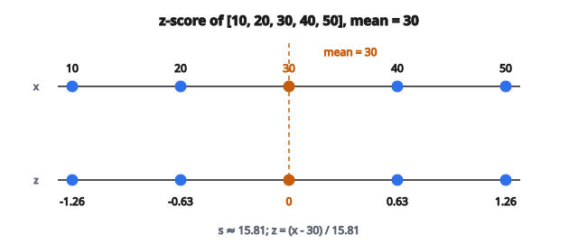

# z-Score Standardization

## z-Score standardization là gì

**z-Score standardization** biến đổi dữ liệu để có mean bằng không và độ lệch chuẩn đơn vị. Mỗi giá trị được đổi thành số độ lệch chuẩn nó cách mean. Đây là một trong những kỹ thuật tiền xử lý nền tảng nhất trong thống kê và machine learning, giúp các đặc trưng so sánh được bất kể thang gốc.

## Vì sao cần standardization

* **Đóng góp đặc trưng ngang nhau:** Đặc trưng thang lớn hơn sẽ lấn át tính khoảng cách và cập nhật gradient nếu không chuẩn hóa.
* **Yêu cầu thuật toán:** Nhiều thuật toán giả định hoặc làm việc tốt hơn với dữ liệu đã standardize (PCA, SVM, hồi quy có regularization).
* **Điểm số diễn giải được:** z-score cho biết giá trị bất thường đến mức nào — z-score bằng 2 nghĩa là giá trị cao hơn mean đúng 2 độ lệch chuẩn.
* **Ổn định số:** Giữ giá trị trong khoảng hợp lý, tránh overflow khi tính toán.

## Công thức z-score

Với giá trị $x$ từ phân phối có mean $\mu$ và độ lệch chuẩn $\sigma$:

$$
z = \frac{x - \mu}{\sigma}
$$

**Với một mẫu:**

$$
z = \frac{x - \bar{x}}{s}
$$

Trong đó:

* $\bar{x}$ = mean mẫu
* $s$ = độ lệch chuẩn mẫu

## Tính chất của z-score

**Mean bằng không:** Sau biến đổi, mean của z-score đúng bằng 0

$$
\mathbb{E}[Z] = \mathbb{E}\left[\frac{X - \mu}{\sigma}\right] = \frac{\mathbb{E}[X] - \mu}{\sigma} = 0
$$

**Phương sai đơn vị:** Độ lệch chuẩn của z-score đúng bằng 1

$$
\operatorname{Var}(Z) = \operatorname{Var}\left(\frac{X - \mu}{\sigma}\right) = \frac{\operatorname{Var}(X)}{\sigma^2} = 1
$$

**Bảo toàn hình dạng:** Standardization là biến đổi tuyến tính; nó không đổi hình dạng phân phối.

## Ví dụ số

**Dữ liệu:** $[10, 20, 30, 40, 50]$

**Bước 1 — Tính mean:**

$$
\bar{x} = \frac{10 + 20 + 30 + 40 + 50}{5} = 30
$$

**Bước 2 — Tính độ lệch chuẩn:**

$$
\begin{aligned}
s &= \sqrt{\frac{(10-30)^2 + (20-30)^2 + (30-30)^2 + (40-30)^2 + (50-30)^2}{5-1}} \\
  &= \sqrt{\frac{400 + 100 + 0 + 100 + 400}{4}} = \sqrt{250} \approx 15.81
\end{aligned}
$$

**Bước 3 — Tính z-score:**

$$
z_1 = \frac{10 - 30}{15.81} = -1.26
$$

$$
z_2 = \frac{20 - 30}{15.81} = -0.63
$$

$$
z_3 = \frac{30 - 30}{15.81} = 0.00
$$

$$
z_4 = \frac{40 - 30}{15.81} = 0.63
$$

$$
z_5 = \frac{50 - 30}{15.81} = 1.26
$$

**Kết quả:** $[-1.26, -0.63, 0.00, 0.63, 1.26]$

**Kiểm tra:** Mean $\approx 0$, độ lệch chuẩn $\approx 1$

::: {#fig-28-zscore-line fig-cap="Với $[10, 20, 30, 40, 50]$, mean $=30$ và $s \approx 15.81$ nên z-score $\approx [-1.26, -0.63, 0, 0.63, 1.26]$; điểm 30 nằm đúng tại $z=0$." fig-alt="Trục số [10, 20, 30, 40, 50] với mean=30; z-score tương ứng khoảng [-1.26, -0.63, 0, 0.63, 1.26]."}
{fig-align="center"}
:::

## Độ lệch chuẩn mẫu và quần thể

**Độ lệch chuẩn quần thể** (chia cho $N$):

$$
\sigma = \sqrt{\frac{1}{N} \sum_{i=1}^{N} (x_i - \mu)^2}
$$

**Độ lệch chuẩn mẫu** (chia cho $N-1$, hiệu chỉnh Bessel):

$$
s = \sqrt{\frac{1}{N-1} \sum_{i=1}^{N} (x_i - \bar{x})^2}
$$

**Dùng cái nào?**

* Độ lệch chuẩn mẫu khi dữ liệu là mẫu từ quần thể lớn hơn (hầu hết tình huống ML)
* Độ lệch chuẩn quần thể khi có toàn bộ quần thể

## Diễn giải z-score

**$Z = 0$:** Giá trị bằng mean

**$Z > 0$:** Giá trị trên mean

* $Z = 1$: Cao hơn một độ lệch chuẩn
* $Z = 2$: Cao hơn hai độ lệch chuẩn (bất thường)
* $Z = 3$: Cao hơn ba độ lệch chuẩn (hiếm)

**$Z < 0$:** Giá trị dưới mean

* $Z = -1$: Thấp hơn một độ lệch chuẩn
* $Z = -2$: Thấp hơn hai độ lệch chuẩn

**Với phân phối chuẩn:**

* $\sim 68\%$ giá trị có $|z| < 1$
* $\sim 95\%$ giá trị có $|z| < 2$
* $\sim 99.7\%$ giá trị có $|z| < 3$

## Xử lý độ lệch chuẩn bằng không

Khi mọi giá trị giống nhau:

$$
\sigma = 0 \Rightarrow z = \frac{x - \mu}{0} = \text{undefined}
$$

**Cách xử lý:**

* Trả về 0 cho mọi giá trị (chúng đang ở mean)
* Trả về NaN rồi xử lý riêng
* Bỏ đặc trưng hằng (không có phương sai để đóng góp)

## Standardization theo cột

Với tập dữ liệu nhiều đặc trưng, standardize độc lập từng cột:

**Với mỗi cột:**

1. Tính mean cột
2. Tính độ lệch chuẩn cột
3. Áp công thức z-score cho từng phần tử

**Kết quả:** Mỗi đặc trưng có mean 0 và std 1, nhưng các đặc trưng khác nhau vẫn có thể có range khác nhau.

## Cân nhắc train-test split

**Quy tắc then chốt:** Tính mean và std chỉ từ dữ liệu huấn luyện

**Áp lên dữ liệu huấn luyện:**

$$
z_{\text{train}} = \frac{x_{\text{train}} - \mu_{\text{train}}}{\sigma_{\text{train}}}
$$

**Áp lên dữ liệu test bằng thống kê tập huấn luyện:**

$$
z_{\text{test}} = \frac{x_{\text{test}} - \mu_{\text{train}}}{\sigma_{\text{train}}}
$$

**Vì sao?** Dùng thống kê test gây data leakage — mô hình sẽ có thông tin về phân phối test.

## Biến đổi ngược

Để đưa z-score về thang gốc:

$$
x = z \cdot \sigma + \mu
$$

**Khi dùng:** Sau khi dự đoán trong không gian đã standardize, đổi lại đơn vị diễn giải được.

## Standardization so với normalization

**Standardization (z-score):**

* Căn giữa tại mean 0, scale về std 1
* Range đầu ra không bị chặn
* Dựa trên mean và std (nhạy với outlier)
* Phù hợp: phân phối gần Gaussian, nhiều thuật toán ML

**Normalization (min-max):**

* Scale về khoảng cố định $[0, 1]$
* Range đầu ra bị chặn
* Dựa trên min và max (rất nhạy với outlier)
* Phù hợp: mạng nơ-ron, miền bị chặn

## Ảnh hưởng lên các thuật toán

**Được lợi từ standardization:**

* PCA (tìm hướng phương sai cực đại)
* SVM với kernel RBF (dựa trên khoảng cách)
* Hồi quy có regularization (phạt L1, L2)
* Phân cụm K-means (dựa trên khoảng cách)
* Tối ưu hạ gradient

**Không phụ thuộc standardization:**

* Cây quyết định (tách theo thứ hạng, không theo độ lớn)
* Random forests (dựa trên cây)
* Naive Bayes (xác suất, không dựa trên khoảng cách)

## Ổn định số

**Catastrophic cancellation:** Tính $(x - \bar{x})$ khi $x$ và $\bar{x}$ lớn và gần nhau có thể mất độ chính xác.

**Thuật toán hai lượt:** Lượt một tính mean, lượt hai tính phương sai (ổn định hơn)

**Thuật toán Welford:** Một lượt, ổn định số, tính mean và phương sai trực tuyến

## z-Score standardization xuất hiện ở đâu

* **Principal Component Analysis:** Cần đặc trưng đã standardize để phân rã phương sai có nghĩa
* **Support Vector Machines:** Phương pháp kernel nhạy với thang đặc trưng
* **Mạng nơ-ron:** Đầu vào đã standardize giúp gradient chảy và hội tụ tốt hơn
* **Hồi quy có regularization:** Phạt Ridge và Lasso chỉ đối xử đều các đặc trưng khi đã standardize
* **Kiểm định thống kê:** z-test dùng thống kê đã standardize
* **Phát hiện bất thường:** Outlier được nhận qua z-score cực trị
* **So sánh giữa các miền:** Điểm thi, metric hiệu năng từ các thang khác nhau
* **Nghiên cứu khoa học:** Kết hợp đo từ các thiết bị khác nhau
* **Phân tích tài chính:** So sánh lợi suất giữa các lớp tài sản

## Code
```python
import numpy as np

def zscore_standardize(X, axis=0, eps=1e-12):
    """
    Standardize X: (X - mean)/std. If 2D and axis=0, per column.
    Return np.ndarray (float).
    """
    X = np.array(X, dtype=float)
    mu = X.mean(axis=axis, keepdims=True)
    sigma = X.std(axis=axis, keepdims=True, ddof=0)
    return ((X - mu) / (sigma + eps)).tolist()

```
