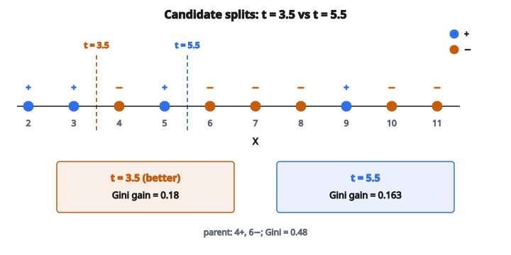

# Chia tốt nhất Decision Tree

## Chia decision tree là gì

Một lần chia trên decision tree tách các mẫu tại một nút thành hai hay nhiều nhóm dựa trên giá trị đặc trưng. Mục tiêu là tạo các nút con **tinh khiết hơn** nút cha, nghĩa là mẫu trong mỗi nút con đồng nhất hơn về nhãn lớp.

Tại mỗi nút trong, cây hỏi một câu dạng "Đặc trưng $X$ có lớn hơn ngưỡng $T$ không?" rồi đưa mẫu sang trái hoặc phải tùy câu trả lời.

## Tiêu chí chia

Để tìm lần chia tốt nhất, cần một thước đo **impurity** của nút. Các thước đo phổ biến:

**Gini impurity:**

$$
\mathrm{Gini}(S) = 1 - \sum_{i=1}^{C} p_i^2
$$

**Entropy:**

$$
H(S) = -\sum_{i=1}^{C} p_i \log_2(p_i)
$$

với $p_i$ là tỉ lệ mẫu thuộc lớp $i$ và $C$ là số lớp.

Lần chia tốt nhất là lần tối đa hóa mức giảm impurity.

## Information gain

Information gain đo mức một lần chia làm giảm impurity:

$$
\mathrm{IG}(S, A) = \mathrm{Impurity}(S) - \sum_{v \in \mathrm{values}(A)} \frac{|S_v|}{|S|} \mathrm{Impurity}(S_v)
$$

với:

* $S$ là tập mẫu tại nút cha
* $A$ là đặc trưng dùng để chia
* $S_v$ là tập con các mẫu mà đặc trưng $A$ nhận giá trị $v$
* $|S_v|/|S|$ là tỉ lệ mẫu đi vào nút con $v$

Ta chọn lần chia tối đa hóa information gain.

## Các kiểu chia

**Chia nhị phân (phổ biến nhất):**

Với đặc trưng số: "$X$ có $\leq$ ngưỡng?"

* Nút con trái: mẫu thỏa $X \leq t$
* Nút con phải: mẫu thỏa $X > t$

Với đặc trưng categorical: "$X$ có thuộc tập con $S$?"

* Nút con trái: mẫu thỏa $X \in S$
* Nút con phải: mẫu thỏa $X \notin S$

**Chia nhiều nhánh:**

Với đặc trưng categorical có $k$ giá trị, tạo $k$ nút con, mỗi giá trị một nút.

## Tìm chia tốt nhất cho đặc trưng số

**Bước 1:** Sắp mẫu theo giá trị đặc trưng

**Bước 2:** Xét các điểm chia nằm giữa hai giá trị phân biệt liên tiếp

**Bước 3:** Với mỗi ngưỡng ứng viên, tính information gain

**Bước 4:** Chọn ngưỡng có information gain lớn nhất

**Ví dụ:**

Giá trị đặc trưng (đã sắp): $[1, 2, 2, 4, 5, 7]$

Ngưỡng ứng viên: $1.5$, $3$, $4.5$, $6$ (trung điểm giữa các giá trị phân biệt)

Với mỗi ngưỡng, chia dữ liệu và tính mức giảm impurity.

## Ví dụ số: tìm chia tốt nhất

**Dữ liệu:** 10 mẫu với đặc trưng $X$ và nhãn nhị phân ($+$ hoặc $-$)

* Mẫu 1: $X = 2$, nhãn $=$ $+$
* Mẫu 2: $X = 3$, nhãn $=$ $+$
* Mẫu 3: $X = 4$, nhãn $=$ $-$
* Mẫu 4: $X = 5$, nhãn $=$ $+$
* Mẫu 5: $X = 6$, nhãn $=$ $-$
* Mẫu 6: $X = 7$, nhãn $=$ $-$
* Mẫu 7: $X = 8$, nhãn $=$ $-$
* Mẫu 8: $X = 9$, nhãn $=$ $+$
* Mẫu 9: $X = 10$, nhãn $=$ $-$
* Mẫu 10: $X = 11$, nhãn $=$ $-$

**Nút cha:** 4 dương, 6 âm

**Gini của nút cha:**

$$
p_{+} = 0.4, \quad p_{-} = 0.6
$$

$$
\mathrm{Gini} = 1 - (0.4^{2} + 0.6^{2}) = 1 - (0.16 + 0.36) = 0.48
$$

**Xét chia tại $X = 5.5$:**

Nút con trái ($X \leq 5.5$): mẫu 1, 2, 3, 4

* 3 dương, 1 âm
* $\mathrm{Gini}_{L} = 1 - (0.75^{2} + 0.25^{2}) = 1 - 0.625 = 0.375$

Nút con phải ($X > 5.5$): mẫu 5, 6, 7, 8, 9, 10

* 1 dương, 5 âm
* $\mathrm{Gini}_{R} = 1 - (0.167^{2} + 0.833^{2}) = 1 - 0.722 = 0.278$

**Gini trung bình có trọng số:**

$$
\mathrm{Gini}_{\mathrm{children}} = \frac{4}{10}(0.375) + \frac{6}{10}(0.278) = 0.15 + 0.167 = 0.317
$$

**Gini gain:** $0.48 - 0.317 = 0.163$

**Xét chia tại $X = 3.5$:**

Nút con trái ($X \leq 3.5$): mẫu 1, 2

* 2 dương, 0 âm (tinh khiết!)
* $\mathrm{Gini}_{L} = 0$

Nút con phải ($X > 3.5$): mẫu 3, 4, 5, 6, 7, 8, 9, 10

* 2 dương, 6 âm
* $\mathrm{Gini}_{R} = 1 - (0.25^{2} + 0.75^{2}) = 0.375$

**Gini trung bình có trọng số:**

$$
\mathrm{Gini}_{\mathrm{children}} = \frac{2}{10}(0) + \frac{8}{10}(0.375) = 0 + 0.3 = 0.3
$$

**Gini gain:** $0.48 - 0.3 = 0.18$

**Lần chia tốt hơn.** Chia tại $X = 3.5$ cho Gini gain cao hơn.

::: {#fig-149-best-split-gini fig-cap="Cùng nút cha Gini $= 0.48$: chia $t = 3.5$ có Gini gain $0.18$, cao hơn chia $t = 5.5$ (gain $0.163$)." fig-alt="Trục số X từ 2 đến 11 với nhãn + và -; hai ngưỡng t = 5.5 (Gini gain 0.163) và t = 3.5 (Gini gain 0.18)."}
{fig-align="center"}
:::

## Chia đặc trưng categorical

**Cách 1: One-vs-rest**

Với mỗi giá trị category, tạo một lần chia nhị phân: "$X$ có bằng giá trị này?"

**Cách 2: Tìm tập con**

Tìm tập con giá trị tốt nhất cho nút con trái. Với $k$ category, có $2^{k-1} - 1$ tập con cần xét.

**Cách 3: Binary encoding**

Đổi đặc trưng categorical thành nhiều đặc trưng nhị phân, rồi chia trên từng đặc trưng đó.

## Điều kiện dừng

Cây ngừng chia khi:

**Đạt độ sâu tối đa:** Cây đã lớn đến giới hạn độ sâu cho trước

**Số mẫu tối thiểu:** Nút có ít mẫu hơn số tối thiểu cần để chia

**Nút tinh khiết:** Mọi mẫu cùng một lớp (impurity $= 0$)

**Không cải thiện:** Không lần chia nào giảm impurity quá một ngưỡng

**Số mẫu tối thiểu mỗi lá:** Lần chia sẽ tạo lá có quá ít mẫu

## Chia greedy

Decision tree dùng cách tiếp cận **greedy**:

1. Tại mỗi nút, tìm lần chia tối ưu cục bộ
2. Không xét lại các lần chia trước
3. Không nhìn trước các lần chia sau

Cách này rẻ về tính toán nhưng có thể không tìm được cây tối ưu toàn cục.

## So sánh metric chất lượng chia

**Gini impurity:**

* Dao động từ 0 (tinh khiết) đến 0.5 (nhị phân, chia đều)
* Tính nhanh hơn (không có logarithm)
* Mặc định trong CART và scikit-learn

**Entropy:**

* Dao động từ 0 (tinh khiết) đến 1 (nhị phân, chia đều)
* Dùng trong ID3 và C4.5
* Hơi nhạy hơn với phân bố lớp

**Misclassification error:**

* $1 - \max(p_i)$
* Không khuyến nghị khi xây cây (không strictly concave)
* Dùng khi pruning

Trong thực tế, Gini và entropy cho cây gần giống nhau.

## Xử lý giá trị thiếu

**Khi huấn luyện:**

* Bỏ qua giá trị thiếu khi tính thống kê chia
* Hoặc dùng surrogate split (đặc trưng dự phòng xấp xỉ lần chia chính)

**Khi dự đoán:**

* Dùng surrogate split
* Hoặc gửi mẫu sang nút con có nhiều mẫu hơn
* Hoặc gán xác suất vào cả hai nút con

## Ổn định số

Khi tính impurity:

* Tránh $\log(0)$ bằng quy ước $0 \log(0) = 0$
* Dùng phép cộng ổn định khi số lớp lớn
* Chú ý sai số floating-point với xác suất rất nhỏ

## Độ phức tạp tính toán

**Tại mỗi nút:**

* Với mỗi đặc trưng ($d$ đặc trưng)
* Sắp theo giá trị đặc trưng: $O(n \log n)$
* Quét các ngưỡng: $O(n)$
* Tổng mỗi nút: $O(d \cdot n \log n)$

**Cho cả cây:**

* Độ sâu $\log n$ (cân bằng) đến $n$ (thoái hóa)
* Tổng: $O(d \cdot n^{2} \log n)$ trường hợp xấu nhất

**Tối ưu:**

* Sắp sẵn đặc trưng một lần
* Dùng histogram thay vì chia exact (cây gradient boosting)

## Chia cho regression tree

Với hồi quy, dùng mức giảm variance thay cho Gini/entropy:

**Variance nút cha:**

$$
\operatorname{Var}(S) = \frac{1}{|S|} \sum_{i \in S} (y_i - \bar{y})^{2}
$$

**Tiêu chí chia:** Cực tiểu hóa variance có trọng số của các nút con

$$
\text{Var reduction} = \operatorname{Var}(S) - \frac{|S_{L}|}{|S|}\operatorname{Var}(S_{L}) - \frac{|S_{R}|}{|S|}\operatorname{Var}(S_{R})
$$

Lần chia tốt nhất tối đa hóa mức giảm variance.

## Code
```python
def decision_tree_split(X, y):
    """
    Find the best feature and threshold to split the data.
    """
    n, d = len(y), len(X[0])
    def gini(labels):
        t = len(labels)
        if t == 0:
            return 0.0
        counts = {}
        for l in labels:
            counts[l] = counts.get(l, 0) + 1
        return 1.0 - sum((c / t) ** 2 for c in counts.values())
    best_gain, best_feat, best_thresh = -1.0, 0, 0.0
    parent_gini = gini(y)
    for f in range(d):
        vals = sorted(set(X[i][f] for i in range(n)))
        for vi in range(len(vals) - 1):
            thresh = (vals[vi] + vals[vi + 1]) / 2.0
            ly = [y[i] for i in range(n) if X[i][f] <= thresh]
            ry = [y[i] for i in range(n) if X[i][f] > thresh]
            if not ly or not ry:
                continue
            wg = len(ly) / n * gini(ly) + len(ry) / n * gini(ry)
            gain = parent_gini - wg
            if gain > best_gain:
                best_gain, best_feat, best_thresh = gain, f, thresh
    return [best_feat, best_thresh]

```

<!-- auto-self-check -->

::: {.callout-note}
## Kiểm tra nhanh
<details>
<summary>Ý chính của bài «Chia tốt nhất Decision Tree» là gì?</summary>
Một lần chia trên decision tree tách các mẫu tại một nút thành hai hay nhiều nhóm dựa trên giá trị đặc trưng.
</details>
<details>
<summary>Công thức / quan hệ cốt lõi trong bài là gì?</summary>
$$\mathrm{Gini}(S) = 1 - \sum_{i=1}^{C} p_i^2$$
</details>
:::
