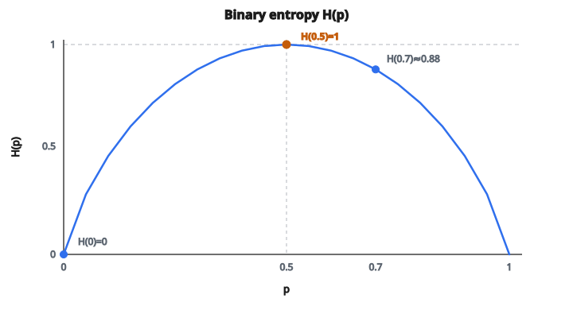

# Entropy của một node

## Entropy là gì

**Entropy** đo **độ bất định** hoặc **độ tạp** trong một tập nhãn. Trong decision tree, ta dùng entropy để định lượng mức độ trộn lớp tại mỗi node.

**Entropy cao:** Nhãn trộn đều, bất định cực đại

**Entropy thấp:** Nhãn chủ yếu thuộc một lớp, bất định thấp

**Entropy bằng không:** Mọi nhãn cùng một lớp, độ tinh khiết hoàn hảo

## Công thức entropy

Với một tập có $C$ lớp, $p_i$ là tỷ lệ mẫu thuộc lớp $i$:

$$
H = -\sum_{i=1}^{C} p_i \log_2(p_i)
$$

**Quy ước:** $0 \log_2(0) = 0$ (giới hạn khi $p \to 0$)

Dấu âm làm entropy dương (vì $\log$ của phân số thì âm).

## Hiểu công thức

Mỗi số hạng $-p_i \log_2(p_i)$ đo “độ bất ngờ” khi gặp lớp $i$:

* Sự kiện hiếm ($p_i$ nhỏ) có độ bất ngờ cao ($-\log_2(p_i)$ lớn)
* Sự kiện phổ biến ($p_i$ lớn) có độ bất ngờ thấp
* Ta nhân độ bất ngờ với xác suất $p_i$

Entropy là **expected surprise** khi lấy mẫu từ phân phối.

## Ví dụ phân loại nhị phân

Với 2 lớp có tỷ lệ $(p, 1-p)$:

$$
H = -p \log_2(p) - (1-p) \log_2(1-p)
$$

**Ví dụ 1: Tinh khiết hoàn hảo**

Mọi mẫu thuộc lớp A: $p = 1.0$

$$
H = -1 \cdot \log_2(1) - 0 \cdot \log_2(0) = -1 \cdot 0 - 0 = 0
$$

Entropy bằng 0. Không còn bất định.

**Ví dụ 2: Tạp cực đại**

Một nửa lớp A, một nửa lớp B: $p = 0.5$

$$
\begin{aligned}
H
&= -0.5 \cdot \log_2(0.5) - 0.5 \cdot \log_2(0.5) \\
&= -0.5 \cdot (-1) - 0.5 \cdot (-1) = 0.5 + 0.5 = 1
\end{aligned}
$$

Entropy bằng 1 (cực đại với nhị phân). Bất định cực đại.

**Ví dụ 3: Tạp vừa phải**

70% lớp A, 30% lớp B: $p = 0.7$

$$
\begin{aligned}
H
&= -0.7 \cdot \log_2(0.7) - 0.3 \cdot \log_2(0.3) \\
&= -0.7 \cdot (-0.515) - 0.3 \cdot (-1.737) \\
&= 0.36 + 0.52 = 0.88
\end{aligned}
$$

## Ví dụ đa lớp

**Node có 100 mẫu:**

* Lớp A: 50 mẫu ($p_A = 0.5$)
* Lớp B: 30 mẫu ($p_B = 0.3$)
* Lớp C: 20 mẫu ($p_C = 0.2$)

$$
H = -0.5 \log_2(0.5) - 0.3 \log_2(0.3) - 0.2 \log_2(0.2)
$$

$$
\begin{aligned}
H
&= -0.5 \cdot (-1) - 0.3 \cdot (-1.737) - 0.2 \cdot (-2.322) \\
&= 0.5 + 0.521 + 0.464 = 1.485
\end{aligned}
$$

Entropy cực đại có thể với 3 lớp là $\log_2(3) \approx 1.585$ (khi mọi lớp đều nhau).

## Cận của entropy

**Entropy cực tiểu:** 0 (mọi mẫu cùng lớp)

**Entropy cực đại:** $\log_2(C)$ (phân phối đều trên $C$ lớp)

* 2 lớp: max = 1
* 3 lớp: max = 1.585
* 4 lớp: max = 2
* 10 lớp: max = 3.322

## Entropy trong decision tree

Decision tree tách node để **giảm entropy**. Mục tiêu là tạo các node con tinh khiết hơn node cha.

**Information Gain** đo mức giảm entropy:

$$
\mathrm{IG} = H(\text{parent}) - \sum_{\text{child}} \frac{n_{\text{child}}}{n_{\text{parent}}} H(\text{child})
$$

Ta chọn split làm cực đại information gain (giảm entropy nhiều nhất).

## Tính entropy của node từng bước

**Cho nhãn:** [A, A, B, A, B, B, A, C, A, C]

**Bước 1: Đếm từng lớp**

* A: 5
* B: 3
* C: 2
* Tổng: 10

**Bước 2: Tính tỷ lệ**

* $p_A = 5/10 = 0.5$
* $p_B = 3/10 = 0.3$
* $p_C = 2/10 = 0.2$

**Bước 3: Tính từng số hạng**

* $-0.5 \log_2(0.5) = -0.5 \times (-1) = 0.5$
* $-0.3 \log_2(0.3) = -0.3 \times (-1.737) = 0.521$
* $-0.2 \log_2(0.2) = -0.2 \times (-2.322) = 0.464$

**Bước 4: Cộng**

$$
H = 0.5 + 0.521 + 0.464 = 1.485
$$

## Các trường hợp biên

**Cùng một lớp:**

Nhãn: [A, A, A, A]

$p_A = 1.0$, không có lớp khác

$$
H = -1 \cdot \log_2(1) = -1 \cdot 0 = 0
$$

**Một mẫu:**

Nhãn: [B]

$p_B = 1.0$

$H = 0$ (chắc chắn, không còn entropy)

**Tỷ lệ rỗng:**

Nếu một lớp có 0 mẫu, $p_i = 0$ và $0 \log_2(0) = 0$ theo quy ước.

## Vì sao log cơ số 2?

Log cơ số 2 cho entropy tính bằng **bit**:

* 1 bit entropy = 1 câu hỏi yes/no để xác định lớp
* 2 bit = 2 câu hỏi
* v.v.

Các cơ số khác cũng dùng được:

* Log tự nhiên ($\ln$): entropy tính bằng “nat”
* Log cơ số 10: entropy tính bằng “dit”

Chọn cơ số đổi thang đo, không đổi so sánh tương đối.

## Entropy so với Gini impurity

Cả hai đều đo độ tạp của node. Khác biệt chính:

**Entropy:**

* Dùng logarithm
* Chi phí tính toán hơi cao hơn
* Nhạy hơn với thay đổi phân phối
* Giá trị cực đại phụ thuộc số lớp

**Gini:**

* Không dùng logarithm, công thức đơn giản hơn
* Tính hơi nhanh hơn
* Dao động từ 0 đến 0.5 với nhị phân
* Thường cho cây tương tự

Trong thực tế, cả hai đều tốt. Gini phổ biến hơn trong các cài đặt (ví dụ mặc định của scikit-learn).

## Đường cong entropy (trường hợp nhị phân)

Với phân loại nhị phân, entropy theo hàm của $p$:

* $H(0) = 0$
* $H(0.5) = 1$ (cực đại)
* $H(1) = 0$

Đường cong đối xứng quanh $p = 0.5$ và lõm (cong lên trên).

::: {#fig-14-1-binary-entropy fig-cap="$H(0)=0$, $H(0.5)=1$, $H(0.7)\approx 0.88$: đường cong đối xứng quanh $p=0.5$ và đạt cực đại khi hai lớp cân bằng." fig-alt="Đường cong entropy nhị phân H(p); ba điểm p=0, 0.5, 0.7 tương ứng H=0, 1, 0.88."}
{fig-align="center"}
:::

Hình dạng này nghĩa là:

* Mọi lệch khỏi 50/50 đều giảm entropy
* Mức giảm dốc nhất gần 50/50
* Node gần tinh khiết ($p$ gần 0 hoặc 1) có entropy rất thấp

## Liên hệ với cross-entropy

Entropy liên hệ với **cross-entropy loss** trong mạng nơ-ron:

$$
\text{Cross-Entropy} = -\sum_i y_i \log(\hat{p}_i)
$$

Khi $y$ là nhãn one-hot và $\hat{p}$ là phân phối dự đoán, cực tiểu hóa cross-entropy đẩy dự đoán về nhãn thật.

Shannon entropy là cross-entropy của một phân phối với chính nó.

## Code
```python
import numpy as np

def entropy_node(y):
    """
    Compute entropy for a single node using stable logarithms.
    """
    y = np.asarray(y, dtype=int)
    if len(y) == 0:
        return 0.0
    _, counts = np.unique(y, return_counts=True)
    probs = counts / len(y)
    probs = probs[probs > 0]
    return float(-np.sum(probs * np.log2(probs)))
```

<!-- auto-self-check -->

::: {.callout-note}
## Kiểm tra nhanh
<details>
<summary>Ý chính của bài «Entropy của một node» là gì?</summary>
**Entropy** đo **độ bất định** hoặc **độ tạp** trong một tập nhãn.
</details>
<details>
<summary>Công thức / quan hệ cốt lõi trong bài là gì?</summary>
$$H = -\sum_{i=1}^{C} p_i \log_2(p_i)$$
</details>
:::
