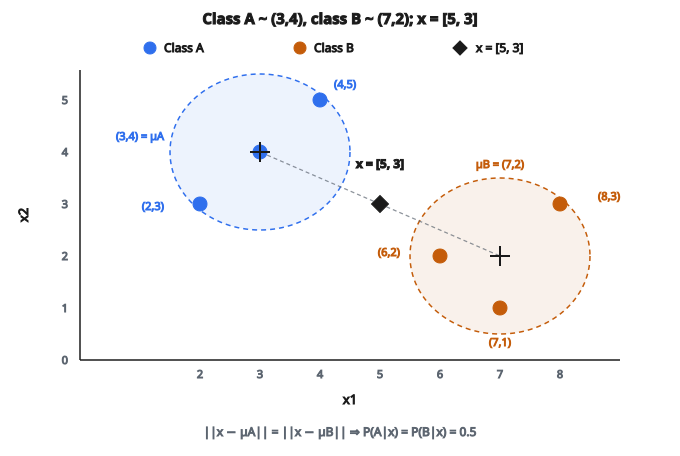

# Gaussian Naive Bayes

## Gaussian Naive Bayes là gì

Gaussian Naive Bayes là thuật toán phân loại cho **đặc trưng liên tục**. Mô hình giả định mỗi đặc trưng theo phân phối Gaussian (chuẩn) trong từng lớp, và các đặc trưng độc lập khi đã biết nhãn lớp.

$$
P(x_i \mid y = c) = \frac{1}{\sqrt{2\pi\sigma_{ic}^{2}}} \exp\left(-\frac{(x_i - \mu_{ic})^{2}}{2\sigma_{ic}^{2}}\right)
$$

với $\mu_{ic}$ và $\sigma_{ic}^{2}$ là mean và variance của đặc trưng $i$ trong lớp $c$.

## Quy tắc phân loại

Theo định lý Bayes:

$$
P(y = c \mid x) \propto P(y = c) \prod_{i=1}^{d} P(x_i \mid y = c)
$$

Lớp dự đoán là:

$$
\hat{y} = \arg\max_{c} P(y = c) \prod_{i=1}^{d} P(x_i \mid y = c)
$$

Thay likelihood Gaussian:

$$
\hat{y} = \arg\max_{c}\, P(y = c) \prod_{i=1}^{d} \frac{1}{\sqrt{2\pi\sigma_{ic}^{2}}} \exp\left(-\frac{(x_i - \mu_{ic})^{2}}{2\sigma_{ic}^{2}}\right)
$$

## Dạng log-probability

Để tránh underflow số, dùng log xác suất:

$$
\log P(y = c \mid x) = \log P(y = c) + \sum_{i=1}^{d} \log P(x_i \mid y = c)
$$

Log-likelihood Gaussian:

$$
\log P(x_i \mid y = c) = -\frac{1}{2}\log(2\pi\sigma_{ic}^{2}) - \frac{(x_i - \mu_{ic})^{2}}{2\sigma_{ic}^{2}}
$$

Rút gọn:

$$
\log P(x_i \mid y = c) = -\frac{1}{2}\log(2\pi) - \log(\sigma_{ic}) - \frac{(x_i - \mu_{ic})^{2}}{2\sigma_{ic}^{2}}
$$

## Ước lượng tham số

**Class prior:**

$$
P(y = c) = \frac{N_c}{N}
$$

**Mean mỗi đặc trưng theo lớp:**

$$
\mu_{ic} = \frac{1}{N_c} \sum_{j: y_j = c} x_{ji}
$$

**Variance mỗi đặc trưng theo lớp:**

$$
\sigma_{ic}^{2} = \frac{1}{N_c} \sum_{j: y_j = c} (x_{ji} - \mu_{ic})^{2}
$$

Một số cài đặt dùng $N_c - 1$ ở mẫu số (Bessel's correction) để ước lượng variance không chệch.

## Ví dụ số từng bước

**Dữ liệu huấn luyện:** 6 mẫu, 2 lớp, 2 đặc trưng

Lớp A (3 mẫu):

* Mẫu 1: $[2, 3]$
* Mẫu 2: $[3, 4]$
* Mẫu 3: $[4, 5]$

Lớp B (3 mẫu):

* Mẫu 4: $[6, 2]$
* Mẫu 5: $[7, 1]$
* Mẫu 6: $[8, 3]$

::: {#fig-150-gnb-classes fig-cap="Lớp A tập trung quanh $\mu_A = (3,4)$, lớp B quanh $\mu_B = (7,2)$. Điểm mới $x = [5, 3]$ cách đều hai mean nên nằm trên biên quyết định." fig-alt="Scatter lớp A quanh (3,4), lớp B quanh (7,2); điểm mới x = [5, 3] cách đều hai mean."}
{fig-align="center"}
:::

**Bước 1: Tính class prior**

$$
P(A) = 3/6 = 0.5
$$

$$
P(B) = 3/6 = 0.5
$$

**Bước 2: Tính mean**

Lớp A:

* $\mu_{1A} = (2 + 3 + 4)/3 = 3$
* $\mu_{2A} = (3 + 4 + 5)/3 = 4$

Lớp B:

* $\mu_{1B} = (6 + 7 + 8)/3 = 7$
* $\mu_{2B} = (2 + 1 + 3)/3 = 2$

**Bước 3: Tính variance**

Lớp A:

* $\sigma_{1A}^{2} = [(2-3)^{2} + (3-3)^{2} + (4-3)^{2}]/3 = (1 + 0 + 1)/3 = 0.667$
* $\sigma_{2A}^{2} = [(3-4)^{2} + (4-4)^{2} + (5-4)^{2}]/3 = (1 + 0 + 1)/3 = 0.667$

Lớp B:

* $\sigma_{1B}^{2} = [(6-7)^{2} + (7-7)^{2} + (8-7)^{2}]/3 = (1 + 0 + 1)/3 = 0.667$
* $\sigma_{2B}^{2} = [(2-2)^{2} + (1-2)^{2} + (3-2)^{2}]/3 = (0 + 1 + 1)/3 = 0.667$

**Bước 4: Phân loại mẫu mới**

Mẫu mới: $x = [5, 3]$

**Với lớp A:**

$$
\begin{aligned}
P(x_1 = 5 \mid A)
&= \frac{1}{\sqrt{2\pi(0.667)}} \exp\left(-\frac{(5-3)^{2}}{2(0.667)}\right) \\
&= \frac{1}{\sqrt{4.19}} \exp(-3) = 0.489 \times 0.0498 = 0.0243
\end{aligned}
$$

$$
\begin{aligned}
P(x_2 = 3 \mid A)
&= \frac{1}{\sqrt{4.19}} \exp\left(-\frac{(3-4)^{2}}{1.333}\right) \\
&= 0.489 \times \exp(-0.75) = 0.489 \times 0.472 = 0.231
\end{aligned}
$$

$$
P(A \mid x) \propto 0.5 \times 0.0243 \times 0.231 = 0.00281
$$

**Với lớp B:**

$$
\begin{aligned}
P(x_1 = 5 \mid B)
&= \frac{1}{\sqrt{4.19}} \exp\left(-\frac{(5-7)^{2}}{1.333}\right) \\
&= 0.489 \times \exp(-3) = 0.489 \times 0.0498 = 0.0243
\end{aligned}
$$

$$
\begin{aligned}
P(x_2 = 3 \mid B)
&= \frac{1}{\sqrt{4.19}} \exp\left(-\frac{(3-2)^{2}}{1.333}\right) \\
&= 0.489 \times \exp(-0.75) = 0.489 \times 0.472 = 0.231
\end{aligned}
$$

$$
P(B \mid x) \propto 0.5 \times 0.0243 \times 0.231 = 0.00281
$$

**Bước 5: Chuẩn hóa**

Hai lớp có xác suất bằng nhau, nên mẫu này nằm trên biên quyết định.

$$
P(A \mid x) = P(B \mid x) = 0.5
$$

Trong thực tế, phá hòa một cách tùy ý hoặc xét kỹ hơn các điểm số thô.

## Giả thiết naive

Giả thiết "naive" là các đặc trưng độc lập có điều kiện khi đã biết lớp:

$$
P(x_1, x_2, \ldots, x_d \mid y) = \prod_{i=1}^{d} P(x_i \mid y)
$$

Nhờ đó ta ước lượng phân phối từng đặc trưng riêng, giảm mạnh số tham số.

**Không độc lập:** Phải ước lượng ma trận hiệp phương sai $d$ chiều cho mỗi lớp: $O(d^{2})$ tham số

**Có độc lập:** Chỉ cần mean và variance mỗi đặc trưng mỗi lớp: $O(d)$ tham số

## Biên quyết định

Gaussian Naive Bayes tạo **biên quyết định bậc hai** khi variance khác nhau giữa các lớp, và **biên tuyến tính** khi variance bằng nhau.

Biên quyết định là nơi:

$$
P(y = c_1 \mid x) = P(y = c_2 \mid x)
$$

Việc so sánh này gồm tổng các số hạng bình phương, nên bậc hai theo $x$.

## Xử lý variance bằng không

Nếu mọi mẫu của một lớp có cùng giá trị trên một đặc trưng, variance bằng không và phép chia cho không xảy ra.

**Cách xử lý:**

**Cộng epsilon nhỏ:**
$\sigma_{ic}^{2} = \max(\sigma_{ic}^{2}, \epsilon)$ với $\epsilon$ nhỏ (ví dụ $10^{-9}$)

**Dùng prior variance:**
Đặt variance tối thiểu dựa trên hiểu biết miền

**Gộp variance:**
Dùng variance chung giữa các lớp cho đặc trưng thiếu dữ liệu

## Quan hệ với LDA/QDA

**Gaussian Naive Bayes:**

* Ma trận hiệp phương sai chéo (đặc trưng độc lập)
* Đường chéo khác nhau theo từng lớp
* Biên quyết định bậc hai

**Linear Discriminant Analysis (LDA):**

* Ma trận hiệp phương sai đầy đủ (đặc trưng tương quan)
* Cùng hiệp phương sai cho mọi lớp
* Biên quyết định tuyến tính

**Quadratic Discriminant Analysis (QDA):**

* Ma trận hiệp phương sai đầy đủ
* Hiệp phương sai khác nhau theo từng lớp
* Biên quyết định bậc hai

Naive Bayes là trường hợp đặc biệt khi các phần tử ngoài đường chéo của hiệp phương sai bằng không.

## Ưu điểm và hạn chế

**Ưu điểm:**

* Đơn giản và nhanh
* Tốt với tập dữ liệu nhỏ
* Xử lý đặc trưng liên tục một cách tự nhiên
* Không có hyperparameter cần chỉnh
* Cho ước lượng xác suất

**Hạn chế:**

* Giả định phân phối Gaussian (có thể sai)
* Giả định độc lập đặc trưng (thường bị vi phạm)
* Nhạy với outlier (do giả định Gaussian)
* Có thể kém hơn khi tương quan mạnh

## Khi giả thiết Gaussian không đúng

Nếu đặc trưng không phân phối chuẩn:

**Log transform:** Với dữ liệu dương lệch phải

**Box-Cox transform:** Biến đổi lũy thừa tổng quát về phân phối chuẩn

**Naive Bayes khác:** Multinomial cho đếm, Bernoulli cho nhị phân

**Kernel density estimation:** Ước lượng mật độ phi tham số (tốn tính toán)

## Độ phức tạp tính toán

**Huấn luyện:**

* Tính mean: $O(N \times d)$
* Tính variance: $O(N \times d)$
* Tổng: $O(N \times d)$

**Dự đoán:**

* Tính PDF Gaussian cho mỗi đặc trưng và mỗi lớp: $O(C \times d)$
* Suy luận rất nhanh

## Ổn định số

**Log-sum-exp:** Khi tính xác suất posterior, dùng:

$$
P(y = c \mid x) = \frac{\exp(\log P(c, x))}{\sum_{c'} \exp(\log P(c', x))}
$$

Trừ log-probability lớn nhất trước khi lũy thừa để tránh overflow:

$$
\log P(c \mid x) = \log P(c, x) - \log \sum_{c'} \exp(\log P(c', x))
$$

## Code
```python
import math

def gaussian_naive_bayes(X_train, y_train, X_test):
    """
    Predict class labels for test samples using Gaussian Naive Bayes.
    """
    classes = sorted(set(y_train))
    n, d = len(y_train), len(X_train[0])
    class_data = {c: [] for c in classes}
    for i in range(n):
        class_data[y_train[i]].append(X_train[i])
    priors, means, variances = {}, {}, {}
    for c in classes:
        data = class_data[c]
        nc = len(data)
        priors[c] = nc / n
        means[c] = [sum(data[i][j] for i in range(nc)) / nc for j in range(d)]
        variances[c] = [sum((data[i][j] - means[c][j]) ** 2 for i in range(nc)) / nc for j in range(d)]
    eps = 1e-9
    preds = []
    for x in X_test:
        best_c, best_lp = classes[0], float("-inf")
        for c in classes:
            lp = math.log(priors[c])
            for j in range(d):
                var = variances[c][j] + eps
                lp += -0.5 * math.log(2 * math.pi * var) - (x[j] - means[c][j]) ** 2 / (2 * var)
            if lp > best_lp:
                best_lp = lp
                best_c = c
        preds.append(best_c)
    return preds

```
