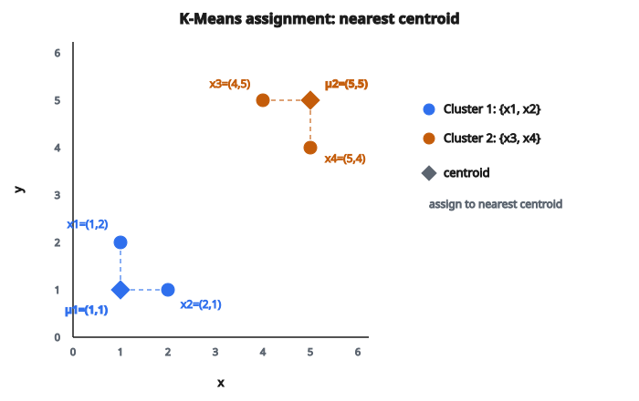

# Bước gán cụm K-Means

## K-Means clustering là gì

K-Means là thuật toán **học không giám sát** chia $n$ điểm dữ liệu thành $k$ cluster. Mỗi điểm thuộc cluster có centroid (tâm cụm) gần nhất.

Thuật toán xen kẽ hai bước:

1. **Gán:** Gán mỗi điểm vào centroid gần nhất
2. **Cập nhật:** Tính lại centroid như mean của các điểm đã gán

Lặp cho đến khi hội tụ.

## Bước gán

Cho $k$ centroid $\mu_1, \mu_2, \ldots, \mu_k$, bước gán đưa mỗi điểm $x_i$ vào centroid gần nhất:

$$
c_i = \arg\min_j \|x_i - \mu_j\|^2
$$

với $c_i$ là nhãn cluster của điểm $i$, và $\|\cdot\|^2$ là khoảng cách Euclid bình phương.

Mỗi điểm được gán đúng một cluster.

## Tính khoảng cách

Với điểm $x = (x_1, x_2, \ldots, x_d)$ và centroid $\mu = (\mu_1, \mu_2, \ldots, \mu_d)$:

**Khoảng cách Euclid bình phương:**

$$
\|x - \mu\|^2 = \sum_{j=1}^{d} (x_j - \mu_j)^2
$$

Ta dùng khoảng cách bình phương vì:

* Tránh tính căn bậc hai (nhanh hơn)
* Cực tiểu hóa khoảng cách bình phương tương đương cực tiểu hóa khoảng cách
* Thuận tiện toán học cho hàm mục tiêu

## Ví dụ gán từng bước

**Điểm dữ liệu (2D):**

* $x_1 = (1, 2)$
* $x_2 = (2, 1)$
* $x_3 = (4, 5)$
* $x_4 = (5, 4)$

**Centroid hiện tại:**

* $\mu_1 = (1, 1)$
* $\mu_2 = (5, 5)$

::: {#fig-144-kmeans-assign fig-cap="Bước gán: cluster 1 = {x₁, x₂} quanh μ₁ = (1, 1); cluster 2 = {x₃, x₄} quanh μ₂ = (5, 5). Mỗi điểm thuộc đúng một centroid gần nhất theo ‖x − μ‖²." fig-alt="Mặt phẳng 2D: điểm x1=(1,2), x2=(2,1) gần centroid μ1=(1,1); điểm x3=(4,5), x4=(5,4) gần centroid μ2=(5,5). Đường đứt nối mỗi điểm tới centroid được gán."}
{fig-align="center"}
:::

**Gán $x_1 = (1, 2)$:**

$$
\begin{aligned}
\|x_1 - \mu_1\|^2 &= (1-1)^2 + (2-1)^2 = 0 + 1 = 1 \\
\|x_1 - \mu_2\|^2 &= (1-5)^2 + (2-5)^2 = 16 + 9 = 25
\end{aligned}
$$

$x_1$ gán vào cluster 1 (khoảng cách $1 < 25$)

**Gán $x_2 = (2, 1)$:**

$$
\begin{aligned}
\|x_2 - \mu_1\|^2 &= (2-1)^2 + (1-1)^2 = 1 + 0 = 1 \\
\|x_2 - \mu_2\|^2 &= (2-5)^2 + (1-5)^2 = 9 + 16 = 25
\end{aligned}
$$

$x_2$ gán vào cluster 1 (khoảng cách $1 < 25$)

**Gán $x_3 = (4, 5)$:**

$$
\begin{aligned}
\|x_3 - \mu_1\|^2 &= (4-1)^2 + (5-1)^2 = 9 + 16 = 25 \\
\|x_3 - \mu_2\|^2 &= (4-5)^2 + (5-5)^2 = 1 + 0 = 1
\end{aligned}
$$

$x_3$ gán vào cluster 2 (khoảng cách $1 < 25$)

**Gán $x_4 = (5, 4)$:**

$$
\begin{aligned}
\|x_4 - \mu_1\|^2 &= (5-1)^2 + (4-1)^2 = 16 + 9 = 25 \\
\|x_4 - \mu_2\|^2 &= (5-5)^2 + (4-5)^2 = 0 + 1 = 1
\end{aligned}
$$

$x_4$ gán vào cluster 2 (khoảng cách $1 < 25$)

**Kết quả gán:**

* Cluster 1: $\{x_1, x_2\}$
* Cluster 2: $\{x_3, x_4\}$

## Hàm mục tiêu K-Means

K-Means cực tiểu hóa **within-cluster sum of squares (WCSS)**:

$$
J = \sum_{i=1}^{n} \|x_i - \mu_{c_i}\|^2
$$

với $c_i$ là nhãn cluster của điểm $i$ và $\mu_{c_i}$ là centroid của cluster đó.

Bước gán cực tiểu hóa $J$ theo các nhãn cluster (giữ centroid cố định).

## Xử lý hòa

Khi một điểm cách đều nhiều centroid:

**Cách 1:** Gán vào centroid đầu tiên trong danh sách

**Cách 2:** Gán ngẫu nhiên trong các centroid hòa

**Cách 3:** Gán vào cluster nhỏ hơn (để cân bằng)

Trong thực tế, hòa đúng bằng số rất hiếm với dữ liệu liên tục.

## Gán vector hóa

Để hiệu quả, tính mọi khoảng cách một lúc:

**Ma trận khoảng cách:** $D$ shape $(n, k)$ với $D_{ij} = \|x_i - \mu_j\|^2$

Dùng đồng nhất thức:

$$
\|x - \mu\|^2 = \|x\|^2 + \|\mu\|^2 - 2x^{T}\mu
$$

**Tính:**

1. $\|X\|^2$: norm bình phương mọi điểm, shape $(n, 1)$
2. $\|M\|^2$: norm bình phương mọi centroid, shape $(1, k)$
3. $XM^{T}$: tích vô hướng, shape $(n, k)$
4. $D = \|X\|^2 + \|M\|^2 - 2XM^{T}$

**Nhãn gán:** $c = \arg\min_j D_{:,j}$ (argmin theo cột)

## Metric khoảng cách

K-Means thường dùng Euclidean distance, nhưng có biến thể:

**Euclidean (L2):**

$$
d(x, \mu) = \sqrt{\sum_j (x_j - \mu_j)^2}
$$

K-Means chuẩn

**Euclid bình phương:**

$$
d(x, \mu) = \sum_j (x_j - \mu_j)^2
$$

Tương đương cho bước gán (không cần căn)

**Manhattan (L1):**

$$
d(x, \mu) = \sum_j |x_j - \mu_j|
$$

Thuật toán K-Medians (centroid trở thành median)

**Cosine distance:**

$$
d(x, \mu) = 1 - \frac{x^{T}\mu}{\|x\| \cdot \|\mu\|}
$$

Spherical K-Means (chuẩn hóa vector lên mặt cầu đơn vị)

## Vấn đề cluster rỗng

Đôi khi sau bước gán, một cluster không có điểm nào. Điều này gây lỗi khi tính centroid.

**Cách xử lý:**

**Khởi tạo lại:** Thay centroid rỗng bằng một điểm ngẫu nhiên, hoặc điểm xa nhất so với mọi centroid.

**Tách một cluster:** Lấy cluster lớn nhất và tách làm hai.

**Xóa cluster:** Giảm $k$ đi một (có thể không mong muốn).

**Phòng ngừa:** Dùng khởi tạo K-Means++ để các centroid trải đều.

## Độ phức tạp bước gán

**Mỗi điểm:**

* Tính khoảng cách tới từng centroid: $O(k \cdot d)$
* Tìm min: $O(k)$
* Tổng mỗi điểm: $O(k \cdot d)$

**Mọi điểm:**

* $O(n \cdot k \cdot d)$

Với phép toán ma trận, bước này rất hiệu quả trên phần cứng hiện đại.

## Gán cứng vs gán mềm

**Gán cứng (K-Means chuẩn):**

Mỗi điểm thuộc đúng một cluster.

$$
c_i = \arg\min_j \|x_i - \mu_j\|^2
$$

**Gán mềm (fuzzy K-Means / EM):**

Mỗi điểm có xác suất thuộc từng cluster.

$$
P(c_i = j) \propto \exp\left(-\frac{\|x_i - \mu_j\|^2}{2\sigma^2}\right)
$$

Gán mềm được dùng trong Gaussian Mixture Models (GMM).

## Hội tụ

Bước gán (cùng bước cập nhật) đảm bảo:

1. Mỗi bước giảm hoặc giữ nguyên mục tiêu $J$
2. Chỉ có hữu hạn cách gán
3. Thuật toán phải hội tụ sau hữu hạn vòng lặp

Tuy nhiên K-Means chỉ tìm **cực tiểu địa phương**, không nhất thiết cực tiểu toàn cục.

## Mini-batch K-Means

Với tập lớn, tính gán trên một tập con ngẫu nhiên (mini-batch) mỗi vòng:

1. Lấy mẫu mini-batch gồm $b$ điểm
2. Gán các điểm mini-batch vào centroid gần nhất
3. Cập nhật centroid từ các gán của mini-batch

Cách này xấp xỉ K-Means đầy đủ nhưng nhanh hơn nhiều khi $n$ lớn.

## Lưu ý thực hành

**Feature scaling:** Chuẩn hóa feature về thang tương đương; nếu không, feature giá trị lớn thống trị khoảng cách.

**Khởi tạo:** Dùng K-Means++ để có centroid ban đầu tốt hơn.

**Nhiều lần chạy:** Chạy K-Means vài lần với khởi tạo khác nhau và giữ kết quả tốt nhất ($J$ thấp nhất).

**Chọn $k$:** Dùng elbow method, silhouette score, hoặc tri thức miền.

## Code
```python
def k_means_assignment(points, centroids):
    """
    Assign each point to the nearest centroid.
    """
    result = []
    for p in points:
        best_j, best_d = 0, float('inf')
        for j, c in enumerate(centroids):
            d = sum((p[dim]-c[dim])**2 for dim in range(len(p)))
            if d < best_d: best_d = d; best_j = j
        result.append(best_j)
    return result

```
