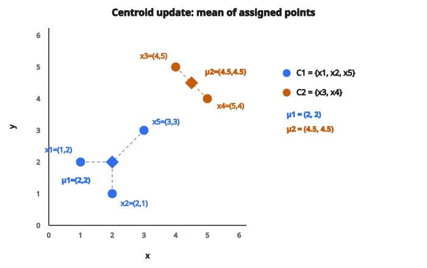

# Bước cập nhật centroid K-Means

## Bước cập nhật centroid là gì

Bước cập nhật centroid là nửa sau của mỗi vòng lặp K-Means. Sau khi gán mỗi điểm vào một cluster, ta tính lại mỗi centroid như **mean** của mọi điểm thuộc cluster đó.

$$
\mu_j = \frac{1}{|C_j|} \sum_{i \in C_j} x_i
$$

với $C_j$ là tập điểm gán vào cluster $j$ và $|C_j|$ là số điểm trong cluster $j$.

## Vì sao dùng mean

Mean cực tiểu hóa tổng khoảng cách bình phương tới mọi điểm:

$$
\mu_j^{*} = \arg\min_{\mu} \sum_{i \in C_j} \|x_i - \mu\|^2
$$

Lấy đạo hàm theo $\mu$ và cho bằng không:

$$
\frac{\partial}{\partial \mu} \sum_{i \in C_j} \|x_i - \mu\|^2 = -2 \sum_{i \in C_j} (x_i - \mu) = 0
$$

Giải: $\sum_{i \in C_j} x_i = |C_j| \cdot \mu$

$$
\mu = \frac{1}{|C_j|} \sum_{i \in C_j} x_i
$$

Mean là centroid tối ưu để cực tiểu hóa khoảng cách bình phương.

## Ví dụ từng bước

**Điểm dữ liệu (2D):**

* $x_1 = (1, 2)$
* $x_2 = (2, 1)$
* $x_3 = (4, 5)$
* $x_4 = (5, 4)$
* $x_5 = (3, 3)$

**Gán cluster hiện tại:**

* Cluster 1: $\{x_1, x_2, x_5\}$
* Cluster 2: $\{x_3, x_4\}$

**Cập nhật centroid 1:**

Điểm trong cluster 1: $(1, 2)$, $(2, 1)$, $(3, 3)$

$$
\begin{aligned}
\mu_1 &= \frac{1}{3} \bigl[(1, 2) + (2, 1) + (3, 3)\bigr] \\
      &= \frac{1}{3} (1+2+3,\ 2+1+3) = \frac{1}{3} (6, 6) = (2, 2)
\end{aligned}
$$

**Cập nhật centroid 2:**

Điểm trong cluster 2: $(4, 5)$, $(5, 4)$

$$
\begin{aligned}
\mu_2 &= \frac{1}{2} \bigl[(4, 5) + (5, 4)\bigr] \\
      &= \frac{1}{2} (4+5,\ 5+4) = \frac{1}{2} (9, 9) = (4.5, 4.5)
\end{aligned}
$$

**Centroid sau cập nhật:**

* $\mu_1 = (2, 2)$
* $\mu_2 = (4.5, 4.5)$

::: {#fig-145-kmeans-centroid fig-cap="Mean của C₁ = {x₁, x₂, x₅} cho μ₁ = (2, 2); mean của C₂ = {x₃, x₄} cho μ₂ = (4.5, 4.5). Centroid mới là trung bình tọa độ của các điểm đã gán." fig-alt="Năm điểm 2D: C1 gồm x1, x2, x5 với centroid mới μ1=(2,2); C2 gồm x3, x4 với centroid mới μ2=(4.5, 4.5). Đường nối mỗi điểm tới mean của cluster."}
{fig-align="center"}
:::

## Tính nhiều chiều

Với dữ liệu $d$ chiều, tính mean từng chiều riêng:

$$
\mu_j = (\mu_{j1}, \mu_{j2}, \ldots, \mu_{jd})
$$

với

$$
\mu_{jk} = \frac{1}{|C_j|} \sum_{i \in C_j} x_{ik}
$$

Mỗi tọa độ của centroid là trung bình tọa độ đó trên mọi điểm trong cluster.

## Tính vector hóa

Để hiệu quả, dùng phép toán ma trận:

**Đầu vào:**

* $X$: ma trận dữ liệu shape $(n, d)$
* $c$: nhãn cluster, mảng độ dài $n$ với giá trị trong $\{1, \ldots, k\}$

**Với mỗi cluster $j$:**

1. Tạo mask: $m_j = (c == j)$, mảng boolean độ dài $n$
2. Chọn điểm: $X_j = X[m_j]$, shape $(|C_j|, d)$
3. Tính mean: $\mu_j = \mathrm{mean}(X_j, \text{axis}=0)$, shape $(d,)$

Hoặc dùng scatter-add để tính song song.

## Cluster rỗng

Nếu một cluster không có điểm nào được gán, mean không xác định (chia cho không).

**Vấn đề:** $|C_j| = 0 \Rightarrow \mu_j = ?$

**Cách xử lý:**

**Giữ centroid cũ:** Không cập nhật centroid nếu cluster rỗng.

**Khởi tạo lại ngẫu nhiên:** Đặt centroid tại một điểm dữ liệu ngẫu nhiên.

**Điểm xa nhất:** Đặt centroid tại điểm xa nhất so với mọi centroid khác (khuyến khích phủ không gian).

**Tách cluster lớn:** Lấy cluster lớn nhất và chia đôi, đặt mỗi centroid tại mean của từng nửa.

## Hàm mục tiêu K-Means

Bước cập nhật centroid làm giảm (hoặc giữ nguyên) within-cluster sum of squares:

$$
J = \sum_{j=1}^{k} \sum_{i \in C_j} \|x_i - \mu_j\|^2
$$

**Chứng minh:**

Với gán cố định $C_1, \ldots, C_k$, mục tiêu $J$ đạt cực tiểu khi mỗi $\mu_j$ là mean của $C_j$.

Vì ta đặt $\mu_j$ đúng bằng mean này, ta đạt cực tiểu cho các gán hiện tại.

Vậy $J$ không thể tăng sau bước cập nhật centroid.

## Đảm bảo hội tụ

Mỗi vòng lặp K-Means (gán + cập nhật) hoặc:

* Giảm $J$, hoặc
* Giữ $J$ không đổi (đã hội tụ)

Vì:

1. $J$ bị chặn dưới (bởi 0)
2. Chỉ có hữu hạn cách gán
3. $J$ giảm ở mỗi bước

Thuật toán phải hội tụ sau hữu hạn vòng lặp.

## Cập nhật centroid online

Với dữ liệu streaming hoặc mini-batch K-Means, cập nhật centroid tăng dần:

**Công thức mean chạy:**

Khi thêm điểm mới $x_{\mathrm{new}}$ vào cluster $j$:

$$
\mu_j^{\mathrm{new}} = \mu_j^{\mathrm{old}} + \frac{1}{n_j + 1} (x_{\mathrm{new}} - \mu_j^{\mathrm{old}})
$$

với $n_j$ là số điểm hiện có trong cluster $j$.

Cách này tránh tính lại tổng trên mọi điểm.

## Cập nhật mini-batch

Với mini-batch K-Means:

1. Với mỗi điểm trong mini-batch, tìm centroid gần nhất
2. Cập nhật centroid với learning rate $\eta$:

$$
\mu_j \leftarrow (1 - \eta) \mu_j + \eta \cdot \frac{1}{|B_j|} \sum_{i \in B_j} x_i
$$

với $B_j$ là tập điểm mini-batch gán vào cluster $j$.

Learning rate $\eta$ giảm theo thời gian để hội tụ.

## K-Medians vs K-Means

**K-Means:** Centroid là mean, cực tiểu hóa khoảng cách bình phương.

**K-Medians:** Centroid là median (từng tọa độ), cực tiểu hóa khoảng cách tuyệt đối (L1).

$$
\mu_{jk}^{\mathrm{median}} = \mathrm{median}(\{x_{ik} : i \in C_j\})
$$

K-Medians bền hơn với outlier.

## K-Medoids

Thay vì tính mean, centroid phải là một điểm dữ liệu thật:

$$
\mu_j = \arg\min_{x \in C_j} \sum_{i \in C_j} \|x_i - x\|^2
$$

Medoid là điểm cực tiểu hóa tổng khoảng cách tới mọi điểm khác trong cluster.

**Ưu điểm:**

* Làm việc với mọi metric khoảng cách
* Bền với outlier
* Centroid luôn là một điểm dữ liệu thật

**Nhược điểm:**

* Đắt hơn: $O(|C_j|^2)$ mỗi cluster

## Độ phức tạp tính toán

**Mỗi cluster:**

* Cộng $|C_j|$ vector chiều $d$: $O(|C_j| \cdot d)$
* Chia cho số điểm: $O(d)$

**Tổng mọi cluster:**

* $\sum_j O(|C_j| \cdot d) = O(n \cdot d)$

Rất hiệu quả, tuyến tính theo số điểm.

## Độ chính xác số

Với tập lớn, cộng nhiều số có thể mất độ chính xác.

**Cách xử lý:**

**Kahan summation:** Dùng thuật toán cộng bù sai số.

**Hai lượt:** Trước tính mean gần đúng, rồi tính độ lệch.

**Độ chính xác cao hơn:** Dùng float 64-bit dù dữ liệu là 32-bit.

Với hầu hết ứng dụng, số học floating-point chuẩn là đủ.

## K-Means có trọng số

Nếu điểm có trọng số $w_i$, centroid có trọng số là:

$$
\mu_j = \frac{\sum_{i \in C_j} w_i x_i}{\sum_{i \in C_j} w_i}
$$

Đây là tổng quát của trường hợp không trọng số, khi mọi $w_i = 1$.

Hữu ích khi một số điểm quan trọng hơn, hoặc đại diện cho nhiều quan sát.

## Code
```python
def k_means_centroid_update(points, assignments, k):
    """
    Compute new centroids as the mean of assigned points.
    """
    dim = len(points[0])
    sums = [[0.0] * dim for _ in range(k)]
    counts = [0] * k
    for i, p in enumerate(points):
        c = assignments[i]
        counts[c] += 1
        for d in range(dim):
            sums[c][d] += p[d]
    return [[sums[j][d] / counts[j] if counts[j] > 0 else 0.0
             for d in range(dim)] for j in range(k)]

```

<!-- auto-self-check -->

::: {.callout-note}
## Kiểm tra nhanh
<details>
<summary>Ý chính của bài «Bước cập nhật centroid K-Means» là gì?</summary>
Bước cập nhật centroid là nửa sau của mỗi vòng lặp K-Means.
</details>
<details>
<summary>Công thức / quan hệ cốt lõi trong bài là gì?</summary>
$$\mu_j = \frac{1}{|C_j|} \sum_{i \in C_j} x_i$$
</details>
:::
