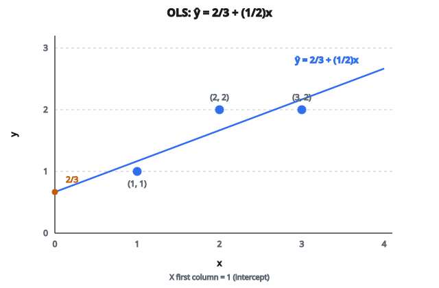

# Linear Regression dạng đóng

## Bài toán linear regression

Linear regression tìm đường thẳng (hoặc siêu phẳng) khớp nhất đi qua các điểm dữ liệu. Cho đặc trưng đầu vào $X$ và giá trị đích $y$, ta muốn tìm trọng số $w$ sao cho:

$$
Xw \approx y
$$

Trọng số “tốt nhất” cực tiểu hóa tổng bình phương sai số giữa dự đoán và giá trị thật.

## Thiết lập tối ưu

Ta muốn cực tiểu hóa squared error:

$$
L(w) = \|Xw - y\|^2 = (Xw - y)^{T}(Xw - y)
$$

Đây là hàm bậc hai theo $w$, hình dạng như một cái bát. Có cực tiểu duy nhất (khi $X^{T} X$ khả nghịch), và ta tìm đúng điểm đó bằng cách cho gradient bằng không.

## Suy ra normal equation

**Bước 1: Khai triển loss**

$$
\begin{aligned}
L(w)
&= (Xw - y)^{T}(Xw - y) \\
&= w^{T} X^{T} X w - 2w^{T} X^{T} y + y^{T} y
\end{aligned}
$$

**Bước 2: Lấy gradient theo $w$**

$$
\nabla_w L = 2 X^{T} X w - 2 X^{T} y
$$

**Bước 3: Cho gradient bằng không**

$$
2 X^{T} X w - 2 X^{T} y = 0
$$

$$
X^{T} X w = X^{T} y
$$

**Bước 4: Giải ra $w$**

$$
w = (X^{T} X)^{-1} X^{T} y
$$

Đây là **normal equation**, nghiệm dạng đóng của linear regression.

## Hiểu từng thành phần

**$X^{T} X$** (Gram matrix):

* Shape: $d \times d$ với $d$ là số đặc trưng
* Đối xứng và semi-definite dương
* Phần tử $(i, j)$ là tích vô hướng của cột đặc trưng $i$ và $j$
* Nắm cấu trúc tương quan giữa các đặc trưng

**$(X^{T} X)^{-1}$:**

* Nghịch đảo của Gram matrix
* Tồn tại khi các đặc trưng không cộng tuyến hoàn hảo
* Condition number càng lớn thì nghiệm càng kém ổn định

**$X^{T} y$:**

* Shape: $d \times 1$
* Phần tử $i$ là tích vô hướng của cột đặc trưng $i$ với target
* Đo mức thẳng hàng của từng đặc trưng với target

## Ví dụ số

**Dữ liệu:** 3 mẫu, 2 đặc trưng

$$
X = \begin{bmatrix} 1 & 1 \\ 1 & 2 \\ 1 & 3 \end{bmatrix}, \quad y = \begin{bmatrix} 1 \\ 2 \\ 2 \end{bmatrix}
$$

Cột đầu toàn 1 (hạng tử intercept).

**Bước 1: Tính $X^{T} X$**

$$
X^{T} X = \begin{bmatrix} 1 & 1 & 1 \\ 1 & 2 & 3 \end{bmatrix} \begin{bmatrix} 1 & 1 \\ 1 & 2 \\ 1 & 3 \end{bmatrix} = \begin{bmatrix} 3 & 6 \\ 6 & 14 \end{bmatrix}
$$

**Bước 2: Tính $X^{T} y$**

$$
X^{T} y = \begin{bmatrix} 1 & 1 & 1 \\ 1 & 2 & 3 \end{bmatrix} \begin{bmatrix} 1 \\ 2 \\ 2 \end{bmatrix} = \begin{bmatrix} 5 \\ 11 \end{bmatrix}
$$

**Bước 3: Tính $(X^{T} X)^{-1}$**

Với ma trận $2 \times 2$:

$$
\det(X^{T} X) = 3 \cdot 14 - 6 \cdot 6 = 42 - 36 = 6
$$

$$
(X^{T} X)^{-1} = \frac{1}{6} \begin{bmatrix} 14 & -6 \\ -6 & 3 \end{bmatrix} = \begin{bmatrix} 7/3 & -1 \\ -1 & 1/2 \end{bmatrix}
$$

**Bước 4: Tính $w$**

$$
\begin{aligned}
w
&= (X^{T} X)^{-1} X^{T} y \\
&= \begin{bmatrix} 7/3 & -1 \\ -1 & 1/2 \end{bmatrix} \begin{bmatrix} 5 \\ 11 \end{bmatrix} \\
&= \begin{bmatrix} 35/3 - 11 \\ -5 + 11/2 \end{bmatrix} \\
&= \begin{bmatrix} 2/3 \\ 1/2 \end{bmatrix}
\end{aligned}
$$

Đường hồi quy: $\hat{y} = \dfrac{2}{3} + \dfrac{1}{2}x$

::: {#fig-143-ols-line fig-cap="Ba điểm $(1,1)$, $(2,2)$, $(3,2)$ với cột intercept; đường OLS $\hat{y} = 2/3 + (1/2)x$ khớp $w = [2/3,\, 1/2]^{T}$." fig-alt="Ba điểm (1,1), (2,2), (3,2) và đường OLS ŷ = 2/3 + (1/2)x; cột intercept toàn 1."}
{fig-align="center"}
:::

## Khi nào công thức này dùng được?

**Điều kiện khả nghịch:**

$(X^{T} X)^{-1}$ tồn tại khi $X^{T} X$ khả nghịch, tức cần:

* Nhiều mẫu hơn đặc trưng ($n \geq d$)
* Không có đa cộng tuyến hoàn hảo (không đặc trưng nào là tổ hợp tuyến tính của các đặc trưng còn lại)

**Đa cộng tuyến hoàn hảo:**

Nếu hai đặc trưng tương quan hoàn hảo (ví dụ một cái là bản scale của cái kia), $X^{T} X$ suy biến. Hệ có vô số nghiệm.

## Ổn định số

**Condition number:**

Ngay cả khi $X^{T} X$ về mặt kỹ thuật khả nghịch, nó vẫn có thể ill-conditioned. Condition number lớn nghĩa là:

* Thay đổi nhỏ ở $X$ hoặc $y$ làm $w$ đổi mạnh
* Sai số floating-point bị khuếch đại
* Nghiệm có thể không đáng tin

**Cách tiếp cận tốt hơn:**

Trong thực tế, tránh tính $(X^{T} X)^{-1}$ trực tiếp. Thay vào đó:

* Dùng QR decomposition: $X = QR$, rồi giải $Rw = Q^{T} y$
* Dùng SVD: ổn định hơn với bài ill-conditioned
* Dùng phương pháp lặp cho tập rất lớn

## Thêm regularization

Để xử lý đa cộng tuyến hoặc chống overfitting, thêm hạng regularization:

**Ridge regression (L2):**

$$
w = (X^{T} X + \lambda I)^{-1} X^{T} y
$$

Hạng $\lambda I$ thêm vào làm ma trận khả nghịch và kéo trọng số về không.

**Vẫn còn dạng đóng!** Khác Lasso (regularization L1), vốn cần tối ưu lặp.

## Độ phức tạp tính toán

* Tính $X^{T} X$: $O(nd^{2})$
* Nghịch đảo $X^{T} X$: $O(d^{3})$
* Tổng: $O(nd^{2} + d^{3})$

Khi $d$ nhỏ (ít đặc trưng), cách này nhanh. Khi $d$ lớn, phương pháp lặp như hạ gradient có thể được ưu tiên hơn.

## Liên hệ với phép chiếu

Về hình học, $Xw$ là hình chiếu của $y$ lên không gian cột của $X$. Normal equation tìm điểm trong không gian con đó gần $y$ nhất.

Phần dư $y - Xw$ trực giao với mọi cột của $X$:

$$
X^{T}(y - Xw) = X^{T} y - X^{T} X w = 0
$$

Đây đúng là normal equation viết lại.

## Code
```python
import numpy as np

def linear_regression_closed_form(X, y):
    """
    Compute the optimal weight vector using the normal equation.
    """
    X = np.asarray(X, dtype=np.float64)
    y = np.asarray(y, dtype=np.float64)
    w = np.linalg.inv(X.T @ X) @ X.T @ y
    return w.tolist()
```
