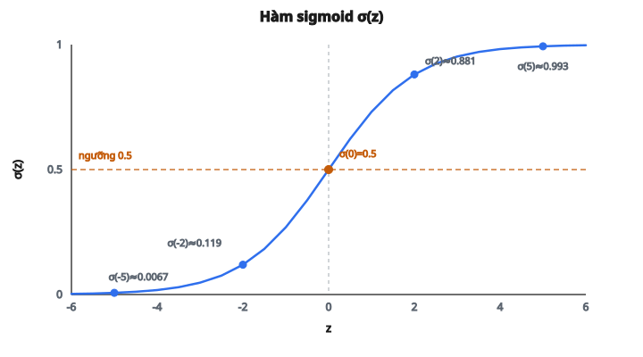

# Vòng lặp huấn luyện Logistic Regression

## Logistic regression làm gì

Logistic regression là thuật toán **phân loại nhị phân**. Cho vector đặc trưng đầu vào, mô hình dự đoán xác suất một mẫu thuộc lớp dương (lớp 1).

Dù tên có chữ *regression*, logistic regression dùng cho **phân loại**, không phải hồi quy. Phần “regression” chỉ việc khớp một mô hình vào dữ liệu, giống linear regression, nhưng đầu ra là xác suất trong khoảng $(0, 1)$.

Mô hình trả lời các câu hỏi như:

* Email này có phải spam hay không?
* Khách hàng này sẽ rời đi hay ở lại?
* Khối u này ác tính hay lành tính?

## Cấu trúc mô hình

Logistic regression ghép hai phần:

**Phần 1: Tổ hợp tuyến tính**

$$
z = Xw + b
$$

với

$$
\begin{aligned}
X &:\ \text{ma trận đầu vào, shape }(n_{\text{samples}},\, n_{\text{features}}), \\
w &:\ \text{vector trọng số, shape }(n_{\text{features}},), \\
b &:\ \text{bias, vô hướng, broadcast cho mọi mẫu}, \\
z &:\ \text{đầu ra tuyến tính, shape }(n_{\text{samples}},),\ \text{một logit mỗi mẫu}.
\end{aligned}
$$

**Phần 2: Hàm kích hoạt sigmoid**

$$
p = \sigma(z) = \frac{1}{1 + e^{-z}}
$$

Sigmoid nén mọi số thực vào khoảng $(0, 1)$; ta diễn giải giá trị này như một xác suất.

Mô hình đầy đủ:

$$
p = \sigma(Xw + b) = \frac{1}{1 + e^{-(Xw + b)}}
$$

## Hiểu hàm sigmoid

Hàm sigmoid $\sigma(z) = \frac{1}{1 + e^{-z}}$ có các tính chất:

* Đầu ra luôn nằm trong $(0, 1)$
* $\sigma(0) = 0.5$ (ngưỡng quyết định)
* $\sigma(z) \to 1$ khi $z \to +\infty$
* $\sigma(z) \to 0$ khi $z \to -\infty$
* Đối xứng: $\sigma(-z) = 1 - \sigma(z)$

Một số giá trị:

* $\sigma(-5) \approx 0.0067$
* $\sigma(-2) \approx 0.119$
* $\sigma(0) = 0.5$
* $\sigma(2) \approx 0.881$
* $\sigma(5) \approx 0.9933$

::: {#fig-02-sigmoid fig-cap="σ(z) ∈ (0,1) và σ(0) = 0.5 là ngưỡng quyết định mặc định. Năm điểm trên đường cong khớp bảng giá trị trong bài." fig-alt="Đường cong sigmoid σ(z) trên trục z từ -6 đến 6; năm điểm z = -5, -2, 0, 2, 5 và đường ngang ngưỡng σ = 0.5."}
{fig-align="center"}
:::

Đạo hàm của sigmoid có dạng gọn:

$$
\frac{d\sigma}{dz} = \sigma(z) \cdot (1 - \sigma(z))
$$

Đạo hàm này được dùng khi lan truyền ngược.

## Hàm mất mát Binary Cross-Entropy

Để huấn luyện logistic regression, cần một hàm mất mát đo mức độ sai của dự đoán. Với phân loại nhị phân, ta dùng **binary cross-entropy** (còn gọi là log loss):

$$
L = -\frac{1}{n} \sum_{i=1}^{n} \left[ y_i \log(p_i) + (1 - y_i) \log(1 - p_i) \right]
$$

với

$$
\begin{aligned}
n &:\ \text{số mẫu huấn luyện}, \\
y_i &:\ \text{nhãn thật }(0\ \text{hoặc}\ 1), \\
p_i &:\ \text{xác suất dự đoán cho mẫu }i.
\end{aligned}
$$

**Vì sao công thức này đúng:**

Khi $y_i = 1$ (lớp dương):

* Loss còn $- \log(p_i)$
* Nếu $p_i$ gần $1$ (đúng), $-\log(p_i) \approx 0$ (loss thấp)
* Nếu $p_i$ gần $0$ (sai), $-\log(p_i) \to \infty$ (loss cao)

Khi $y_i = 0$ (lớp âm):

* Loss còn $- \log(1 - p_i)$
* Nếu $p_i$ gần $0$ (đúng), $-\log(1 - p_i) \approx 0$ (loss thấp)
* Nếu $p_i$ gần $1$ (sai), $-\log(1 - p_i) \to \infty$ (loss cao)

## Hạ gradient cho logistic regression

Huấn luyện nghĩa là tìm trọng số $w$ và bias $b$ làm giảm loss. Ta dùng **hạ gradient**:

1. Khởi tạo $w$ và $b$ (thường bằng không)
2. Tính dự đoán $p = \sigma(Xw + b)$
3. Tính loss $L$
4. Tính gradient $\frac{\partial L}{\partial w}$ và $\frac{\partial L}{\partial b}$
5. Cập nhật tham số ngược hướng gradient
6. Lặp đến khi hội tụ

**Các gradient:**

Với logistic regression và binary cross-entropy, gradient có dạng gọn:

$$
\frac{\partial L}{\partial w} = \frac{1}{n} X^{T} (p - y)
$$

$$
\frac{\partial L}{\partial b} = \frac{1}{n} \sum_{i=1}^{n} (p_i - y_i)
$$

trong đó $(p - y)$ là vector sai số dự đoán.

**Quy tắc cập nhật:**

$$
w \leftarrow w - \alpha \cdot \frac{\partial L}{\partial w}
$$

$$
b \leftarrow b - \alpha \cdot \frac{\partial L}{\partial b}
$$

với $\alpha$ là **learning rate**.

## Suy ra gradient

Đạo hàm được suy từ quy tắc chuỗi kết hợp đạo hàm sigmoid. Với một mẫu:

$$
\frac{\partial L}{\partial z} = p - y
$$

Kết quả đơn giản này đến từ việc cross-entropy và sigmoid bắt cặp toán học: đạo hàm loss theo logit đúng bằng sai số dự đoán.

Tiếp theo, quy tắc chuỗi:

$$
\frac{\partial L}{\partial w} = \frac{\partial L}{\partial z} \cdot \frac{\partial z}{\partial w} = (p - y) \cdot x
$$

$$
\frac{\partial L}{\partial b} = \frac{\partial L}{\partial z} \cdot \frac{\partial z}{\partial b} = (p - y) \cdot 1
$$

Trung bình trên mọi mẫu cho gradient của cả batch.

## Ví dụ số

Xét tập dữ liệu đơn giản với 2 đặc trưng và 4 mẫu:

$$
X = \begin{bmatrix}
1.0 & 2.0 \\
2.0 & 1.0 \\
-1.0 & -1.0 \\
-2.0 & -2.0
\end{bmatrix},
\quad
y = \begin{bmatrix} 1 \\ 1 \\ 0 \\ 0 \end{bmatrix}
$$

### Bước 1: Khởi tạo

$$
w = \begin{bmatrix} 0 \\ 0 \end{bmatrix}, \quad b = 0
$$

### Bước 2: Lượt truyền xuôi đầu tiên

$$
z = Xw + b = \begin{bmatrix} 0 \\ 0 \\ 0 \\ 0 \end{bmatrix}
$$

$$
p = \sigma(z) = \begin{bmatrix} 0.5 \\ 0.5 \\ 0.5 \\ 0.5 \end{bmatrix}
$$

Mọi dự đoán đều là $0.5$ (bất định tối đa).

### Bước 3: Tính gradient

Vector sai số:

$$
\begin{aligned}
p - y
&= \begin{bmatrix} 0.5 - 1 \\ 0.5 - 1 \\ 0.5 - 0 \\ 0.5 - 0 \end{bmatrix} \\
&= \begin{bmatrix} -0.5 \\ -0.5 \\ 0.5 \\ 0.5 \end{bmatrix}
\end{aligned}
$$

$$
\begin{aligned}
\frac{\partial L}{\partial w}
&= \frac{1}{4} X^{T} (p - y) \\
&= \frac{1}{4}
\begin{bmatrix}
1.0 & 2.0 & -1.0 & -2.0 \\
2.0 & 1.0 & -1.0 & -2.0
\end{bmatrix}
\begin{bmatrix} -0.5 \\ -0.5 \\ 0.5 \\ 0.5 \end{bmatrix} \\
&= \frac{1}{4}
\begin{bmatrix} -3.0 \\ -3.0 \end{bmatrix}
= \begin{bmatrix} -0.75 \\ -0.75 \end{bmatrix}
\end{aligned}
$$

$$
\frac{\partial L}{\partial b} = \frac{1}{4} \sum_{i=1}^{4} (p_i - y_i) = \frac{1}{4}(-0.5 - 0.5 + 0.5 + 0.5) = 0
$$

### Bước 4: Cập nhật tham số

Với learning rate $\alpha = 0.1$:

$$
\begin{aligned}
w &\leftarrow \begin{bmatrix} 0 \\ 0 \end{bmatrix} - 0.1 \cdot \begin{bmatrix} -0.75 \\ -0.75 \end{bmatrix} \\
  &= \begin{bmatrix} 0.075 \\ 0.075 \end{bmatrix}
\end{aligned}
$$

$$
b \leftarrow 0 - 0.1 \cdot 0 = 0
$$

Trọng số tăng, nên logit (và xác suất) của hai mẫu dương (hàng 1–2 của $X$) sẽ tăng, còn của hai mẫu âm (hàng 3–4) sẽ giảm. Sau nhiều vòng lặp, mô hình học được $w$ tách hai lớp.

## Hội tụ và learning rate

Learning rate $\alpha$ kiểm soát độ lớn mỗi bước cập nhật:

* Quá lớn: thuật toán có thể vượt quá cực tiểu và phân kỳ
* Quá nhỏ: hội tụ rất chậm
* Vừa phải: hội tụ mượt tới cực tiểu

Giá trị điển hình từ $0.001$ đến $0.1$, tùy dữ liệu và thang của đặc trưng.

**Dấu hiệu hội tụ tốt:**

* Loss giảm đều qua các vòng lặp
* Loss cuối cùng ổn định tại một cực tiểu
* Giá trị tham số ổn định

**Dấu hiệu có vấn đề:**

* Loss tăng hoặc dao động mạnh (learning rate quá cao)
* Loss giảm cực chậm (learning rate quá thấp)
* Loss thành NaN (tràn số, thường do dự đoán cực đoan)

## Dự đoán

Sau khi huấn luyện, dùng $w$ và $b$ đã học để dự đoán:

1. Tính $p = \sigma(Xw + b)$
2. Nếu $p \geq 0.5$, dự đoán lớp 1
3. Nếu $p < 0.5$, dự đoán lớp 0

Ngưỡng $0.5$ là biên quyết định mặc định. Trong thực tế, có thể chỉnh ngưỡng theo chi phí false positive so với false negative.

## Code
```python
def train_logistic_regression(X, y, lr=0.1, steps=1000):
    """
    Train logistic regression via gradient descent.
    Return (w, b).
    """
    X = np.asarray(X, float)
    y = np.asarray(y, float)
    N, D = X.shape
    w = np.zeros(D)
    b = 0.0
    for _ in range(steps):
        logits = X @ w + b
        preds = _sigmoid(logits)
        grad_w = X.T @ (preds - y) / N
        grad_b = np.mean(preds - y)
        w -= lr * grad_w
        b -= lr * grad_b
    return w, b

```

<!-- auto-self-check -->

::: {.callout-note}
## Kiểm tra nhanh
<details>
<summary>Ý chính của bài «Vòng lặp huấn luyện Logistic Regression» là gì?</summary>
Logistic regression là thuật toán **phân loại nhị phân**.
</details>
<details>
<summary>Công thức / quan hệ cốt lõi trong bài là gì?</summary>
$$z = Xw + b$$
</details>
:::
