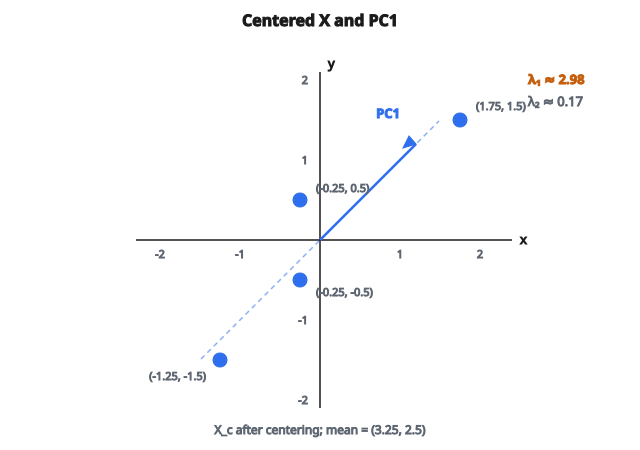

# Chiếu PCA

## PCA là gì

Principal Component Analysis (PCA) là kỹ thuật giảm số chiều của dữ liệu trong khi giữ càng nhiều phương sai càng tốt. PCA tìm các trục mới (principal component) dọc theo hướng dữ liệu biến thiên mạnh nhất.

Nếu có 100 feature nhưng chỉ 10 hướng bắt phần lớn biến thiên, PCA cho phép chiếu lên 10 hướng đó và bỏ phần còn lại.

## Ý tưởng cốt lõi

Hãy tưởng tượng một đám mây điểm trong không gian 3D có dạng bánh pancake dẹt. Phần lớn độ trải nằm trên hai hướng (mặt bánh), còn hướng thứ ba (độ dày bánh) hầu như không biến thiên.

PCA xác định:

1. Hướng phương sai cực đại (principal component thứ nhất)
2. Hướng phương sai lớn thứ hai, vuông góc với hướng thứ nhất (PC thứ hai)
3. Và tiếp tục như vậy...

Chiếu lên $k$ thành phần đầu tiên giữ biến thiên quan trọng nhất và loại nhiễu.

## Thuật toán

**Bước 1: Center dữ liệu**

Trừ mean mỗi feature để dữ liệu đặt tại gốc:

$$
X_c = X - \bar{X}
$$

với $\bar{X}$ là vector hàng các mean theo cột.

**Bước 2: Tính covariance matrix**

$$
C = \frac{1}{n-1} X_c^{T} X_c
$$

Ma trận $d \times d$ này mô tả các feature đồng biến thế nào.

**Bước 3: Tìm eigenvalue và eigenvector**

Giải $Cv = \lambda v$ để được:

* Eigenvalue $\lambda_1 \geq \lambda_2 \geq \ldots \geq \lambda_d$
* Eigenvector tương ứng $v_1, v_2, \ldots, v_d$

Các eigenvector là hướng của principal component.

**Bước 4: Chiếu dữ liệu**

Lấy $k$ eigenvector đầu làm cột của $W$ (shape $d \times k$):

$$
X_{\mathrm{proj}} = X_c W
$$

Kết quả có shape $n \times k$: dữ liệu đã chiếu xuống $k$ chiều.

## Ví dụ số

**Dữ liệu:** 4 mẫu, 2 feature

$$
X = \begin{bmatrix}
2 & 1 \\
3 & 2 \\
3 & 3 \\
5 & 4
\end{bmatrix}
$$

**Bước 1: Center**

Mean: $\bar{x}_1 = 3.25$, $\bar{x}_2 = 2.5$

$$
X_c = \begin{bmatrix}
-1.25 & -1.5 \\
-0.25 & -0.5 \\
-0.25 & 0.5 \\
1.75 & 1.5
\end{bmatrix}
$$

**Bước 2: Covariance matrix**

$$
C = \frac{1}{3} X_c^{T} X_c = \begin{bmatrix} 1.5625 & 1.4167 \\ 1.4167 & 1.5833 \end{bmatrix}
$$

**Bước 3: Phân tích riêng**

Giải cho eigenvalue xấp xỉ $2.98$ và $0.17$.

Eigenvector thứ nhất (hướng phương sai cực đại) trỏ gần theo đường chéo, hợp lý vì hai feature cùng tăng.

::: {#fig-148-pca-pc1 fig-cap="Bốn điểm của X sau khi center nằm dọc hướng chéo; PC1 (λ ≈ 2.98) theo đường chéo, λ₂ ≈ 0.17. Chiếu lên PC1 giữ phần lớn phương sai." fig-alt="Scatter bốn điểm đã center: (-1.25,-1.5), (-0.25,-0.5), (-0.25,0.5), (1.75,1.5). Mũi tên PC1 theo đường chéo, nhãn λ≈2.98 và λ≈0.17."}
{fig-align="center"}
:::

**Bước 4: Chiếu xuống 1D**

Dùng eigenvector thứ nhất, mỗi điểm dữ liệu thành một số — vị trí của nó dọc theo hướng chính.

## Phương sai được giải thích

Mỗi eigenvalue là phương sai dọc principal component đó:

$$
\text{phương sai giải thích bởi PC}_i = \frac{\lambda_i}{\sum_{j} \lambda_j}
$$

Nếu ba eigenvalue lớn nhất là $[10, 3, 1]$ trên tổng $15$:

* PC1 giải thích $10/15 = 67\%$ phương sai
* PC2 giải thích $3/15 = 20\%$ phương sai
* PC3 giải thích $1/15 = 7\%$ phương sai

Hai thành phần đầu cộng lại giải thích $87\%$ phương sai. Có thể chỉ giữ hai thành phần đó.

## Chọn số thành phần

**Các cách thường dùng:**

**Ngưỡng phương sai:** Giữ đủ thành phần để giải thích (ví dụ) $95\%$ tổng phương sai.

**Elbow method:** Vẽ phương sai giải thích theo số thành phần. Tìm “khuỷu” nơi thêm thành phần cho lợi ích giảm dần.

**Tiêu chí Kaiser:** Giữ thành phần có eigenvalue $> 1$ (với dữ liệu đã chuẩn hóa).

**Theo ứng dụng:** Nếu cần đúng 2D để vẽ, dùng $k = 2$.

## Tính chất của principal component

**Trực giao:** Các principal component vuông góc lẫn nhau. Nghĩa là các feature sau khi chiếu không tương quan.

**Sắp theo tầm quan trọng:** PC1 bắt nhiều phương sai hơn PC2, PC2 nhiều hơn PC3, v.v.

**Tổ hợp tuyến tính:** Mỗi PC là tổ hợp tuyến tính của các feature gốc. Nếu eigenvector thứ nhất là $[0.7, 0.7]$, thì $\mathrm{PC1} = 0.7 \cdot \mathrm{feature}_1 + 0.7 \cdot \mathrm{feature}_2$.

## PCA vs các phương pháp giảm chiều khác

**PCA:**

* Phương pháp tuyến tính
* Nhanh và scale tốt
* Giữ cấu trúc toàn cục
* Có thể bỏ lỡ pattern phi tuyến

**t-SNE, UMAP:**

* Phương pháp phi tuyến
* Tốt hơn cho visualization
* Giữ cấu trúc địa phương
* Đắt tính toán hơn

**Autoencoder:**

* Tiếp cận mạng nơ-ron
* Học được ánh xạ phi tuyến
* Cần dữ liệu huấn luyện
* Linh hoạt hơn nhưng phức tạp hơn

## Khi PCA hữu ích

**Giảm tính toán:** Huấn luyện mô hình nhanh hơn với ít feature hơn.

**Loại nhiễu:** Thành phần phương sai thấp thường bắt nhiễu. Bỏ chúng có thể cải thiện mô hình.

**Visualization:** Chiếu dữ liệu nhiều chiều xuống 2D hoặc 3D để vẽ.

**Khử tương quan feature:** Một số thuật toán làm việc tốt hơn với đầu vào không tương quan.

## Khi PCA gặp khó

**Quan hệ phi tuyến:** PCA tìm hướng tuyến tính. Nếu dữ liệu nằm trên manifold cong, PCA có thể bỏ lỡ cấu trúc.

**Thang đo khác nhau:** Feature thang lớn thống trị phương sai. Chuẩn hóa feature trước nếu thang khác nhau.

**Khả năng diễn giải:** Principal component là hỗn hợp của feature gốc. “PC1 là $0.3 \cdot \mathrm{age} + 0.2 \cdot \mathrm{income} + \cdots$” khó diễn giải.

## Ghi chú triển khai

**Biến thể SVD:**

Thay vì eigendecomposition của $X^{T} X$, có thể SVD trực tiếp trên $X$:

$$
X = U \Sigma V^{T}
$$

Các cột của $V$ là hướng principal component. Cách này thường ổn định số hơn.

**Centering là bắt buộc:**

Nếu bỏ centering, “principal component” thứ nhất sẽ trỏ về centroid của dữ liệu, không phải hướng phương sai cực đại. Luôn center trước PCA.

## Code
```python
import numpy as np

def pca_projection(X, k):
    """
    Project data onto the top-k principal components.
    """
    X = np.asarray(X, dtype=float)
    n, d = X.shape
    mean = X.mean(axis=0)
    X_c = X - mean
    cov = (X_c.T @ X_c) / (n - 1)
    eigenvalues, eigenvectors = np.linalg.eigh(cov)
    idx = np.argsort(eigenvalues)[::-1]
    eigenvectors = eigenvectors[:, idx]
    W = eigenvectors[:, :k]
    for j in range(k):
        max_idx = np.argmax(np.abs(W[:, j]))
        if W[max_idx, j] < 0:
            W[:, j] *= -1
    X_proj = X_c @ W
    return X_proj

```
