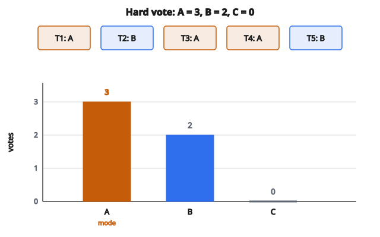

# Bình chọn đa số Random Forest

## Random Forest là gì

Random Forest là một **ensemble** các decision tree. Thay vì dựa vào một cây duy nhất, mô hình huấn luyện nhiều cây trên các tập con khác nhau của dữ liệu rồi kết hợp dự đoán của chúng.

Ý chính: từng cây có thể overfitting hoặc mắc lỗi, nhưng lấy trung bình trên nhiều cây đa dạng sẽ giảm variance và cải thiện generalization.

## Random Forest dự đoán thế nào

**Với phân loại:**

Mỗi cây bỏ phiếu cho một lớp. Dự đoán cuối cùng là **majority vote** (phiếu đa số) trên mọi cây.

$$
\hat{y} = \mathrm{mode}(\hat{y}_1, \hat{y}_2, \ldots, \hat{y}_T)
$$

với $\hat{y}_t$ là dự đoán của cây $t$ và $T$ là tổng số cây.

**Với hồi quy:**

Mỗi cây xuất ra một giá trị. Dự đoán cuối cùng là **trung bình** trên mọi cây.

$$
\hat{y} = \frac{1}{T} \sum_{t=1}^{T} \hat{y}_t
$$

## Quy trình bình chọn cho phân loại

**Bước 1:** Đưa mẫu đầu vào qua từng cây trong forest

**Bước 2:** Mỗi cây duyệt cấu trúc của mình và xuất ra một lớp dự đoán

**Bước 3:** Đếm phiếu cho từng lớp

**Bước 4:** Trả về lớp có nhiều phiếu nhất

Nếu hòa phiếu, các chiến lược thường dùng gồm:

* Chọn ngẫu nhiên trong các lớp đang hòa
* Chọn lớp có chỉ số nhỏ hơn
* Dùng ước lượng xác suất để phá hòa

## Ví dụ số: phân loại

**Thiết lập:** 5 cây, 3 lớp (A, B, C)

**Dự đoán của từng cây cho mẫu $X$:**

* Cây 1: lớp A
* Cây 2: lớp B
* Cây 3: lớp A
* Cây 4: lớp A
* Cây 5: lớp B

**Đếm phiếu:**

* Lớp A: 3 phiếu
* Lớp B: 2 phiếu
* Lớp C: 0 phiếu

**Dự đoán cuối:** lớp A (đa số, 3 trên 5 phiếu)

::: {#fig-146-rf-majority fig-cap="Hard vote trên 5 cây: A = 3, B = 2, C = 0 nên $\mathrm{mode} = A$." fig-alt="Năm cây bỏ phiếu A, B, A, A, B. Biểu đồ cột số phiếu: A = 3, B = 2, C = 0; mode là A."}
{fig-align="center"}
:::

## Ví dụ số: hồi quy

**Thiết lập:** 5 cây dự đoán giá nhà

**Dự đoán của từng cây cho mẫu $X$:**

* Cây 1: $250{,}000$
* Cây 2: $270{,}000$
* Cây 3: $245{,}000$
* Cây 4: $260{,}000$
* Cây 5: $255{,}000$

**Dự đoán cuối:**

$$
\hat{y} = \frac{250000 + 270000 + 245000 + 260000 + 255000}{5} = \frac{1280000}{5} = 256000
$$

Giá dự đoán là $256{,}000$.

## Vì sao bình chọn hiệu quả: trí tuệ đám đông

Xét mô hình đơn giản: mỗi cây có độ chính xác 60% (tốt hơn đoán ngẫu nhiên 50%).

**Một cây:** xác suất đúng 60%

**Đa số trên 5 cây:** cần ít nhất 3 cây đúng

$$
\begin{aligned}
P(\text{majority đúng})
&= \sum_{k=3}^{5} \binom{5}{k} (0.6)^k (0.4)^{5-k} \\
&= \binom{5}{3}(0.6)^3(0.4)^2 + \binom{5}{4}(0.6)^4(0.4)^1 + \binom{5}{5}(0.6)^5 \\
&= 10(0.216)(0.16) + 5(0.1296)(0.4) + 1(0.07776) \\
&= 0.3456 + 0.2592 + 0.07776 = 0.683
\end{aligned}
$$

**Kết quả:** độ chính xác ensemble 68.3% so với 60% của từng cây.

Với nhiều cây hơn (giả sử độc lập), độ chính xác tiến tới 100%.

## Soft voting và hard voting

**Hard voting:** Mỗi cây bỏ một phiếu cho lớp nó dự đoán. Dự đoán cuối là mode.

**Soft voting:** Mỗi cây xuất xác suất theo lớp. Trung bình các xác suất, rồi chọn lớp có xác suất trung bình cao nhất.

**Ví dụ soft voting:**

Xác suất cây 1: $[0.7, 0.2, 0.1]$ cho các lớp $[A, B, C]$

Xác suất cây 2: $[0.4, 0.5, 0.1]$

Xác suất cây 3: $[0.6, 0.3, 0.1]$

**Xác suất trung bình:**

* Lớp A: $(0.7 + 0.4 + 0.6)/3 = 0.567$
* Lớp B: $(0.2 + 0.5 + 0.3)/3 = 0.333$
* Lớp C: $(0.1 + 0.1 + 0.1)/3 = 0.1$

**Dự đoán cuối:** lớp A (xác suất trung bình cao nhất)

Soft voting thường tốt hơn vì có xét độ tin cậy của dự đoán.

## Vì sao Random Forest hiệu quả

**Bagging (Bootstrap Aggregating):**

Mỗi cây được huấn luyện trên một bootstrap sample (mẫu ngẫu nhiên có hoàn lại) của tập huấn luyện. Cách này tạo sự đa dạng giữa các cây.

**Feature randomization:**

Tại mỗi lần chia, chỉ một tập con ngẫu nhiên của các đặc trưng được xét. Điều này làm giảm tương quan giữa các cây thêm một bước nữa.

**Giảm variance:**

Lấy trung bình trên nhiều cây đã decorrelate sẽ giảm variance mà không tăng bias. Sai số kỳ vọng của trung bình thấp hơn sai số kỳ vọng của từng cây riêng.

$$
\operatorname{Var}(\bar{X}) = \frac{\operatorname{Var}(X)}{n} \quad \text{(khi các biến độc lập)}
$$

## Số cây

**Nhiều cây hơn:**

* Độ chính xác tốt hơn (lợi ích giảm dần sau một ngưỡng)
* Dự đoán ổn định hơn
* Thời gian huấn luyện và dự đoán dài hơn
* Tốn bộ nhớ hơn

**Giá trị điển hình:** 100 đến 500 cây

**Quy tắc thực dụng:** tiếp tục thêm cây đến khi lỗi out-of-bag ổn định.

## Xử lý hòa phiếu

Khi hai hay nhiều lớp có số phiếu bằng nhau:

**Phương án 1:** Chọn ngẫu nhiên

* Chọn ngẫu nhiên trong các lớp đang hòa
* Không deterministic

**Phương án 2:** Lớp có chỉ số nhỏ hơn

* Deterministic nhưng tùy tiện

**Phương án 3:** Dùng xác suất

* Nếu cây xuất xác suất, lấy trung bình để phá hòa
* Cách có nguyên tắc hơn

**Phương án 4:** Bình chọn có trọng số

* Gán trọng số khác nhau cho từng cây (ví dụ theo độ chính xác trên validation)
* Trọng số cao hơn = ảnh hưởng lớn hơn

## Dự đoán out-of-bag

Vì mỗi cây huấn luyện trên một bootstrap sample, khoảng 37% mẫu là "out-of-bag" (không được dùng) đối với từng cây.

**Dự đoán OOB:** Với mỗi mẫu, chỉ gộp phiếu từ những cây không huấn luyện trên mẫu đó.

Cách này cho ước lượng validation sẵn có, không cần tập validation tách riêng.

## Độ quan trọng đặc trưng từ bình chọn

Random Forest có thể ước lượng độ quan trọng của đặc trưng:

**Mean Decrease in Impurity:** Trung bình mức giảm impurity (Gini hoặc entropy) trên mọi lần chia theo đặc trưng đó, trên mọi cây.

**Permutation Importance:** Xáo giá trị của đặc trưng rồi đo độ chính xác giảm bao nhiêu. Đặc trưng quan trọng làm độ chính xác giảm mạnh.

## So sánh chiến lược bình chọn

**Majority voting (mode):**

* Đơn giản, dễ hiểu
* Mỗi cây có tiếng nói ngang nhau
* Tốt khi các cây có độ chính xác tương đương

**Weighted voting:**

* Cây tốt hơn có ảnh hưởng lớn hơn
* Cần ước lượng chất lượng từng cây
* Có thể tăng độ chính xác khi chất lượng cây không đều

**Probability averaging (soft voting):**

* Dùng thêm thông tin (độ tin cậy)
* Thường hơn hard voting
* Cần cây xuất được xác suất

## Cân nhắc tính toán

**Thời gian dự đoán:** $O(T \cdot d)$ với $T$ là số cây và $d$ là độ sâu trung bình của cây

**Song song hóa được:** Các cây độc lập, nên có thể tính dự đoán song song

**Bộ nhớ:** Phải lưu mọi cây trong bộ nhớ

Với forest 100 cây, độ sâu 10, mỗi cây 1000 lá, bộ nhớ có thể đáng kể nhưng thường vẫn quản lý được.

## Code
```python
def random_forest_vote(predictions):
    """
    Compute the majority vote from multiple tree predictions.
    """
    n_samples = len(predictions[0])
    result = []
    for i in range(n_samples):
        votes = {}
        for t in range(len(predictions)):
            v = predictions[t][i]
            votes[v] = votes.get(v, 0) + 1
        mx = max(votes.values())
        result.append(min(k for k, v in votes.items() if v == mx))
    return result

```
