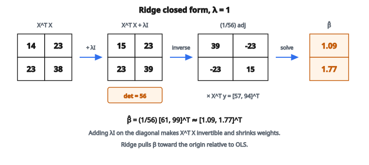

# Ridge Regression

## Ridge regression là gì

Ridge regression là **linear regression với regularization L2**. Nó thêm một hạng phạt vào hàm mất mát để không khuyến khích hệ số lớn, giúp chống overfitting.

$$
L(\beta) = \sum_{i=1}^{n} (y_i - \hat{y}_i)^2 + \lambda \sum_{j=1}^{p} \beta_j^2
$$

với:

* $y_i$ là giá trị đích của mẫu $i$
* $\hat{y}_i = \beta_0 + \sum_j \beta_j x_{ij}$ là dự đoán
* $\lambda$ là cường độ regularization
* $\beta_j$ là các hệ số (không gồm intercept)

## Vì sao cần regularization?

**Vấn đề của ordinary least squares (OLS):**

Khi đặc trưng tương quan (đa cộng tuyến) hoặc khi $p > n$ (nhiều đặc trưng hơn mẫu), OLS:

* Phương sai ước lượng hệ số cao
* Có thể cho hệ số lớn tùy ý
* Overfit dữ liệu huấn luyện

**Cách ridge xử lý:**

Hạng phạt $\lambda \sum_j \beta_j^2$ kéo hệ số về không, giảm phương sai đổi lấy việc đưa thêm một ít bias.

## Hàm mục tiêu ridge

Ký hiệu ma trận:

$$
L(\beta) = \|y - X\beta\|^2 + \lambda \|\beta\|^2
$$

với:

* $y$ là vector đích, shape $(n,)$
* $X$ là ma trận thiết kế, shape $(n, p)$
* $\beta$ là vector hệ số, shape $(p,)$
* $\|\cdot\|^2$ là bình phương chuẩn L2

## Nghiệm dạng đóng

Lấy đạo hàm và cho bằng không:

$$
\frac{\partial L}{\partial \beta} = -2X^{T}(y - X\beta) + 2\lambda\beta = 0
$$

$$
X^{T} X \beta + \lambda\beta = X^{T} y
$$

$$
(X^{T} X + \lambda I) \beta = X^{T} y
$$

**Nghiệm ridge:**

$$
\hat{\beta} = (X^{T} X + \lambda I)^{-1} X^{T} y
$$

Cộng $\lambda I$ bảo đảm ma trận khả nghịch, kể cả khi $X^{T} X$ suy biến.

## So sánh với OLS

**Ordinary Least Squares:**

$$
\hat{\beta}_{\mathrm{OLS}} = (X^{T} X)^{-1} X^{T} y
$$

**Ridge Regression:**

$$
\hat{\beta}_{\mathrm{Ridge}} = (X^{T} X + \lambda I)^{-1} X^{T} y
$$

Khác biệt là cộng $\lambda I$ vào đường chéo của $X^{T} X$.

* Khi $\lambda = 0$: Ridge trùng OLS
* Khi $\lambda \to \infty$: Hệ số co về không

## Vai trò của $\lambda$

**$\lambda$ nhỏ (regularization yếu):**

* Hệ số gần nghiệm OLS
* Phương sai cao hơn, bias thấp hơn
* Nguy cơ overfitting

**$\lambda$ lớn (regularization mạnh):**

* Hệ số co về không
* Phương sai thấp hơn, bias cao hơn
* Nguy cơ underfitting

**$\lambda$ tối ưu:**

* Tìm bằng cross-validation
* Cân bằng bias và phương sai

## Ví dụ số

**Dữ liệu:** 3 mẫu, 2 đặc trưng

$$
X = \begin{bmatrix} 1 & 2 \\ 2 & 3 \\ 3 & 5 \end{bmatrix}, \quad y = \begin{bmatrix} 5 \\ 8 \\ 12 \end{bmatrix}
$$

**Bước 1: Tính $X^{T} X$**

$$
X^{T} X = \begin{bmatrix} 1 & 2 & 3 \\ 2 & 3 & 5 \end{bmatrix} \begin{bmatrix} 1 & 2 \\ 2 & 3 \\ 3 & 5 \end{bmatrix} = \begin{bmatrix} 14 & 23 \\ 23 & 38 \end{bmatrix}
$$

**Bước 2: Cộng $\lambda I$ (lấy $\lambda = 1$)**

$$
X^{T} X + \lambda I = \begin{bmatrix} 14 & 23 \\ 23 & 38 \end{bmatrix} + \begin{bmatrix} 1 & 0 \\ 0 & 1 \end{bmatrix} = \begin{bmatrix} 15 & 23 \\ 23 & 39 \end{bmatrix}
$$

**Bước 3: Tính $X^{T} y$**

$$
X^{T} y = \begin{bmatrix} 1 & 2 & 3 \\ 2 & 3 & 5 \end{bmatrix} \begin{bmatrix} 5 \\ 8 \\ 12 \end{bmatrix} = \begin{bmatrix} 57 \\ 94 \end{bmatrix}
$$

**Bước 4: Giải $(X^{T} X + \lambda I)\beta = X^{T} y$**

$$
\begin{bmatrix} 15 & 23 \\ 23 & 39 \end{bmatrix} \beta = \begin{bmatrix} 57 \\ 94 \end{bmatrix}
$$

Nghịch đảo: $\det = 15 \times 39 - 23 \times 23 = 585 - 529 = 56$

$$
(X^{T} X + \lambda I)^{-1} = \frac{1}{56} \begin{bmatrix} 39 & -23 \\ -23 & 15 \end{bmatrix}
$$

$$
\hat{\beta} = \frac{1}{56} \begin{bmatrix} 39 & -23 \\ -23 & 15 \end{bmatrix} \begin{bmatrix} 57 \\ 94 \end{bmatrix}
$$

$$
\begin{aligned}
\hat{\beta}
&= \frac{1}{56} \begin{bmatrix} 39 \times 57 - 23 \times 94 \\ -23 \times 57 + 15 \times 94 \end{bmatrix} \\
&= \frac{1}{56} \begin{bmatrix} 2223 - 2162 \\ -1311 + 1410 \end{bmatrix} \\
&= \frac{1}{56} \begin{bmatrix} 61 \\ 99 \end{bmatrix}
\end{aligned}
$$

$$
\hat{\beta} \approx \begin{bmatrix} 1.09 \\ 1.77 \end{bmatrix}
$$

::: {#fig-147-ridge-closed-form fig-cap="Với $\lambda=1$, cộng $\lambda I$ vào $X^{T} X$ rồi nghịch đảo cho $\hat{\beta} \approx [1.09,\, 1.77]^{T}$." fig-alt="Các bước ridge dạng đóng: X^T X cộng λI, nghịch đảo, nhân X^T y cho β̂ ≈ [1.09, 1.77] khi λ=1."}
{fig-align="center"}
:::

## Diễn giải hình học

**OLS:** Tìm điểm trong không gian cột của $X$ gần $y$ nhất.

**Ridge:** Tìm điểm cân bằng giữa gần $y$ (khớp dữ liệu) và gần gốc tọa độ (hệ số nhỏ).

Ràng buộc ridge $\|\beta\|^2 \leq t$ định nghĩa một **hình cầu** trong không gian hệ số. Ridge tìm điểm trên hoặc trong hình cầu này làm cực tiểu residual sum of squares.

## Tradeoff bias–variance

**OLS:**

* Không chệch: $\mathbb{E}[\hat{\beta}_{\mathrm{OLS}}] = \beta_{\mathrm{true}}$
* Phương sai cao khi đặc trưng tương quan

**Ridge:**

* Chệch: $\mathbb{E}[\hat{\beta}_{\mathrm{Ridge}}] \neq \beta_{\mathrm{true}}$ (bị kéo về không)
* Phương sai thấp hơn

**Tổng sai số = Bias$^2$ + Variance**

Ridge có thể đạt tổng sai số thấp hơn bằng cách đổi bias tăng lấy phương sai giảm.

## Ridge so với Lasso

**Ridge (regularization L2):**

* Phạt: $\lambda \sum_j \beta_j^2$
* Co mọi hệ số theo tỷ lệ
* **Không** đưa hệ số đúng về không
* Xử lý tốt đặc trưng tương quan

**Lasso (regularization L1):**

* Phạt: $\lambda \sum_j |\beta_j|$
* Có thể đưa hệ số đúng về không (chọn đặc trưng)
* Thiên về chọn một trong nhóm đặc trưng tương quan

**Elastic Net:**

* Kết hợp phạt L1 và L2
* Cân bằng tính chất của cả hai

## Standardization

**Quan trọng:** Ridge phạt hệ số, nên các đặc trưng phải cùng thang.

**Trước khi khớp:**

1. Center đặc trưng: trừ mean
2. Scale đặc trưng: chia cho độ lệch chuẩn

Không chuẩn hóa thì đặc trưng giá trị lớn sẽ có hệ số nhỏ giả tạo, chịu phạt ít hơn.

**Intercept** thường không bị phạt và được tính riêng sau khi centering.

## Chọn $\lambda$ bằng cross-validation

**Quy trình:**

1. Chọn lưới giá trị $\lambda$ (ví dụ $10^{-4}$ đến $10^{4}$, cách đều theo log)
2. Với mỗi $\lambda$:
   * Chạy k-fold cross-validation
   * Tính lỗi validation trung bình
3. Chọn $\lambda$ có lỗi validation thấp nhất

**Lựa chọn thường gặp:**

* $\lambda$ có lỗi CV nhỏ nhất
* $\lambda$ lớn nhất nằm trong 1 standard error của cực tiểu (regularization mạnh hơn)

## Nghiệm SVD

Dùng singular value decomposition $X = U\Sigma V^{T}$:

$$
\hat{\beta} = V (\Sigma^{2} + \lambda I)^{-1} \Sigma U^{T} y
$$

Công thức này cho thấy ridge regression co đóng góp của các singular value nhỏ mạnh hơn các singular value lớn, làm ổn định nghiệm.

**Effective degrees of freedom:**

$$
\mathrm{df}(\lambda) = \sum_{j=1}^{p} \frac{\sigma_j^2}{\sigma_j^2 + \lambda}
$$

với $\sigma_j$ là các singular value. Khi $\lambda$ tăng, effective degrees of freedom giảm.

## Kernel ridge regression

Với quan hệ phi tuyến, dùng kernel trick:

$$
\hat{y} = K(K + \lambda I)^{-1} y
$$

với $K$ là ma trận kernel: $K_{ij} = k(x_i, x_j)$.

Cách này cho phép ridge regression trong không gian đặc trưng vô hạn chiều mà không cần tính tường minh các đặc trưng.

## Độ phức tạp tính toán

**Nghiệm trực tiếp:**

* Lập $X^{T} X$: $O(np^{2})$
* Cộng $\lambda I$ và nghịch đảo: $O(p^{3})$
* Nhân $X^{T} y$: $O(p^{2})$
* Tổng: $O(np^{2} + p^{3})$

**Khi $n < p$:**

* Dùng dạng đối ngẫu: $(XX^{T} + \lambda I)^{-1}$
* Độ phức tạp: $O(n^{2}p + n^{3})$

**Phương pháp lặp:**

* Hạ gradient, conjugate gradient
* Hữu ích cho bài rất lớn

## Ridge regression cho phân loại

Ridge có thể thích nghi cho phân loại:

**Cách 1:** Dùng ridge regression trực tiếp với target nhị phân (0/1 hoặc $-1$/$+1$). Không lý tưởng nhưng đôi khi vẫn chạy.

**Cách 2:** Logistic regression với phạt L2 (ridge logistic regression):

$$
L = -\sum_i \bigl[y_i \log p_i + (1-y_i) \log(1-p_i)\bigr] + \lambda \|\beta\|^2
$$

Cách này nguyên tắc hơn cho bài phân loại.

## Code
```python
import numpy as np

def ridge_regression(X, y, lam):
    """
    Compute ridge regression weights using the closed-form solution.
    """
    X = np.asarray(X, dtype=np.float64)
    y = np.asarray(y, dtype=np.float64)
    I = np.eye(X.shape[1])
    w = np.linalg.inv(X.T @ X + lam * I) @ X.T @ y
    return w.tolist()
```

<!-- auto-self-check -->

::: {.callout-note}
## Kiểm tra nhanh
<details>
<summary>Ý chính của bài «Ridge Regression» là gì?</summary>
Ridge regression là **linear regression với regularization L2**.
</details>
<details>
<summary>Công thức / quan hệ cốt lõi trong bài là gì?</summary>
$$L(\beta) = \sum_{i=1}^{n} (y_i - \hat{y}_i)^2 + \lambda \sum_{j=1}^{p} \beta_j^2$$
</details>
:::
