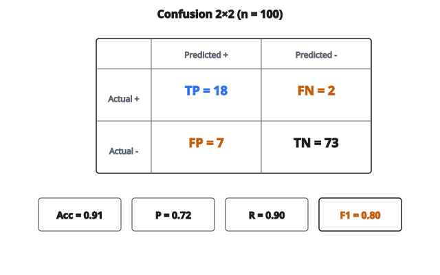

# Accuracy, Precision, Recall, F1

## Nền tảng confusion matrix

Mọi metric phân loại đều xuất phát từ **confusion matrix**, bảng đếm dự đoán đối chiếu với nhãn thật.

Với phân loại nhị phân:

**True Positive (TP):** Dự đoán dương, thực tế dương

**True Negative (TN):** Dự đoán âm, thực tế âm

**False Positive (FP):** Dự đoán dương, thực tế âm (sai lầm loại I)

**False Negative (FN):** Dự đoán âm, thực tế dương (sai lầm loại II)

$$
\begin{array}{c|cc}
& \text{Predicted +} & \text{Predicted -} \\
\hline
\text{Actual +} & TP & FN \\
\text{Actual -} & FP & TN
\end{array}
$$

## Accuracy

Metric trực quan nhất: tỷ lệ dự đoán đúng là bao nhiêu?

$$
\text{Accuracy} = \frac{TP + TN}{TP + TN + FP + FN}
$$

**Điểm mạnh:**

* Đơn giản và trực quan
* Ổn khi các lớp cân bằng

**Điểm yếu:**

* Gây hiểu nhầm khi dữ liệu mất cân bằng
* Mô hình luôn dự đoán âm trên dữ liệu 95% âm vẫn được accuracy 95%

## Precision

Trong mọi dự đoán dương, tỷ lệ thực sự dương là bao nhiêu?

$$
\text{Precision} = \frac{TP}{TP + FP}
$$

**Ý:** “Khi mô hình bảo dương, nó đúng bao nhiêu lần?”

**Precision cao quan trọng khi:**

* False positive đắt
* Lọc spam (không muốn mất email quan trọng)
* Cảnh báo gian lận (không muốn làm phiền khách hàng hợp lệ)

## Recall (sensitivity, true positive rate)

Trong mọi mẫu dương thật, ta bắt được tỷ lệ bao nhiêu?

$$
\text{Recall} = \frac{TP}{TP + FN}
$$

**Ý:** “Trong các dương thật, ta tìm ra bao nhiêu?”

**Recall cao quan trọng khi:**

* False negative đắt
* Sàng lọc bệnh (không muốn bỏ sót bệnh nhân)
* Đe dọa an ninh (không muốn bỏ sót tấn công)

## Trade-off precision–recall

Tăng ngưỡng phân loại:

* Ít dự đoán dương hơn
* Precision thường tăng (chọn lọc hơn)
* Recall thường giảm (bỏ sót nhiều dương hơn)

Giảm ngưỡng:

* Nhiều dự đoán dương hơn
* Recall tăng (bắt được nhiều hơn)
* Precision thường giảm (thêm false positive)

Không thể cực đại hóa cả hai cùng lúc. Cân bằng đúng phụ thuộc ứng dụng.

## F1 score

Trung bình điều hòa của precision và recall:

$$
\begin{aligned}
F1
&= 2 \times \frac{\text{Precision} \times \text{Recall}}{\text{Precision} + \text{Recall}} \\
&= \frac{2 \times TP}{2 \times TP + FP + FN}
\end{aligned}
$$

**Vì sao trung bình điều hòa?**

* Phạt mất cân bằng cực đoan
* Nếu precision $= 1.0$ và recall $= 0.01$, $F1 = 0.02$ (không phải $0.5$)
* Cả precision lẫn recall phải cao thì F1 mới cao

**Phạm vi F1:** $0$ đến $1$, càng cao càng tốt

## F-beta score

Tổng quát hóa F1, cho phép trọng số hóa precision so với recall:

$$
F_\beta = (1 + \beta^2) \times \frac{\text{Precision} \times \text{Recall}}{\beta^2 \times \text{Precision} + \text{Recall}}
$$

**F1:** $\beta = 1$, trọng số bằng nhau

**F2:** $\beta = 2$, recall được trọng cao hơn (gấp 2 lần tầm quan trọng)

**F0.5:** $\beta = 0.5$, precision được trọng cao hơn (gấp 2 lần tầm quan trọng)

## Specificity (true negative rate)

Trong mọi mẫu âm thật, tỷ lệ ta nhận đúng là bao nhiêu?

$$
\text{Specificity} = \frac{TN}{TN + FP}
$$

**Ý:** “Ta nhận diện lớp âm tốt đến mức nào?”

Quan trọng trong xét nghiệm y khoa khi muốn tránh báo động giả.

## False Positive Rate

$$
\text{FPR} = \frac{FP}{FP + TN} = 1 - \text{Specificity}
$$

Dùng trong đường ROC. Tỷ lệ mẫu âm bị phân loại nhầm thành dương.

## Ví dụ số

**100 bệnh nhân, 20 mắc bệnh, 80 khỏe**

Dự đoán của mô hình: 25 dương, 75 âm

Confusion matrix:

* $TP = 18$ (nhận đúng người bệnh)
* $FN = 2$ (bỏ sót người bệnh)
* $FP = 7$ (người khỏe bị đánh dấu bệnh)
* $TN = 73$ (nhận đúng người khỏe)

::: {#fig-29-confusion-f1 fig-cap="TP = 18, FN = 2, FP = 7, TN = 73 cho Acc = 0.91, precision = 0.72, recall = 0.90, F1 = 0.80." fig-alt="Confusion matrix 2x2: TP=18, FN=2, FP=7, TN=73; Acc=0.91, P=0.72, R=0.90, F1=0.80."}
{fig-align="center"}
:::

**Tính toán:**

$$
\text{Accuracy} = \frac{18 + 73}{100} = 0.91
$$

$$
\text{Precision} = \frac{18}{18 + 7} = \frac{18}{25} = 0.72
$$

$$
\text{Recall} = \frac{18}{18 + 2} = \frac{18}{20} = 0.90
$$

$$
F1 = 2 \times \frac{0.72 \times 0.90}{0.72 + 0.90} = \frac{1.296}{1.62} = 0.80
$$

$$
\text{Specificity} = \frac{73}{73 + 7} = \frac{73}{80} = 0.91
$$

## Matthews Correlation Coefficient (MCC)

Metric cân bằng dùng cả bốn giá trị của confusion matrix:

$$
\text{MCC} = \frac{TP \times TN - FP \times FN}{\sqrt{(TP+FP)(TP+FN)(TN+FP)(TN+FN)}}
$$

**Phạm vi:** $-1$ đến $+1$

* $+1$: Dự đoán hoàn hảo
* $0$: Dự đoán ngẫu nhiên
* $-1$: Dự đoán đảo ngược hoàn hảo

**Ưu điểm:**

* Ổn với lớp mất cân bằng
* Đối xứng (đối xử hai lớp như nhau)
* Chỉ cao khi cả bốn ô đều tốt

## Balanced Accuracy

Trung bình recall của từng lớp:

$$
\text{Balanced Accuracy} = \frac{\text{Recall}_+ + \text{Recall}_-}{2} = \frac{\text{TPR} + \text{TNR}}{2}
$$

Hữu ích trên tập mất cân bằng, nơi accuracy thông thường gây hiểu nhầm.

## Chọn metric phù hợp

**Lớp cân bằng, mục đích chung:** Accuracy hoặc F1

**Lớp mất cân bằng:** F1, MCC, hoặc balanced accuracy

**False positive đắt:** Precision

**False negative đắt:** Recall

**Cần một số để so mô hình:** F1 hoặc MCC

**Ngưỡng sẽ chỉnh sau:** AUC-ROC

**Đa lớp:** Micro / macro / weighted F1

## Mở rộng đa lớp

Với $n$ lớp, confusion matrix có kích thước $n \times n$.

**Metric theo lớp:** Coi mỗi lớp là “dương so với phần còn lại” để tính precision, recall, F1.

**Gộp:**

* Micro: Cộng TP, FP, FN trên mọi lớp, rồi tính
* Macro: Tính theo từng lớp, rồi lấy trung bình
* Weighted: Tính theo từng lớp, trung bình có trọng số theo cỡ lớp

## Các lỗi thường gặp

**Nghịch lý accuracy:** Accuracy cao trên dữ liệu mất cân bằng không có ý nghĩa.

**Tối ưu sai metric:** Chỉ tối ưu precision có thể phá recall (và ngược lại).

**Bỏ qua chi phí:** Mọi metric đối xử lỗi như nhau. Chi phí thực tế thì khác nhau.

**Ám ảnh một metric:** Báo cáo nhiều metric để có bức tranh đầy đủ.

**Phụ thuộc ngưỡng:** Precision, recall, F1 phụ thuộc ngưỡng. AUC thì không.

## Code
```python
import numpy as np

def classification_metrics(y_true, y_pred, average="micro", pos_label=1):
    """
    Compute accuracy, precision, recall, F1 for single-label classification.
    Averages: 'micro' | 'macro' | 'weighted' | 'binary' (uses pos_label).
    Return dict with float values.
    """
    yt = np.asarray(y_true)
    yp = np.asarray(y_pred)
    acc = float(np.mean(yt == yp)) if yt.size else 0.0
    labels = np.unique(np.concatenate([yt, yp]))
    K = labels.size
    idx = {lab: i for i, lab in enumerate(labels)}
    cm = np.zeros((K, K), dtype=np.int64)
    for t, p in zip(yt, yp):
        cm[idx[t], idx[p]] += 1
    tp = np.diag(cm).astype(float)
    fp = cm.sum(axis=0) - tp
    fn = cm.sum(axis=1) - tp
    prec_c = tp / np.maximum(tp + fp, 1e-12)
    rec_c = tp / np.maximum(tp + fn, 1e-12)
    f1_c = 2 * prec_c * rec_c / np.maximum(prec_c + rec_c, 1e-12)
    support = cm.sum(axis=1).astype(float)
    if average == "macro":
        precision = float(np.mean(prec_c))
        recall = float(np.mean(rec_c))
        f1 = float(np.mean(f1_c))
    elif average == "weighted":
        w = support / np.maximum(support.sum(), 1e-12)
        precision = float((w * prec_c).sum())
        recall = float((w * rec_c).sum())
        f1 = float((w * f1_c).sum())
    elif average == "binary":
        i = idx.get(pos_label, -1)
        if i < 0:
            precision = recall = f1 = 0.0
        else:
            precision, recall, f1 = float(prec_c[i]), float(rec_c[i]), float(f1_c[i])
    else:
        TP = float(tp.sum())
        FP = float(fp.sum())
        FN = float(fn.sum())
        precision = TP / max(TP + FP, 1e-12)
        recall = TP / max(TP + FN, 1e-12)
        f1 = 2 * precision * recall / max(precision + recall, 1e-12)
    return {"accuracy": round(acc, 6), "precision": round(precision, 6),
            "recall": round(recall, 6), "f1": round(f1, 6)}

```

<!-- auto-self-check -->

::: {.callout-note}
## Kiểm tra nhanh
<details>
<summary>Ý chính của bài «Accuracy, Precision, Recall, F1» là gì?</summary>
Mọi metric phân loại đều xuất phát từ **confusion matrix**, bảng đếm dự đoán đối chiếu với nhãn thật.
</details>
<details>
<summary>Công thức / quan hệ cốt lõi trong bài là gì?</summary>
$$\begin{array}{c|cc} & \text{Predicted +} & \text{Predicted -} \\ \hline \text{Actual +} & TP & FN \\ \text{Actual -} & FP & TN \end{array}$$
</details>
:::
