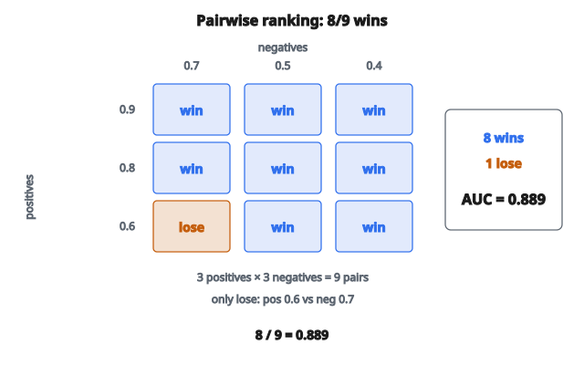

# AUC (diện tích dưới ROC)

## AUC-ROC là gì

AUC là **Area Under the Curve** (diện tích dưới đường cong). Trong machine learning, nó thường chỉ diện tích dưới **đường ROC** (Receiver Operating Characteristic).

AUC-ROC đo mức độ bộ phân loại xếp mẫu dương trên mẫu âm, không phụ thuộc ngưỡng phân loại. Nó trả lời: "Nếu lấy một dương ngẫu nhiên và một âm ngẫu nhiên, xác suất mô hình cho score dương cao hơn là bao nhiêu?"

## Đường ROC

Đường ROC vẽ:

* **Trục X:** False Positive Rate (FPR) = FP / (FP + TN)
* **Trục Y:** True Positive Rate (TPR) = TP / (TP + FN)

Mỗi điểm trên đường cong tương ứng một ngưỡng phân loại khác nhau.

**Tại ngưỡng = 0 (dự đoán mọi mẫu dương):**

* TPR = 1 (bắt hết dương)
* FPR = 1 (mọi âm bị gắn nhầm dương)
* Điểm: $(1, 1)$

**Tại ngưỡng = 1 (dự đoán mọi mẫu âm):**

* TPR = 0 (không bắt dương nào)
* FPR = 0 (không false positive)
* Điểm: $(0, 0)$

Đường ROC đi từ $(0, 0)$ tới $(1, 1)$ khi ngưỡng giảm.

## Đọc đường ROC

**Bộ phân loại hoàn hảo:** Đi từ $(0, 0)$ lên $(0, 1)$, rồi ngang tới $(1, 1)$. Đạt 100% TPR với 0% FPR.

**Bộ phân loại ngẫu nhiên:** Đường chéo từ $(0, 0)$ tới $(1, 1)$. TPR luôn bằng FPR.

**Bộ phân loại tốt:** Đường cong ôm góc trên-trái. TPR cao với FPR thấp.

**Bộ phân loại kém (kém hơn ngẫu nhiên):** Đường nằm dưới đường chéo. Mô hình phản-dự đoán.

## AUC: diện tích dưới đường ROC

AUC là tổng diện tích dưới đường ROC:

$$
\text{AUC} = \int_0^1 \text{TPR}(\text{FPR}) \, d(\text{FPR})
$$

**AUC = 1.0:** Bộ phân loại hoàn hảo. Đường cong phủ cả vùng trên-trái.

**AUC = 0.5:** Bộ phân loại ngẫu nhiên. Đường cong là đường chéo.

**AUC = 0.0:** Bộ phân loại sai hoàn toàn. Luôn dự đoán ngược nhãn thật.

## Diễn giải xác suất

AUC bằng xác suất một mẫu dương chọn ngẫu nhiên được xếp score cao hơn một mẫu âm chọn ngẫu nhiên:

$$
\text{AUC} = P(\text{score}(x^+) > \text{score}(x^-))
$$

Diễn giải này trực quan và không phụ thuộc ngưỡng. Nó đo **chất lượng xếp hạng**, không phải phân loại tại một ngưỡng cụ thể.

## Tính AUC

**Phương pháp 1: quy tắc hình thang**

1. Sắp mọi mẫu theo score dự đoán (giảm dần)
2. Tính TPR và FPR tại mỗi ngưỡng duy nhất
3. Cộng diện tích các hình thang giữa các điểm liên tiếp

**Phương pháp 2: thống kê Wilcoxon-Mann-Whitney**

Đếm mọi cặp dương-âm mà dương có score cao hơn:

$$
\text{AUC} = \frac{\sum_{i \in \text{pos}} \sum_{j \in \text{neg}} \mathbf{1}[s_i > s_j]}{|\text{pos}| \times |\text{neg}|}
$$

Hòa (tie) thường được đếm 0.5.

## Ví dụ số

**Dự đoán (score, nhãn):**

* $(0.9, 1)$
* $(0.8, 1)$
* $(0.7, 0)$
* $(0.6, 1)$
* $(0.5, 0)$
* $(0.4, 0)$

**Dương:** 3, **Âm:** 3, **Tổng số cặp:** 9

**Đếm cặp dương có score cao hơn âm:**

Dương 0.9 vs âm $(0.7, 0.5, 0.4)$: 3 thắng

Dương 0.8 vs âm $(0.7, 0.5, 0.4)$: 3 thắng

Dương 0.6 vs âm $(0.7, 0.5, 0.4)$: 2 thắng (thua 0.7)

Tổng thắng: $3 + 3 + 2 = 8$

AUC = $8 / 9 = 0.889$

::: {#fig-74-auc-pairs fig-cap="AUC = 8/9 = 0.889: tám cặp dương xếp trên âm; cặp thua duy nhất là dương 0.6 so với âm 0.7." fig-alt="Lưới 3x3 cặp dương-âm: 8 ô thắng và 1 ô thua (0.6 so với 0.7); AUC = 8/9 = 0.889."}
{fig-align="center"}
:::

## AUC so với accuracy

**Accuracy:** Đo hiệu năng tại một ngưỡng. Nhạy với mất cân lớp.

**AUC:** Đo xếp hạng trên mọi ngưỡng. Không phụ thuộc ngưỡng.

**Ví dụ làm rõ sự khác:**

Tập: 95 âm, 5 dương

Mô hình A: Dự đoán tất cả âm. Accuracy = 95%. AUC = 0.5 (ngẫu nhiên).

Mô hình B: Xếp mọi dương trong top 10. Accuracy phụ thuộc ngưỡng. AUC = 1.0 (xếp hạng hoàn hảo).

AUC cho thấy mô hình B học được điều hữu ích; accuracy thì không.

## Khi AUC hữu ích

**Tập mất cân:**
AUC không bị ảnh hưởng bởi tỷ lệ lớp. Mô hình AUC = 0.9 trên 1% dương ấn tượng không kém AUC = 0.9 trên 50% dương.

**Khi ngưỡng chưa biết:**
Nếu ngưỡng triển khai sẽ chỉnh sau, AUC đánh giá chất lượng xếp hạng tổng thể.

**So sánh mô hình:**
AUC cho một số để so mô hình trước khi chọn ngưỡng.

## Khi AUC dễ gây hiểu nhầm

**Khi chi phí lỗi khác nhau:**
AUC đối xử FP và FN đối xứng. Nếu false negative tệ hơn nhiều so với false positive (ví dụ sàng lọc bệnh), AUC có thể không nắm được điều này.

**Khi quan tâm một điểm vận hành cụ thể:**
Nếu luôn dùng ngưỡng = 0.5, precision/recall tại ngưỡng đó có thể liên quan hơn AUC.

**Với dữ liệu mất cân cực:**
AUC có thể cao dù precision rất thấp. Khi đó xét AUC-PR (diện tích dưới đường precision-recall).

## AUC-PR: diện tích dưới đường Precision-Recall

Với tập mất cân, đường precision-recall thường thông tin hơn:

* **Trục X:** Recall = TP / (TP + FN)
* **Trục Y:** Precision = TP / (TP + FP)

AUC-PR tập trung vào lớp dương. Bộ phân loại ngẫu nhiên có AUC-PR bằng tỷ lệ dương (ví dụ 0.01 với 1% dương), nên cải thiện dễ nhìn hơn.

## AUC đa lớp

Với bài đa lớp:

**One-vs-Rest (OvR):**
Tính AUC mỗi lớp so với mọi lớp còn lại. Trung bình các AUC (macro hoặc có trọng số).

**One-vs-One (OvO):**
Tính AUC mỗi cặp lớp. Trung bình mọi AUC từng cặp.

## Đọc giá trị AUC

* AUC > 0.9: Phân biệt xuất sắc
* $0.8 < \text{AUC} < 0.9$: Phân biệt tốt
* $0.7 < \text{AUC} < 0.8$: Phân biệt khá
* $0.6 < \text{AUC} < 0.7$: Phân biệt kém
* AUC < 0.6: Thất bại (gần ngẫu nhiên)

Đây là mốc thô. Ngữ cảnh miền mới quyết định.

## Độ phức tạp tính toán

**Đếm cặp ngây thơ:** $O(n_{\text{pos}} \times n_{\text{neg}})$

**Sắp hiệu quả:** $O(n \log n)$ với $n$ là tổng số mẫu

Cách sắp:

1. Sắp theo score
2. Đếm inversion trên thứ tự đã sắp
3. AUC = $1 - (\text{inversions} / \text{total\_pairs})$

## Code
```python
import numpy as np

def auc(fpr, tpr):
    """
    Compute AUC (Area Under ROC Curve) using trapezoidal rule.
    """
    fpr = np.asarray(fpr, dtype=float)
    tpr = np.asarray(tpr, dtype=float)
    if len(fpr) != len(tpr):
        raise ValueError("fpr and tpr must have same length")
    if len(fpr) < 2:
        raise ValueError("Need at least 2 points for AUC")
    if hasattr(np, 'trapezoid'):
        return float(np.trapezoid(tpr, fpr))
    else:
        import warnings
        with warnings.catch_warnings():
            warnings.simplefilter("ignore", DeprecationWarning)
            return float(np.trapz(tpr, fpr))

```
