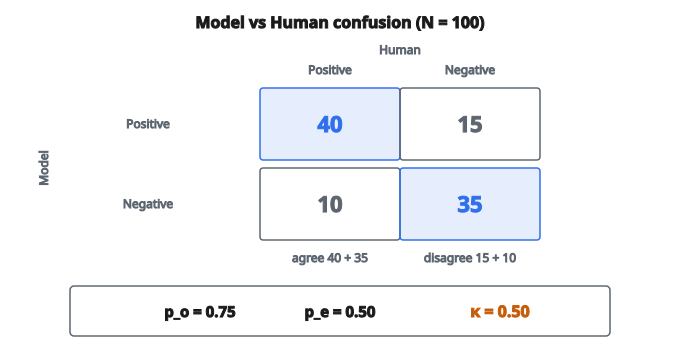

# Cohen's Kappa

## Vấn đề của agreement đơn giản

Khi hai rater (hoặc một mô hình và nhãn thật) phân loại các mẫu, ta có thể đo agreement bằng tỷ lệ mẫu mà họ đồng ý. Nhưng tỷ lệ agreement thô này dễ gây hiểu nhầm vì một phần agreement xảy ra **do ngẫu nhiên**.

**Ví dụ:** Hai rater phân loại 100 ảnh thành "cat" hoặc "dog". Nếu cả hai đoán ngẫu nhiên "cat" 50% thời gian, họ sẽ đồng ý khoảng 50% thuần do ngẫu nhiên (cả hai nói cat 25%, cả hai nói dog 25%).

Agreement thô 60% nghe có vẻ ổn, nhưng nếu chance agreement là 50%, các rater hầu như không hơn random.

**Cohen's Kappa** điều chỉnh cho chance agreement, đo mức agreement tốt hơn ngẫu nhiên bao nhiêu.

## Công thức chính

$$
\kappa = \frac{p_o - p_e}{1 - p_e}
$$

với

$$
\begin{aligned}
p_o &:\ \text{observed agreement (tỷ lệ mẫu hai rater đồng ý)}, \\
p_e &:\ \text{expected agreement do ngẫu nhiên}, \\
1 - p_e &:\ \text{agreement tối đa có thể vượt trên chance}.
\end{aligned}
$$

**Diễn giải:** Kappa đo tỷ lệ agreement vượt trên chance, so với mức agreement vượt trên chance tối đa có thể.

## Tính observed agreement

$p_o$ tính thẳng: đếm số lần hai rater đồng ý rồi chia cho tổng số mẫu.

**Ví dụ confusion matrix:**

Rater B nói Cat: Rater A nói Cat = 20, Rater A nói Dog = 10

Rater B nói Dog: Rater A nói Cat = 5, Rater A nói Dog = 15

Tổng = 50 mẫu

Agreements: 20 (cả hai Cat) + 15 (cả hai Dog) = 35

$p_o = 35 / 50 = 0.70$

## Tính expected agreement

$p_e$ là agreement kỳ vọng nếu hai rater đoán độc lập, ngẫu nhiên, theo đúng phân phối biên quan sát được.

**Bước 1: Tính xác suất biên**

Rater A nói Cat: $20 + 5 = 25$ trên 50 $= 0.50$

Rater A nói Dog: $10 + 15 = 25$ trên 50 $= 0.50$

Rater B nói Cat: $20 + 10 = 30$ trên 50 $= 0.60$

Rater B nói Dog: $5 + 15 = 20$ trên 50 $= 0.40$

**Bước 2: Tính chance agreement cho từng lớp**

Chance cả hai nói Cat: $0.50 \times 0.60 = 0.30$

Chance cả hai nói Dog: $0.50 \times 0.40 = 0.20$

**Bước 3: Cộng các chance agreement**

$p_e = 0.30 + 0.20 = 0.50$

## Tính kappa

Dùng ví dụ trên:

$p_o = 0.70$

$p_e = 0.50$

$$
\kappa = \frac{0.70 - 0.50}{1 - 0.50} = \frac{0.20}{0.50} = 0.40
$$

Dù agreement thô là 70%, kappa chỉ còn 0.40 vì một nửa lượng agreement đó đã được kỳ vọng do ngẫu nhiên.

## Diễn giải giá trị kappa

$$
-1 \leq \kappa \leq 1
$$

**$\kappa = 1$:** Agreement hoàn hảo. Hai rater đồng ý trên mọi mẫu.

**$\kappa = 0$:** Agreement đúng bằng chance. Không hơn đoán ngẫu nhiên.

**$\kappa < 0$:** Agreement kém hơn chance. Hai rater bất đồng có hệ thống.

**Hướng dẫn diễn giải thường dùng:**

* $\kappa > 0.80$: Almost perfect agreement
* $0.60 < \kappa \leq 0.80$: Substantial agreement
* $0.40 < \kappa \leq 0.60$: Moderate agreement
* $0.20 < \kappa \leq 0.40$: Fair agreement
* $0.00 < \kappa \leq 0.20$: Slight agreement
* $\kappa \leq 0.00$: Poor agreement (bằng hoặc dưới chance)

## Ví dụ số đầy đủ

**Dữ liệu:** 100 mẫu được phân loại bởi Model và Human

Model dự đoán Positive: Human nói Positive = 40, Human nói Negative = 15

Model dự đoán Negative: Human nói Positive = 10, Human nói Negative = 35

::: {#fig-113-kappa-agreement fig-cap="Observed agreement $p_o = 0.75$; sau khi trừ chance $p_e = 0.50$ còn $\kappa = 0.50$ (moderate)." fig-alt="Confusion matrix 2x2 Model vs Human: diagonal 40 and 35, off-diagonal 15 and 10; po = 0.75, pe = 0.50, kappa = 0.50."}
{fig-align="center"}
:::

### Bước 1: Observed agreement

$p_o = (40 + 35) / 100 = 0.75$

### Bước 2: Xác suất biên

Model Positive: $(40 + 15) / 100 = 0.55$

Model Negative: $(10 + 35) / 100 = 0.45$

Human Positive: $(40 + 10) / 100 = 0.50$

Human Negative: $(15 + 35) / 100 = 0.50$

### Bước 3: Expected agreement

$$
p_e = (0.55 \times 0.50) + (0.45 \times 0.50) = 0.275 + 0.225 = 0.50
$$

### Bước 4: Kappa

$$
\kappa = \frac{0.75 - 0.50}{1 - 0.50} = \frac{0.25}{0.50} = 0.50
$$

Kết quả này tương ứng moderate agreement.

## Kappa cho bài toán đa lớp

Công thức mở rộng tự nhiên cho hơn hai lớp:

$$
p_e = \sum_{k=1}^{K} p_{A,k} \times p_{B,k}
$$

với $p_{A,k}$ là tỷ lệ mẫu Rater A gán vào lớp $k$.

**Ví dụ 3 lớp:**

Nếu phân phối của Rater A là $[0.3, 0.5, 0.2]$ và của Rater B là $[0.4, 0.4, 0.2]$:

$$
\begin{aligned}
p_e &= (0.3 \times 0.4) + (0.5 \times 0.4) + (0.2 \times 0.2) \\
    &= 0.12 + 0.20 + 0.04 = 0.36
\end{aligned}
$$

## Khi nào dùng kappa

**So mô hình với nhãn thật:** Kappa đo agreement phân loại sau khi đã tính đến mất cân bằng lớp.

**Inter-rater reliability:** Khi nhiều người gán nhãn cùng dữ liệu, kappa lượng hóa độ nhất quán.

**Tập mất cân bằng:** Accuracy gây hiểu nhầm khi các lớp lệch nhau. Một mô hình luôn dự đoán "negative" trên dữ liệu 95% negative được accuracy 95% nhưng không đóng góp gì. Kappa phạt trường hợp này.

**Dữ liệu thứ bậc:** Weighted kappa (không phủ ở đây) mở rộng cho các lớp có thứ tự, trong đó một số bất đồng nặng hơn các bất đồng khác.

## Kappa so với accuracy

**Ví dụ vì sao accuracy gây hiểu nhầm:**

Tập dữ liệu: 95 negative, 5 positive

Mô hình dự đoán tất cả là negative:

* Accuracy = 95%
* Kappa = 0 (không hơn chance)

Mô hình không học được gì hữu ích. Kappa lộ ra điều này; accuracy che giấu.

## Hạn chế của kappa

**Phụ thuộc prevalence:** Kappa có thể thấp dù agreement cao khi một lớp chiếm ưu thế. Hiện tượng này đôi khi gọi là "kappa paradox."

**Không cho điểm từng phần:** Kappa chuẩn coi mọi bất đồng như nhau. Nhầm lớp A với lớp B giống hệt nhầm A với lớp C.

**Chỉ hai rater:** Cohen's kappa dành cho đúng hai rater. Với nhiều rater hơn, dùng Fleiss' kappa.

**Đối xứng:** Kappa đối xử hai rater như nhau. Nếu một bên là nhãn thật và một bên là mô hình, tính đối xứng này có thể không khớp cấu trúc bài toán.

## Quan hệ với các metric khác

**Matthews Correlation Coefficient (MCC):** Với phân loại nhị phân, MCC và kappa liên hệ chặt. MCC thường được ưa trong ML vì xử lý dữ liệu mất cân bằng tốt.

**F1 Score:** F1 tập trung vào lớp dương. Kappa xét mọi lớp đối xứng.

**AUC-ROC:** Đo chất lượng ranking, không phải agreement tại một ngưỡng cố định. Use case khác nhau.

## Code
```python
def cohens_kappa(rater1, rater2):
    """
    Compute Cohen's Kappa coefficient.
    """
    n = len(rater1)
    p_o = sum(1 for a, b in zip(rater1, rater2) if a == b) / n
    labels = set(rater1) | set(rater2)
    p_e = 0.0
    for label in labels:
        freq1 = sum(1 for x in rater1 if x == label) / n
        freq2 = sum(1 for x in rater2 if x == label) / n
        p_e += freq1 * freq2
    if p_e == 1.0:
        return 1.0
    return (p_o - p_e) / (1 - p_e)

```

<!-- auto-self-check -->

::: {.callout-note}
## Kiểm tra nhanh
<details>
<summary>Ý chính của bài «Cohen's Kappa» là gì?</summary>
Khi hai rater (hoặc một mô hình và nhãn thật) phân loại các mẫu, ta có thể đo agreement bằng tỷ lệ mẫu mà họ đồng ý.
</details>
<details>
<summary>Công thức / quan hệ cốt lõi trong bài là gì?</summary>
$$\kappa = \frac{p_o - p_e}{1 - p_e}$$
</details>
:::
