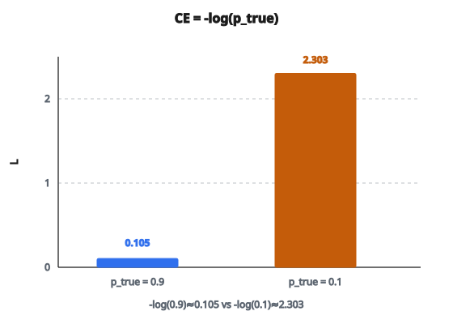

# Cross-Entropy Loss

## Cross-entropy loss là gì

**Cross-entropy loss** (còn gọi là log loss hoặc softmax loss) là hàm mất mát chuẩn cho bài phân loại. Nó đo mức khác nhau giữa phân phối xác suất dự đoán và phân phối thật.

Với phân loại đa lớp có $C$ lớp:

$$
\text{CE} = -\sum_{c=1}^{C} y_c \log(\hat{y}_c)
$$

với:

* $y_c$ bằng 1 nếu lớp $c$ là lớp thật, 0 nếu không (mã hóa one-hot)
* $\hat{y}_c$ là xác suất dự đoán cho lớp $c$ (đầu ra softmax)

## Rút gọn với nhãn one-hot

Khi nhãn thật được mã hóa one-hot, chỉ một số hạng trong tổng khác không:

$$
\text{CE} = -\log(\hat{y}_{\text{true class}})
$$

Tương đương: "âm log của xác suất dự đoán cho lớp đúng."

Ví dụ:

* Lớp thật: 2, xác suất dự đoán cho lớp 2: 0.9
* Loss: $-\log(0.9) \approx 0.105$
* Lớp thật: 2, xác suất dự đoán cho lớp 2: 0.1
* Loss: $-\log(0.1) \approx 2.303$

Mô hình càng chắc vào lớp đúng thì loss càng thấp.

::: {#fig-16-ce-nll fig-cap="CE = -log(ŷ của lớp thật). ŷ = 0.9 cho loss ≈ 0.105; ŷ = 0.1 cho loss ≈ 2.303." fig-alt="Hai cột -log(p_true): p_true = 0.9 cho loss 0.105 so với p_true = 0.1 cho loss 2.303."}
{fig-align="center"}
:::

## Hiểu negative log

Vì sao âm logarithm? Lần lượt lý do:

**Bước 1: Muốn xác suất cao cho lớp thật**

* Nếu xác suất dự đoán = 1.0 (dự đoán hoàn hảo), loss phải bằng 0
* Nếu xác suất dự đoán = 0.0 (thất bại hoàn toàn), loss phải vô cùng

**Bước 2: Log cho đúng hành vi này**

* $\log(1) = 0$
* $\log(x)$ tiến tới âm vô cùng khi $x$ tiến tới 0

**Bước 3: Đổi dấu để thành loss**

* $-\log(1) = 0$ (hoàn hảo, không loss)
* $-\log(0.5) = 0.693$ (không chắc)
* $-\log(0.1) = 2.303$ (chắc nhưng sai)
* $-\log(0.01) = 4.605$ (rất chắc và sai)

Loss tăng không bị chặn khi xác suất dự đoán cho lớp thật tiến tới không.

## Đường cong loss

Với một mẫu có lớp thật $c$, loss là hàm của xác suất dự đoán:

**Xác suất dự đoán 0.99:** loss = 0.010
**Xác suất dự đoán 0.90:** loss = 0.105
**Xác suất dự đoán 0.70:** loss = 0.357
**Xác suất dự đoán 0.50:** loss = 0.693
**Xác suất dự đoán 0.30:** loss = 1.204
**Xác suất dự đoán 0.10:** loss = 2.303
**Xác suất dự đoán 0.01:** loss = 4.605

Nhận xét chính:

* Loss gần không khi độ chắc cao
* Loss tăng chậm lúc đầu, rồi nhanh khi xác suất tiến tới không
* Đường cong lồi (hình bát), thuận lợi cho tối ưu

## Gradient

Gradient của cross-entropy theo logit (trước softmax) có dạng rất gọn:

$$
\frac{\partial \text{CE}}{\partial z_c} = \hat{y}_c - y_c
$$

với $z_c$ là logit của lớp $c$.

Ý nghĩa:

* Với lớp thật ($y_c = 1$): gradient = predicted − 1 (âm, đẩy logit lên)
* Với các lớp khác ($y_c = 0$): gradient = predicted (dương, đẩy logit xuống)

Gradient đúng bằng hiệu xác suất dự đoán và xác suất thật. Sự đơn giản này là một lý do cross-entropy đi rất tốt với softmax.

## Cross-entropy và lý thuyết thông tin

Cross-entropy đến từ lý thuyết thông tin. Cho hai phân phối xác suất $p$ (thật) và $q$ (dự đoán):

$$
H(p, q) = -\sum_x p(x) \log q(x)
$$

Đại lượng này đo số bit trung bình cần để mã hóa mẫu từ $p$ bằng mã tối ưu cho $q$.

* Nếu $q = p$ (dự đoán hoàn hảo): cross-entropy bằng entropy của $p$ (cực tiểu)
* Nếu $q \neq p$: cross-entropy lớn hơn entropy của $p$
* Hiệu là KL divergence: $D_{KL}(p \| q) = H(p, q) - H(p)$

Tối thiểu hóa cross-entropy tương đương tối thiểu hóa KL divergence so với phân phối thật.

## Binary cross-entropy

Với phân loại nhị phân (2 lớp), công thức rút gọn:

$$
\text{BCE} = -[y \log(\hat{y}) + (1 - y) \log(1 - \hat{y})]
$$

với:

* $y \in \{0, 1\}$ là nhãn thật
* $\hat{y} \in (0, 1)$ là xác suất dự đoán cho lớp 1

Tương đương:

* Nếu $y = 1$: loss $= -\log(\hat{y})$
* Nếu $y = 0$: loss $= -\log(1 - \hat{y})$

Binary cross-entropy dùng với đầu ra sigmoid, còn cross-entropy đa lớp dùng với đầu ra softmax.

## Ổn định số

Tính $\log(\text{predicted})$ trực tiếp thì nguy hiểm:

* Nếu predicted = 0: $\log(0)$ = âm vô cùng
* Nếu predicted là float rất nhỏ: $\log(\text{predicted})$ có thể underflow

Cách xử lý:

* Cắt dự đoán: $\text{predicted} = \mathrm{clip}(\text{predicted}, \varepsilon, 1 - \varepsilon)$ với $\varepsilon$ khoảng $10^{-7}$
* Dùng phép fused: tính $\log(\mathrm{softmax}(z))$ trực tiếp từ logit $z$ (ổn định hơn)
* Framework cung cấp bản ổn định: `torch.nn.CrossEntropyLoss`, `tf.nn.softmax_cross_entropy_with_logits`

## Cross-entropy dùng ở đâu

* **Phân loại ảnh**: dự đoán ảnh thuộc lớp nào trong $C$ lớp
* **Mô hình ngôn ngữ**: dự đoán từ tiếp theo trong từ vựng
* **Phân tích cảm xúc**: gắn nhãn văn bản dương/âm/trung tính
* **Phát hiện đối tượng**: phân loại các đối tượng đã phát hiện
* **Mọi bài phân loại đa lớp hoặc nhị phân**

Cross-entropy là loss mặc định cho phân loại vì:

* Có diễn giải xác suất rõ
* Gradient đơn giản và ổn định
* Phạt nặng dự đoán sai mà chắc
* Ghép tự nhiên với đầu ra softmax/sigmoid

## Code
```python
import numpy as np

def cross_entropy_loss(y_true, y_pred):
    """
    Compute average cross-entropy loss for multi-class classification.
    """
    y_true = np.asarray(y_true, dtype=int)
    y_pred = np.asarray(y_pred, dtype=float)
    N = len(y_true)
    p_true = y_pred[np.arange(N), y_true]
    return float(-np.mean(np.log(p_true)))

```

<!-- auto-self-check -->

::: {.callout-note}
## Kiểm tra nhanh
<details>
<summary>Ý chính của bài «Cross-Entropy Loss» là gì?</summary>
**Cross-entropy loss** (còn gọi là log loss hoặc softmax loss) là hàm mất mát chuẩn cho bài phân loại.
</details>
<details>
<summary>Công thức / quan hệ cốt lõi trong bài là gì?</summary>
$$\text{CE} = -\sum_{c=1}^{C} y_c \log(\hat{y}_c)$$
</details>
:::
