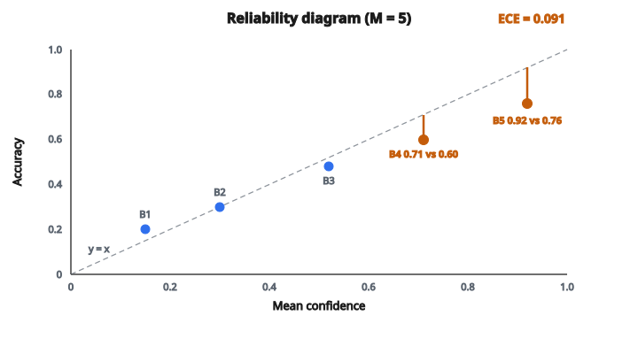

# Expected Calibration Error

## Calibration là gì

Một mô hình **well-calibrated** nếu xác suất dự đoán khớp tần suất thực tế. Khi mô hình nói "tự tin 80%," nó phải đúng 80% số lần.

**Ví dụ calibration tốt:**

* Trong các dự đoán có confidence 90%: 90% là đúng
* Trong các dự đoán có confidence 70%: 70% là đúng
* Trong các dự đoán có confidence 50%: 50% là đúng

**Ví dụ calibration kém:**

* Trong các dự đoán có confidence 90%: chỉ 60% là đúng (overconfident)
* Trong các dự đoán có confidence 30%: thực tế đúng 70% (underconfident)

Một mô hình có thể accuracy cao nhưng calibration kém. Nó có thể phân loại đúng 95% mẫu nhưng gán confidence 99% cho mọi thứ, tức là overconfident.

## Vì sao calibration quan trọng

**Ra quyết định:** Nếu mô hình y tế nói "90% khả năng bệnh," bác sĩ cần tin được xác suất đó. Nếu mô hình overconfident, bệnh nhân nhận điều trị không cần thiết.

**Ensemble:** Kết hợp dự đoán từ nhiều mô hình hoạt động tốt nhất khi các xác suất có nghĩa.

**Định lượng bất định:** Trong ứng dụng an toàn nghiêm ngặt, ta cần biết khi nào mô hình không chắc.

**Selective prediction:** Hệ thống được phép "bỏ qua" khi không chắc cần điểm confidence đã calibrated.

## Công thức Expected Calibration Error

ECE đo khoảng cách trung bình giữa confidence dự đoán và accuracy thực tế, có trọng số theo số mẫu rơi vào mỗi khoảng confidence.

$$
\text{ECE} = \sum_{m=1}^{M} \frac{|B_m|}{n} \left| \text{acc}(B_m) - \text{conf}(B_m) \right|
$$

với

$$
\begin{aligned}
M &:\ \text{số bin}, \\
B_m &:\ \text{tập mẫu trong bin } m, \\
|B_m| &:\ \text{số mẫu trong bin } m, \\
n &:\ \text{tổng số mẫu}, \\
\text{acc}(B_m) &:\ \text{accuracy của các mẫu trong bin } m, \\
\text{conf}(B_m) &:\ \text{confidence trung bình của các mẫu trong bin } m.
\end{aligned}
$$

## Quá trình chia bin

**Bước 1: Chọn số bin**

Thường $M = 10$ hoặc $M = 15$. Nhiều bin hơn cho độ phân giải mịn hơn nhưng dễ có bin thưa.

**Bước 2: Định nghĩa biên bin**

Với $M = 10$: các bin là $[0, 0.1)$, $[0.1, 0.2)$, $\ldots$, $[0.9, 1.0]$

**Bước 3: Gán mỗi dự đoán vào một bin**

Dự đoán có confidence $0.73$ vào bin $[0.7, 0.8)$.

**Bước 4: Với mỗi bin, tính accuracy và confidence trung bình**

## Ví dụ số

100 dự đoán với $M = 5$ bin: $[0, 0.2)$, $[0.2, 0.4)$, $[0.4, 0.6)$, $[0.6, 0.8)$, $[0.8, 1.0]$

**Bin 1 $[0, 0.2)$:** 5 mẫu, confidence trung bình $= 0.15$, accuracy $= 0.20$

**Bin 2 $[0.2, 0.4)$:** 10 mẫu, confidence trung bình $= 0.30$, accuracy $= 0.30$

**Bin 3 $[0.4, 0.6)$:** 25 mẫu, confidence trung bình $= 0.52$, accuracy $= 0.48$

**Bin 4 $[0.6, 0.8)$:** 35 mẫu, confidence trung bình $= 0.71$, accuracy $= 0.60$

**Bin 5 $[0.8, 1.0)$:** 25 mẫu, confidence trung bình $= 0.92$, accuracy $= 0.76$

**Tính ECE:**

Bin 1: $(5/100) \times |0.20 - 0.15| = 0.05 \times 0.05 = 0.0025$

Bin 2: $(10/100) \times |0.30 - 0.30| = 0.10 \times 0.00 = 0.0000$

Bin 3: $(25/100) \times |0.48 - 0.52| = 0.25 \times 0.04 = 0.0100$

Bin 4: $(35/100) \times |0.60 - 0.71| = 0.35 \times 0.11 = 0.0385$

Bin 5: $(25/100) \times |0.76 - 0.92| = 0.25 \times 0.16 = 0.0400$

**ECE $= 0.0025 + 0.0000 + 0.0100 + 0.0385 + 0.0400 = 0.091$**

Mô hình có 9.1% calibration error. Bin 4 và 5 cho thấy mô hình overconfident ở mức confidence cao.

::: {#fig-115-ece-reliability fig-cap="Điểm nằm dưới đường chéo $y = x$ là overconfident. Bin 4 (0.71 vs 0.60) và bin 5 (0.92 vs 0.76) kéo ECE lên 0.091." fig-alt="Reliability diagram with 5 bins: diagonal y = x; bin 4 (conf 0.71, acc 0.60) and bin 5 (conf 0.92, acc 0.76) below the diagonal; ECE = 0.091."}
{fig-align="center"}
:::

## Diễn giải ECE

**ECE $= 0$:** Calibration hoàn hảo. Xác suất dự đoán khớp đúng tần suất quan sát.

**ECE gần 0 (ví dụ 0.01–0.03):** Well calibrated.

**ECE trung bình (ví dụ 0.05–0.10):** Có vấn đề calibration. Có thể cần temperature scaling.

**ECE cao (ví dụ $> 0.15$):** Calibrated kém. Các xác suất không đáng tin.

## Reliability diagram

Reliability diagram trực quan hóa calibration:

**Trục X:** Confidence dự đoán trung bình mỗi bin

**Trục Y:** Accuracy thực tế mỗi bin

**Calibration hoàn hảo:** Các điểm nằm trên đường chéo $y = x$

**Overconfident:** Điểm nằm dưới đường chéo (accuracy $<$ confidence)

**Underconfident:** Điểm nằm trên đường chéo (accuracy $>$ confidence)

Khoảng cách từ mỗi điểm tới đường chéo, có trọng số theo kích thước bin, cho ra ECE.

## Trọng số bin

ECE gán trọng số mỗi bin theo số mẫu $|B_m|/n$. Điều này hợp lý vì:

* Bin có nhiều mẫu đóng góp nhiều hơn vào sai số tổng
* Bin thưa với ít mẫu ảnh hưởng ít hơn
* Trọng số phản ánh phân phối confidence của mô hình

## Maximum Calibration Error (MCE)

Một metric thay thế nhìn vào bin xấu nhất:

$$
\text{MCE} = \max_m \left| \text{acc}(B_m) - \text{conf}(B_m) \right|
$$

MCE hữu ích khi ta quan tâm miscalibration trường hợp xấu nhất, không phải trung bình.

## Xử lý bài toán đa lớp

Với phân loại đa lớp:

* Dùng confidence của lớp được dự đoán (xác suất lớn nhất)
* Một dự đoán là "đúng" nếu lớp dự đoán khớp lớp thật
* Phần còn lại của tính ECE giống hệt

## Các vấn đề calibration thường gặp

**Overconfidence (phổ biến nhất):** Mạng nơ-ron hiện đại thường overconfident. Chúng gán xác suất cao ngay cả khi sai.

**Underconfidence:** Một số mô hình, đặc biệt sau một số dạng regularization, có thể underconfident.

**Miscalibration không đơn điệu:** Overconfident ở một số khoảng, underconfident ở khoảng khác.

## Sửa calibration

**Temperature scaling:** Chia logit cho một nhiệt độ $T$ đã học trước khi softmax. $T > 1$ làm mềm xác suất (sửa overconfidence).

**Platt scaling:** Khớp một logistic regression trên các logit để ánh xạ sang xác suất đã calibrated.

**Isotonic regression:** Calibration phi tham số dùng isotonic regression trên một tập held-out.

**Histogram binning:** Điều chỉnh trực tiếp xác suất theo accuracy quan sát được của từng bin.

Mọi phương pháp này được áp dụng sau huấn luyện và cần một tập dữ liệu calibration.

## Hạn chế của ECE

**Nhạy với bin:** Số bin khác nhau cho giá trị ECE khác nhau. Không có số bin "đúng."

**Bin thưa:** Bin với ít mẫu có ước lượng accuracy không ổn định.

**Giả định chia bin là phù hợp:** ECE giả định sai số calibration được nắm bắt tốt bởi các bin rời rạc.

**Không đo sharpness:** Một mô hình dự đoán 50% cho mọi thứ là calibrated hoàn hảo nhưng vô dụng. ECE không phạt trường hợp này.

## Code
```python
def expected_calibration_error(y_true, y_pred, n_bins):
    """
    Compute Expected Calibration Error.
    """
    n = len(y_true)
    bins = [[] for _ in range(n_bins)]
    for y, p in zip(y_true, y_pred):
        bin_idx = min(int(p * n_bins), n_bins - 1)
        bins[bin_idx].append((y, p))
    ece = 0.0
    for b in bins:
        if not b:
            continue
        acc = sum(y for y, p in b) / len(b)
        conf = sum(p for y, p in b) / len(b)
        ece += (len(b) / n) * abs(acc - conf)
    return ece

```

<!-- auto-self-check -->

::: {.callout-note}
## Kiểm tra nhanh
<details>
<summary>Ý chính của bài «Expected Calibration Error» là gì?</summary>
Một mô hình **well-calibrated** nếu xác suất dự đoán khớp tần suất thực tế.
</details>
<details>
<summary>Công thức / quan hệ cốt lõi trong bài là gì?</summary>
$$\text{ECE} = \sum_{m=1}^{M} \frac{|B_m|}{n} \left| \text{acc}(B_m) - \text{conf}(B_m) \right|$$
</details>
:::
