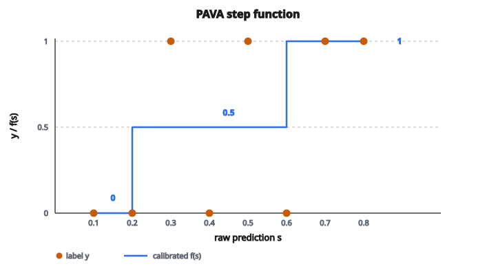

# Isotonic Regression Calibration

## Bài toán calibration

Mạng nơ-ron hiện đại thường **overconfident**: chúng gán xác suất cao ngay cả khi sai. Một mô hình có thể nói "tự tin 95%" nhưng thực tế chỉ đúng 70% số lần ở mức confidence đó.

Các phương pháp calibration sửa điều này bằng cách học một ánh xạ từ đầu ra thô của mô hình sang xác suất well-calibrated. **Isotonic regression** là cách tiếp cận phi tham số học ánh xạ này từ dữ liệu.

## Isotonic regression là gì

Isotonic regression khớp một hàm **đơn điệu không giảm** vào dữ liệu. Nếu $x_1 < x_2$ thì giá trị khớp $f(x_1) \leq f(x_2)$.

Với calibration, điều này nghĩa là: nếu mô hình tự tin hơn về dự đoán A so với dự đoán B, xác suất đã calibrated của A phải ít nhất bằng B.

Ràng buộc đơn điệu hợp lý vì confidence thô cao hơn phải ánh xạ sang confidence đã calibrated cao hơn (hoặc giữ nguyên), không bao giờ thấp hơn.

## Quy trình isotonic calibration

**Đầu vào:**

* Dự đoán thô của mô hình (xác suất hoặc score) trên tập calibration
* Nhãn thật (0 hoặc 1 với phân loại nhị phân)

**Đầu ra:**

* Một hàm bậc thang ánh xạ dự đoán thô sang xác suất đã calibrated

**Bước 1:** Sắp mẫu theo dự đoán thô (tăng dần)

**Bước 2:** Khớp isotonic regression: tìm hàm đơn điệu không giảm dự đoán nhãn thật tốt nhất từ các dự đoán thô

**Bước 3:** Dùng hàm này để biến đổi các dự đoán tương lai

## Isotonic regression hoạt động thế nào

Cho các dự đoán thô đã sắp $s_1 \leq s_2 \leq \ldots \leq s_n$ và các nhãn tương ứng $y_1, y_2, \ldots, y_n$:

Tìm các giá trị $f_1, f_2, \ldots, f_n$ sao cho:

1. Tối thiểu $\sum_i (f_i - y_i)^2$ (squared error)
2. Với ràng buộc $f_1 \leq f_2 \leq \ldots \leq f_n$ (đơn điệu)

Bài toán này được giải bằng **Pool Adjacent Violators Algorithm (PAVA)**.

## Thuật toán PAVA

**Intuition:** Bắt đầu với trung bình thô trong mỗi "block." Khi một block có trung bình cao hơn block kế tiếp (vi phạm đơn điệu), gộp chúng và lấy trung bình kết hợp.

**Bước 1:** Khởi tạo mỗi điểm là một block riêng với giá trị = nhãn (0 hoặc 1)

**Bước 2:** Quét trái sang phải. Nếu block $i$ có giá trị lớn hơn block $i+1$:

* Gộp các block
* Đặt giá trị block đã gộp bằng trung bình có trọng số
* Quay lại kiểm tra xem block đã gộp có vi phạm đơn điệu với block trước nó không

**Bước 3:** Lặp đến khi không còn vi phạm

Kết quả là một hàm bậc thang: các mẫu liên tiếp cùng giá trị khớp tạo thành một "bậc."

## Ví dụ số

**Dữ liệu (đã sắp theo dự đoán thô):**

Dự đoán thô: $[0.1, 0.2, 0.3, 0.4, 0.5, 0.6, 0.7, 0.8]$

Nhãn: $[0, 0, 1, 0, 1, 0, 1, 1]$

**Block ban đầu:** Mỗi điểm là một block riêng với giá trị = nhãn

$[0, 0, 1, 0, 1, 0, 1, 1]$

**Các vòng PAVA:**

Block 3 (giá trị 1) $>$ Block 4 (giá trị 0): Gộp thành block trung bình $0.5$

$[0, 0, 0.5, 0.5, 1, 0, 1, 1]$

Block 5 (giá trị 1) $>$ Block 6 (giá trị 0): Gộp thành $0.5$

$[0, 0, 0.5, 0.5, 0.5, 0.5, 1, 1]$

Kiểm tra ngược: Block 4 ($0.5$) $=$ Block 5 ($0.5$), OK

Mọi thứ đã đơn điệu. Giá trị calibrated cuối:

$[0, 0, 0.5, 0.5, 0.5, 0.5, 1, 1]$

::: {#fig-117-isotonic-pava fig-cap="PAVA gộp các vi phạm đơn điệu thành ba bậc: 0, 0.5, rồi 1." fig-alt="Binary labels at raw scores 0.1 to 0.8 and PAVA step function: 0 on [0.1, 0.2], 0.5 on [0.3, 0.6], 1 on [0.7, 0.8]."}
{fig-align="center"}
:::

## Hàm bậc thang

Isotonic regression cho ra một **hàm bậc thang**:

* Dự đoán thô trong $[0.1, 0.2]$: calibrated thành 0
* Dự đoán thô trong $[0.3, 0.6]$: calibrated thành 0.5
* Dự đoán thô trong $[0.7, 0.8]$: calibrated thành 1

Với dự đoán mới, tìm khoảng chứa nó rồi trả giá trị calibrated tương ứng.

## Nội suy cho dự đoán mới

Hàm isotonic đã khớp được định nghĩa tại các điểm huấn luyện. Với dự đoán mới:

**Cách 1: Nearest neighbor** Tìm điểm huấn luyện gần nhất và dùng giá trị calibrated của nó.

**Cách 2: Nội suy tuyến tính** Nội suy giữa hai điểm huấn luyện kề nhau.

**Cách 3: Cắt về miền** Nếu dự đoán mới nằm ngoài miền huấn luyện, cắt về giá trị endpoint gần nhất.

## Isotonic so với Platt scaling

**Platt scaling (tham số):**

* Khớp logistic regression: $P(y=1) = \frac{1}{1 + e^{-(As + B)}}$
* Chỉ học 2 tham số ($A$ và $B$)
* Giả định dạng sigmoid là phù hợp
* Hoạt động tốt khi dữ liệu calibration hạn chế

**Isotonic regression (phi tham số):**

* Không giả định dạng hàm
* Mô hình được quan hệ đơn điệu tùy ý
* Linh hoạt hơn, bắt được pattern miscalibration phức tạp
* Cần nhiều dữ liệu hơn để tránh overfitting

**Khi nào dùng cái nào:**

Isotonic: Tập calibration lớn (1000+ mẫu), pattern miscalibration phức tạp

Platt: Tập calibration nhỏ, khi giả định sigmoid hợp lý

## Calibration đa lớp

Với bài toán đa lớp, áp dụng isotonic calibration cho từng lớp riêng:

**Cách one-vs-all:**

1. Với mỗi lớp $k$, thu thập xác suất dự đoán $P(y=k)$ và nhãn nhị phân (1 nếu lớp thật là $k$, ngược lại 0)
2. Khớp isotonic regression cho từng lớp
3. Calibrate xác suất từng lớp độc lập
4. Tùy chọn chuẩn hóa lại để các xác suất cộng thành 1

## Ưu điểm của isotonic calibration

**Linh hoạt:** Không giả định dạng miscalibration. Có thể sửa overconfidence, underconfidence, hoặc pattern không đơn điệu.

**Đơn điệu được bảo đảm:** Score thô cao hơn luôn ánh xạ sang xác suất calibrated bằng hoặc cao hơn.

**Đơn giản:** PAVA dễ cài và nhanh ($O(n)$ với $n$ mẫu).

**Phi tham số:** Thích nghi với dữ liệu mà không giả định dạng hàm.

## Nhược điểm và lỗi thường gặp

**Overfitting:** Với tập calibration nhỏ, isotonic regression có thể overfit. Hàm bậc thang có thể quá răng cưa.

**Ngoại suy:** Isotonic regression ngoại suy kém ra ngoài miền huấn luyện. Dự đoán mới ngoài miền bị cắt.

**Cần dữ liệu held-out:** Cần một tập calibration riêng (không dùng để huấn luyện mô hình gốc).

**Hiệu ứng chia bin:** Đầu ra là hàm bậc thang, không mượt. Điều này có thể gây khó chịu nếu ta kỳ vọng xác suất calibrated liên tục.

## Triển khai thực tế

**Bước 1:** Chia dữ liệu thành tập train, calibration, và test

**Bước 2:** Huấn luyện mô hình trên tập train

**Bước 3:** Lấy dự đoán thô trên tập calibration

**Bước 4:** Khớp isotonic regression: dự đoán thô ($X$) so với nhãn thật ($y$)

**Bước 5:** Biến đổi dự đoán tập test bằng hàm isotonic đã khớp

**Bước 6:** Đánh giá calibration trên tập test (ví dụ tính ECE)

## Liên hệ với reliability diagram

Isotonic calibration về bản chất là khớp một hàm bậc thang lên reliability diagram. Nơi reliability diagram hiện các điểm (confidence trung bình, accuracy), isotonic regression tìm hàm đơn điệu khớp các điểm đó tốt nhất.

## Code
```python
def calibrate_isotonic(cal_labels, cal_probs, new_probs):
    """
    Apply isotonic regression calibration.
    """
    pairs = sorted(zip(cal_probs, cal_labels))
    sorted_probs = [p for p, l in pairs]
    sorted_labels = [float(l) for p, l in pairs]
    blocks = []
    for val in sorted_labels:
        blocks.append([val, 1])
        while len(blocks) >= 2 and blocks[-2][0] / blocks[-2][1] > blocks[-1][0] / blocks[-1][1]:
            blocks[-2][0] += blocks[-1][0]
            blocks[-2][1] += blocks[-1][1]
            blocks.pop()
    cal_values = []
    for val_sum, count in blocks:
        cal_values.extend([val_sum / count] * count)
    result = []
    for q in new_probs:
        if q <= sorted_probs[0]:
            result.append(cal_values[0])
        elif q >= sorted_probs[-1]:
            result.append(cal_values[-1])
        else:
            lo, hi = 0, len(sorted_probs) - 1
            while lo < hi:
                mid = (lo + hi + 1) // 2
                if sorted_probs[mid] <= q:
                    lo = mid
                else:
                    hi = mid - 1
            p1, v1 = sorted_probs[lo], cal_values[lo]
            p2, v2 = sorted_probs[lo + 1], cal_values[lo + 1]
            t = (q - p1) / (p2 - p1) if p2 != p1 else 0
            result.append(v1 + t * (v2 - v1))
    return result

```

<!-- auto-self-check -->

::: {.callout-note}
## Kiểm tra nhanh
<details>
<summary>Ý chính của bài «Isotonic Regression Calibration» là gì?</summary>
Isotonic regression khớp một hàm **đơn điệu không giảm** vào dữ liệu.
</details>
<details>
<summary>Khi nào nên nhớ / áp dụng «Isotonic Regression Calibration»?</summary>
Mạng nơ-ron hiện đại thường overconfident: chúng gán xác suất cao ngay cả khi sai.
</details>
:::
