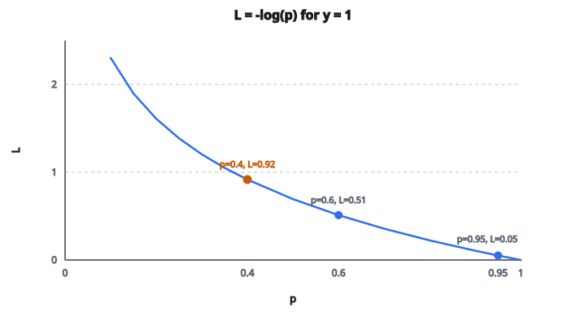

# Log Loss (từng mẫu)

## Thiết lập phân loại nhị phân

Trong phân loại nhị phân:

* Đầu vào: một mẫu $x$
* Nhãn thật: $y \in \{0, 1\}$
* Xác suất dự đoán: $\hat{y} = P(y=1|x)$

Mô hình xuất một xác suất cho lớp dương. Xác suất lớp âm là $1 - \hat{y}$.

## Log loss cho một mẫu

Log loss (còn gọi là binary cross-entropy) cho một mẫu là:

$$
L = -[y \log(\hat{y}) + (1-y) \log(1-\hat{y})]
$$

Công thức có hai trường hợp:

**Khi $y = 1$ (lớp dương):**

$$
L = -\log(\hat{y})
$$

Loss là âm log của xác suất dự đoán cho lớp dương.

**Khi $y = 0$ (lớp âm):**

$$
L = -\log(1-\hat{y})
$$

Loss là âm log của xác suất dự đoán cho lớp âm.

## Hiểu công thức

Loss đo mức "bất ngờ" trước dự đoán của bạn:

**Đúng và chắc:**

* Thật: $y = 1$, dự đoán: $p = 0.95$
* Loss: $-\log(0.95) = 0.05$
* Loss thấp vì dự đoán khớp thực tế

**Đúng nhưng không chắc:**

* Thật: $y = 1$, dự đoán: $p = 0.6$
* Loss: $-\log(0.6) = 0.51$
* Loss cao hơn vì không chắc

**Sai và không chắc:**

* Thật: $y = 1$, dự đoán: $p = 0.4$
* Loss: $-\log(0.4) = 0.92$
* Loss cao vì dự đoán sai

**Sai và chắc:**

* Thật: $y = 1$, dự đoán: $p = 0.05$
* Loss: $-\log(0.05) = 3.0$
* Loss rất cao vì sai mà chắc

## Đường cong loss

Với mẫu dương ($y = 1$), loss là hàm của xác suất dự đoán:

**$p = 0.99$:** loss = 0.01
**$p = 0.90$:** loss = 0.105
**$p = 0.70$:** loss = 0.357
**$p = 0.50$:** loss = 0.693
**$p = 0.30$:** loss = 1.204
**$p = 0.10$:** loss = 2.303
**$p = 0.01$:** loss = 4.605

::: {#fig-114-logloss-curve fig-cap="Với y = 1, L = -log(p). Ba điểm: p = 0.95 cho L = 0.05; p = 0.6 cho L = 0.51; p = 0.4 cho L = 0.92." fig-alt="Đường cong L = -log(p) với y = 1; ba điểm p = 0.95, L = 0.05; p = 0.6, L = 0.51; p = 0.4, L = 0.92."}
{fig-align="center"}
:::

Nhận xét chính:

* Loss gần 0 khi dự đoán đúng và chắc
* Loss bằng 0.693 ($\log 2$) khi không chắc ($p = 0.5$)
* Loss tăng nhanh khi dự đoán sai mà chắc
* Loss tiến tới vô cùng khi $p$ tiến tới 0

## Vì sao dùng logarithm?

Logarithm không tùy tiện. Nó đến từ lý thuyết thông tin:

**Lượng tin:** Thông tin thu được khi quan sát sự kiện có xác suất $p$ là $-\log(p)$.

**Bất ngờ:** Nếu dự đoán $p = 0.9$ và sự kiện xảy ra, bạn không bất ngờ (lượng tin thấp). Nếu dự đoán $p = 0.1$ mà nó xảy ra, bạn rất bất ngờ (lượng tin cao).

**Proper scoring rule:**
Log loss là proper scoring rule: dự đoán tối ưu luôn là xác suất thật. Không thể "lách" metric bằng cách dự đoán khác niềm tin thật.

## Gộp trên nhiều mẫu

Với tập $n$ mẫu:

$$
L_{\text{total}} = -\frac{1}{n}\sum_{i=1}^{n}[y_i \log(\hat{y}_i) + (1-y_i) \log(1-\hat{y}_i)]
$$

Đây là log loss trung bình, với các tính chất:

* Trung bình các loss từng mẫu
* Mỗi mẫu cùng trọng số
* So sánh được giữa các tập kích thước khác nhau

## Liên hệ với cross-entropy

Log loss và binary cross-entropy là cùng một thứ:

$$
L = -[y \log(\hat{y}) + (1-y) \log(1-\hat{y})] = H(y, \hat{y})
$$

với $H(y, \hat{y})$ là cross-entropy giữa phân phối thật $y$ (delta tại 0 hoặc 1) và phân phối dự đoán $\hat{y}$.

Cross-entropy đa lớp là mở rộng cho hơn 2 lớp.

## Gradient

Gradient của log loss theo xác suất dự đoán:

$$
\frac{\partial L}{\partial \hat{y}} = -\frac{y}{\hat{y}} + \frac{1-y}{1-\hat{y}}
$$

Với $y = 1$: gradient = $-1/\hat{y}$ (âm, đẩy dự đoán lên)
Với $y = 0$: gradient = $1/(1-\hat{y})$ (dương, đẩy dự đoán xuống)

Độ lớn gradient:

* Nhỏ khi dự đoán đúng và chắc
* Lớn khi dự đoán sai, đặc biệt khi sai mà chắc

## Ổn định số

Tính $\log(p)$ nguy hiểm khi $p$ gần 0:

* $\log(0)$ = âm vô cùng
* $\log(10^{-100}) = -230.26$ (rất lớn)

Cách xử lý:

**Clipping:** Cắt dự đoán về $[\varepsilon, 1-\varepsilon]$ với $\varepsilon = 10^{-7}$

* $p_{\text{clipped}} = \mathrm{clip}(p, 10^{-7}, 1-10^{-7})$
* Loss = $-\log(p_{\text{clipped}})$

**Log-sum-exp:** Tính $\log(\sigma(z))$ trực tiếp từ logit $z$

* Ổn định số hơn so với $\sigma(z)$ rồi mới $\log$

**Hàm sẵn của framework:** Dùng hàm có sẵn như `torch.nn.BCEWithLogitsLoss` để framework lo ổn định bên trong.

## Log loss so với các metric khác

**Accuracy:**

* Chỉ quan tâm đúng/sai
* Không thưởng cho độ chắc
* Phụ thuộc ngưỡng (thường 0.5)

**Log loss:**

* Quan tâm xác suất dự đoán
* Thưởng dự đoán đúng mà chắc
* Phạt dự đoán sai mà chắc
* Không phụ thuộc ngưỡng

Ví dụ hai mô hình dự đoán $y=1$:

* Mô hình A: $p = 0.51$ (đúng theo ngưỡng, loss = 0.67)
* Mô hình B: $p = 0.99$ (đúng theo ngưỡng, loss = 0.01)

Accuracy coi cả hai đều đúng. Log loss coi mô hình B tốt hơn nhiều.

## Log loss dùng ở đâu

* **Logistic regression**: hàm mất mát chuẩn
* **Bộ phân loại mạng nơ-ron nhị phân**: lớp sigmoid cuối với BCE loss
* **Dự đoán xác suất**: mọi mô hình xuất xác suất
* **Cuộc thi Kaggle**: metric đánh giá phổ biến
* **Dự đoán click-through rate**: xác suất click
* **Chẩn đoán y tế**: khi xác suất đã hiệu chỉnh quan trọng

## Code
```python
import math

def log_loss(y_true, y_pred, eps=1e-15):
    """
    Compute per-sample log loss.
    """
    losses = []
    for y, p in zip(y_true, y_pred):
        p_clip = max(eps, min(1 - eps, p))
        loss = -(y * math.log(p_clip) + (1 - y) * math.log(1 - p_clip))
        losses.append(loss)
    return losses

```

<!-- auto-self-check -->

::: {.callout-note}
## Kiểm tra nhanh
<details>
<summary>Ý chính của bài «Log Loss (từng mẫu)» là gì?</summary>
Trong phân loại nhị phân: * Đầu vào: một mẫu $x$ * Nhãn thật: $y \in \{0, 1\}$ * Xác suất dự đoán: $\hat{y} = P(y=1|x)$ Mô hình xuất một xác suất cho lớp dương.
</details>
<details>
<summary>Công thức / quan hệ cốt lõi trong bài là gì?</summary>
$$L = -[y \log(\hat{y}) + (1-y) \log(1-\hat{y})]$$
</details>
:::
