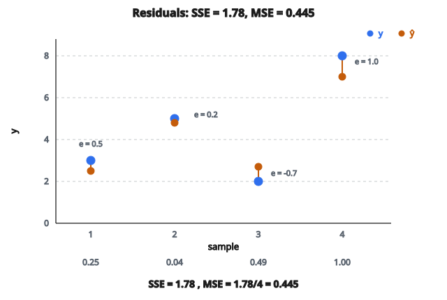

# Mean Squared Error (MSE)

## Mean Squared Error là gì

**Mean Squared Error (MSE)** là hàm mất mát phổ biến nhất cho bài hồi quy. Nó đo trung bình bình phương chênh lệch giữa giá trị dự đoán và giá trị thật.

Công thức:

$$
\text{MSE} = \frac{1}{n} \sum_{i=1}^{n} (y_i - \hat{y}_i)^2
$$

với:

* $n$ là số mẫu
* $y_i$ là giá trị thật của mẫu $i$
* $\hat{y}_i$ là giá trị dự đoán của mẫu $i$

## Tách bước tính

Tính MSE gồm ba bước:

**Bước 1: Tính sai số (residual)**

* Với mỗi mẫu, trừ dự đoán khỏi giá trị thật
* Sai số $= y_i - \hat{y}_i$
* Có thể dương (dự đoán thấp) hoặc âm (dự đoán cao)

**Bước 2: Bình phương từng sai số**

* $(y_i - \hat{y}_i)^2$
* Bình phương làm hai việc:
  * Biến mọi sai số thành dương (để chúng không triệt tiêu)
  * Phạt sai số lớn nặng hơn

**Bước 3: Lấy trung bình**

* Cộng mọi sai số bình phương rồi chia cho $n$
* Được một số đại diện sai số bình phương trung bình

## Ví dụ số

Giả sử có 4 mẫu:

**Mẫu 1:**

* Giá trị thật: $3.0$
* Dự đoán: $2.5$
* Sai số: $0.5$
* Sai số bình phương: $0.25$

**Mẫu 2:**

* Giá trị thật: $5.0$
* Dự đoán: $4.8$
* Sai số: $0.2$
* Sai số bình phương: $0.04$

**Mẫu 3:**

* Giá trị thật: $2.0$
* Dự đoán: $2.7$
* Sai số: $-0.7$
* Sai số bình phương: $0.49$

**Mẫu 4:**

* Giá trị thật: $8.0$
* Dự đoán: $7.0$
* Sai số: $1.0$
* Sai số bình phương: $1.00$

Tổng sai số bình phương: $0.25 + 0.04 + 0.49 + 1.00 = 1.78$

MSE: $\frac{1.78}{4} = 0.445$

::: {#fig-88-mse-residuals fig-cap="Bốn residual 0.5, 0.2, -0.7, 1.0 cho SSE = 1.78 và MSE = 1.78/4 = 0.445." fig-alt="Bốn residual 0.5, 0.2, -0.7, 1.0 giữa y và y-hat; SSE=1.78; MSE=0.445."}
{fig-align="center"}
:::

## Vì sao bình phương?

Phép bình phương không tùy tiện. Nó có vài tính chất quan trọng:

**1. Khử dấu**

* Sai số thô có thể dương hoặc âm
* Nếu chỉ trung bình sai số thô, dương và âm sẽ triệt tiêu
* Ví dụ: sai số $+5$ và $-5$ cho sai số trung bình $0$, che những lỗi lớn

**2. Phạt sai số lớn không tỷ lệ**

* Sai số $2$ đóng góp $2^2 = 4$ vào loss
* Sai số $4$ đóng góp $4^2 = 16$ vào loss
* Sai số lớn hơn đóng góp gấp 4, không phải gấp 2
* Mô hình vì thế rất nhạy với outlier

**3. Thuận tiện toán học**

* Hàm bình phương trơn và khả vi khắp nơi
* Gradient đơn giản: $\frac{\partial}{\partial \hat{y}} (y - \hat{y})^2 = -2(y - \hat{y})$
* Tối ưu vì thế thẳng tiến

## Gradient của MSE

Khi lan truyền ngược, cần gradient theo từng dự đoán:

$$
\frac{\partial \text{MSE}}{\partial \hat{y}_i} = \frac{2}{n}(\hat{y}_i - y_i)
$$

Quan sát chính:

* Gradient tỷ lệ với chính sai số
* Nếu $\hat{y}_i > y_i$ (dự đoán cao): gradient dương, đẩy dự đoán xuống
* Nếu $\hat{y}_i < y_i$ (dự đoán thấp): gradient âm, đẩy dự đoán lên
* Sai số lớn cho gradient lớn, nên mô hình sửa lỗi lớn nhanh hơn

## MSE và MAE (Mean Absolute Error)

MAE dùng trị tuyệt đối thay vì bình phương:

$$
\text{MAE} = \frac{1}{n} \sum_{i=1}^{n} |y_i - \hat{y}_i|
$$

**Đặc điểm MSE:**

* Phạt outlier nặng (phạt bình phương)
* Gradient trơn khắp nơi
* Độ lớn gradient phụ thuộc cỡ sai số
* Dự đoán tối ưu là mean của giá trị thật
* Đơn vị bị bình phương (ví dụ dự đoán mét thì MSE là mét bình phương)

**Đặc điểm MAE:**

* Đối xử mọi sai số tuyến tính (ít nhạy outlier hơn)
* Gradient không trơn tại không (đạo hàm không xác định khi $y = \hat{y}$)
* Độ lớn gradient không đổi (luôn $\pm 1$)
* Dự đoán tối ưu là median của giá trị thật
* Đơn vị khớp gốc (ví dụ mét)

## Khi MSE gặp khó

**Outlier**

* Một sai số cực lớn có thể chi phối cả loss
* Ví dụ: 99 mẫu sai số $1$, một mẫu sai số $100$
* MSE $\approx \frac{99 \times 1 + 10000}{100} = 100.99$
* Outlier đóng góp gấp 100 lần tổng mọi mẫu còn lại

**Phân phối sai số không Gaussian**

* MSE ngầm giả định sai số phân phối chuẩn
* Nếu phân phối sai số thật đuôi nặng hoặc lệch, MSE có thể không tối ưu

**Thang khác nhau**

* Nếu target trải nhiều độ lớn, target lớn chi phối loss
* Cân nhắc chuẩn hóa target hoặc dùng sai số theo phần trăm

## RMSE: Root Mean Squared Error

RMSE chỉ là căn bậc hai của MSE:

$$
\text{RMSE} = \sqrt{\text{MSE}} = \sqrt{\frac{1}{n} \sum_{i=1}^{n} (y_i - \hat{y}_i)^2}
$$

Vì sao dùng RMSE?

* Cùng đơn vị với target gốc (dễ diễn giải)
* Ví dụ: dự đoán giá nhà theo đô la thì RMSE cũng theo đô la
* MSE sẽ theo đô la bình phương, khó diễn giải hơn

Tối ưu giống hệt vì lấy căn không đổi mô hình nào cực tiểu hóa loss.

## MSE được dùng ở đâu

* **Linear regression**: nghiệm least squares cổ điển cực tiểu hóa MSE
* **Hồi quy mạng nơ-ron**: loss mặc định khi dự đoán giá trị liên tục
* **Dự báo time series**: dự đoán giá trị số trong tương lai
* **Autoencoder**: reconstruction loss cho dữ liệu liên tục
* **Mọi bài** dự đoán một số liên tục và muốn phạt sai số lớn nặng

## Code
```python
import numpy as np

def mean_squared_error(y_true, y_pred):
    """
    Returns: float MSE
    """
    y_true = np.asarray(y_true, dtype=float)
    y_pred = np.asarray(y_pred, dtype=float)
    return float(np.mean((y_true - y_pred) ** 2))

```
