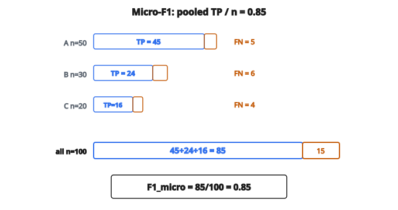

# Micro-F1

## Nhắc lại F1 score

F1 score là trung bình điều hòa của precision và recall:

$$
F1 = 2 \times \frac{\text{Precision} \times \text{Recall}}{\text{Precision} + \text{Recall}}
$$

Với phân loại nhị phân:

* Precision $= TP / (TP + FP)$
* Recall $= TP / (TP + FN)$

F1 cân bằng trade-off giữa precision và recall trong một metric.

## Thách thức đa lớp

Khi có hơn hai lớp, cần gộp F1 trên mọi lớp. Có ba cách chính:

1. **Micro-averaged F1**
2. **Macro-averaged F1**
3. **Weighted F1**

Mỗi cách cho insight khác nhau và phù hợp tình huống khác nhau.

## Micro-averaged F1

Micro-averaging tính precision và recall **toàn cục** bằng cách cộng mọi true positive, false positive, và false negative trên tất cả các lớp, rồi tính F1 từ các tổng đó.

$$
\text{Precision}_{\text{micro}} = \frac{\sum_i TP_i}{\sum_i (TP_i + FP_i)}
$$

$$
\text{Recall}_{\text{micro}} = \frac{\sum_i TP_i}{\sum_i (TP_i + FN_i)}
$$

$$
F1_{\text{micro}} = 2 \times \frac{\text{Precision}_{\text{micro}} \times \text{Recall}_{\text{micro}}}{\text{Precision}_{\text{micro}} + \text{Recall}_{\text{micro}}}
$$

## Điểm then chốt: micro F1 bằng accuracy

Với phân loại đa lớp trong đó mỗi mẫu thuộc đúng một lớp:

$$
\sum_i TP_i = \text{tổng dự đoán đúng}
$$

$$
\sum_i (TP_i + FP_i) = \sum_i (TP_i + FN_i) = \text{tổng số mẫu}
$$

Do đó:

$$
\text{Precision}_{\text{micro}} = \text{Recall}_{\text{micro}} = \text{Accuracy}
$$

Và:

$$
F1_{\text{micro}} = \text{Accuracy}
$$

Micro F1 và accuracy trùng nhau trên bài single-label đa lớp.

## Ví dụ số

**Bài 3 lớp với 100 mẫu:**

Lớp A: 50 mẫu, 45 đúng ($TP=45$, $FN=5$)

Lớp B: 30 mẫu, 24 đúng ($TP=24$, $FN=6$)

Lớp C: 20 mẫu, 16 đúng ($TP=16$, $FN=4$)

**Tính metric theo lớp:**

Với lớp A:

* $FP$ = mẫu được dự đoán A nhưng thực tế là B hoặc C
* Giả sử $FP_A = 3$

Với lớp B: $FP_B = 4$

Với lớp C: $FP_C = 8$

**Precision micro-averaged:**

$$
\text{Precision}_{\text{micro}} = \frac{45 + 24 + 16}{(45+3) + (24+4) + (16+8)} = \frac{85}{100} = 0.85
$$

**Recall micro-averaged:**

$$
\text{Recall}_{\text{micro}} = \frac{45 + 24 + 16}{(45+5) + (24+6) + (16+4)} = \frac{85}{100} = 0.85
$$

**Micro F1:**

$$
F1_{\text{micro}} = 2 \times \frac{0.85 \times 0.85}{0.85 + 0.85} = 0.85
$$

Giá trị này bằng accuracy: 85 đúng trên 100.

::: {#fig-15-micro-f1 fig-cap="Cộng TP trên 3 lớp: 45 + 24 + 16 = 85, nên F1_micro = 85/100 = 0.85 = accuracy." fig-alt="Ba lớp TP=45, 24, 16 cộng thành 85/100; F1 micro = 0.85."}
{fig-align="center"}
:::

## Micro F1 và macro F1

**Micro F1:**

* Gộp đóng góp từ mọi lớp
* Bị lớp đa số chi phối
* Phù hợp khi quan tâm hiệu năng tổng thể
* Bằng accuracy trên phân loại single-label

**Macro F1:**

* Tính F1 từng lớp, rồi lấy trung bình
* Mỗi lớp trọng số bằng nhau bất kể cỡ
* Phù hợp khi mọi lớp đều quan trọng như nhau
* Nhạy với hiệu năng trên lớp thiểu số

## Khi lớp mất cân bằng

**Tập dữ liệu:** 1000 mẫu

* Lớp A: 900 mẫu
* Lớp B: 80 mẫu
* Lớp C: 20 mẫu

**Mô hình dự đoán mọi thứ là lớp A:**

Micro F1 $= 900/1000 = 0.90$ (trông tốt!)

Macro F1:

* $F1_A$ = cao (hầu hết đúng)
* $F1_B$ = $0$ (không dự đoán lớp B)
* $F1_C$ = $0$ (không dự đoán lớp C)
* Macro F1 $= (\text{cao} + 0 + 0) / 3$ = thấp

Micro F1 che thất bại trên lớp thiểu số. Macro F1 phơi bày điều đó.

## Công thức đặt cạnh nhau

**Micro F1:**

$$
F1_{\text{micro}} = \frac{2 \times \sum_i TP_i}{2 \times \sum_i TP_i + \sum_i FP_i + \sum_i FN_i}
$$

**Macro F1:**

$$
F1_{\text{macro}} = \frac{1}{n} \sum_{i=1}^{n} F1_i
$$

**Weighted F1:**

$$
F1_{\text{weighted}} = \sum_{i=1}^{n} w_i \times F1_i
$$

với $w_i$ là tỷ lệ mẫu thuộc lớp $i$.

## Khi nào dùng micro F1

**Mọi mẫu quan trọng như nhau:**
Nếu phân loại đúng bất kỳ mẫu nào đều có giá trị bằng nhau, bất kể lớp.

**Mất cân bằng lớp phản ánh phân phối thực tế:**
Nếu phân phối test khớp lúc triển khai, accuracy tổng thể mới quan trọng.

**So với baseline:**
Micro F1 (accuracy) là metric chuẩn, được hiểu rộng rãi.

## Khi nào dùng macro F1

**Mọi lớp quan trọng như nhau:**
Trong chẩn đoán y khoa, nhận đúng bệnh hiếm quan trọng không kém bệnh phổ biến.

**Đánh giá công bằng:**
Đảm bảo mô hình tốt trên mọi nhóm, không chỉ đa số.

**Hiệu năng lớp thiểu số là then chốt:**
Khi thất bại trên lớp hiếm là không chấp nhận được.

## Phân loại multi-label

Với bài multi-label (mỗi mẫu có thể có nhiều nhãn):

* Micro F1 gộp TP, FP, FN trên mọi mẫu và mọi nhãn
* Micro F1 không còn bằng accuracy
* Công thức giữ nguyên, nhưng cách diễn giải khác

**Ví dụ:** Mẫu có nhãn $[A, B]$, mô hình dự đoán $[A, C]$

* $TP = 1$ (A)
* $FP = 1$ (C)
* $FN = 1$ (B bị bỏ)

## Ghi chú cài đặt

**Tính micro F1:**

1. Lập confusion matrix ($n_{\text{classes}} \times n_{\text{classes}}$)
2. Cộng đường chéo để lấy tổng TP
3. Cộng từng cột cho $(TP + FP)$ theo lớp
4. Cộng từng hàng cho $(TP + FN)$ theo lớp
5. Áp dụng công thức micro

**Tính hiệu quả:**

Với phân loại single-label:

* Micro F1 = (dự đoán đúng) / (tổng dự đoán)
* Chỉ cần đếm khớp giữa dự đoán và nhãn

## Các lỗi thường gặp

**Nhầm micro và macro:**
Chúng có thể cho giá trị rất khác trên dữ liệu mất cân bằng. Luôn nêu rõ đang dùng cái nào.

**Bỏ qua phân phối lớp:**
Micro F1 cao có thể che hiệu năng kém trên lớp thiểu số.

**Không báo cáo cả hai:**
Thực hành tốt là báo cáo cả micro và macro (hoặc weighted) để có bức tranh đầy đủ.

## Code
```python
def f1_micro(y_true, y_pred) -> float:
    """
    Compute micro-averaged F1 for multi-class integer labels.
    """
    classes = set(y_true) | set(y_pred)
    total_tp = 0
    total_fp = 0
    total_fn = 0
    for c in classes:
        for yt, yp in zip(y_true, y_pred):
            if yp == c and yt == c:
                total_tp += 1
            elif yp == c and yt != c:
                total_fp += 1
            elif yp != c and yt == c:
                total_fn += 1
    denom = 2 * total_tp + total_fp + total_fn
    if denom == 0:
        return 0.0
    return round(2 * total_tp / denom, 4)

```

<!-- auto-self-check -->

::: {.callout-note}
## Kiểm tra nhanh
<details>
<summary>Ý chính của bài «Micro-F1» là gì?</summary>
F1 score là trung bình điều hòa của precision và recall: Với phân loại nhị phân: * Precision $= TP / (TP + FP)$ * Recall $= TP / (TP + FN)$ F1 cân bằng trade-off giữa precision và recall trong một metric.
</details>
<details>
<summary>Công thức / quan hệ cốt lõi trong bài là gì?</summary>
$$F1 = 2 \times \frac{\text{Precision} \times \text{Recall}}{\text{Precision} + \text{Recall}}$$
</details>
:::
