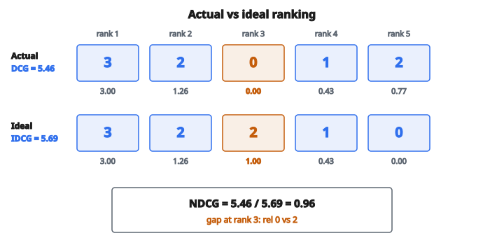

# NDCG (Normalized Discounted Cumulative Gain)

## Bài toán ranking

Trong information retrieval và recommendation, ta thường xếp hạng item theo độ liên quan. Khác phân loại (relevant hay không), ranking quan tâm **thứ tự**: đưa item tốt nhất lên trước quan trọng hơn là chỉ đưa chúng ra.

**Ví dụ:** Một search engine trả 10 kết quả. Nếu kết quả liên quan nhất nằm ở vị trí 10, người dùng có thể không bao giờ thấy. Cùng kết quả đó ở vị trí 1 thì giá trị hơn nhiều.

NDCG (Normalized Discounted Cumulative Gain) đo chất lượng ranking, cho nhiều điểm hơn khi item relevant xuất hiện sớm.

## Relevance score

Mỗi item có một **relevance score** cho biết nó hữu ích đến đâu. Thang phổ biến:

**Binary:** 0 (not relevant) hoặc 1 (relevant)

**Graded:** 0 (not relevant), 1 (somewhat relevant), 2 (relevant), 3 (highly relevant)

Điểm cao hơn nghĩa là liên quan hơn. Điểm đến từ đánh giá của người hoặc dữ liệu hành vi người dùng.

## Cumulative Gain (CG)

Metric đơn giản nhất: cộng các relevance score của top $k$ kết quả.

$$
\text{CG}_k = \sum_{i=1}^{k} \mathrm{rel}_i
$$

với $\mathrm{rel}_i$ là độ liên quan của item ở vị trí $i$.

**Vấn đề:** CG không xét vị trí. Ranking $[3, 2, 1]$ và $[1, 2, 3]$ có cùng CG, nhưng cái thứ nhất rõ ràng tốt hơn.

## Discounted Cumulative Gain (DCG)

DCG thêm **position discount**: item xuất hiện muộn đóng góp ít hơn.

$$
\text{DCG}_k = \sum_{i=1}^{k} \frac{\mathrm{rel}_i}{\log_2(i + 1)}
$$

Mẫu số $\log_2(i + 1)$ tăng theo vị trí, làm giảm đóng góp của các item sau.

**Position discount:**

* Vị trí 1: $\log_2(2) = 1$ (không chiết khấu)
* Vị trí 2: $\log_2(3) \approx 1.58$
* Vị trí 3: $\log_2(4) = 2$
* Vị trí 4: $\log_2(5) \approx 2.32$
* Vị trí 10: $\log_2(11) \approx 3.46$

Một item ở vị trí 1 đóng góp đủ relevance. Cùng item đó ở vị trí 10 chỉ còn khoảng 29% relevance.

## Công thức DCG thay thế

Một số cài đặt dùng biến thể phạt vị trí sau nặng hơn:

$$
\text{DCG}_k = \sum_{i=1}^{k} \frac{2^{\mathrm{rel}_i} - 1}{\log_2(i + 1)}
$$

Tử số $2^{\mathrm{rel}_i} - 1$ gán trọng số tăng theo hàm mũ cho relevance cao hơn:

* $\mathrm{rel} = 0$: $2^0 - 1 = 0$
* $\mathrm{rel} = 1$: $2^1 - 1 = 1$
* $\mathrm{rel} = 2$: $2^2 - 1 = 3$
* $\mathrm{rel} = 3$: $2^3 - 1 = 7$

Phiên bản này phổ biến trong thực tế và nhấn mạnh các item highly relevant.

## Ví dụ số: DCG

Ranking với relevance score: $[3, 2, 0, 1, 2]$

Dùng công thức chuẩn:

Vị trí 1: $3 / \log_2(2) = 3 / 1 = 3.0$

Vị trí 2: $2 / \log_2(3) = 2 / 1.585 = 1.26$

Vị trí 3: $0 / \log_2(4) = 0 / 2 = 0$

Vị trí 4: $1 / \log_2(5) = 1 / 2.32 = 0.43$

Vị trí 5: $2 / \log_2(6) = 2 / 2.58 = 0.77$

$$
\text{DCG}_5 = 3.0 + 1.26 + 0 + 0.43 + 0.77 = 5.46
$$

## Ideal DCG (IDCG)

DCG phụ thuộc các relevance score cụ thể đang có. Để so sánh được giữa các query, ta chuẩn hóa theo **DCG tốt nhất có thể**.

IDCG là DCG của ranking lý tưởng: mọi item được sắp theo relevance giảm dần.

**Cùng các item sắp tối ưu:** $[3, 2, 2, 1, 0]$

Vị trí 1: $3 / 1 = 3.0$

Vị trí 2: $2 / 1.585 = 1.26$

Vị trí 3: $2 / 2 = 1.0$

Vị trí 4: $1 / 2.32 = 0.43$

Vị trí 5: $0 / 2.58 = 0$

$$
\text{IDCG}_5 = 3.0 + 1.26 + 1.0 + 0.43 + 0 = 5.69
$$

## Normalized DCG (NDCG)

NDCG là DCG chia cho IDCG:

$$
\text{NDCG}_k = \frac{\text{DCG}_k}{\text{IDCG}_k}
$$

**Từ ví dụ của ta:**

$$
\text{NDCG}_5 = \frac{5.46}{5.69} = 0.96
$$

Ranking đạt 96% của DCG lý tưởng. Gần tối ưu.

::: {#fig-116-ndcg-ranks fig-cap="NDCG = DCG / IDCG = 5.46 / 5.69. Khác biệt chính ở vị trí 3: $\mathrm{rel} = 0$ thay vì 2." fig-alt="Two ranking rows: actual [3, 2, 0, 1, 2] with DCG = 5.46; ideal [3, 2, 2, 1, 0] with IDCG = 5.69; NDCG = 5.46/5.69."}
{fig-align="center"}
:::

## Tính chất của NDCG

**Miền:** 0 đến 1

**NDCG $= 1$:** Ranking hoàn hảo. Item được sắp đúng theo relevance.

**NDCG $= 0$:** Mọi item có relevance 0 (hoặc ranking xấu tối đa).

**Nhạy vị trí:** Đưa một item relevant từ vị trí 10 lên vị trí 1 làm NDCG tăng rõ.

**Graded relevance:** Khác precision/recall (nhị phân), NDCG xử lý graded relevance một cách tự nhiên.

## NDCG at k (NDCG@k)

Trong thực tế, người dùng chỉ nhìn vài kết quả đầu. NDCG@k đo chất lượng chỉ trên $k$ vị trí đầu.

**NDCG@1:** Chỉ chất lượng kết quả đầu tiên

**NDCG@5:** Chất lượng top 5 kết quả

**NDCG@10:** Phổ biến khi đánh giá web search

Các giá trị $k$ khác nhau cho insight khác nhau:

* NDCG@1 có thể thấp nhưng NDCG@10 cao (item tốt nhất không đứng đầu, nhưng nằm trong top 10)
* NDCG@1 cao nhưng NDCG@10 thấp (item đầu rất tốt, phần còn lại kém)

## Xử lý relevance score thiếu

Nếu một số item trong ranking không có đánh giá relevance:

* Cách 1: Coi relevance chưa biết bằng 0
* Cách 2: Bỏ các item chưa được đánh giá (dồn vị trí lên)
* Cách 3: Dùng relevance ước lượng

Lựa chọn phụ thuộc kịch bản đánh giá.

## NDCG so với các ranking metric khác

**Mean Average Precision (MAP):**

* Chỉ relevance nhị phân
* Tập trung vào recall (tìm hết item relevant)
* Ít nhạy với vị trí chính xác

**Mean Reciprocal Rank (MRR):**

* Chỉ quan tâm item relevant đầu tiên
* Bỏ qua mọi thứ sau vị trí hit đầu tiên

**Ưu điểm của NDCG:**

* Xử lý được graded relevance
* Nhạy vị trí xuyên suốt ranking
* Chuẩn công nghiệp cho recommendation và search

## Ứng dụng

**Search engine:** Đánh giá chất lượng kết quả cho query.

**Hệ gợi ý:** Đo mức top-N recommendation khớp sở thích người dùng.

**Learning to rank:** NDCG là mục tiêu tối ưu phổ biến cho mô hình ranking.

**A/B testing:** So các thuật toán ranking khác nhau trên dữ liệu người dùng thật.

## Tính NDCG trong thực tế

**Bước 1:** Lấy relevance score cho mọi item (từ nhãn hoặc phản hồi người dùng)

**Bước 2:** Tính DCG của ranking thực tế

**Bước 3:** Sắp item theo relevance để có thứ tự lý tưởng

**Bước 4:** Tính IDCG của ranking lý tưởng

**Bước 5:** Chia DCG cho IDCG

**Bước 6:** Trung bình NDCG trên nhiều query để đánh giá tổng thể

## Code
```python
import math

def ndcg(relevance_scores, k):
    """
    Compute NDCG@k.
    """
    scores = list(relevance_scores)[:k]
    dcg = sum((2 ** rel - 1) / math.log2(i + 2) for i, rel in enumerate(scores))
    ideal = sorted(relevance_scores, reverse=True)[:k]
    idcg = sum((2 ** rel - 1) / math.log2(i + 2) for i, rel in enumerate(ideal))
    if idcg == 0:
        return 0.0
    return dcg / idcg

```

<!-- auto-self-check -->

::: {.callout-note}
## Kiểm tra nhanh
<details>
<summary>Ý chính của bài «NDCG (Normalized Discounted Cumulative Gain)» là gì?</summary>
Trong information retrieval và recommendation, ta thường xếp hạng item theo độ liên quan.
</details>
<details>
<summary>Công thức / quan hệ cốt lõi trong bài là gì?</summary>
$$\text{CG}_k = \sum_{i=1}^{k} \mathrm{rel}_i$$
</details>
:::
