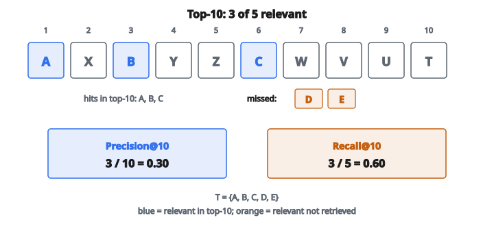

# Precision và Recall at K

## Precision và Recall at K là gì

Precision@K và Recall@K là ranking metric đánh giá mức hệ gợi ý đặt item relevant vào các vị trí top-K.

**Precision@K:** Trong K item được gợi ý, tỷ lệ bao nhiêu là relevant?

**Recall@K:** Trong tất cả item relevant, tỷ lệ bao nhiêu xuất hiện trong top-K?

Các metric này mượn từ information retrieval và được thích nghi cho đánh giá recommendation.

## Công thức Precision at K

$$
\text{Precision@K} = \frac{|\{\text{relevant items in top-K}\}|}{K} = \frac{|R_K \cap T|}{K}
$$

với

$$
\begin{aligned}
R_K &:\ \text{tập top-K item được gợi ý}, \\
T &:\ \text{tập item thực sự relevant}.
\end{aligned}
$$

**Miền:** 0 đến 1 (hoặc 0% đến 100%)

## Công thức Recall at K

$$
\text{Recall@K} = \frac{|\{\text{relevant items in top-K}\}|}{|\{\text{all relevant items}\}|} = \frac{|R_K \cap T|}{|T|}
$$

**Miền:** 0 đến 1 (hoặc 0% đến 100%)

## Ví dụ số

**Item relevant của user (nhãn thật):** $\{A, B, C, D, E\}$ (5 item)

**Top-10 recommendation:** $\{A, X, B, Y, Z, C, W, V, U, T\}$

**Item relevant trong top-10:** $\{A, B, C\}$ (3 item)

::: {#fig-14-2-precision-recall-k fig-cap="3 hit trong top-10 trên 5 item relevant: Precision@10 = 0.30 và Recall@10 = 0.60." fig-alt="Top-10 row A, X, B, Y, Z, C, W, V, U, T with hits A, B, C; leftover relevant D, E; P@10 = 0.30, R@10 = 0.60."}
{fig-align="center"}
:::

**Precision@10:**

$$
\text{Precision@10} = \frac{3}{10} = 0.30 = 30\%
$$

30% recommendation là relevant.

**Recall@10:**

$$
\text{Recall@10} = \frac{3}{5} = 0.60 = 60\%
$$

60% item relevant được gợi ý trong top-10.

## Precision và Recall tại các K khác nhau

**Top-5 recommendation:** $\{A, X, B, Y, Z\}$

Relevant trong top-5: $\{A, B\}$ (2 item)

* Precision@5 $= 2/5 = 0.40$
* Recall@5 $= 2/5 = 0.40$

**Top-3 recommendation:** $\{A, X, B\}$

Relevant trong top-3: $\{A, B\}$ (2 item)

* Precision@3 $= 2/3 = 0.67$
* Recall@3 $= 2/5 = 0.40$

**Quan sát:**

* Precision có thể tăng hoặc giảm khi K tăng
* Recall luôn tăng hoặc giữ nguyên khi K tăng

## Tradeoff Precision–Recall

Khi K tăng:

**Recall có xu hướng tăng:**

Nhiều cơ hội hơn để đưa item relevant vào.

**Precision có xu hướng giảm:**

Đưa thêm item nghĩa là thêm cả item không relevant.

Tradeoff này là bản chất của information retrieval và recommendation.

## Precision và Recall trung bình

Tính precision và recall cho từng user, rồi lấy trung bình:

$$
\text{Mean Precision@K} = \frac{1}{|U|} \sum_{u \in U} \text{Precision@K}_u
$$

$$
\text{Mean Recall@K} = \frac{1}{|U|} \sum_{u \in U} \text{Recall@K}_u
$$

Kết quả là metric mức hệ thống trên mọi user.

## Thế nào là relevant?

**Relevance tường minh:**

* Item user đánh giá 4 hoặc 5 sao
* Item user thêm vào mục yêu thích

**Relevance ẩn:**

* Item user đã click
* Item user đã mua
* Item user đã xem hết

**Tương tác tương lai:**

Trong tách train/test, relevant = các item user tương tác trong tập test.

## Xử lý user không có item relevant

Nếu một user không có item relevant trong tập test:

**Cách 1:** Loại họ khỏi trung bình

**Cách 2:** Gán precision = 0, recall = không xác định (hoặc 0)

Ghi rõ cách được dùng.

## Xử lý user có ít item relevant

Nếu một user chỉ có 2 item relevant:

* Recall@10 tối đa có thể $= 2/2 = 1.0$
* Nếu $K > |T|$, Recall@K dễ đạt $1.0$

**Chuẩn hóa:**

Một số công thức cắt K theo số item relevant:

$$
\text{Precision@K} = \frac{|R_K \cap T|}{\min(K, |T|)}
$$

## Đường cong Precision–Recall

Vẽ precision theo recall khi K thay đổi:

**Các điểm trên đường cong:**

* $K=1$: $(\text{Recall@1}, \text{Precision@1})$
* $K=2$: $(\text{Recall@2}, \text{Precision@2})$
* $\ldots$
* $K=N$: $(\text{Recall@N}, \text{Precision@N})$

**Đường cong lý tưởng:** Precision cao ở mọi mức recall (góc trên phải).

**Đường cong kém:** Precision giảm nhanh khi recall tăng.

## F1 Score at K

Trung bình điều hòa của precision và recall:

$$
\text{F1@K} = 2 \cdot \frac{\text{Precision@K} \cdot \text{Recall@K}}{\text{Precision@K} + \text{Recall@K}}
$$

F1 cân cả hai metric trong một số.

**F1@10 cho ví dụ của ta:**

$$
\text{F1@10} = 2 \cdot \frac{0.30 \cdot 0.60}{0.30 + 0.60} = 2 \cdot \frac{0.18}{0.90} = 0.40
$$

## Mean Average Precision (MAP)

Average precision trên mọi vị trí relevant:

$$
\text{AP} = \frac{1}{|T|} \sum_{k=1}^{K} \text{Precision@k} \cdot \mathrm{rel}(k)
$$

với $\mathrm{rel}(k) = 1$ nếu item ở vị trí $k$ là relevant.

**MAP = trung bình AP trên các user.**

MAP thưởng việc đặt item relevant sớm, không chỉ bất kỳ đâu trong top-K.

## Normalized Discounted Cumulative Gain (NDCG)

Một metric liên quan cũng xét vị trí:

$$
\text{DCG@K} = \sum_{k=1}^{K} \frac{\mathrm{rel}(k)}{\log_2(k+1)}
$$

Item ở vị trí sớm đóng góp nhiều hơn. NDCG chuẩn hóa theo DCG lý tưởng.

NDCG nhạy với thứ tự ranking hơn precision/recall.

## Chọn K

**K phụ thuộc ứng dụng:**

* Màn hình mobile: $K = 3$–$5$ (không gian hạn chế)
* Trang web: $K = 10$–$20$
* Email digest: $K = 5$–$10$

**Báo cáo nhiều giá trị K:**

Precision@1, @5, @10, @20 cho bức tranh đầy đủ hơn.

## Precision@K so với Hit Rate@K

**Precision@K:**

Tỷ lệ top-K là relevant.

**Hit Rate@K:**

Nhị phân: Có ít nhất một item relevant trong top-K không?

Hit rate ít chi tiết hơn. Precision phân biệt 1 hit với 5 hit trong top-10.

## Diễn giải

**Precision@10 $= 0.3$:**

"30% top-10 recommendation là item user thực sự muốn."

**Recall@10 $= 0.6$:**

"Ta gợi ý thành công 60% item user muốn trong top 10."

**Cả hai đều quan trọng:**

Precision cao = ít recommendation không relevant
Recall cao = ít bỏ sót item relevant

## Micro vs Macro averaging

**Micro-average:**

Gộp mọi recommendation của mọi user, rồi tính precision/recall trên gộp đó.

$$
\text{Precision}_{\text{micro}} = \frac{\sum_u |R_K^u \cap T_u|}{\sum_u K}
$$

**Macro-average:**

Tính theo từng user, rồi lấy trung bình.

$$
\text{Precision}_{\text{macro}} = \frac{1}{|U|} \sum_u \text{Precision@K}_u
$$

Macro-average đối xử mọi user như nhau. Micro-average gán trọng số theo mức hoạt động của user.

## Code
```python
def precision_recall_at_k(recommended, relevant, k):
    """
    Compute precision@k and recall@k for a recommendation list.
    """
    top_k = recommended[:k]
    relevant_set = set(relevant)
    hits = sum(1 for item in top_k if item in relevant_set)
    precision = hits / k if k > 0 else 0.0
    recall = hits / len(relevant_set) if len(relevant_set) > 0 else 0.0
    return [precision, recall]

```
