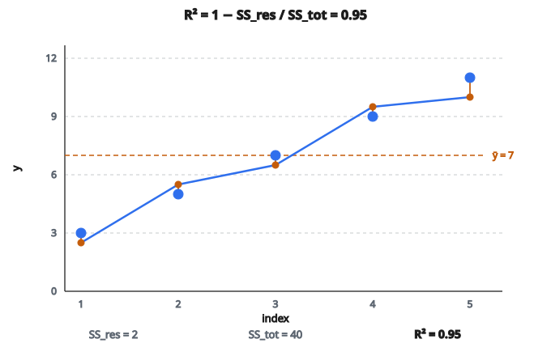

# R² Score (hệ số xác định)

## R-squared đo gì

R-squared ($R^2$), còn gọi là **hệ số xác định** (coefficient of determination), đo mức mô hình hồi quy giải thích phương sai của biến target.

**Ý:** “Tỷ lệ phương sai của target được mô hình giải thích là bao nhiêu?”

$R^2 = 0.85$ nghĩa là 85% phương sai của target được mô hình giải thích, và 15% còn lại chưa giải thích.

## Công thức chính

$$
R^2 = 1 - \frac{SS_{\text{res}}}{SS_{\text{tot}}}
$$

với:

**Residual Sum of Squares (phương sai chưa giải thích):**

$$
SS_{\text{res}} = \sum_{i=1}^{n} (y_i - \hat{y}_i)^2
$$

**Total Sum of Squares (tổng phương sai):**

$$
SS_{\text{tot}} = \sum_{i=1}^{n} (y_i - \bar{y})^2
$$

* $y_i$ là giá trị thật
* $\hat{y}_i$ là giá trị dự đoán
* $\bar{y}$ là mean của giá trị thật

## Hiểu các thành phần

**$SS_{\text{tot}}$:** Tổng phương sai trong dữ liệu. Đây là thứ ta nhận được nếu chỉ dự đoán mean cho mọi mẫu.

**$SS_{\text{res}}$:** Phương sai còn lại sau khi dùng mô hình. Đây là sai số bình phương của dự đoán.

**$R^2$:** Phần phương sai mô hình giải thích:

$$
R^2 = 1 - \frac{\text{phương sai chưa giải thích}}{\text{tổng phương sai}} = \frac{\text{phương sai đã giải thích}}{\text{tổng phương sai}}
$$

## Đọc R-squared

**$R^2 = 1$:** Khớp hoàn hảo. Mô hình giải thích toàn bộ phương sai. $SS_{\text{res}} = 0$.

**$R^2 = 0$:** Mô hình không hơn việc dự đoán mean. $SS_{\text{res}} = SS_{\text{tot}}$.

**$R^2 < 0$:** Mô hình kém hơn dự đoán mean. Xảy ra khi dự đoán rất tệ.

**Cách đọc điển hình:**

* $R^2 > 0.9$: Khớp xuất sắc
* $0.7 < R^2 < 0.9$: Khớp tốt
* $0.5 < R^2 < 0.7$: Khớp vừa
* $R^2 < 0.5$: Khớp yếu

Ngữ cảnh quyết định. Ở một số lĩnh vực (vật lý), $R^2 > 0.99$ là kỳ vọng. Ở lĩnh vực khác (khoa học xã hội), $R^2 = 0.3$ có thể đã xuất sắc.

## Ví dụ số

**Giá trị thật:** $y = [3, 5, 7, 9, 11]$

**Giá trị dự đoán:** $\hat{y} = [2.5, 5.5, 6.5, 9.5, 10]$

**Bước 1: Tính mean của giá trị thật**

$$
\bar{y} = \frac{3 + 5 + 7 + 9 + 11}{5} = 7
$$

**Bước 2: Tính $SS_{\text{tot}}$**

$$
\begin{aligned}
SS_{\text{tot}}
&= (3-7)^2 + (5-7)^2 + (7-7)^2 + (9-7)^2 + (11-7)^2 \\
&= 16 + 4 + 0 + 4 + 16 = 40
\end{aligned}
$$

**Bước 3: Tính $SS_{\text{res}}$**

$$
\begin{aligned}
SS_{\text{res}}
&= (3-2.5)^2 + (5-5.5)^2 + (7-6.5)^2 + (9-9.5)^2 + (11-10)^2 \\
&= 0.25 + 0.25 + 0.25 + 0.25 + 1 = 2
\end{aligned}
$$

**Bước 4: Tính $R^2$**

$$
R^2 = 1 - \frac{2}{40} = 1 - 0.05 = 0.95
$$

Mô hình giải thích 95% phương sai.

::: {#fig-30-r2-fit fig-cap="y = [3, 5, 7, 9, 11], ŷ = [2.5, 5.5, 6.5, 9.5, 10]; SS_res = 2, SS_tot = 40 nên R² = 0.95." fig-alt="Năm điểm y = [3,5,7,9,11] và y-hat = [2.5,5.5,6.5,9.5,10]; đường mean y-bar = 7; R² = 0.95."}
{fig-align="center"}
:::

## R-squared có thể âm

Khác correlation (bị chặn $-1$ đến $1$), $R^2$ không có cận dưới.

Nếu $SS_{\text{res}} > SS_{\text{tot}}$, thì $R^2 < 0$.

**Khi nào xảy ra?**

* Dự đoán kém hơn chỉ dự đoán mean
* Thường báo hiệu bug hoặc mô hình sai nghiêm trọng
* Có thể xảy ra khi đánh giá trên dữ liệu rất khác tập huấn luyện

**Ví dụ:**

Thật: $[10, 20, 30]$

Dự đoán: $[100, 200, 300]$ (lệch rất xa)

Residual lớn hơn nhiều so với việc dự đoán mean, cho $R^2$ âm.

## R-squared và correlation

Với hồi quy tuyến tính đơn (một đặc trưng), $R^2$ bằng bình phương hệ số tương quan Pearson:

$$
R^2 = r^2
$$

Với hồi quy bội, quan hệ này không giữ trực tiếp. $R^2$ vẫn tính được ngay khi không có một hệ số tương quan duy nhất.

## Adjusted R-squared

$R^2$ thường luôn tăng khi thêm đặc trưng, dù chúng chỉ thêm nhiễu. **Adjusted $R^2$** phạt đặc trưng thừa:

$$
R^2_{\text{adj}} = 1 - \frac{(1 - R^2)(n - 1)}{n - p - 1}
$$

với:

* $n$ là số mẫu
* $p$ là số đặc trưng

Adjusted $R^2$ giảm nếu đặc trưng mới không cải thiện mô hình đủ để biện minh cho việc thêm nó.

## R-squared và MSE/RMSE

**MSE (Mean Squared Error):**

$$
\text{MSE} = \frac{1}{n} \sum_i (y_i - \hat{y}_i)^2 = \frac{SS_{\text{res}}}{n}
$$

**Quan hệ:**

$$
R^2 = 1 - \frac{n \times \text{MSE}}{SS_{\text{tot}}}
$$

**Khác biệt then chốt:**

* MSE mang đơn vị bình phương của target (ví dụ đô la²)
* $R^2$ không đơn vị (tỷ lệ phương sai)
* MSE phụ thuộc thang; $R^2$ thì không

## Hạn chế của R-squared

**Không cho biết chất lượng dự đoán tuyệt đối:**
$R^2$ cao không nghĩa dự đoán chính xác theo đơn vị gốc. Nếu target có phương sai rất lớn, ngay cả $R^2 = 0.9$ vẫn có thể kèm sai số lớn.

**Không phát hiện bias:**
Mô hình có thể $R^2$ cao nhưng hệ thống dự đoán cao hoặc thấp.

**Nhạy outlier:**
Cả $SS_{\text{tot}}$ lẫn $SS_{\text{res}}$ dựa trên giá trị bình phương, khuếch đại ảnh hưởng outlier.

**Luôn tăng khi thêm đặc trưng:**
Thêm đặc trưng luôn tăng $R^2$ (dùng adjusted $R^2$ để chống điều này).

**Không luôn có nghĩa với mọi mô hình:**
Với mô hình phi tuyến, $R^2$ có thể gây hiểu nhầm. Một số người thực hành tránh dùng cho mạng nơ-ron.

## Khi nào dùng R-squared

**Linear regression:**
$R^2$ là metric chuẩn để đánh giá mô hình tuyến tính.

**So sánh mô hình:**
$R^2$ cho điểm đã chuẩn hóa (khác MSE, vốn phụ thuộc thang).

**Giải thích với stakeholder:**
“Mô hình giải thích 80% phương sai” là trực quan.

## Khi nào dùng metric khác

**Sai số tuyệt đối mới quan trọng:**
Dùng MAE hoặc RMSE để hiểu sai số dự đoán thực tế.

**Outlier là mối lo:**
Dùng MAE (ít nhạy hơn) hoặc metric vững.

**So trên nhiều tập dữ liệu:**
$R^2$ tương đối theo phương sai từng tập. Hai tập cùng MSE có thể có $R^2$ rất khác.

**Chọn mô hình:**
Dùng metric cross-validated để tránh overfitting.

## Cách tính R-squared

**Bước 1:** Tính mean của target: $\bar{y} = \frac{1}{n} \sum y_i$

**Bước 2:** Tính $SS_{\text{tot}} = \sum (y_i - \bar{y})^2$

**Bước 3:** Tính $SS_{\text{res}} = \sum (y_i - \hat{y}_i)^2$

**Bước 4:** $R^2 = 1 - SS_{\text{res}} / SS_{\text{tot}}$

Xử lý biên: nếu $SS_{\text{tot}} = 0$ (mọi target giống nhau), $R^2$ không xác định.

## Code
```python
import numpy as np

def r2_score(y_true, y_pred):
    """
    Compute R² (coefficient of determination) for 1D regression.
    Handle the constant-target edge case:
      - return 1.0 if predictions match exactly,
      - else 0.0.
    """
    y_true = np.array(y_true, dtype=float)
    y_pred = np.array(y_pred, dtype=float)
    ss_res = np.sum((y_true - y_pred) ** 2)
    mean_y = np.mean(y_true)
    ss_tot = np.sum((y_true - mean_y) ** 2)
    if ss_tot == 0:
        return 1.0 if ss_res == 0 else 0.0
    return round(float(1.0 - ss_res / ss_tot), 4)

```

<!-- auto-self-check -->

::: {.callout-note}
## Kiểm tra nhanh
<details>
<summary>Ý chính của bài «R² Score (hệ số xác định)» là gì?</summary>
R-squared ($R^2$), còn gọi là **hệ số xác định** (coefficient of determination), đo mức mô hình hồi quy giải thích phương sai của biến target.
</details>
<details>
<summary>Công thức / quan hệ cốt lõi trong bài là gì?</summary>
$$R^2 = 1 - \frac{SS_{\text{res}}}{SS_{\text{tot}}}$$
</details>
:::
