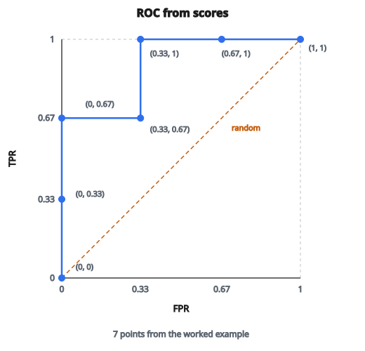

# Đường ROC từ score

## Đường ROC cho thấy gì

Đường **ROC** (Receiver Operating Characteristic) trực quan hóa hiệu năng bộ phân loại trên mọi ngưỡng có thể. Thay vì đánh giá tại một ngưỡng, nó hiện toàn bộ đánh đổi giữa true positive rate và false positive rate.

**Trục X:** False Positive Rate (FPR) = FP / (FP + TN)

**Trục Y:** True Positive Rate (TPR) = TP / (TP + FN)

Mỗi điểm trên đường cong tương ứng một ngưỡng phân loại cụ thể.

## Hai tỷ lệ then chốt

**True Positive Rate (TPR), còn gọi là Recall hoặc Sensitivity:**

$$
\text{TPR} = \frac{TP}{TP + FN} = \frac{\text{số dương nhận đúng}}{\text{tất cả dương thật}}
$$

"Trong tất cả mẫu dương thật, ta bắt được bao nhiêu phần?"

**False Positive Rate (FPR), còn gọi là Fall-out:**

$$
\text{FPR} = \frac{FP}{FP + TN} = \frac{\text{số âm bị gắn nhầm dương}}{\text{tất cả âm thật}}
$$

"Trong tất cả mẫu âm thật, ta gắn nhầm dương bao nhiêu phần?"

## Ngưỡng tạo đường cong thế nào

Bộ phân loại xuất score (ví dụ xác suất). Ta chọn ngưỡng $t$: dự đoán dương nếu score $\geq t$.

**Ngưỡng cao (ví dụ $t = 0.9$):**

* Rất chọn lọc, ít dự đoán dương
* TPR thấp (bỏ sót nhiều dương)
* FPR thấp (ít báo động giả)
* Điểm gần $(0, 0)$

**Ngưỡng thấp (ví dụ $t = 0.1$):**

* Dễ dãi, nhiều dự đoán dương
* TPR cao (bắt hầu hết dương)
* FPR cao (nhiều báo động giả)
* Điểm gần $(1, 1)$

Quét từ ngưỡng cao xuống thấp vẽ đường ROC từ $(0, 0)$ tới $(1, 1)$.

## Tính các điểm ROC

**Bước 1:** Sắp mọi mẫu theo score dự đoán (giảm dần)

**Bước 2:** Bắt đầu với ngưỡng trên max score: TPR = 0, FPR = 0

**Bước 3:** Hạ ngưỡng xuống từng giá trị score duy nhất:

* Mẫu có score tại hoặc trên ngưỡng trở thành dự đoán dương
* Tính lại TPR và FPR
* Ghi điểm

**Bước 4:** Kết thúc với ngưỡng dưới min score: TPR = 1, FPR = 1

## Ví dụ số

**Dữ liệu (score, nhãn):**

$(0.9, 1)$, $(0.8, 1)$, $(0.7, 0)$, $(0.6, 1)$, $(0.4, 0)$, $(0.3, 0)$

**Tổng:** 3 dương, 3 âm

**Ngưỡng = 1.0 (không mẫu nào dự đoán dương):**

* TP = 0, FP = 0, FN = 3, TN = 3
* TPR = $0/3 = 0$, FPR = $0/3 = 0$
* Điểm: $(0, 0)$

**Ngưỡng = 0.9:**

* Dự đoán dương: $(0.9, 1)$
* TP = 1, FP = 0
* TPR = $1/3 = 0.33$, FPR = $0/3 = 0$
* Điểm: $(0, 0.33)$

**Ngưỡng = 0.8:**

* Dự đoán dương: $(0.9, 1)$, $(0.8, 1)$
* TP = 2, FP = 0
* TPR = $2/3 = 0.67$, FPR = $0$
* Điểm: $(0, 0.67)$

**Ngưỡng = 0.7:**

* Dự đoán dương: top 3, gồm $(0.7, 0)$
* TP = 2, FP = 1
* TPR = $0.67$, FPR = $1/3 = 0.33$
* Điểm: $(0.33, 0.67)$

**Ngưỡng = 0.6:**

* TP = 3, FP = 1
* TPR = $1.0$, FPR = $0.33$
* Điểm: $(0.33, 1.0)$

**Ngưỡng = 0.4:**

* TP = 3, FP = 2
* TPR = $1.0$, FPR = $0.67$
* Điểm: $(0.67, 1.0)$

**Ngưỡng = 0.3:**

* TP = 3, FP = 3
* TPR = $1.0$, FPR = $1.0$
* Điểm: $(1, 1)$

::: {#fig-73-roc-curve fig-cap="Bảy điểm ROC của ví dụ số: TPR tăng trước khi FPR tăng, nên đường cong ôm góc trên-trái. Đường chéo là bộ phân loại ngẫu nhiên." fig-alt="Đường ROC bậc thang qua các điểm (0,0), (0,0.33), (0,0.67), (0.33,0.67), (0.33,1), (0.67,1), (1,1); đường chéo bộ phân loại ngẫu nhiên từ (0,0) tới (1,1)."}
{fig-align="center"}
:::

## Đọc hình dạng đường cong

**Bộ phân loại hoàn hảo:**
Đường đi từ $(0, 0)$ thẳng lên $(0, 1)$, rồi ngang tới $(1, 1)$. Mọi dương được xếp trên mọi âm.

**Bộ phân loại ngẫu nhiên:**
Đường chéo từ $(0, 0)$ tới $(1, 1)$. Dương và âm trộn ngẫu nhiên.

**Bộ phân loại tốt:**
Đường cong ôm về góc trên-trái. TPR cao đạt được với FPR thấp.

**Kém hơn ngẫu nhiên:**
Đường nằm dưới đường chéo. Mô hình phản-dự đoán (đảo dự đoán sẽ cải thiện).

## Góc trên-trái

Điểm vận hành lý tưởng là $(0, 1)$: TPR = 1, FPR = 0. Nghĩa là:

* Mọi dương được nhận đúng
* Không báo động giả

Bộ phân loại thực không đạt điểm này. Mục tiêu là tiến càng gần càng tốt.

Điểm trên đường cong gần $(0, 1)$ nhất thường là lựa chọn ngưỡng tốt nếu muốn cân TPR và FPR.

## Chọn điểm vận hành

Từng ứng dụng cần đánh đổi khác nhau:

**Sàng lọc y tế (TPR cao then chốt):**
Chọn điểm TPR cao dù FPR vừa phải. Bỏ sót bệnh tệ hơn làm thêm xét nghiệm.

**Lọc spam (FPR thấp then chốt):**
Chọn điểm FPR thấp dù TPR thấp hơn. Mất email quan trọng tệ hơn nhìn thấy vài spam.

**Cân bằng:**
Chọn điểm gần $(0, 1)$ nhất, hoặc nơi TPR $-$ FPR cực đại (thống kê Youden's J).

## Đường ROC so với đường Precision-Recall

**Đường ROC:**

* X: FPR, Y: TPR
* Dùng TN trong công thức FPR
* Ít bị ảnh hưởng bởi mất cân lớp
* Phù hợp tập cân bằng

**Đường Precision-Recall:**

* X: Recall (TPR), Y: Precision
* Không dùng TN
* Thông tin hơn khi dữ liệu mất cân
* Hiện hiệu năng trên lớp dương

Với dữ liệu mất cân mạnh (ví dụ 1% dương), ROC có thể trông tốt dù precision kém. Khi đó dùng đường PR.

## Diện tích dưới đường ROC (AUC)

Diện tích dưới đường ROC tóm tắt hiệu năng bằng một số:

**AUC = 1.0:** Tách hoàn hảo

**AUC = 0.5:** Bộ phân loại ngẫu nhiên (đường chéo)

**AUC < 0.5:** Kém hơn ngẫu nhiên

AUC bằng xác suất một mẫu dương ngẫu nhiên được xếp score cao hơn một mẫu âm ngẫu nhiên.

## ROC đa lớp

Với bài đa lớp, tính đường ROC bằng:

**One-vs-Rest (OvR):**
Với mỗi lớp, coi nó là dương và mọi lớp còn lại là âm. Vẽ một đường mỗi lớp.

**Micro-average:**
Gộp mọi lớp, tính TPR và FPR toàn cục.

**Macro-average:**
Trung bình các đường qua các lớp.

## Ghi chú cài đặt

**Xử lý hòa (tie):**
Khi nhiều mẫu cùng score, chúng nên được nhóm. Một số cài đặt bước qua tất cả cùng lúc.

**Tính hiệu quả:**
Sắp một lần, rồi quét trong thời gian $O(n)$. Không cần tính lại confusion matrix tại mỗi ngưỡng.

**Giá trị trả về:**
Thường trả mảng FPR, mảng TPR, và các ngưỡng tương ứng.

## Thực hành vẽ

**Vẽ đường chéo:**
Vẽ đường bộ phân loại ngẫu nhiên để đối chiếu.

**Đánh dấu điểm vận hành:**
Chỉ các ngưỡng cụ thể đang quan tâm.

**Hiện AUC:**
Đưa giá trị AUC vào tiêu đề hoặc chú giải hình.

**Trục đều:**
Dùng cùng thang cho X và Y để đường chéo nằm 45 độ.

## Code
```python
import numpy as np

def roc_curve(y_true, y_score):
    """
    Compute ROC curve from binary labels and scores.
    """
    y_true = np.asarray(y_true, dtype=int)
    y_score = np.asarray(y_score, dtype=float)
    P = int(np.sum(y_true == 1))
    N = int(np.sum(y_true == 0))
    order = np.lexsort((y_true, -y_score))
    y_true_sorted = y_true[order]
    y_score_sorted = y_score[order]
    fprs, tprs, thresholds = [0.0], [0.0], [float("inf")]
    tp, fp, i = 0, 0, 0
    n_items = len(y_true_sorted)
    while i < n_items:
        j = i
        while j < n_items and y_score_sorted[j] == y_score_sorted[i]:
            if y_true_sorted[j] == 1:
                tp += 1
            else:
                fp += 1
            j += 1
        fprs.append(fp / N if N > 0 else 0.0)
        tprs.append(tp / P if P > 0 else 0.0)
        thresholds.append(float(y_score_sorted[i]))
        i = j
    return fprs, tprs, thresholds

```

<!-- auto-self-check -->

::: {.callout-note}
## Kiểm tra nhanh
<details>
<summary>Ý chính của bài «Đường ROC từ score» là gì?</summary>
Đường **ROC** (Receiver Operating Characteristic) trực quan hóa hiệu năng bộ phân loại trên mọi ngưỡng có thể.
</details>
<details>
<summary>Công thức / quan hệ cốt lõi trong bài là gì?</summary>
$$\text{TPR} = \frac{TP}{TP + FN} = \frac{\text{số dương nhận đúng}}{\text{tất cả dương thật}}$$
</details>
:::
