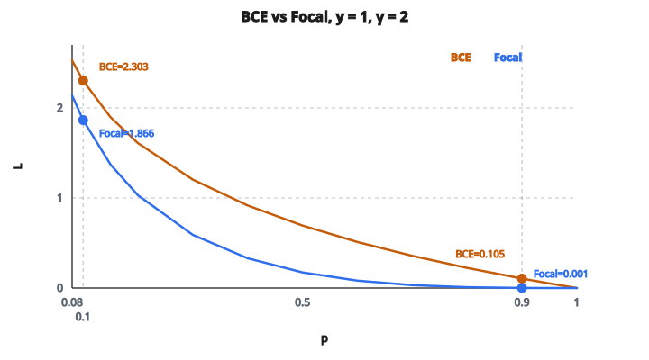

# Binary Focal Loss

## Vấn đề mất cân bằng lớp

Trong nhiều bài phân loại nhị phân, một lớp phổ biến hơn lớp kia rất nhiều:

* Phát hiện gian lận: $99.9\%$ hợp lệ, $0.1\%$ gian lận
* Chẩn đoán y khoa: $95\%$ khỏe, $5\%$ bệnh
* Object detection: hầu hết vùng là nền, ít vùng chứa vật

Binary cross-entropy chuẩn đối xử mọi mẫu như nhau. Điều này gây vấn đề:

**Khi huấn luyện:**

* Mô hình thấy áp đảo mẫu âm
* Gradient bị lớp đa số chiếm
* Mô hình học luôn dự đoán “âm” (đạt accuracy cao bằng cách bỏ qua lớp thiểu số)

**Phân rã loss:**

* $1000$ negative dễ, mỗi cái loss $0.01$, đóng góp tổng $10.0$
* $10$ positive khó, mỗi cái loss $2.0$, đóng góp tổng $20.0$
* Negative dễ vẫn đóng góp đáng kể vào gradient

## Focal loss làm gì

Focal loss thêm một nhân tử điều chế, hạ trọng số các mẫu dễ:

$$
\text{FL}(p_t) = -\alpha_t (1 - p_t)^\gamma \log(p_t)
$$

với:

* $p_t$ là xác suất dự đoán cho lớp đúng
* $\gamma$ là focusing parameter (thường là $2$)
* $\alpha_t$ là trọng số cân bằng lớp
* $(1 - p_t)^\gamma$ là modulating factor

Modulating factor $(1 - p_t)^\gamma$ nhỏ khi $p_t$ cao (mẫu dễ) và lớn khi $p_t$ thấp (mẫu khó).

## Giải công thức

Với phân loại nhị phân:

$$
p_t = \begin{cases}
p & \text{nếu } y = 1 \\
1 - p & \text{nếu } y = 0
\end{cases}
$$

với $p$ là xác suất mô hình gán cho lớp $1$.

Công thức khai triển:

$$
\text{FL} = \begin{cases}
-\alpha (1 - p)^\gamma \log(p) & \text{nếu } y = 1 \\
-(1 - \alpha) \cdot p^\gamma \log(1 - p) & \text{nếu } y = 0
\end{cases}
$$

Hai thành phần làm việc cùng nhau:

* **Class weight alpha**: cân bằng tầm quan trọng lớp dương so với lớp âm
* **Focusing factor**: hạ trọng số các mẫu đã phân loại tốt

## Focusing factor hoạt động thế nào

Tính modulating factor $(1 - p_t)^\gamma$ với $\gamma = 2$:

**Độ tin cậy $0.9$ (rất tự tin):** factor $= 0.01$, giảm $100$ lần
**Độ tin cậy $0.8$:** factor $= 0.04$, giảm $25$ lần
**Độ tin cậy $0.6$:** factor $= 0.16$, giảm $6$ lần
**Độ tin cậy $0.5$ (bất định):** factor $= 0.25$, giảm $4$ lần
**Độ tin cậy $0.3$:** factor $= 0.49$, giảm $2$ lần
**Độ tin cậy $0.1$ (sai):** factor $= 0.81$, giảm rất ít

Ý chính:

* Mẫu dễ (độ tin cậy $> 0.5$) bị hạ trọng số mạnh
* Mẫu khó (độ tin cậy $< 0.5$) giữ gần như toàn bộ loss
* Mô hình tập trung học các mẫu đang gặp khó

## Ảnh hưởng của gamma

$\gamma$ kiểm soát mức hạ trọng số mẫu dễ:

**gamma $= 0$:**

* Factor $= 1$ với mọi dự đoán
* Không có focusing
* Trở về cross-entropy chuẩn (kèm class weight)

**gamma $= 1$:**

* Focusing vừa
* Mẫu dễ ở độ tin cậy $0.9$ giảm $10$ lần

**gamma $= 2$ (phổ biến nhất):**

* Focusing mạnh
* Mẫu dễ ở độ tin cậy $0.9$ giảm $100$ lần
* Đây là mặc định trong hầu hết cài đặt

**gamma $= 5$:**

* Focusing cực đoan
* Mẫu dễ ở độ tin cậy $0.9$ giảm 100,000 lần
* Có thể gây không ổn định; ít khi dùng

## Tham số alpha

Alpha là trọng số cân bằng lớp:

* Alpha cho lớp dương (khi $y = 1$)
* $(1 - \text{alpha})$ cho lớp âm (khi $y = 0$)

Thiết lập thường gặp:

* $\text{alpha} = 0.25$ cho lớp thiểu số khi dữ liệu mất cân bằng nặng
* $\text{alpha} = 0.5$ cho dữ liệu cân bằng (trọng số bằng nhau)
* Thường đặt theo nghịch đảo tần suất lớp

Ví dụ với $99\%$ negative, $1\%$ positive:

* Đặt $\text{alpha} = 0.25$ cho positive
* Nghĩa là positive nặng hơn negative $3$ lần trước khi focusing

## So sánh loss trên mẫu dễ và khó

::: {#fig-136-focal fig-cap="Với y = 1 và γ = 2: p = 0.9 cho BCE = 0.105 còn Focal = 0.001; p = 0.1 cho BCE = 2.303 còn Focal = 1.866. Mẫu dễ bị hạ loss mạnh hơn mẫu khó." fig-alt="Hai đường BCE và Focal với y = 1, γ = 2; tại p = 0.9 BCE = 0.105 Focal = 0.001; tại p = 0.1 BCE = 2.303 Focal = 1.866."}
{fig-align="center"}
:::

Ví dụ: mẫu dương ($y = 1$)

**Dự đoán $0.9$:** BCE $= 0.105$, Focal $= 0.001$, tỉ lệ nhỏ hơn $105$ lần
**Dự đoán $0.7$:** BCE $= 0.357$, Focal $= 0.032$, tỉ lệ nhỏ hơn $11$ lần
**Dự đoán $0.5$:** BCE $= 0.693$, Focal $= 0.173$, tỉ lệ nhỏ hơn $4$ lần
**Dự đoán $0.3$:** BCE $= 1.204$, Focal $= 0.590$, tỉ lệ nhỏ hơn $2$ lần
**Dự đoán $0.1$:** BCE $= 2.303$, Focal $= 1.866$, tỉ lệ nhỏ hơn $1.2$ lần

Quan sát:

* Với mẫu dễ (dự đoán cao): focal loss nhỏ hơn nhiều bậc
* Với mẫu khó (dự đoán thấp): focal loss gần BCE
* Đóng góp loss tương đối dịch về phía mẫu khó

## Gradient

Gradient của focal loss phức tạp hơn cross-entropy:

$$
\frac{\partial \text{FL}}{\partial p} = -\alpha_t \left[ \gamma (1 - p_t)^{\gamma - 1} \log(p_t) + (1 - p_t)^\gamma \cdot \frac{1}{p_t} \right] \cdot \frac{\partial p_t}{\partial p}
$$

Tính chất chính:

* Độ lớn gradient giảm với mẫu dễ (giống loss)
* Mô hình nhận tín hiệu học mạnh hơn từ mẫu khó
* Hội tụ ban đầu có thể chậm hơn nhưng đạt nghiệm tốt hơn trên dữ liệu mất cân bằng

## Focal loss được dùng ở đâu

**Object detection:**

* Trường hợp dùng gốc (bài RetinaNet của Lin et al., 2017)
* Hầu hết anchor box là nền (negative dễ)
* Focal loss cho phép huấn luyện với mọi anchor thay vì hard negative mining

**Ảnh y khoa:**

* Phát hiện bệnh hiếm
* Phân đoạn tổn thương khi hầu hết pixel khỏe

**Phát hiện gian lận:**

* Lớp dương hiếm (giao dịch gian lận)
* Hầu hết mẫu là negative dễ (giao dịch hợp lệ)

**Mọi bài phân loại nhị phân mất cân bằng nặng**

## Mẹo thực tế

* **Bắt đầu với gamma $= 2$**: ổn với hầu hết trường hợp
* **Chỉnh alpha theo tần suất lớp**: thử nghịch đảo tần suất trước
* **Theo dõi mất ổn định**: gamma rất cao có thể gây vấn đề khi huấn luyện
* **So với class weighting**: đôi khi trọng số lớp đơn giản cũng đủ tốt
* **Theo dõi metric từng lớp**: accuracy dễ gây hiểu nhầm; dùng precision, recall, F1

## Code
```python
import math

def binary_focal_loss(predictions, targets, alpha, gamma):
    """
    Compute the mean binary focal loss.
    """
    n = len(predictions)
    total = 0.0
    for i in range(n):
        p_t = predictions[i] if targets[i] == 1 else 1.0 - predictions[i]
        total -= alpha * ((1.0 - p_t) ** gamma) * math.log(p_t)
    return total / n

```

<!-- auto-self-check -->

::: {.callout-note}
## Kiểm tra nhanh
<details>
<summary>Ý chính của bài «Binary Focal Loss» là gì?</summary>
Trong nhiều bài phân loại nhị phân, một lớp phổ biến hơn lớp kia rất nhiều: * Phát hiện gian lận: $99.9\%$ hợp lệ, $0.1\%$ gian lận * Chẩn đoán y khoa: $95\%$ khỏe, $5\%$ bệnh * Object detection: hầu hết vùng là nền, ít vùng chứa vật Binary cross-entropy…
</details>
<details>
<summary>Công thức / quan hệ cốt lõi trong bài là gì?</summary>
$$\text{FL}(p_t) = -\alpha_t (1 - p_t)^\gamma \log(p_t)$$
</details>
:::
