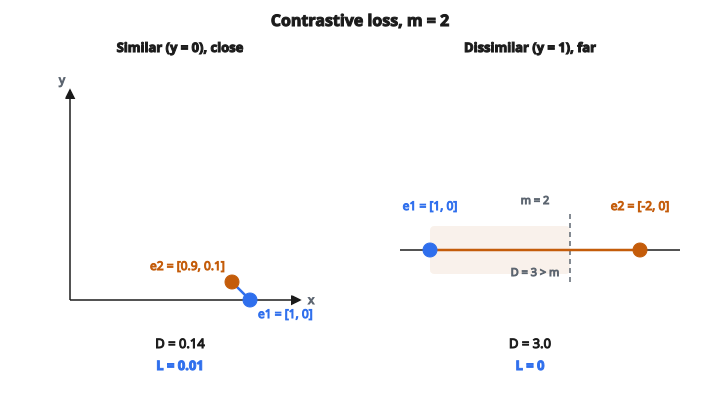

# Contrastive Loss (Siamese)

## Mục tiêu của contrastive learning

Contrastive learning huấn luyện mô hình tạo embedding sao cho:

* **Mục giống nhau nằm gần nhau** trong không gian embedding
* **Mục khác nhau nằm xa nhau**

Khác với phân loại:

* Phân loại gán mục vào các nhóm cố định
* Contrastive learning học một metric tương đồng tổng quát

## Công thức Contrastive Loss

Với một cặp mẫu có nhãn $y$:

$$
L = (1 - y) \cdot \frac{1}{2} D^2 + y \cdot \frac{1}{2} \max(0, m - D)^2
$$

với:

* $y = 0$ nếu cặp giống nhau (cùng lớp)
* $y = 1$ nếu cặp khác nhau (khác lớp)
* $D = \|f(x_1) - f(x_2)\|_2$ là khoảng cách Euclidean giữa các embedding
* $m$ là margin (hyperparameter)
* $f$ là hàm embedding (mạng nơ-ron)

## Hai trường hợp

**Trường hợp 1: Cặp giống ($y = 0$)**

$$
L = \frac{1}{2} D^2
$$

* Cực tiểu hóa khoảng cách bình phương giữa các embedding
* Kéo các mục giống nhau lại gần
* Không có margin

**Trường hợp 2: Cặp khác ($y = 1$)**

$$
L = \frac{1}{2} \max(0, m - D)^2
$$

* Nếu $D \geq m$: loss bằng $0$ (đã đủ xa)
* Nếu $D < m$: loss bằng $0.5 \cdot (m - D)^2$ (đẩy chúng ra xa)
* Đẩy các mục khác nhau cách nhau ít nhất $m$

## Vai trò của margin

Margin $m$ định nghĩa ranh giới giữa “gần” và “xa”:

* Cặp giống: khoảng cách nên xấp xỉ $0$
* Cặp khác: khoảng cách nên $\geq m$

**Chọn $m$:**

* Giá trị thường gặp: $1.0$, $2.0$ (tùy cách chuẩn hóa embedding)
* Nếu embedding chuẩn hóa L2 (mặt cầu đơn vị): $m$ trong $[0.5, 1.5]$ là điển hình
* Margin lớn hơn: tách mạnh hơn, nhưng khó đạt hơn
* Margin nhỏ hơn: dễ thỏa, nhưng kém phân biệt hơn

## Ví dụ số

::: {#fig-34-contrastive fig-cap="Với m = 2: cặp giống gần nhau D = 0.14 cho L = 0.01; cặp khác đã xa D = 3 &gt; m cho L = 0." fig-alt="Hai cặp contrastive với m = 2: cặp giống e1=[1,0], e2=[0.9,0.1], D=0.14, L=0.01; cặp khác e1=[1,0], e2=[-2,0], D=3 &gt; m, L=0."}
{fig-align="center"}
:::

Cho margin $m = 2.0$.

**Ví dụ 1: Cặp giống, gần**

* Embedding: $e_1 = [1, 0]$, $e_2 = [0.9, 0.1]$
* Khoảng cách: $D = \sqrt{0.1^2 + 0.1^2} = 0.14$
* Loss: $0.5 \cdot (0.14)^2 = 0.01$ (nhỏ, tốt)

**Ví dụ 2: Cặp giống, xa**

* Embedding: $e_1 = [1, 0]$, $e_2 = [-1, 0]$
* Khoảng cách: $D = 2.0$
* Loss: $0.5 \cdot (2.0)^2 = 2.0$ (phạt nặng)

**Ví dụ 3: Cặp khác, gần**

* Embedding: $e_1 = [1, 0]$, $e_2 = [0.8, 0.2]$
* Khoảng cách: $D = 0.28$
* Loss: $0.5 \cdot (2.0 - 0.28)^2 = 1.48$ (đẩy ra xa)

**Ví dụ 4: Cặp khác, xa**

* Embedding: $e_1 = [1, 0]$, $e_2 = [-2, 0]$
* Khoảng cách: $D = 3.0 > m$
* Loss: $\max(0, 2.0 - 3.0)^2 = 0$ (đã thỏa)

## Gradient

**Với cặp giống ($y = 0$):**

$$
\frac{\partial L}{\partial e_1} = (e_1 - e_2)
$$

Gradient hướng từ $e_2$ tới $e_1$, nên $e_1$ tiến về $e_2$.

**Với cặp khác ($y = 1$) khi $D < m$:**

$$
\frac{\partial L}{\partial e_1} = -(m - D) \cdot \frac{e_1 - e_2}{D}
$$

Gradient ngược chiều, đẩy $e_1$ ra xa $e_2$.

**Với cặp khác khi $D \geq m$:**

$$
\frac{\partial L}{\partial e_1} = 0
$$

Không còn gradient. Cặp đã tách đủ xa.

## Tạo cặp huấn luyện

Contrastive loss cần cặp mẫu. Các chiến lược:

**Từ dữ liệu có nhãn:**

* Cùng lớp: cặp dương ($y = 0$)
* Khác lớp: cặp âm ($y = 1$)
* Lấy ngẫu nhiên hoặc hard negative mining

**Self-supervised (không nhãn):**

* Augmentation của cùng một ảnh: cặp dương
* Ảnh khác nhau: cặp âm
* Đây là nền của SimCLR, MoCo, v.v.

**Chiến lược mining:**

* Random: lấy cặp đều
* Hard negative mining: tìm cặp khác nhau đang nằm gần
* Semi-hard mining: cặp khác nhau trong margin nhưng không quá gần

## Không gian embedding

Embedding huấn luyện tốt tạo thành cụm:

* Mục giống nhau tụ lại
* Các cụm khác nhau cách nhau ít nhất margin $m$
* Margin tạo “vùng chết” giữa các cụm

Tính chất của không gian đã học:

* Khoảng cách có nghĩa (khác không gian đặc trưng thô)
* Có thể thêm lớp mới mà không huấn luyện lại (zero-shot)
* Tìm kiếm nearest neighbor trở nên hiệu quả

## Contrastive so với Triplet loss

Contrastive loss làm việc với cặp. Triplet loss làm việc với triplet (anchor, positive, negative).

**Contrastive:**

* Hai số hạng: kéo cái giống, đẩy cái khác
* Dễ hiểu hơn
* Cần nhãn giống/khác nhị phân

**Triplet:**

* Một số hạng: positive phải gần hơn negative một khoảng margin
* So sánh tương đối rõ hơn
* Hard negative mining tự nhiên hơn

Cả hai đạt mục tiêu tương tự; triplet loss thường được xem là hiệu quả mẫu hơn.

## Contrastive loss được dùng ở đâu

* **Face recognition**: embedding sao cho cùng người = gần, khác người = xa
* **Xác minh chữ ký**: cùng người ký so với người khác
* **Siamese network**: so hai đầu vào về độ giống
* **Self-supervised learning**: học biểu diễn không cần nhãn
* **One-shot learning**: nhận lớp mới với ít ví dụ
* **Image retrieval**: tìm ảnh giống trong cơ sở dữ liệu

## Code
```python
import numpy as np

def contrastive_loss(a, b, y, margin, reduction):
    """
    a, b: arrays of shape (N, D) or (D,)  (will broadcast to (N,D))
    y:    array of shape (N,) with values in {0,1}; 1=similar, 0=dissimilar
    margin: float > 0
    reduction: "mean" (default) or "sum"
    Return: float
    """
    a = np.asarray(a, float)
    b = np.asarray(b, float)
    y = np.asarray(y, float)
    diff = a - b
    if diff.ndim == 1:
        diff = diff[None, :]
    d = np.linalg.norm(diff, axis=1)
    pos = y * (d ** 2)
    neg = (1.0 - y) * np.maximum(0.0, margin - d) ** 2
    loss = pos + neg
    return float(loss.mean() if reduction == "mean" else loss.sum())

```
