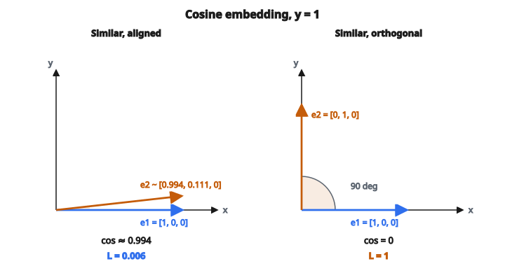

# Cosine Embedding Loss

## Đo tương đồng bằng cosine

Cosine similarity đo góc giữa hai vector:

$$
\cos(\theta) = \frac{a \cdot b}{\|a\| \cdot \|b\|}
$$

với:

* $a \cdot b$ là tích vô hướng
* $\|a\|$ và $\|b\|$ là độ lớn các vector

Miền giá trị:

* $\cos(\theta) = 1$: hai vector cùng hướng (giống nhất)
* $\cos(\theta) = 0$: hai vector trực giao (không liên quan)
* $\cos(\theta) = -1$: hai vector ngược hướng (khác nhất)

## Cosine Embedding Loss

Cosine embedding loss huấn luyện embedding bằng cosine similarity thay vì khoảng cách Euclidean:

$$
L = \begin{cases}
1 - \cos(e_1, e_2) & \text{nếu } y = 1 \\
\max(0, \cos(e_1, e_2) - m) & \text{nếu } y = -1
\end{cases}
$$

với:

* $e_1, e_2$ là các vector embedding
* $y = 1$ cho cặp giống
* $y = -1$ cho cặp khác
* $m$ là margin (thường trong $[-1, 1]$)

Lưu ý: quy ước nhãn ($y \in \{-1, 1\}$) khác contrastive loss chuẩn.

## Hai trường hợp

**Trường hợp 1: Cặp giống ($y = 1$)**

$$
L = 1 - \cos(e_1, e_2)
$$

* Nếu $\cos = 1$ (cùng hướng): loss $= 0$
* Nếu $\cos = 0$ (trực giao): loss $= 1$
* Nếu $\cos = -1$ (ngược hướng): loss $= 2$
* Cực tiểu hóa loss bằng cách cực đại hóa cosine similarity

**Trường hợp 2: Cặp khác ($y = -1$)**

$$
L = \max(0, \cos(e_1, e_2) - m)
$$

* Nếu $\cos \leq m$: loss $= 0$ (đã đủ khác)
* Nếu $\cos > m$: loss $= \cos - m$ (phạt vì còn quá giống)
* Margin $m$ là độ giống tối đa cho phép với cặp khác

## Vai trò của margin

Margin $m$ đặt ngưỡng cho cặp khác:

**$m = 0$:**

* Cặp khác nên trực giao hoặc tương quan âm
* Tách nghiêm

**$m = 0.5$:**

* Cặp khác vẫn được phép một phần tương quan dương
* Nới hơn

**$m = -0.5$:**

* Cặp khác nên hơi tương quan âm
* Tách rất nghiêm

Lựa chọn thường gặp: $m = 0$ hoặc $m = 0.1$

## Ví dụ số

::: {#fig-135-cosine-embed fig-cap="Cặp giống cùng hướng cos ≈ 0.994 cho L = 0.006; cặp giống nhưng trực giao cho L = 1." fig-alt="Hai cặp cosine embedding y = 1: e1 và e2 gần cùng hướng cos ≈ 0.994, L = 0.006; e1 và e2 trực giao cos = 0, L = 1."}
{fig-align="center"}
:::

**Ví dụ 1: Cặp giống, cùng hướng**

* $e_1 = [1, 0, 0]$, $e_2 = [0.9, 0.1, 0]$ (chuẩn hóa: $[0.994, 0.111, 0]$)
* $\cos(e_1, e_2) \approx 0.994$
* Loss: $1 - 0.994 = 0.006$ (rất nhỏ)

**Ví dụ 2: Cặp giống, trực giao**

* $e_1 = [1, 0, 0]$, $e_2 = [0, 1, 0]$
* $\cos(e_1, e_2) = 0$
* Loss: $1 - 0 = 1.0$ (phạt nặng)

**Ví dụ 3: Cặp khác, cùng hướng (với $m = 0$)**

* $e_1 = [1, 0, 0]$, $e_2 = [0.8, 0.6, 0]$
* $\cos(e_1, e_2) = 0.8$
* Loss: $\max(0, 0.8 - 0) = 0.8$ (cần đẩy ra xa)

**Ví dụ 4: Cặp khác, ngược hướng (với $m = 0$)**

* $e_1 = [1, 0, 0]$, $e_2 = [-1, 0, 0]$
* $\cos(e_1, e_2) = -1$
* Loss: $\max(0, -1 - 0) = 0$ (đã khác tối đa)

## Cosine so với khoảng cách Euclidean

**Khoảng cách Euclidean (L2):**

* Đo chênh lệch vị trí tuyệt đối
* Chịu ảnh hưởng độ lớn vector
* Hai vector có thể xa theo L2 nhưng cùng hướng

**Cosine similarity:**

* Đo tương đồng góc
* Bất biến với độ lớn (chỉ hướng quan trọng)
* Hai vector cùng hướng có cosine $= 1$ bất kể độ dài

**Khi dùng cosine:**

* Khi hướng quan trọng hơn độ lớn
* Khi embedding có norm thay đổi
* Embedding văn bản (TF-IDF, word2vec): độ dài tài liệu không nên ảnh hưởng tương đồng
* Khi muốn so sánh bất biến thang

**Khi dùng Euclidean:**

* Khi độ lớn mang thông tin
* Khi vị trí tuyệt đối trong không gian embedding quan trọng
* Thường dùng với embedding chuẩn hóa L2 (khi đó cosine và L2 tương đương)

## Quan hệ với khoảng cách L2

Với vector chuẩn hóa L2 (vector đơn vị trên hypersphere):

$$
\|e_1 - e_2\|_2^2 = 2(1 - \cos(e_1, e_2))
$$

Nghĩa là:

* Nếu embedding đã chuẩn hóa: cosine và L2 liên hệ đơn điệu
* Cực đại hóa cosine $\equiv$ cực tiểu hóa khoảng cách L2
* Nhiều cài đặt chuẩn hóa embedding, nên lựa chọn kém then chốt hơn

## Gradient

Với cặp giống ($y = 1$):

$$
\frac{\partial L}{\partial e_1} = -\frac{e_2 - (e_1 \cdot e_2) e_1 / \|e_1\|^2}{\|e_1\| \cdot \|e_2\|}
$$

Hướng này làm tăng cosine similarity.

Với cặp khác ($y = -1$) khi $\cos > m$:

$$
\frac{\partial L}{\partial e_1} = \frac{e_2 - (e_1 \cdot e_2) e_1 / \|e_1\|^2}{\|e_1\| \cdot \|e_2\|}
$$

Hướng này làm giảm cosine similarity.

## Ghi chú khi cài đặt

**Chuẩn hóa:**

* Thường áp L2 normalization trước khi tính loss
* Loss khi đó chỉ còn hướng
* Đơn giản hóa tính gradient

**Ổn định số:**

* Tránh chia cho không với vector norm bằng không
* Clip cosine về $[-1, 1]$ trước khi tính loss

**Temperature scaling:**

* Đôi khi cosine similarity được chia thang: $\cos(e_1, e_2) / \tau$
* Temperature $\tau$ kiểm soát “độ sắc” của tương đồng
* Dùng trong InfoNCE và các loss liên quan

## Cosine embedding loss được dùng ở đâu

* **Tương đồng câu**: so sánh sentence embedding (SBERT)
* **Truy hồi tài liệu**: tìm tài liệu giống
* **Face verification**: so sánh face embedding
* **Phát hiện trùng**: tìm mục gần trùng
* **Hệ gợi ý**: tương đồng user–item
* Mọi tác vụ mà tương đồng góc có nghĩa hơn khoảng cách tuyệt đối

## Code
```python
import math

def cosine_embedding_loss(x1, x2, label, margin):
    """
    Compute cosine embedding loss for a pair of vectors.
    """
    dot = sum(a * b for a, b in zip(x1, x2))
    n1 = math.sqrt(sum(a * a for a in x1))
    n2 = math.sqrt(sum(b * b for b in x2))
    cos_sim = dot / (n1 * n2)
    if label == 1:
        return 1.0 - cos_sim
    else:
        return max(0.0, cos_sim - margin)

```

<!-- auto-self-check -->

::: {.callout-note}
## Kiểm tra nhanh
<details>
<summary>Ý chính của bài «Cosine Embedding Loss» là gì?</summary>
Cosine similarity đo góc giữa hai vector: với: * $a \cdot b$ là tích vô hướng * $\|a\|$ và $\|b\|$ là độ lớn các vector Miền giá trị: * $\cos(\theta) = 1$: hai vector cùng hướng (giống nhất) * $\cos(\theta) = 0$: hai vector trực giao (không liên quan) *…
</details>
<details>
<summary>Công thức / quan hệ cốt lõi trong bài là gì?</summary>
$$\cos(\theta) = \frac{a \cdot b}{\|a\| \cdot \|b\|}$$
</details>
:::
