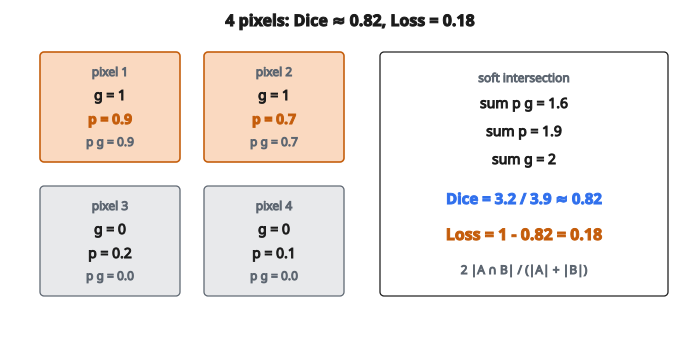

# Dice Loss

## Bài toán segmentation

Trong semantic segmentation, mục tiêu là gán lớp cho từng pixel trong ảnh:

* Đầu vào: ảnh kích thước $H \times W$
* Đầu ra: mask kích thước $H \times W$ trong đó mỗi pixel có một nhãn lớp

Thách thức: mất cân bằng lớp rất nặng.

* Ví dụ: phân đoạn khối u trên ảnh não
* $99\%$ pixel là mô lành (background)
* $1\%$ pixel là khối u (foreground)

Nếu dùng cross-entropy theo pixel:

* Mô hình có thể đạt độ chính xác $99\%$ bằng cách dự đoán “background” khắp nơi
* Nó hoàn toàn bỏ qua vùng quan tâm

## Dice Loss đo gì

Dice loss dựa trên **Dice coefficient** (còn gọi là hệ số Sørensen–Dice hoặc F1 score):

$$
\mathrm{Dice} = \frac{2 |A \cap B|}{|A| + |B|}
$$

với

* $A$ là tập pixel dương dự đoán
* $B$ là tập pixel dương ground truth
* $|A \cap B|$ là số pixel thuộc cả hai tập (true positives)
* $|A| + |B|$ là tổng số pixel dương trên cả hai mask

Dice coefficient chạy từ $0$ (không chồng) đến $1$ (chồng hoàn toàn).

## Chuyển thành loss khả vi

Công thức trên tập hợp không khả vi. Khi huấn luyện, ta dùng dự đoán mềm:

$$
\mathrm{Dice\ Loss} = 1 - \frac{2 \sum_i p_i g_i + \epsilon}{\sum_i p_i + \sum_i g_i + \epsilon}
$$

với

* $p_i$ là xác suất dự đoán cho pixel $i$ (từ sigmoid/softmax)
* $g_i$ là nhãn ground truth của pixel $i$ ($0$ hoặc $1$)
* $\epsilon$ là hằng số nhỏ để ổn định số (ví dụ $10^{-6}$)
* Tổng lấy trên mọi pixel

Đây là bản “mềm” vì:

* Thay vì dự đoán cứng $0/1$, ta dùng xác suất
* Phần giao $\sum_i p_i g_i$ là đếm mềm true positives
* Khi dự đoán tự tin hơn ($0$ hoặc $1$), giá trị này tiến tới Dice cứng

## Ví dụ số

Xét ảnh nhỏ 4 pixel:

| Pixel | Ground truth $g$ | Dự đoán $p$ | $p \cdot g$ |
| --- | --- | --- | --- |
| 1 | 1 | 0.9 | 0.9 |
| 2 | 1 | 0.7 | 0.7 |
| 3 | 0 | 0.2 | 0.0 |
| 4 | 0 | 0.1 | 0.0 |

Tính:

* $\sum p_i g_i = 0.9 + 0.7 = 1.6$ (giao mềm)
* $\sum p_i = 0.9 + 0.7 + 0.2 + 0.1 = 1.9$
* $\sum g_i = 1 + 1 + 0 + 0 = 2$

Dice coefficient:

$$
\mathrm{Dice} = \frac{2 \times 1.6}{1.9 + 2} = \frac{3.2}{3.9} \approx 0.82
$$

Dice loss:

$$
\mathrm{Loss} = 1 - 0.82 = 0.18
$$

::: {#fig-56-dice fig-cap="Bốn pixel: Dice = 3.2/3.9 ≈ 0.82 nên Loss = 0.18. Hai pixel foreground (g = 1) đóng góp giao mềm 1.6." fig-alt="Lưới 2×2 gồm bốn pixel: (g=1, p=0.9), (g=1, p=0.7), (g=0, p=0.2), (g=0, p=0.1); Dice = 3.2/3.9 ≈ 0.82, Loss = 0.18."}
{fig-align="center"}
:::

## Vì sao Dice Loss xử lý được mất cân bằng

Xét mất cân bằng cực đoan: $1000$ pixel, chỉ $10$ là foreground.

**Với cross-entropy:**

* Dự đoán toàn background: $990$ đúng, $10$ sai
* Loss bị $990$ pixel background dễ dàng chiếm ưu thế
* Tín hiệu gradient từ $10$ pixel foreground rất nhỏ

**Với Dice loss:**

* Chỉ pixel foreground đóng góp vào hạng tử giao
* Pixel background chỉ ảnh hưởng nhẹ đến mẫu số
* Loss đo trực tiếp độ chồng với vùng foreground
* Nếu trượt hết foreground, $\mathrm{Dice} = 0$, $\mathrm{loss} = 1$ (cực đại)

Dice loss hỏi: “Bạn bắt được bao nhiêu phần foreground?” chứ không phải “Bạn phân loại đúng bao nhiêu phần trăm pixel?”

## Gradient

Với xác suất dự đoán $p_i$ trên một pixel foreground ($g_i = 1$):

$$
\frac{\partial \mathrm{Dice}}{\partial p_i} = \frac{2(\sum g)(\sum p + \sum g) - 2(\sum pg)(1)}{(\sum p + \sum g)^2}
$$

Điểm then chốt:

* Gradient phụ thuộc thống kê toàn cục ($\sum p$, $\sum g$, $\sum pg$)
* Tạo ràng buộc “mềm” xét mọi pixel cùng lúc
* Khác cross-entropy, nơi gradient từng pixel độc lập

## Dice so với IoU (Jaccard)

IoU (Intersection over Union) là metric họ hàng:

$$
\mathrm{IoU} = \frac{|A \cap B|}{|A \cup B|}
$$

Quan hệ với Dice:

$$
\mathrm{Dice} = \frac{2 \cdot \mathrm{IoU}}{1 + \mathrm{IoU}}
$$

Chúng đơn điệu theo nhau: cực đại hóa cái này thì cực đại hóa cái kia.

Khác biệt:

* Dice nhân đôi phần giao
* IoU là metric đánh giá chuẩn trong segmentation
* Dice loss thường được ưa hơn khi huấn luyện (gradient tốt hơn)

## Generalized Dice Loss

Với segmentation đa lớp, Generalized Dice Loss (GDL) xử lý nhiều lớp và trọng số theo lớp:

$$
\mathrm{GDL} = 1 - 2 \frac{\sum_{c} w_c \sum_i p_{ic} g_{ic}}{\sum_{c} w_c (\sum_i p_{ic} + \sum_i g_{ic})}
$$

với

* $c$ chỉ số lớp
* $w_c$ là trọng số lớp $c$ (thường tỉ lệ nghịch với tần suất lớp)

Như vậy lớp hiếm được cân với lớp phổ biến.

## Kết hợp Dice với Cross-Entropy

Thực hành phổ biến là cộng hai loss:

$$
L = \alpha \cdot \text{Dice Loss} + (1 - \alpha) \cdot \text{Cross-Entropy}
$$

Vì sao kết hợp?

* Cross-entropy cho gradient theo từng pixel (tín hiệu cục bộ)
* Dice loss cho gradient theo vùng (tín hiệu toàn cục)
* Cùng nhau, huấn luyện ổn định hơn
* $\alpha = 0.5$ là điểm khởi đầu thường dùng

## Dice Loss được dùng ở đâu

* **Phân đoạn ảnh y khoa**: phân đoạn cơ quan, phát hiện khối u, xác định tổn thương
* **Phân tích ảnh vệ tinh**: phân loại phủ bề mặt, trích footprint công trình
* **Mọi segmentation nhị phân/đa lớp có mất cân bằng lớp**
* **Instance segmentation**: một phần loss của mask head
* **Segmentation 3D**: ảnh y khoa thể tích (CT, MRI)

## Code
```python
import numpy as np

def dice_loss(p, y, eps=1e-8):
    """
    Compute Dice Loss for segmentation.
    """
    p = np.asarray(p, dtype=float)
    y = np.asarray(y, dtype=float)
    intersection = np.sum(p.flatten() * y.flatten())
    return float(1.0 - (2.0 * intersection + eps) / (np.sum(p) + np.sum(y) + eps))

```
