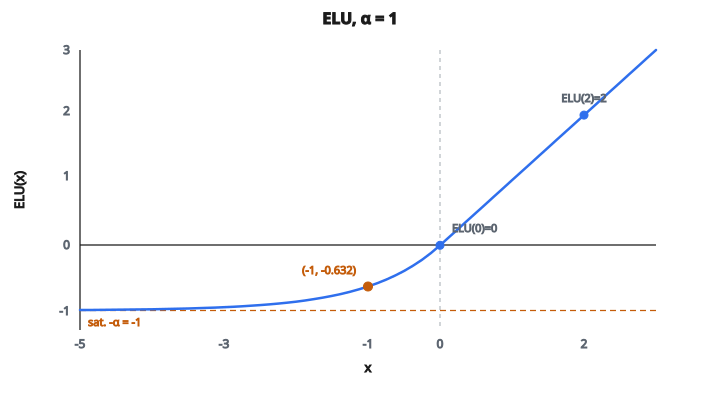

# ELU Activation

## Hai vấn đề của ReLU

ReLU ($\max(0, x)$) đã thay đổi deep learning, nhưng có hai vấn đề:

1. **Neuron chết**: khi đầu vào âm, cả đầu ra lẫn gradient đều bằng không. Neuron có thể chết vĩnh viễn và không bao giờ phục hồi.
2. **Đầu ra trung bình khác không**: ReLU chỉ cho ra không hoặc dương, nên trung bình đầu ra luôn dương. Điều này tạo độ lệch bias có thể làm chậm học ở các lớp sâu hơn.

Leaky ReLU sửa vấn đề neuron chết bằng cách cho phép độ dốc nhỏ với đầu vào âm ($\alpha x$). Nhưng phía âm của Leaky ReLU chỉ là đường thẳng, không xử lý vấn đề lệch trung bình.

## ELU: đường cong mũ cho phía âm

ELU (Exponential Linear Unit) tiếp cận phía âm khác. Thay vì đường thẳng, nó dùng **đường cong mũ** bão hòa mượt tại $-\alpha$:

$$
\text{ELU}(x) = \begin{cases} x & \text{nếu } x > 0 \\ \alpha \cdot (e^x - 1) & \text{nếu } x \leq 0 \end{cases}
$$

Một số giá trị để tạo trực giác (với $\alpha = 1.0$):

* $\text{ELU}(2.0) = 2.0$ (phía dương: đồng nhất)
* $\text{ELU}(0) = 1.0 \cdot (e^0 - 1) = 0$ (liên tục tại không)
* $\text{ELU}(-0.5) = 1.0 \cdot (e^{-0.5} - 1) \approx -0.394$
* $\text{ELU}(-1.0) = 1.0 \cdot (e^{-1} - 1) \approx -0.632$
* $\text{ELU}(-5.0) = 1.0 \cdot (e^{-5} - 1) \approx -0.993$
* $\text{ELU}(-\infty) \to -\alpha = -1.0$

Phía âm cong mượt từ 0 về $-\alpha$ rồi nằm đó.

::: {#fig-132-elu fig-cap="ELU với α = 1: phía dương là đồng nhất, phía âm bão hòa tại −α = −1. Điểm ELU(-1) ≈ -0.632 khớp ví dụ trong bài." fig-alt="Đồ thị ELU với α = 1; ELU(-1) ≈ -0.632, bão hòa tại -1."}
{fig-align="center"}
:::

## Vì sao dạng mũ giúp được

Đường cong mũ có ba lợi ích so với cả ReLU và Leaky ReLU:

**1. Trung bình activation gần không hơn**

Vì ELU cho ra giá trị âm bão hòa tại $-\alpha$, trung bình đầu ra trên một lớp gần không hơn so với ReLU. Điều này quan trọng vì:

* Các lớp có activation trung bình không hội tụ nhanh hơn
* Độ lệch bias từ đầu ra luôn dương của ReLU giống một số hạng bias không mong muốn mà lớp sau phải bù
* Activation trung bình gần không có hiệu ứng tương tự batch normalization, nhưng nằm sẵn trong hàm kích hoạt

**2. Không neuron chết**

Với mọi đầu vào âm $x$, gradient là:

$$
\frac{d}{dx} \text{ELU}(x) = \alpha \cdot e^x
$$

Luôn dương (không bao giờ bằng không), nên gradient luôn chảy. Khác ReLU, neuron không thể chết.

**3. Chuyển tiếp mượt tại không**

ELU liên tục và khả vi mọi nơi, kể cả tại $x = 0$. Không có góc nhọn như ReLU. Đường cong mượt nghĩa là:

* Landscape tối ưu có ít cạnh sắc hơn
* Tối ưu dựa trên gradient ổn định hơn
* Đạo hàm chuyển mượt từ suy giảm mũ sang 1

## Tham số alpha

$\alpha$ điều khiển giá trị bão hòa âm:

* **$\alpha = 1.0$**: lựa chọn phổ biến nhất. Đầu ra bão hòa tại $-1$, khớp tốt với độ dốc 1 của phía dương.
* **$\alpha$ nhỏ hơn** (ví dụ 0.5): đầu ra ít âm hơn, hiệu ứng regularization yếu hơn
* **$\alpha$ lớn hơn** (ví dụ 2.0): đầu ra âm hơn, hiệu ứng đẩy trung bình mạnh hơn

Khi $x \to -\infty$, ELU tiến tới $-\alpha$. Vậy $\alpha$ đặt trực tiếp sàn cho đầu ra âm.

## ELU so với ReLU và Leaky ReLU

Tại $x = -1$ (với $\alpha = 1.0$ cho ELU, $\alpha = 0.01$ cho Leaky ReLU):

* **ReLU**: đầu ra $= 0$, gradient $= 0$
* **Leaky ReLU**: đầu ra $= -0.01$, gradient $= 0.01$
* **ELU**: đầu ra $\approx -0.632$, gradient $\approx 0.368$

Khác biệt chính:

* ReLU tính nhanh nhất (chỉ so sánh) nhưng rủi ro neuron chết
* Leaky ReLU ngăn neuron chết với overhead tính toán tối thiểu, nhưng không giúp lệch trung bình
* ELU ngăn neuron chết **và** đẩy trung bình activation về không, nhưng cần tính $e^x$ nên chậm hơn

## ELU xuất hiện ở đâu

* **Mạng fully connected sâu**: ELU thường hơn ReLU khi không dùng batch normalization, vì nó tự căn trung bình
* **Như khối xây cho SELU**: Scaled ELU (SELU) nhân ELU với một hằng số cụ thể để đạt tính tự chuẩn hóa
* **Bài nhận dạng ảnh**: các paper cho thấy ELU cạnh tranh hoặc hơn ReLU trên CIFAR và ImageNet
* **Nơi cần gradient mượt**: khả vi tại không làm ELU hữu ích khi độ mượt của gradient quan trọng

## Code
```python
import math

def elu(x, alpha=1.0):
    """
    Apply ELU activation to each element.
    """
    return [v if v > 0 else alpha * (math.exp(v) - 1) for v in x]

```

<!-- auto-self-check -->

::: {.callout-note}
## Kiểm tra nhanh
<details>
<summary>Ý chính của bài «ELU Activation» là gì?</summary>
ReLU ($\max(0, x)$) đã thay đổi deep learning, nhưng có hai vấn đề: 1.
</details>
<details>
<summary>Công thức / quan hệ cốt lõi trong bài là gì?</summary>
$$\text{ELU}(x) = \begin{cases} x & \text{nếu } x > 0 \\ \alpha \cdot (e^x - 1) & \text{nếu } x \leq 0 \end{cases}$$
</details>
:::
