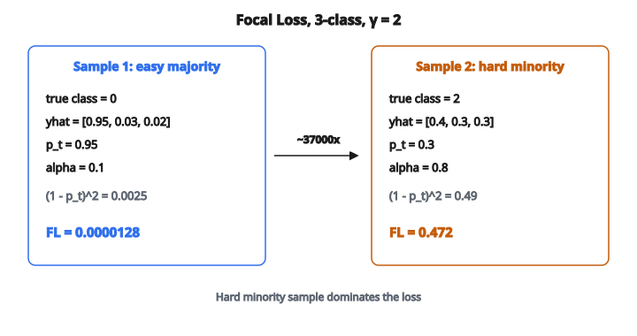

# Focal Loss

## Vấn đề của Cross-Entropy trên dữ liệu mất cân bằng

Phân loại đa lớp thường có phân phối lớp lệch:

* **Object detection:** $10{,}000$ vùng nền cho mỗi vật
* **Text classification:** một số category có nhiều hơn category khác tới $1000$ lần
* **Fine-grained classification:** các subcategory hiếm bị under-represent

Cross-entropy chuẩn lấy trung bình loss trên mọi mẫu. Khi lớp mất cân bằng:

* Lớp dễ, xuất hiện nhiều chiếm gradient
* Lớp hiếm đóng góp ít vào việc học
* Mô hình thiên về lớp đa số

## Focal Loss cho phân loại đa lớp

**Focal loss** mở rộng cross-entropy bằng một modulating factor:

$$
\text{FL}(p_t) = -\alpha_t (1 - p_t)^\gamma \log(p_t)
$$

Với phân loại đa lớp có $C$ lớp và lớp đúng $c^{\ast}$:

$$
\text{FL} = -\alpha_{c^{\ast}} (1 - \hat{y}_{c^{\ast}})^\gamma \log(\hat{y}_{c^{\ast}})
$$

trong đó:

* $\hat{y}_{c^{\ast}}$ là xác suất softmax của lớp đúng
* $\alpha_{c^{\ast}}$ là trọng số của lớp đúng
* $\gamma$ là focusing parameter

## Hai thành phần chính

**1. Class weights (giá trị alpha):**

* Một trọng số cho mỗi lớp
* Thường lấy nghịch đảo tần suất lớp
* Xử lý mất cân bằng lớp trực tiếp

**2. Focusing term:**

* Giảm loss của mẫu đã phân loại tốt
* Không phụ thuộc mẫu thuộc lớp nào
* Xử lý vấn đề “easy example”

Hai thành phần làm việc cùng nhau:

* Lớp hiếm nhận alpha cao hơn
* Mẫu dễ từ mọi lớp bị focusing term hạ trọng số

## Ví dụ số

Phân loại 3 lớp:

**Mẫu 1: dễ, lớp đa số**

* Lớp đúng: $0$ (lớp phổ biến, $\alpha = 0.1$)
* Xác suất dự đoán: $[0.95, 0.03, 0.02]$
* $p_t = 0.95$
* Focusing factor: $(1 - 0.95)^2 = 0.0025$
* Loss: $-0.1 \times 0.0025 \times \log(0.95) = 0.0000128$

**Mẫu 2: khó, lớp thiểu số**

* Lớp đúng: $2$ (lớp hiếm, $\alpha = 0.8$)
* Xác suất dự đoán: $[0.4, 0.3, 0.3]$
* $p_t = 0.3$
* Focusing factor: $(1 - 0.3)^2 = 0.49$
* Loss: $-0.8 \times 0.49 \times \log(0.3) = 0.472$

::: {#fig-55-focal fig-cap="Với $\gamma = 2$: mẫu dễ ($p_t=0.95$, $\alpha=0.1$) có $\mathrm{FL}=0.0000128$; mẫu khó ($p_t=0.3$, $\alpha=0.8$) có $\mathrm{FL}=0.472$ — khoảng $37{,}000$ lần lớn hơn." fig-alt="Hai mau Focal Loss gamma=2: mau de pt=0.95, factor=0.0025, FL=0.0000128; mau kho pt=0.3, factor=0.49, FL=0.472; mau kho dong gop gap khoang 37000 lan."}
{fig-align="center"}
:::

Mẫu khó thuộc lớp thiểu số đóng góp vào loss gấp khoảng $37{,}000$ lần mẫu dễ thuộc lớp đa số.

## Ảnh hưởng của gamma theo độ tin cậy

Focusing factor $(1 - p_t)^\gamma$ thay đổi theo $\gamma$:

**Tại độ tin cậy $0.9$ (đúng và tự tin):**

* $\gamma = 0$: factor $= 1.0$ (không giảm)
* $\gamma = 1$: factor $= 0.1$ (giảm $10$ lần)
* $\gamma = 2$: factor $= 0.01$ (giảm $100$ lần)
* $\gamma = 5$: factor $= 0.00001$ (giảm $100{,}000$ lần)

**Tại độ tin cậy $0.5$ (không chắc):**

* $\gamma = 0$: factor $= 1.0$
* $\gamma = 1$: factor $= 0.5$ (giảm $2$ lần)
* $\gamma = 2$: factor $= 0.25$ (giảm $4$ lần)
* $\gamma = 5$: factor $= 0.03125$ (giảm $32$ lần)

**Tại độ tin cậy $0.1$ (sai và tự tin):**

* $\gamma = 0$: factor $= 1.0$
* $\gamma = 1$: factor $= 0.9$ (giảm rất ít)
* $\gamma = 2$: factor $= 0.81$ (giảm rất ít)
* $\gamma = 5$: factor $= 0.59$ (giảm vừa)

## Đặt trọng số alpha

Các chiến lược phổ biến:

**Nghịch đảo tần suất lớp:**

$$
\alpha_c = \frac{N}{C \cdot N_c}
$$

với $N$ là tổng số mẫu, $N_c$ là số mẫu lớp $c$, $C$ là số lớp.

**Effective number of samples:**

$$
\alpha_c = \frac{1 - \beta}{1 - \beta^{N_c}}
$$

với $\beta \in [0, 1)$ là hyperparameter. Công thức này phản ánh lợi ích giảm dần khi thêm mẫu.

**Trọng số đều:**

* Đặt mọi alpha bằng $1$
* Để focusing term xử lý mất cân bằng
* Đôi khi đủ khi lệch lớp vừa phải

**Chuẩn hóa:**

* Sau khi tính trọng số, chuẩn hóa để tổng bằng $C$ (số lớp)
* Giữ thang loss gần với cross-entropy chuẩn

## So sánh: Cross-Entropy và Focal Loss

Khác biệt khi huấn luyện:

**Cross-entropy:**

* Mọi mẫu đóng góp như nhau (hoặc theo class weight nếu có)
* Mẫu dễ vẫn sinh gradient nhỏ nhưng khác không
* Gradient bị số lượng mẫu dễ chiếm
* Mô hình học nhanh các pattern dễ, rồi cải thiện chậm trên case khó

**Focal loss:**

* Mẫu dễ đóng góp gần như không
* Mẫu khó chiếm gradient
* Mô hình buộc tập trung vào case khó ngay từ đầu
* Có thể tốt hơn trên case khó / hiếm

## Gradient

Gradient của focal loss theo logit của lớp đúng:

$$
\frac{\partial \text{FL}}{\partial z_{c^{\ast}}} = \alpha_{c^{\ast}} \left[ \gamma (1 - p_t)^{\gamma - 1} p_t \log(p_t) + (1 - p_t)^\gamma (p_t - 1) \right]
$$

Tính chất:

* Phức tạp hơn gradient cross-entropy (predicted − true)
* Độ lớn gradient được scale bởi focusing factor
* Mẫu dễ có gradient rất nhỏ
* Mẫu khó có gradient gần với cross-entropy

## Cân nhắc khi cài đặt

**Ổn định số:**

* Tính $\log(p_t)$ cẩn thận khi $p_t$ nhỏ
* Dùng log-softmax để ổn định hơn
* Clip $p_t$ để tránh $\log(0)$

**Khởi tạo:**

* Với focal loss, mô hình chủ yếu thấy mẫu khó ngay từ đầu
* Có thể chỉnh bias ban đầu: đặt bias lớp ra bằng $\log((1 - \pi) / \pi)$ với $\pi$ là prior của lớp hiếm
* Tránh mất ổn định sớm khi huấn luyện

**Batch size:**

* Focal loss giảm effective batch size (ít mẫu đóng góp thực sự)
* Có thể cần batch lớn hơn để ước lượng gradient ổn định

## Khi nào dùng Focal Loss

**Phù hợp:**

* Phân loại mất cân bằng nặng ($1{:}100$ trở lên)
* Dense prediction (object detection, segmentation)
* Khi hard negative mining quá chậm hoặc phức tạp
* Khi chỉ class weight chưa đủ

**Có thể không giúp:**

* Dataset cân bằng
* Khi “mẫu khó” thực ra là nhãn sai
* Dataset rất nhỏ (cần toàn bộ tín hiệu gradient)

## Nguồn gốc và ứng dụng

Focal loss được Lin et al. giới thiệu trong “Focal Loss for Dense Object Detection” (2017):

* Cho detector một giai đoạn (RetinaNet) bắt kịp detector hai giai đoạn
* Bỏ nhu cầu chiến lược sampling phức tạp
* Nay dùng rộng ngoài object detection:
  * Phân tích ảnh y khoa
  * Phát hiện gian lận
  * Phân loại tài liệu
  * Mọi bài phân loại mất cân bằng

## Code
```python
import numpy as np

def focal_loss(p, y, gamma=2.0):
    """
    Compute Focal Loss for binary classification.
    """
    p = np.asarray(p, dtype=float)
    y = np.asarray(y, dtype=float)
    p = np.clip(p, 1e-15, 1 - 1e-15)
    term1 = (1 - p) ** gamma * y * np.log(p)
    term2 = p ** gamma * (1 - y) * np.log(1 - p)
    return float(np.mean(-(term1 + term2)))

```

<!-- auto-self-check -->

::: {.callout-note}
## Kiểm tra nhanh
<details>
<summary>Ý chính của bài «Focal Loss» là gì?</summary>
Phân loại đa lớp thường có phân phối lớp lệch: * **Object detection:** $10{,}000$ vùng nền cho mỗi vật * **Text classification:** một số category có nhiều hơn category khác tới $1000$ lần * **Fine-grained classification:** các subcategory hiếm bị…
</details>
<details>
<summary>Công thức / quan hệ cốt lõi trong bài là gì?</summary>
$$\text{FL}(p_t) = -\alpha_t (1 - p_t)^\gamma \log(p_t)$$
</details>
:::
