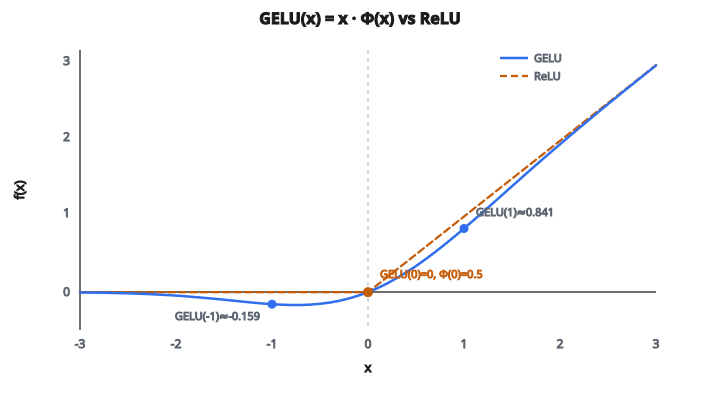

# GELU Activation

## Vì sao cần hàm kích hoạt

Mạng neural không có hàm kích hoạt chỉ là chồng biến đổi tuyến tính. Dù thêm bao nhiêu lớp, cả khối sụp thành một hàm tuyến tính: $y = Wx + b$. Nó không học được đường cong, biên, hay pattern không tầm thường.

Hàm kích hoạt đưa **phi tuyến** vào sau mỗi lớp. Chúng quyết định neuron nào “bắn” và mạnh tới đâu. Lựa chọn hàm kích hoạt ảnh hưởng lớn tới mức độ mạng huấn luyện được và cách nó hành xử.

## ReLU: chuẩn hiện tại

Hàm kích hoạt dùng rộng nhất là **ReLU** (Rectified Linear Unit):

$$
\text{ReLU}(x) = \max(0, x)
$$

* Đầu vào dương đi qua nguyên vẹn
* Đầu vào âm bị gán đúng không
* Đơn giản, nhanh, và hiệu quả trong hầu hết trường hợp

Nhưng ReLU có góc nhọn tại $x = 0$. Đầu ra nhảy từ 0 sang tuyến tính, không có chuyển tiếp mượt. Gradient hoặc là 0 (đầu vào âm) hoặc 1 (đầu vào dương), với gián đoạn tại không.

Điều này gây hai vấn đề:

* **Neuron chết**: nếu đầu vào của neuron luôn âm, gradient luôn bằng 0, nên nó không bao giờ cập nhật. Nó “chết” vĩnh viễn.
* **Gradient không mượt**: chuyển tiếp sắc tại không có thể làm tối ưu kém ổn định hơn

## GELU: một lựa chọn mượt

GELU (Gaussian Error Linear Unit) thay cutoff cứng của ReLU bằng chuyển tiếp **mượt, xác suất**. Công thức:

$$
\text{GELU}(x) = x \cdot \Phi(x)
$$

với $\Phi(x)$ là **hàm phân phối tích lũy (CDF)** của phân phối chuẩn tắc. $\Phi(x)$ trả lời: “Nếu tôi lấy một số ngẫu nhiên từ phân phối chuẩn tắc $N(0,1)$, xác suất nó nhỏ hơn $x$ là bao nhiêu?”

Một số giá trị $\Phi(x)$ để tạo trực giác:

* $\Phi(-3) \approx 0.001$ (gần không)
* $\Phi(-1) \approx 0.159$
* $\Phi(0) = 0.5$ (đúng một nửa)
* $\Phi(1) \approx 0.841$
* $\Phi(3) \approx 0.999$ (gần một)

Vậy GELU nhân mỗi đầu vào $x$ với xác suất một biến ngẫu nhiên Gaussian nhỏ hơn $x$:

* **$x$ dương lớn**: $\Phi(x) \approx 1$, nên $\text{GELU}(x) \approx x$ (đi qua gần như nguyên vẹn)
* **$x$ âm lớn**: $\Phi(x) \approx 0$, nên $\text{GELU}(x) \approx 0$ (bị nén, như ReLU)
* **Gần không**: $\Phi(x) \approx 0.5$, nên đầu ra được scale mượt. Ví dụ, $\text{GELU}(0) = 0 \times 0.5 = 0$

Chuyển từ “nén” sang “cho qua” là **dần**, không đột ngột như ReLU.

## Liên hệ hàm sai số

CDF chuẩn tắc viết được theo **hàm sai số** (erf):

$$
\Phi(x) = \frac{1}{2}\left(1 + \text{erf}\left(\frac{x}{\sqrt{2}}\right)\right)
$$

Thế vào công thức GELU:

$$
\text{GELU}(x) = \frac{1}{2} x \left(1 + \text{erf}\left(\frac{x}{\sqrt{2}}\right)\right)
$$

Hàm sai số $\text{erf}(z)$ là hàm toán chuẩn, đi mượt từ $-1$ tới $+1$:

* $\text{erf}(-\infty) = -1$
* $\text{erf}(0) = 0$
* $\text{erf}(+\infty) = +1$

Nó có trong hầu hết thư viện toán và tính được hiệu quả.

## So sánh GELU với ReLU

Một số giá trị cụ thể để thấy khác biệt:

**Tại $x = -1$:**

* ReLU: $\max(0, -1) = 0$ (không cứng)
* GELU: $-1 \times \Phi(-1) = -1 \times 0.159 = -0.159$ (giá trị âm nhỏ)

**Tại $x = 0$:**

* ReLU: $0$
* GELU: $0 \times 0.5 = 0$

**Tại $x = 1$:**

* ReLU: $1$
* GELU: $1 \times \Phi(1) = 1 \times 0.841 = 0.841$ (hơi nhỏ hơn 1)

**Tại $x = 3$:**

* ReLU: $3$
* GELU: $3 \times \Phi(3) = 3 \times 0.999 \approx 2.996$ (gần như giống)

::: {#fig-35-gelu fig-cap="GELU(x) = x·Φ(x) mượt quanh 0, với Φ(0) = 0.5 nên GELU(0) = 0. GELU(-1) ≈ -0.159 và GELU(1) ≈ 0.841, khác ReLU tại cùng các điểm." fig-alt="GELU so với ReLU; Φ(0)=0.5 nên GELU(0)=0; GELU(-1)≈-0.159, GELU(1)≈0.841."}
{fig-align="center"}
:::

Khác biệt chính:

* GELU cho phép **đầu ra âm nhỏ** với đầu vào âm (cực tiểu khoảng $-0.17$ tại $x \approx -0.75$). ReLU luôn cho ra đúng 0 với đầu vào âm.
* GELU **mượt mọi nơi**. ReLU có gãy tại $x = 0$.
* Với đầu vào dương lớn, cả hai hành xử gần như giống nhau.
* GELU không bao giờ có “neuron chết” vì gradient không bao giờ đúng bằng không với mọi đầu vào hữu hạn.

## Vì sao tính mượt quan trọng

Độ mượt của GELU có hệ quả thực tế khi huấn luyện:

* **Gradient chảy mọi nơi**: ngay cả với đầu vào hơi âm, gradient khác không. Không neuron chết vĩnh viễn.
* **Landscape tối ưu tốt hơn**: đường cong mượt nghĩa là mặt loss có ít cạnh sắc hơn, tối ưu dựa trên gradient ổn định hơn.
* **Giữ thông tin**: tín hiệu hơi âm vẫn mang thông tin. Gán cứng về không (như ReLU) vứt thông tin đó.

## GELU được dùng ở đâu

GELU đã thành **activation chuẩn cho mô hình Transformer**:

* **BERT**: dùng GELU trong các lớp feed-forward (đây là thứ làm GELU phổ biến)
* **GPT-2, GPT-3**: dùng GELU xuyên suốt
* **Vision Transformers (ViT)**: dùng GELU
* **Hầu hết Transformer hiện đại**: mặc định GELU hơn ReLU

Paper GELU gốc (Hendrycks and Gimpel, 2016) cho thấy GELU vượt ReLU một cách nhất quán trên nhiều benchmark, đặc biệt các bài xử lý ngôn ngữ tự nhiên.

## Code
```python
import numpy as np
import math

def gelu(x):
    """
    Compute the Gaussian Error Linear Unit (exact version using erf).
    x: list or np.ndarray
    Return: np.ndarray of same shape (dtype=float)
    """
    x = np.asarray(x, dtype=float)
    erf_vec = np.vectorize(math.erf)
    return 0.5 * x * (1.0 + erf_vec(x / np.sqrt(2.0)))

```

<!-- CROSSLINK_GELU -->

::: {.callout-tip}
## Học tiếp
GELU trong FFN Transformer: [Transformer — FFN](../../architecture-models/Transformer/ffn.qmd). So với ReLU cổ điển: [ReLU Activation](relu-activation.qmd) · [AlexNet ReLU](../../architecture-models/AlexNet/activation-func.qmd).
:::

<!-- auto-self-check -->

::: {.callout-note}
## Kiểm tra nhanh
<details>
<summary>Ý chính của bài «GELU Activation» là gì?</summary>
Mạng neural không có hàm kích hoạt chỉ là chồng biến đổi tuyến tính.
</details>
<details>
<summary>Công thức / quan hệ cốt lõi trong bài là gì?</summary>
$$\text{ReLU}(x) = \max(0, x)$$
</details>
:::
