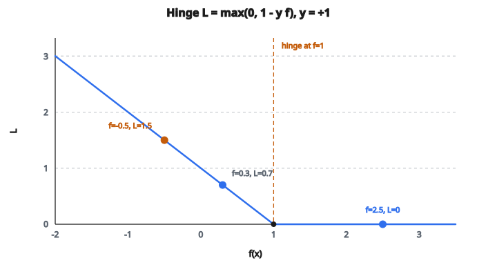

# Hinge Loss (SVM nhị phân)

## Hinge loss là gì

**Hinge loss** là hàm mất mát đứng sau Support Vector Machines (SVM). Nó được thiết kế với một mục tiêu cụ thể: cực đại hóa margin giữa các lớp.

Với phân loại nhị phân, nhãn $y \in \{-1, +1\}$ và đầu ra thô của mô hình $f(x)$ (không phải xác suất):

$$
L = \max(0, 1 - y \cdot f(x))
$$

Công thức trông đơn giản nhưng mã hóa một ý mạnh: mô hình không chỉ cần phân loại đúng, mà còn phải phân loại với độ tin cậy.

## Giải công thức

Số hạng $y \cdot f(x)$ được gọi là **functional margin**:

* Nếu $y = +1$ và $f(x) > 0$: phân loại đúng, margin dương
* Nếu $y = -1$ và $f(x) < 0$: phân loại đúng, margin dương
* Nếu $y = +1$ và $f(x) < 0$: phân loại sai, margin âm
* Nếu $y = -1$ và $f(x) > 0$: phân loại sai, margin âm

Loss $\max(0, 1 - y \cdot f(x))$ khi đó nói rằng:

* Nếu margin $\geq 1$: loss bằng $0$ (đúng và tự tin)
* Nếu margin $< 1$: loss bằng $(1 - \text{margin})$ (phạt độ tin cậy thấp hoặc dự đoán sai)

## Ví dụ số

::: {#fig-33-hinge fig-cap="Với y = +1, L = max(0, 1 − f): f = 2.5 cho L = 0, f = 0.3 cho L = 0.7, f = −0.5 cho L = 1.5. Góc gãy (hinge) nằm tại f = 1." fig-alt="Đường hinge L = max(0, 1 - y f) với y = +1; ba điểm f = 2.5 (L = 0), f = 0.3 (L = 0.7), f = -0.5 (L = 1.5) và góc gãy tại f = 1."}
{fig-align="center"}
:::

**Ví dụ 1: Dự đoán đúng và tự tin**

* Nhãn thật: $y = +1$
* Đầu ra mô hình: $f(x) = 2.5$
* Margin: $1 \cdot 2.5 = 2.5$
* Loss: $\max(0, 1 - 2.5) = \max(0, -1.5) = 0$ (đúng)

**Ví dụ 2: Dự đoán đúng nhưng yếu**

* Nhãn thật: $y = +1$
* Đầu ra mô hình: $f(x) = 0.3$
* Margin: $1 \cdot 0.3 = 0.3$
* Loss: $\max(0, 1 - 0.3) = 0.7$ (bị phạt vì độ tin cậy thấp)

**Ví dụ 3: Dự đoán sai**

* Nhãn thật: $y = +1$
* Đầu ra mô hình: $f(x) = -0.5$
* Margin: $1 \cdot (-0.5) = -0.5$
* Loss: $\max(0, 1 - (-0.5)) = 1.5$ (phạt nặng)

**Ví dụ 4: Dự đoán sai và tự tin**

* Nhãn thật: $y = -1$
* Đầu ra mô hình: $f(x) = 2.0$
* Margin: $(-1) \cdot 2.0 = -2.0$
* Loss: $\max(0, 1 - (-2.0)) = 3.0$ (phạt rất nặng)

## Khái niệm margin

Số $1$ trong hinge loss là **target margin**. Mô hình được yêu cầu:

* Không chỉ đúng dấu
* Mà đúng dấu với độ lớn ít nhất $1$

Vì sao margin quan trọng:

* Một mô hình xuất $f(x) = 0.001$ cho mẫu dương thì về kỹ thuật là đúng
* Nhưng không tự tin; nhiễu nhỏ có thể lật dự đoán
* Hinge loss nói: cần xuất ít nhất $f(x) = 1$

Đây là ý tưởng cốt lõi của SVM: tìm siêu phẳng tách các lớp với margin lớn nhất.

## Đường cong loss

Với mẫu dương ($y = +1$), vẽ loss theo $f(x)$:

**$f(x) = -2.0$:** margin $= -2.0$, loss $= 3.0$
**$f(x) = -1.0$:** margin $= -1.0$, loss $= 2.0$
**$f(x) = 0.0$:** margin $= 0.0$, loss $= 1.0$
**$f(x) = 0.5$:** margin $= 0.5$, loss $= 0.5$
**$f(x) = 1.0$:** margin $= 1.0$, loss $= 0.0$
**$f(x) = 2.0$:** margin $= 2.0$, loss $= 0.0$

Đường cong:

* Tuyến tính với hệ số góc $-1$ khi $f(x) < 1$
* Phẳng tại $0$ khi $f(x) \geq 1$
* Có “bản lề” (góc gãy sắc) tại $f(x) = 1$

Đó là nguồn gốc tên *hinge loss*.

## Gradient

$$
\frac{\partial L}{\partial f(x)} = \begin{cases}
0 & \text{nếu } y \cdot f(x) \geq 1 \\
-y & \text{nếu } y \cdot f(x) < 1
\end{cases}
$$

Tính chất chính:

* **Gradient bằng không khi dự đoán đúng và tự tin**: một khi margin vượt $1$, không còn gradient. Mô hình không cố đẩy margin cao hơn nữa.
* **Gradient hằng số trong các trường hợp còn lại**: gradient luôn là $\pm 1$ (chỉ còn dấu), bất kể dự đoán sai đến đâu.

Tính thưa của gradient giải thích vì sao SVM có “support vector”: chỉ các mẫu gần biên quyết định mới đóng góp vào gradient.

## Hinge loss so với Cross-Entropy

**Hinge loss:**

* Đầu ra là điểm số thô (không bị chặn)
* Loss bằng không khi dự đoán đúng và tự tin
* Không còn gradient khi margin $> 1$
* Từng khúc tuyến tính (không trơn tại bản lề)

**Cross-entropy:**

* Đầu ra là xác suất (qua softmax/sigmoid)
* Loss không bao giờ bằng không (luôn còn một phần gradient)
* Liên tục đẩy về độ tin cậy cao hơn
* Trơn mọi nơi

Hinge loss “thỏa mãn” khi margin đủ lớn. Cross-entropy luôn muốn độ tin cậy cao hơn, kể cả với mẫu đã phân loại đúng và rất tự tin.

## Hinge loss đa lớp

Với $C$ lớp, hinge loss đa lớp là:

$$
L = \sum_{j \neq y} \max(0, 1 + f_j(x) - f_y(x))
$$

trong đó:

* $y$ là lớp đúng
* $f_y(x)$ là điểm số của lớp đúng
* $f_j(x)$ là điểm số của từng lớp sai

Cách đọc: với mỗi lớp sai, phạt nếu điểm số của nó nằm trong khoảng $1$ so với điểm số lớp đúng.

## Squared Hinge Loss

Một biến thể phạt phân loại sai nặng hơn:

$$
L = \max(0, 1 - y \cdot f(x))^2
$$

Khác hinge chuẩn:

* Phạt bình phương khi vi phạm
* Gradient trơn tại điểm bản lề
* Phạt lớn hơn khi dự đoán sai và tự tin
* Đôi khi dùng khi muốn phạt lỗi nặng hơn

## Hinge loss được dùng ở đâu

* **Support Vector Machines**: trường hợp dùng gốc và chủ yếu
* **Bộ phân loại maximum-margin**: mọi mô hình nhằm margin lớn
* **Structured prediction**: các biến thể như structured hinge loss cho gán nhãn chuỗi
* **Mạng nơ-ron**: đôi khi dùng thay cross-entropy, đặc biệt cho phân loại nhị phân
* **Bài toán ranking**: pairwise hinge loss cho learning to rank

## Code
```python
import numpy as np

def hinge_loss(y_true, y_score, margin=1.0, reduction="mean"):
    """
    y_true: 1D array of {-1,+1}
    y_score: 1D array of real scores, same shape as y_true
    reduction: "mean" or "sum"
    Return: float
    """
    y = np.asarray(y_true, float)
    s = np.asarray(y_score, float)
    loss = np.maximum(0.0, margin - y * s)
    return float(loss.mean() if reduction == "mean" else loss.sum())

```

<!-- auto-self-check -->

::: {.callout-note}
## Kiểm tra nhanh
<details>
<summary>Ý chính của bài «Hinge Loss (SVM nhị phân)» là gì?</summary>
**Hinge loss** là hàm mất mát đứng sau Support Vector Machines (SVM).
</details>
<details>
<summary>Công thức / quan hệ cốt lõi trong bài là gì?</summary>
$$L = \max(0, 1 - y \cdot f(x))$$
</details>
:::
