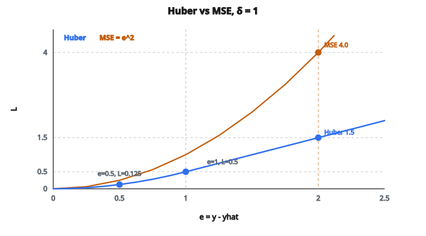

# Huber Loss

## Vấn đề của squared error

Mean Squared Error (MSE) là hàm mất mát phổ biến nhất cho hồi quy:

$$
\text{MSE} = \frac{1}{n} \sum_{i=1}^{n} (y_i - \hat{y}_i)^2
$$

MSE hoạt động tốt khi sai số phân phối chuẩn, nhưng có điểm yếu then chốt: **nhạy với outlier**.

Vì sai số bị bình phương, sai số lớn chiếm ưu thế trong loss:

* Sai số $2$ đóng góp $2^2 = 4$ vào loss
* Sai số $10$ đóng góp $10^2 = 100$ vào loss
* Sai số $100$ đóng góp $100^2 = 10000$ vào loss

Một outlier duy nhất với sai số lớn có thể át toàn bộ loss và kéo mô hình ra khỏi việc khớp tốt phần lớn dữ liệu.

## MAE: cực kia

Mean Absolute Error (MAE) chịu outlier tốt hơn:

$$
\text{MAE} = \frac{1}{n} \sum_{i=1}^{n} |y_i - \hat{y}_i|
$$

Sai số lớn tăng tuyến tính, không phải bậc hai:

* Sai số $2$ đóng góp $2$ vào loss
* Sai số $10$ đóng góp $10$ vào loss
* Sai số $100$ đóng góp $100$ vào loss

MAE bền vững hơn nhiều với outlier. Nhưng nó có vấn đề riêng: gradient hằng số mọi nơi (hoặc $+1$ hoặc $-1$), khiến tối ưu không ổn định gần cực tiểu — nơi ta muốn điều chỉnh nhẹ và chính xác.

## Huber loss: kết hợp hai thế giới

Huber loss kết hợp MSE và MAE. Nó ứng xử như MSE với sai số nhỏ và như MAE với sai số lớn:

$$
L_\delta(y, \hat{y}) = \begin{cases}
\frac{1}{2}(y - \hat{y})^2 & \text{nếu } |y - \hat{y}| \leq \delta \\
\delta \cdot |y - \hat{y}| - \frac{1}{2}\delta^2 & \text{nếu } |y - \hat{y}| > \delta
\end{cases}
$$

với $\delta$ (delta) là ngưỡng kiểm soát lúc chuyển từ bậc hai sang tuyến tính.

**Ý chính:**

* Với sai số nhỏ ($|e| \leq \delta$): dùng squared error, cho gradient mượt để tối ưu chính xác
* Với sai số lớn ($|e| > \delta$): dùng sai số tuyến tính, ngăn outlier át loss

## Hiểu công thức

Đặt $e = y - \hat{y}$ là sai số. Huber loss viết được:

$$
L_\delta(e) = \begin{cases}
\frac{1}{2}e^2 & \text{nếu } |e| \leq \delta \\
\delta |e| - \frac{1}{2}\delta^2 & \text{nếu } |e| > \delta
\end{cases}
$$

**Vì sao công thức phần sai số lớn lại như vậy?**

Số hạng $\delta |e| - \frac{1}{2}\delta^2$ được chọn sao cho:

1. Hàm **liên tục** tại $|e| = \delta$
2. Hàm **khả vi** tại $|e| = \delta$ (chuyển mượt)

Tại biên $|e| = \delta$:

* Khúc bậc hai: $\frac{1}{2}\delta^2$
* Khúc tuyến tính: $\delta \cdot \delta - \frac{1}{2}\delta^2 = \frac{1}{2}\delta^2$

Hai khúc cho cùng một giá trị, đảm bảo liên tục.

## Ví dụ số

::: {#fig-52-huber fig-cap="Với δ = 1: e = 0.5 cho Huber 0.125, e = 1 cho 0.5, e = 2 cho 1.5 trong khi MSE = 4. Huber tăng chậm hơn MSE khi |e| &gt; δ." fig-alt="Đường Huber δ = 1 và MSE = e²; đánh dấu e = 0.5 (Huber 0.125), e = 1 (Huber 0.5), e = 2 (Huber 1.5 so với MSE 4)."}
{fig-align="center"}
:::

Cho $\delta = 1.0$. Một số giá trị loss:

**Sai số nhỏ (vùng bậc hai):**

* Sai số $e = 0$: loss $= \frac{1}{2}(0)^2 = 0$
* Sai số $e = 0.5$: loss $= \frac{1}{2}(0.5)^2 = 0.125$
* Sai số $e = 1.0$: loss $= \frac{1}{2}(1.0)^2 = 0.5$

**Sai số lớn (vùng tuyến tính):**

* Sai số $e = 2.0$: loss $= 1.0 \cdot 2.0 - \frac{1}{2}(1.0)^2 = 2.0 - 0.5 = 1.5$
* Sai số $e = 5.0$: loss $= 1.0 \cdot 5.0 - 0.5 = 4.5$
* Sai số $e = 10.0$: loss $= 1.0 \cdot 10.0 - 0.5 = 9.5$

**So với MSE cùng các sai số:**

* Sai số $e = 2.0$: MSE $= 4.0$, Huber $= 1.5$
* Sai số $e = 5.0$: MSE $= 25.0$, Huber $= 4.5$
* Sai số $e = 10.0$: MSE $= 100.0$, Huber $= 9.5$

Huber loss tăng chậm hơn nhiều với sai số lớn, làm giảm ảnh hưởng của outlier.

## Gradient của Huber loss

Gradient (đạo hàm) của Huber loss theo dự đoán:

$$
\frac{\partial L_\delta}{\partial \hat{y}} = \begin{cases}
-(y - \hat{y}) = \hat{y} - y & \text{nếu } |y - \hat{y}| \leq \delta \\
-\delta \cdot \operatorname{sign}(y - \hat{y}) & \text{nếu } |y - \hat{y}| > \delta
\end{cases}
$$

**Tính chất chính:**

* Với sai số nhỏ: gradient tỉ lệ với sai số (như MSE)
* Với sai số lớn: gradient hằng số $\pm\delta$ (như MAE, nhưng bị chặn)
* Gradient liên tục tại $|e| = \delta$
* Không nổ gradient vì outlier

Gradient bị chặn này khiến Huber loss ổn định hơn khi huấn luyện có outlier.

## Chọn delta

Ngưỡng $\delta$ là hyperparameter phải chọn:

**$\delta$ nhỏ (ví dụ $0.1$):**

* Hầu hết sai số rơi vào vùng tuyến tính
* Ứng xử gần MAE
* Rất bền với outlier
* Có thể quá mạnh khi coi sai số bình thường là outlier

**$\delta$ lớn (ví dụ $10.0$):**

* Hầu hết sai số rơi vào vùng bậc hai
* Ứng xử gần MSE
* Kém bền với outlier hơn
* Tối ưu tốt hơn gần cực tiểu

**Mặc định thường dùng:** $\delta = 1.0$

**Cách chọn:**

* Nhìn thang của biến mục tiêu
* Xác định độ lớn sai số nào nên coi là outlier
* Cross-validate nhiều giá trị

## Huber loss trên một batch

Với một batch $n$ dự đoán, mean Huber loss là:

$$
L = \frac{1}{n} \sum_{i=1}^{n} L_\delta(y_i, \hat{y}_i)
$$

Loss từng mẫu được tính độc lập theo công thức từng khúc, rồi lấy trung bình.

## Khi nào dùng Huber loss

**Trường hợp phù hợp:**

* Hồi quy với outlier tiềm năng ở biến mục tiêu
* Dữ liệu thực nhiễu, một số phép đo có thể hỏng
* Khi muốn bền vững mà không bỏ hoàn toàn sai số lớn
* Reinforcement learning (dùng trong DQN để cập nhật Q-value ổn định)

**Khi MSE có thể tốt hơn:**

* Dữ liệu sạch, không outlier
* Khi sai số lớn nên bị phạt nặng
* Sai số phân phối Gaussian

**Khi MAE có thể tốt hơn:**

* Nhiều outlier hoặc phân phối sai số đuôi nặng
* Khi quan tâm median hơn mean

## Smooth L1 Loss

Trong một số framework (đặc biệt object detection), bạn sẽ gặp **Smooth L1 Loss**, tức Huber loss với $\delta = 1$:

$$
\text{Smooth L1}(e) = \begin{cases}
0.5 e^2 & \text{nếu } |e| < 1 \\
|e| - 0.5 & \text{nếu không}
\end{cases}
$$

Đây đúng là Huber loss. Tên khác đến từ cộng đồng computer vision, được phổ biến bởi bài Fast R-CNN cho hồi quy bounding box.

## Code
```python
import numpy as np

def huber_loss(y_true, y_pred, delta=1.0):
    """
    Compute Huber Loss for regression.
    """
    y_true = np.asarray(y_true, dtype=float)
    y_pred = np.asarray(y_pred, dtype=float)
    e = y_true - y_pred
    abs_e = np.abs(e)
    loss = np.where(abs_e <= delta, 0.5 * e ** 2, delta * (abs_e - 0.5 * delta))
    return float(np.mean(loss))

```

<!-- auto-self-check -->

::: {.callout-note}
## Kiểm tra nhanh
<details>
<summary>Ý chính của bài «Huber Loss» là gì?</summary>
Mean Squared Error (MSE) là hàm mất mát phổ biến nhất cho hồi quy: MSE hoạt động tốt khi sai số phân phối chuẩn, nhưng có điểm yếu then chốt: **nhạy với outlier**.
</details>
<details>
<summary>Công thức / quan hệ cốt lõi trong bài là gì?</summary>
$$\text{MSE} = \frac{1}{n} \sum_{i=1}^{n} (y_i - \hat{y}_i)^2$$
</details>
:::
