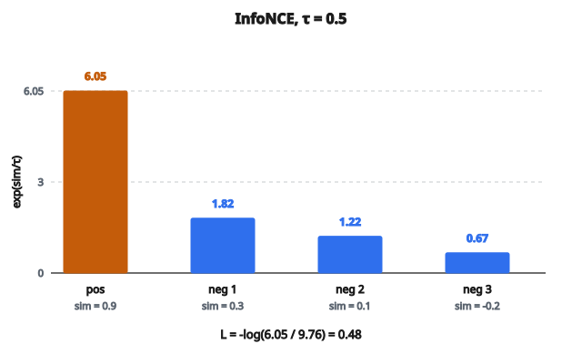

# InfoNCE Loss

## Khung contrastive learning

**InfoNCE** (Information Noise-Contrastive Estimation) là hàm mất mát đứng sau nhiều phương pháp self-supervised learning hiện đại như SimCLR, MoCo và CLIP. Nó học biểu diễn bằng cách đối chiếu cặp dương với các cặp âm.

Thiết lập:

* **Anchor**: mẫu ta muốn học biểu diễn
* **Positive**: mẫu tương đồng với anchor (ví dụ một augmentation khác của cùng ảnh)
* **Negatives**: các mẫu không tương đồng với anchor (ví dụ các ảnh khác trong batch)

Mục tiêu: đưa anchor gần positive và cách xa mọi negative.

## Công thức InfoNCE

Với một anchor có embedding $z$, positive có embedding $z^{+}$, và $N$ negatives có embedding $z^{-}_{1}, \ldots, z^{-}_{N}$:

$$
L = -\log \frac{\exp(\mathrm{sim}(z, z^{+}) / \tau)}{\exp(\mathrm{sim}(z, z^{+}) / \tau) + \sum_{i=1}^{N} \exp(\mathrm{sim}(z, z^{-}_{i}) / \tau)}
$$

với

* $\mathrm{sim}(a, b)$ là hàm tương đồng (thường là cosine similarity hoặc tích vô hướng)
* $\tau$ là tham số temperature
* Mẫu số cộng positive và mọi negative

## Phân tích công thức

Cấu trúc giống softmax cross-entropy:

**Tử số:** độ tương đồng giữa anchor và positive, sau đó lấy mũ
**Mẫu số:** tổng độ tương đồng giữa anchor và MỌI mẫu (positive + negatives), sau đó lấy mũ

Có thể viết lại:

$$
L = -\frac{\mathrm{sim}(z, z^{+})}{\tau} + \log\left(\sum_{k} \exp(\mathrm{sim}(z, z_{k})/\tau)\right)
$$

trong đó $k$ chạy trên positive và mọi negative.

Loss được cực tiểu khi:

* $\mathrm{sim}(z, z^{+})$ lớn (anchor gần positive)
* $\mathrm{sim}(z, z^{-})$ nhỏ với mọi negative (anchor xa các negatives)

## Tham số temperature

Temperature $\tau$ điều khiển độ “khó” của bài contrastive:

**Temperature thấp (ví dụ $0.07$):**

* Phân phối sắc hơn
* Hard negatives chiếm ưu thế trên gradient
* Mô hình phải phân biệt rất cẩn thận
* Có thể không ổn định nếu quá thấp

**Temperature cao (ví dụ $1.0$):**

* Phân phối mềm hơn
* Mọi negative đóng góp đều hơn
* Tối ưu dễ hơn nhưng kém phân biệt

**Giá trị thường dùng:** $0.07$ đến $0.5$

Temperature tối ưu phụ thuộc vào:

* Số lượng negatives
* Độ khó của bài toán
* Số chiều embedding

## Vì sao hiệu quả: góc nhìn lý thuyết thông tin

InfoNCE gắn chặt với mutual information. Loss là một cận dưới của:

$$
I(X; Y) \geq \log(N) - L_{\mathrm{InfoNCE}}
$$

với

* $I(X; Y)$ là mutual information giữa anchor và positive
* $N$ là số negatives cộng $1$

Cực tiểu hóa InfoNCE tức là cực đại hóa một cận dưới của mutual information. Các biểu diễn học được do đó nắm thông tin dùng chung giữa các view khác nhau của cùng dữ liệu.

## Ví dụ số

Xét một anchor với 1 positive và 3 negatives.

Độ tương đồng (trước khi chia temperature):

* Anchor với positive: $0.9$
* Anchor với negative 1: $0.3$
* Anchor với negative 2: $0.1$
* Anchor với negative 3: $-0.2$

Với temperature $= 0.5$:

Độ tương đồng đã chia: $1.8$, $0.6$, $0.2$, $-0.4$

Mũ: $\exp(1.8) = 6.05$, $\exp(0.6) = 1.82$, $\exp(0.2) = 1.22$, $\exp(-0.4) = 0.67$

Tổng mẫu số: $6.05 + 1.82 + 1.22 + 0.67 = 9.76$

$$
L = -\log(6.05 / 9.76) = -\log(0.62) = 0.48
$$

::: {#fig-54-infonce fig-cap="InfoNCE với τ = 0.5: L = −log(6.05/9.76) = 0.48. Cột positive (sim = 0.9) chiếm 6.05 trong tổng mẫu số 9.76." fig-alt="Bốn cột exp(sim/τ) với sim = 0.9, 0.3, 0.1, −0.2 và τ = 0.5; cột positive 6.05 nổi bật so với 1.82, 1.22, 0.67; L = −log(6.05/9.76) = 0.48."}
{fig-align="center"}
:::

Nếu positive tương đồng hơn (ví dụ $0.99$ thay vì $0.9$), loss sẽ thấp hơn.

## Tầm quan trọng của negatives

InfoNCE cần nhiều negatives mới học tốt:

**Ít negatives (ví dụ $10$):**

* Bài toán quá dễ
* Xác suất chọn đúng positive ngẫu nhiên là $10\%$
* Mô hình có thể thành công mà không học biểu diễn tốt

**Nhiều negatives (ví dụ $65{,}536$ trong MoCo):**

* Bài toán khó hơn
* Xác suất chọn đúng positive ngẫu nhiên là $0.0015\%$
* Mô hình phải học đặc trưng có nghĩa để phân biệt

**Thế khó của batch size:**

* Nhiều negatives hơn = học tốt hơn
* Nhưng batch lớn thì đắt
* Cách giải: memory bank (MoCo), huấn luyện batch lớn (SimCLR)

## InfoNCE đối xứng

Nhiều cài đặt (như SimCLR) tính loss đối xứng:

Với một cặp $(i, j)$ gồm hai view đã tăng cường:

* Tính loss với $i$ làm anchor, $j$ làm positive
* Tính loss với $j$ làm anchor, $i$ làm positive
* Trung bình hai loss

Như vậy cả hai view đều học biểu diễn tốt như nhau.

## Gradient

Gradient theo embedding của anchor $z$:

$$
\frac{\partial L}{\partial z} = -\frac{1}{\tau}\left(z^{+} - \sum_{k} p_{k} \cdot z_{k}\right)
$$

trong đó $p_{k}$ là xác suất softmax của mẫu $k$.

Diễn giải:

* Kéo anchor về phía positive
* Đẩy anchor ra xa trung bình có trọng số của mọi mẫu
* Mẫu có độ tương đồng cao hơn (hard negatives) bị đẩy mạnh hơn

## InfoNCE so với Triplet Loss

**Triplet loss:**

* Dùng một positive và một negative cho mỗi anchor
* Dựa trên margin: chỉ quan tâm thứ tự tương đối
* Cần mining cẩn thận các triplet khó

**InfoNCE:**

* Dùng một positive và nhiều negatives
* Dựa trên softmax: xét mọi negative cùng lúc
* Gradient ổn định hơn, ít cần mining
* Mở rộng tốt hơn khi batch size tăng

InfoNCE thường vượt triplet loss khi có nhiều negatives.

## Các cài đặt phổ biến

**SimCLR:**

* Batch $N$ ảnh tạo ra $2N$ view đã tăng cường
* Mỗi view có 1 positive (cặp của nó) và $2(N-1)$ negatives (mọi view còn lại)
* Cần batch size lớn ($4096+$)

**MoCo:**

* Dùng encoder cập nhật momentum để giữ một hàng đợi negatives lớn
* Hàng đợi lưu $65{,}536$ embedding từ các batch gần đây
* Làm việc được với batch nhỏ ($256$)

**CLIP:**

* Khớp ảnh với mô tả văn bản
* Dùng InfoNCE trên các cặp ảnh–văn bản
* Huấn luyện trên $400$ triệu cặp

## InfoNCE được dùng ở đâu

* **Self-supervised visual learning**: SimCLR, MoCo, BYOL, SwAV
* **Học đa phương thức**: CLIP (ảnh + văn bản), ALIGN
* **Học audio–thị giác**: khớp audio với khung hình video
* **Sentence embeddings**: học biểu diễn văn bản
* **Reinforcement learning**: contrastive predictive coding cho biểu diễn trạng thái

## Code
```python
import numpy as np

def info_nce_loss(Z1, Z2, temperature=0.1):
    """
    Compute InfoNCE Loss for contrastive learning.
    """
    Z1 = np.asarray(Z1, dtype=float)
    Z2 = np.asarray(Z2, dtype=float)
    S = np.dot(Z1, Z2.T) / temperature
    S_max = np.max(S, axis=1, keepdims=True)
    S_stable = S - S_max
    exp_S = np.exp(S_stable)
    sum_exp_S = np.sum(exp_S, axis=1)
    positive_similarities = np.diag(S_stable)
    losses = -positive_similarities + np.log(sum_exp_S)
    return float(np.mean(losses))

```

<!-- auto-self-check -->

::: {.callout-note}
## Kiểm tra nhanh
<details>
<summary>Ý chính của bài «InfoNCE Loss» là gì?</summary>
**InfoNCE** (Information Noise-Contrastive Estimation) là hàm mất mát đứng sau nhiều phương pháp self-supervised learning hiện đại như SimCLR, MoCo và CLIP.
</details>
<details>
<summary>Công thức / quan hệ cốt lõi trong bài là gì?</summary>
$$L = -\log \frac{\exp(\mathrm{sim}(z, z^{+}) / \tau)}{\exp(\mathrm{sim}(z, z^{+}) / \tau) + \sum_{i=1}^{N} \exp(\mathrm{sim}(z, z^{-}_{i}) / \tau)}$$
</details>
:::
