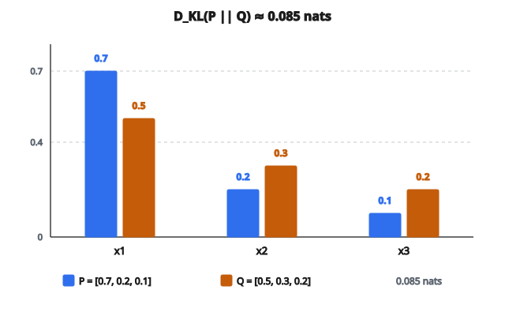

# KL Divergence

## KL Divergence là gì

**Kullback–Leibler (KL) divergence** đo mức một phân phối xác suất khác phân phối kia. Nó trả lời: “Nếu dùng phân phối $Q$ để xấp xỉ phân phối $P$, tôi mất bao nhiêu thông tin?”

$$
D_{\mathrm{KL}}(P \parallel Q) = \sum_x P(x) \log \frac{P(x)}{Q(x)}
$$

với

* $P$ là phân phối “thật” hoặc tham chiếu
* $Q$ là phân phối “xấp xỉ” hoặc của mô hình
* Tổng lấy trên mọi kết cục $x$ có thể

## Đọc công thức

Phân tích $P(x) \log \frac{P(x)}{Q(x)}$:

**Tỉ số $\frac{P(x)}{Q(x)}$:**

* Nếu $P(x) > Q(x)$: tỉ số $> 1$, log dương (ta đánh giá thấp kết cục này)
* Nếu $P(x) = Q(x)$: tỉ số bằng $1$, log bằng $0$ (khớp hoàn toàn)
* Nếu $P(x) < Q(x)$: tỉ số $< 1$, log âm (ta đánh giá cao kết cục này)

**Trọng số theo $P(x)$:**

* Sai số tại mỗi điểm được nhân với xác suất thật
* Sai trên kết cục xác suất cao thì quan trọng hơn
* Sai trên kết cục xác suất thấp đóng góp ít

## Tính chất chính của KL Divergence

**Không âm:**

$$
D_{\mathrm{KL}}(P \parallel Q) \geq 0
$$

Bằng không khi và chỉ khi $P = Q$ mọi nơi.

**Không đối xứng:**

$$
D_{\mathrm{KL}}(P \parallel Q) \neq D_{\mathrm{KL}}(Q \parallel P)
$$

KL divergence KHÔNG phải metric khoảng cách. Thứ tự có ý nghĩa.

**Không bị chặn:**

* Nếu $Q(x) = 0$ tại chỗ $P(x) > 0$: $\log \frac{P(x)}{0} = \infty$
* KL divergence có thể vô hạn nếu $Q$ gán xác suất không cho một kết cục mà $P$ cho là có thể

## Ví dụ số

Phân phối thật $P$: $[0.7,\ 0.2,\ 0.1]$
Phân phối mô hình $Q$: $[0.5,\ 0.3,\ 0.2]$

$$
D_{\mathrm{KL}}(P \parallel Q) = 0.7 \log \frac{0.7}{0.5} + 0.2 \log \frac{0.2}{0.3} + 0.1 \log \frac{0.1}{0.2}
$$

Từng hạng tử:

* $0.7 \log(1.4) = 0.7 \times 0.336 = 0.235$
* $0.2 \log(0.667) = 0.2 \times (-0.405) = -0.081$
* $0.1 \log(0.5) = 0.1 \times (-0.693) = -0.069$

Tổng: $0.235 - 0.081 - 0.069 = 0.085$

Đây là nats (log tự nhiên). Để ra bit, dùng $\log_2$:
$D_{\mathrm{KL}} \approx 0.085 / \ln(2) \approx 0.123$ bits

::: {#fig-57-kl fig-cap="D_KL(P ∥ Q) ≈ 0.085 nats với P = [0.7, 0.2, 0.1] và Q = [0.5, 0.3, 0.2]. Hạng tử tại x có P lớn (0.7) đóng góp nhiều nhất." fig-alt="Ba nhóm cột P = [0.7, 0.2, 0.1] và Q = [0.5, 0.3, 0.2]; D_KL(P ∥ Q) ≈ 0.085 nats."}
{fig-align="center"}
:::

## Forward KL và Reverse KL

**Forward KL: $D_{\mathrm{KL}}(P \parallel Q)$**

* Cực tiểu hóa để $Q$ “phủ” $P$
* Phạt $Q(x) = 0$ tại chỗ $P(x) > 0$ (phạt vô hạn)
* Cho $Q$ kiểu “mean-seeking” hay “mode-covering”
* $Q$ thường rộng hơn mức cần thiết

**Reverse KL: $D_{\mathrm{KL}}(Q \parallel P)$**

* Cực tiểu hóa để $Q$ “nằm trong” $P$
* Phạt $Q(x) > 0$ tại chỗ $P(x) = 0$
* Cho $Q$ kiểu “mode-seeking”
* $Q$ dễ sụp vào một mode của $P$

Phân biệt này then chốt trong variational inference và mô hình sinh.

## Phân phối liên tục

Với mật độ xác suất liên tục $p$ và $q$:

$$
D_{\mathrm{KL}}(p \parallel q) = \int p(x) \log \frac{p(x)}{q(x)}\, dx
$$

**Trường hợp đặc biệt: hai Gaussian**

Với $p = \mathcal{N}(\mu_1, \sigma_1^2)$ và $q = \mathcal{N}(\mu_2, \sigma_2^2)$:

$$
D_{\mathrm{KL}}(p \parallel q) = \log \frac{\sigma_2}{\sigma_1} + \frac{\sigma_1^2 + (\mu_1 - \mu_2)^2}{2\sigma_2^2} - \frac{1}{2}
$$

Biểu thức đóng này dùng nhiều trong variational autoencoders (VAEs).

## KL Divergence và Cross-Entropy

KL divergence liên hệ với cross-entropy và entropy:

$$
D_{\mathrm{KL}}(P \parallel Q) = H(P, Q) - H(P)
$$

với

* $H(P, Q) = -\sum_x P(x) \log Q(x)$ là cross-entropy
* $H(P) = -\sum_x P(x) \log P(x)$ là entropy của $P$

Vì $H(P)$ không đổi theo $Q$:

* Cực tiểu hóa KL divergence $\equiv$ cực tiểu hóa cross-entropy
* Đó là lý do cross-entropy loss huấn luyện mô hình khớp phân phối dữ liệu

## Gradient

Với mô hình tham số $Q_{\theta}$:

$$
\frac{\partial D_{\mathrm{KL}}}{\partial \theta} = -\sum_x P(x) \frac{1}{Q_{\theta}(x)} \frac{\partial Q_{\theta}(x)}{\partial \theta}
$$

Điều này cho thấy:

* Gradient được trọng số bởi $P(x)/Q_{\theta}(x)$
* Gradient lớn tại chỗ $Q$ đánh giá thấp $P$
* Mô hình bị đẩy tăng xác suất nơi hiện đang quá thấp

## KL Divergence được dùng ở đâu

**Variational Autoencoders (VAEs):**

* Phân phối ẩn $q(z|x)$ cần khớp prior $p(z)$
* Hạng tử KL trong ELBO: $D_{\mathrm{KL}}(q(z|x) \parallel p(z))$

**Knowledge distillation:**

* Mạng student cần khớp dự đoán mềm của teacher
* Cực tiểu hóa KL divergence giữa đầu ra student và teacher

**Reinforcement learning (tối ưu policy):**

* Ràng cập nhật policy: $D_{\mathrm{KL}}(\pi_{\mathrm{old}} \parallel \pi_{\mathrm{new}}) < \delta$
* Dùng trong TRPO, PPO

**Lý thuyết thông tin:**

* Đo mất thông tin khi nén
* Định lượng surprise hay tính bất ngờ

**Language models:**

* Huấn luyện: cross-entropy loss (tương đương forward KL)
* Đánh giá: perplexity (cross-entropy mũ hóa)

## Ổn định số

Tính KL divergence trực tiếp có thể gây lỗi:

* Chia cho không nếu $Q(x) = 0$
* Log của không nếu một trong hai phân phối bằng không

Cách xử lý:

* Cộng $\epsilon$ nhỏ vào cả hai phân phối trước khi tính
* Tính trên không gian log: $\log P(x) - \log Q(x)$
* Dùng hàm thư viện đã xử lý các trường hợp biên

## Code
```python
import numpy as np

def kl_divergence(p, q, eps=1e-12):
    """
    Compute KL Divergence D_KL(P || Q).
    """
    p = np.asarray(p, dtype=float)
    q = np.asarray(q, dtype=float)
    q_stable = q + eps
    kl = 0.0
    for i in range(len(p)):
        if p[i] > 0:
            kl += p[i] * np.log(p[i] / q_stable[i])
    return float(kl)

```

<!-- CROSSLINK_KL -->

::: {.callout-tip}
## Học tiếp
KL trong VAE (regularize posterior): [VAE — KL Divergence](../../architecture-models/VAE/kl-divergence.qmd) · [ELBO](../../architecture-models/VAE/elbo.qmd).
:::
