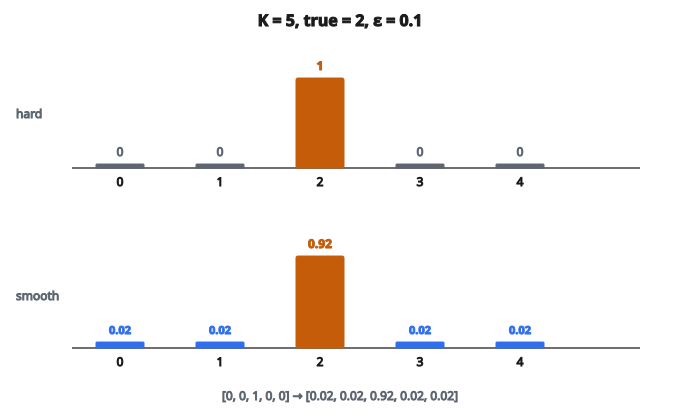

# Label Smoothing Loss

## Vấn đề của nhãn cứng

Phân loại chuẩn dùng nhãn one-hot:

* Lớp đúng: $1$
* Mọi lớp khác: $0$

Ví dụ phân loại $5$ lớp với lớp đúng là $2$:

* Nhãn cứng: $[0,\ 0,\ 1,\ 0,\ 0]$

Cross-entropy với nhãn cứng đẩy mô hình:

* Dự đoán xác suất $1.0$ cho lớp đúng
* Dự đoán xác suất $0.0$ cho mọi lớp khác

Điều này gây ra các vấn đề:

**Overconfidence:** Mô hình trở nên cực kỳ tự tin, xuất ra dự đoán kiểu $[0.001,\ 0.001,\ 0.997,\ 0.001,\ 0.000]$. Sự tự tin này hiếm khi có cơ sở.

**Hiệu chỉnh kém:** Độ tin của mô hình không khớp độ chính xác. Một dự đoán tin $95\%$ có thể chỉ đúng $80\%$ số lần.

**Nhạy với nhiễu:** Nếu nhãn có lỗi, mô hình cố khớp mạnh các nhãn sai.

## Label smoothing làm gì

**Label smoothing** thay nhãn cứng bằng nhãn mềm:

$$
y_{\mathrm{smooth}} = (1 - \epsilon) \cdot y_{\mathrm{hard}} + \frac{\epsilon}{K}
$$

với

* $\epsilon$ là tham số smoothing (thường $0.1$)
* $K$ là số lớp
* $y_{\mathrm{hard}}$ là vector one-hot gốc

$$
y_k^{\mathrm{smooth}} =
\begin{cases}
1 - \epsilon + \epsilon/K & \text{nếu } k = c, \\
\epsilon/K & \text{nếu } k \neq c.
\end{cases}
$$

## Ví dụ số

Phân loại $5$ lớp, lớp đúng $= 2$, smoothing $= 0.1$:

**Nhãn cứng:** $[0,\ 0,\ 1,\ 0,\ 0]$

**Nhãn đã làm mượt:**

* Lớp đúng: $1 - 0.1 + 0.1/5 = 0.92$
* Các lớp khác: $0.1/5 = 0.02$
* Kết quả: $[0.02,\ 0.02,\ 0.92,\ 0.02,\ 0.02]$

::: {#fig-134-label-smooth fig-cap="K = 5, lớp đúng = 2, ε = 0.1 cho nhãn mượt [0.02, 0.02, 0.92, 0.02, 0.02]. Lớp đúng nhận 1 − ε + ε/K = 0.92, các lớp còn lại nhận ε/K = 0.02." fig-alt="Hai hàng năm cột: nhãn cứng [0, 0, 1, 0, 0] và nhãn mượt [0.02, 0.02, 0.92, 0.02, 0.02] với K = 5, lớp đúng = 2, ε = 0.1."}
{fig-align="center"}
:::

Mô hình giờ được khuyến khích:

* Dự đoán khoảng $92\%$ cho lớp đúng (không phải $100\%$)
* Dự đoán khoảng $2\%$ cho các lớp khác (không phải $0\%$)

## Hàm mất mát

Label smoothing sửa cross-entropy bằng cách dùng nhãn mềm:

$$
L = -\sum_{k=1}^{K} y_k^{\mathrm{smooth}} \log(\hat{y}_k)
$$

Khai triển:

$$
L = (1 - \epsilon) \cdot \bigl[-\log(\hat{y}_c)\bigr] + \epsilon \cdot \left[-\frac{1}{K}\sum_{k=1}^{K} \log(\hat{y}_k)\right]
$$

Đây là:

* $(1 - \epsilon)$ lần cross-entropy gốc
* Cộng $\epsilon$ lần entropy của phân phối dự đoán (với target đều)

Hạng tử thứ hai đẩy dự đoán về phân phối đều, chống overconfidence.

## Vì sao hiệu quả

**Hiệu ứng regularization:**

* Mô hình không thể đạt loss bằng không (target không còn one-hot)
* Ngăn logits tăng không bị chặn
* Đóng vai trò weight decay ẩn trên lớp cuối

**Hiệu chỉnh tốt hơn:**

* Dự đoán ít cực đoan hơn
* Độ tin phản ánh độ chính xác thực tế tốt hơn
* Quan trọng với ứng dụng mà độ tin có ý nghĩa (y khoa, xe tự hành)

**Bền với nhiễu nhãn:**

* Mô hình không cố khớp bất kỳ nhãn đơn nào với độ tin $100\%$
* Nhãn nhiễu ảnh hưởng ít hơn

**Tổng quát hóa tốt hơn:**

* Thường cho cải thiện độ chính xác nhỏ nhưng ổn định
* Đặc biệt hữu ích với mô hình lớn dễ overfitting

## Chọn tham số smoothing

Tham số smoothing $\epsilon$ điều khiển độ mềm của nhãn:

**$\epsilon = 0$:** Không smoothing, nhãn cứng chuẩn
**$\epsilon = 0.1$:** Giá trị điển hình, smoothing nhẹ
**$\epsilon = 0.2$:** Smoothing mạnh hơn, regularization nhiều hơn
**$\epsilon = 1/K$:** Nhãn đều, mô hình không học được danh tính lớp

Thực hành phổ biến:

* Bắt đầu với $\epsilon = 0.1$
* Chỉnh theo hiệu năng validation
* $\epsilon$ cao hơn khi nhãn nhiễu hơn hoặc khi overfitting

## Ảnh hưởng lên dự đoán

Không có label smoothing:

* Logits có thể rất lớn
* Dự đoán cuối cụm gần $0$ và $1$
* Mô hình overconfident

Có label smoothing:

* Logits ở mức vừa
* Dự đoán cuối ít cực đoan hơn
* Độ tin được hiệu chỉnh tốt hơn

Ví dụ dự đoán cho một mẫu:

**Không smoothing:** $[0.001,\ 0.002,\ 0.995,\ 0.001,\ 0.001]$
**Có smoothing:** $[0.03,\ 0.04,\ 0.88,\ 0.03,\ 0.02]$

Cả hai đều dự đoán lớp $2$, nhưng bản đã làm mượt ít cực đoan hơn.

## Gradient

Gradient theo logits đổi một chút:

**Không smoothing (lớp đúng):**

$$
\frac{\partial L}{\partial z_c} = \hat{y}_c - 1
$$

**Có smoothing (lớp đúng):**

$$
\frac{\partial L}{\partial z_c} = \hat{y}_c - (1 - \epsilon + \epsilon/K)
$$

**Các lớp khác:**

$$
\frac{\partial L}{\partial z_j} = \hat{y}_j - \epsilon/K
$$

Khác biệt then chốt: có smoothing, gradient của các lớp không đúng khác không. Mô hình nhận một tín hiệu nhỏ đẩy dự đoán các lớp khác ra xa số không.

## Label smoothing so với temperature scaling

Cả hai đều ảnh hưởng độ tin của dự đoán, nhưng khác cách:

**Label smoothing:**

* Áp dụng khi huấn luyện
* Đổi những gì mô hình học
* Ảnh hưởng cả độ chính xác lẫn hiệu chỉnh
* Hiệu ứng bền

**Temperature scaling:**

* Áp dụng sau huấn luyện (lúc suy luận)
* Chia logits cho temperature trước softmax
* Chỉ ảnh hưởng hiệu chỉnh, không đổi độ chính xác
* Chỉnh được sau thực tế

Có thể kết hợp: huấn luyện với label smoothing, rồi tinh chỉnh hiệu chỉnh bằng temperature scaling.

## Label smoothing được dùng ở đâu

* **Phân loại ảnh**: chuẩn trong kiến trúc hiện đại (EfficientNet, ViT)
* **Dịch máy**: hữu ích với từ vựng lớn (nhiều lớp)
* **Nhận dạng tiếng nói**: giảm overconfidence trong bản phiên âm
* **Knowledge distillation**: nhãn mềm từ teacher gần với label smoothing
* **Mọi bài phân loại mà hiệu chỉnh quan trọng**

Không khuyến nghị khi:

* Nhãn tin cậy $100\%$ (ví dụ dữ liệu tổng hợp)
* Cần phân biệt các dự đoán đúng có độ tin cao
* Tập dữ liệu rất nhỏ (regularization có thể hại)

## Code
```python
import math

def label_smoothing_loss(predictions, target, epsilon):
    """
    Compute cross-entropy loss with label smoothing.
    """
    K = len(predictions)
    loss = 0.0
    for i in range(K):
        q = (1.0 - epsilon + epsilon / K) if i == target else (epsilon / K)
        loss -= q * math.log(predictions[i])
    return loss

```
