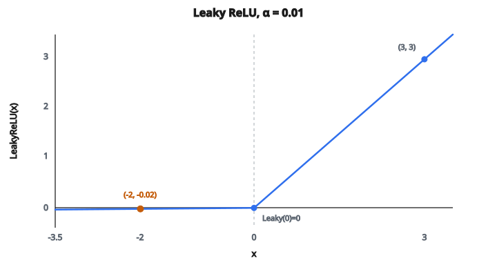

# Leaky ReLU (với α)

## Vấn đề neuron chết

ReLU cho ra đúng không với mọi đầu vào âm:

$$
\text{ReLU}(x) = \max(0, x)
$$

Nghĩa là nếu pre-activation của một neuron âm với mọi mẫu huấn luyện, gradient của nó luôn bằng không. Neuron không bao giờ cập nhật. Nó chết vĩnh viễn và không đóng góp gì cho mạng.

Điều này xảy ra thường hơn ta nghĩ:

* Một bước cập nhật gradient lớn có thể đẩy bias âm đến mức pre-activation luôn dưới không
* Với learning rate cao, nhiều neuron có thể chết ngay những bước huấn luyện đầu
* Một khi đã chết, không có cách phục hồi vì gradient đúng bằng không

## Leaky ReLU: một sửa đơn giản

Leaky ReLU sửa phía âm để có độ dốc nhỏ thay vì phẳng tại không:

$$
\text{LeakyReLU}(x) = \begin{cases} x & \text{nếu } x \geq 0 \\ \alpha x & \text{nếu } x < 0 \end{cases}
$$

* Với đầu vào dương, nó hành xử đúng như ReLU: đầu ra bằng đầu vào
* Với đầu vào âm, nó nhân với một hằng số nhỏ $\alpha$ (thường 0.01)

Một số ví dụ với $\alpha = 0.01$:

* $\text{LeakyReLU}(3.0) = 3.0$
* $\text{LeakyReLU}(0) = 0$
* $\text{LeakyReLU}(-2.0) = -0.02$
* $\text{LeakyReLU}(-100) = -1.0$

“Rò” nhỏ nhưng then chốt. Thay vì chặn hoàn toàn tín hiệu âm, nó cho một lượng rất nhỏ đi qua.

::: {#fig-23-leaky-relu fig-cap="Leaky ReLU với α = 0.01: phía dương là đồng nhất, phía âm có độ dốc 0.01. Hai điểm LeakyReLU(-2) = -0.02 và LeakyReLU(3) = 3 khớp ví dụ trong bài." fig-alt="Đồ thị Leaky ReLU với α = 0.01; điểm (-2, -0.02) và (3, 3)."}
{fig-align="center"}
:::

## Vai trò của alpha

Tham số $\alpha$ điều khiển độ dốc phía âm:

* $\alpha = 0$: đây là ReLU chuẩn. Không rò chút nào.
* $\alpha = 0.01$: mặc định phổ biến nhất. Đầu vào âm bị co 100 lần.
* $\alpha = 0.1$ hoặc $0.2$: rò lớn hơn. Dùng khi muốn gradient chảy nhiều hơn ở phía âm.
* $\alpha = 1$: hàm thành $f(x) = x$ (đồng nhất). Không còn activation.
* $\alpha > 1$: phía âm dốc hơn phía dương. Ít gặp nhưng hợp lệ.

Ý then chốt: **chỉ cần $\alpha \neq 0$, không neuron nào chết được.** Dù pre-activation âm, luôn có gradient khác không ($\alpha$), nên trọng số vẫn cập nhật được.

## Gradient

Đạo hàm của Leaky ReLU là:

$$
\frac{d}{dx} \text{LeakyReLU}(x) = \begin{cases} 1 & \text{nếu } x \geq 0 \\ \alpha & \text{nếu } x < 0 \end{cases}
$$

So với ReLU, đạo hàm phía âm đúng bằng 0. Với Leaky ReLU, đạo hàm phía âm là $\alpha$, nhỏ nhưng khác không. Khi lan truyền ngược:

* Vùng dương: gradient đi qua đủ mạnh (nhân với 1)
* Vùng âm: gradient bị giảm hệ số $\alpha$ (ví dụ 0.01) nhưng vẫn chảy

Nghĩa là gradient luôn tới được mọi neuron, bất kể dấu của đầu vào.

## Parametric ReLU (PReLU)

Mở rộng tự nhiên: thay vì cố định $\alpha$ như hằng số, biến nó thành **tham số học được**. Đó là **PReLU** (Parametric ReLU):

$$
\text{PReLU}(x) = \begin{cases} x & \text{nếu } x \geq 0 \\ \alpha x & \text{nếu } x < 0 \end{cases}
$$

Công thức giống hệt, nhưng $\alpha$ giờ được học khi huấn luyện qua lan truyền ngược, giống trọng số và bias. Mạng có thể tìm độ dốc tối ưu cho từng lớp (thậm chí từng neuron).

* Nếu $\alpha$ tối ưu gần 0, PReLU học cách hành xử như ReLU
* Nếu $\alpha$ tối ưu gần 1, lớp học gần như tuyến tính
* Trong thực tế, $\alpha$ học được thường nằm giữa 0.1 và 0.3

## Leaky ReLU xuất hiện ở đâu

* **GAN (Generative Adversarial Networks)**: Leaky ReLU là activation chuẩn cho mạng discriminator. Paper DCGAN khuyến nghị $\alpha = 0.2$ cho discriminator.
* **Object detection**: các kiến trúc như YOLO dùng Leaky ReLU
* **Mọi mạng sâu lo neuron chết**: nếu sau huấn luyện nhiều neuron có đầu ra bằng không, chuyển từ ReLU sang Leaky ReLU là sửa dễ nhất
* **Như một chẩn đoán**: nếu Leaky ReLU vượt trội rõ so với ReLU trên bài của bạn, đó là dấu hiệu neuron chết đang hại hiệu năng

## Code
```python
import numpy as np

def leaky_relu(x, alpha=0.01):
    """
    Vectorized Leaky ReLU implementation.
    """
    x = np.asarray(x, dtype=float)
    return np.where(x >= 0, x, alpha * x)

```

<!-- auto-self-check -->

::: {.callout-note}
## Kiểm tra nhanh
<details>
<summary>Ý chính của bài «Leaky ReLU (với α)» là gì?</summary>
ReLU cho ra đúng không với mọi đầu vào âm: Nghĩa là nếu pre-activation của một neuron âm với mọi mẫu huấn luyện, gradient của nó luôn bằng không.
</details>
<details>
<summary>Công thức / quan hệ cốt lõi trong bài là gì?</summary>
$$\text{ReLU}(x) = \max(0, x)$$
</details>
:::
