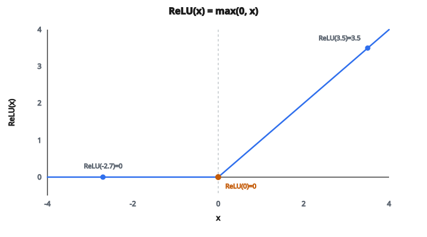

# ReLU Activation

## Hàm kích hoạt làm gì

Mạng neural được ghép từ các lớp biến đổi tuyến tính: nhân với ma trận trọng số, cộng bias. Vấn đề là xếp chồng các hàm tuyến tính vẫn chỉ cho một hàm tuyến tính. Hai lớp không có activation:

$$
y = W_2(W_1 x + b_1) + b_2 = (W_2 W_1) x + (W_2 b_1 + b_2)
$$

Đây vẫn chỉ là $y = Ax + c$, một hàm tuyến tính duy nhất. Dù xếp bao nhiêu lớp, mạng chỉ học được quan hệ tuyến tính. Nó không thể học phân loại ảnh, hiểu ngôn ngữ, hay xấp xỉ các pattern phức tạp.

**Hàm kích hoạt** (activation) phá tính tuyến tính đó. Sau mỗi biến đổi tuyến tính, một hàm kích hoạt áp dụng phép phi tuyến theo từng phần tử. Đó là thứ cho mạng neural khả năng xấp xỉ mọi hàm liên tục.

## ReLU: phi tuyến đơn giản nhất

ReLU (Rectified Linear Unit) được định nghĩa:

$$
\text{ReLU}(x) = \max(0, x)
$$

Quy tắc cực kỳ đơn giản:

* Nếu $x > 0$: đầu ra là $x$ (cho đi qua nguyên vẹn)
* Nếu $x \leq 0$: đầu ra là $0$ (chặn lại)

Một số ví dụ:

* $\text{ReLU}(3.5) = 3.5$
* $\text{ReLU}(0) = 0$
* $\text{ReLU}(-2.7) = 0$
* $\text{ReLU}(100) = 100$

Hàm trông như gậy khúc côn cầu: phẳng tại không với mọi đầu vào âm, rồi một đường thẳng độ dốc 1 với đầu vào dương.

::: {#fig-49-relu fig-cap="ReLU(x) = max(0, x): phẳng ở 0 khi x ≤ 0 và đồng nhất khi x > 0. Ba điểm ReLU(-2.7) = 0, ReLU(0) = 0, ReLU(3.5) = 3.5 khớp ví dụ trong bài." fig-alt="Đồ thị ReLU dạng gậy khúc côn cầu trên trục x từ -4 đến 4; ba điểm ReLU(-2.7)=0, ReLU(0)=0, ReLU(3.5)=3.5."}
{fig-align="center"}
:::

## Vì sao ReLU trở thành chuẩn

Trước ReLU, activation chuẩn là **sigmoid** và **tanh**. Cả hai nén đầu vào vào một khoảng bị chặn (sigmoid vào $(0,1)$, tanh vào $(-1,1)$). Chúng dùng được, nhưng có một vấn đề nghiêm trọng: **vanishing gradients**.

Vấn đề vanishing gradient:

* Sigmoid và tanh bão hòa với đầu vào lớn (đầu ra hầu như không đổi)
* Ở vùng bão hòa, đạo hàm gần như bằng không
* Khi lan truyền ngược, gradient bị nhân qua nhiều lớp
* Đạo hàm gần không ở mỗi lớp làm gradient co theo hàm mũ
* Các lớp sâu hầu như không học vì tín hiệu gradient gần như bằng không

ReLU sửa điều này cho đầu vào dương:

* Đạo hàm của ReLU bằng 1 với mọi $x > 0$
* Gradient đi qua nguyên vẹn, bất kể bao nhiêu lớp
* Mạng sâu huấn luyện nhanh hơn nhiều vì tín hiệu gradient còn sống

ReLU còn có lợi thực tế:

* **Rẻ tính toán**: chỉ so sánh với không, không có hàm mũ hay phép chia
* **Kích hoạt thưa**: nhiều neuron cho ra đúng không, tạo biểu diễn thưa. Mạng thưa hiệu quả hơn và thường tổng quát hóa tốt hơn.
* **Dễ cài**: một dòng mã

## Gradient của ReLU

Đạo hàm (dùng khi lan truyền ngược) là:

$$
\frac{d}{dx} \text{ReLU}(x) = \begin{cases} 1 & \text{nếu } x > 0 \\ 0 & \text{nếu } x < 0 \end{cases}
$$

Tại $x = 0$, hàm có góc nhọn và về mặt kỹ thuật không khả vi. Trong thực tế, các framework định nghĩa đạo hàm tại không bằng 0 (một số dùng 0.5 hoặc 1). Điều này không gây vấn đề vì trúng đúng $x = 0$ cực hiếm với số chấm động.

Gradient đúng bằng 1 với đầu vào dương là lý do ReLU hiệu quả với mạng sâu. So với sigmoid, gradient lớn nhất chỉ là 0.25 (tại $x = 0$). Sau 10 lớp sigmoid, gradient co đi một hệ số $0.25^{10} \approx 10^{-6}$.

## Vấn đề neuron chết

Điểm yếu chính của ReLU: với đầu vào âm, cả đầu ra lẫn gradient đều đúng bằng không. Nếu đầu vào có trọng số của một neuron âm với mọi mẫu huấn luyện, neuron đó không bao giờ cho ra khác không và không bao giờ nhận gradient khác không. Nó “chết” vĩnh viễn.

Neuron chết như thế nào:

* Một bước cập nhật gradient lớn đẩy trọng số sao cho pre-activation luôn âm
* Một khi âm với mọi đầu vào, gradient luôn bằng không nên trọng số không bao giờ cập nhật nữa
* Neuron không đóng góp gì cho mạng trong phần còn lại của quá trình huấn luyện

Điều này có thể xảy ra với một phần đáng kể neuron, đặc biệt khi learning rate cao. Trong một số mạng, 10–40% neuron có thể chết.

Các giải pháp xây trên ReLU:

* **Leaky ReLU**: cho phép gradient nhỏ với đầu vào âm ($\alpha x$ thay vì $0$)
* **ELU**: dùng đường cong mũ cho đầu vào âm
* **GELU/Swish**: xấp xỉ mượt, không bao giờ có gradient đúng bằng không
* **Khởi tạo cẩn thận**: khởi tạo trọng số đúng (ví dụ He initialization) giảm khả năng neuron bắt đầu trong vùng chết

## ReLU được dùng ở đâu

ReLU là **activation mặc định** cho hầu hết kiến trúc mạng neural:

* **Mạng tích chập (CNN)**: AlexNet (2012) là một trong những thành công lớn đầu tiên dùng ReLU, và mọi CNN lớn sau đó dùng ReLU hoặc biến thể
* **Lớp fully connected**: lựa chọn chuẩn cho hidden layer trong MLP
* **Mô hình sinh**: dùng trong generator và discriminator của GAN
* **Residual networks (ResNets)**: ReLU sau mỗi residual block

ReLU ít gặp hơn ở:

* **Lớp đầu ra**: nơi cần đầu ra bị chặn (dùng sigmoid hoặc softmax)
* **Transformers**: thường dùng GELU hoặc Swish trong các lớp feed-forward
* **RNN**: dùng tanh hoặc sigmoid cho kết nối hồi tiếp (ReLU có thể làm activation nổ trong vòng lặp hồi tiếp)

## Code
```python
import numpy as np

def relu(x):
    """
    Implement ReLU activation function.
    """
    return np.maximum(0, x)

```

<!-- CROSSLINK_RELU -->

::: {.callout-tip}
## Học tiếp
ReLU trong pipeline CNN thật: [AlexNet — Hàm kích hoạt ReLU](../../architecture-models/AlexNet/activation-func.qmd). Biến thể và FFN Transformer: [GELU](gelu-activation.qmd), [Transformer FFN](../../architecture-models/Transformer/ffn.qmd).
:::

<!-- SELFCHECK_RELU -->

::: {.callout-note}
## Kiểm tra nhanh
<details>
<summary>Vì sao “dead ReLU” xảy ra?</summary>
Pre-activation luôn âm → gradient $=0$ → trọng số không cập nhật, neuron “chết”.
</details>
<details>
<summary>He init khác Xavier thế nào với ReLU?</summary>
He dùng phương sai $\approx 2/n_{in}$ để bù việc ReLU cắt ~một nửa activation.
</details>
:::
