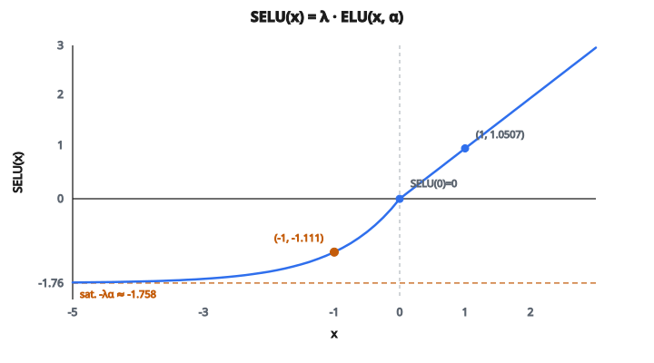

# SELU Activation

## Vấn đề chuẩn hóa

Mạng sâu gặp **internal covariate shift**: phân phối activation ở mỗi lớp thay đổi khi mạng huấn luyện. Việc này làm huấn luyện không ổn định vì mỗi lớp phải liên tục thích nghi với thống kê đầu vào đang dịch.

Sửa chuẩn là **batch normalization**: chuẩn hóa activation mỗi lớp về trung bình không và phương sai đơn vị, rồi học scale và shift. Nó hiệu quả, nhưng:

* Phụ thuộc thống kê batch, nên hành vi khác giữa huấn luyện và inference
* Không tốt với batch nhỏ
* Thêm chi phí tính toán và tham số
* Làm kiến trúc mô hình phức tạp hơn

Nếu chính hàm kích hoạt có thể giữ thống kê ổn định một cách tự động?

## SELU: kích hoạt tự chuẩn hóa

SELU (Scaled Exponential Linear Unit) được thiết kế đúng cho việc này. Nó là phiên bản đã scale của ELU với **các hằng số cụ thể** chọn sao cho activation tự hội tụ về trung bình không và phương sai đơn vị khi đi qua các lớp.

$$
\text{SELU}(x) = \lambda \cdot \begin{cases} x & \text{nếu } x > 0 \\ \alpha \cdot (e^x - 1) & \text{nếu } x \leq 0 \end{cases}
$$

Các hằng số không tùy ý. Chúng được suy ra giải tích:

$$
\lambda \approx 1.0507 \qquad \alpha \approx 1.6733
$$

Đúng các giá trị này mới làm tính tự chuẩn hóa hoạt động. Đổi chúng là phá bảo đảm toán học.

## Self-normalization hoạt động thế nào

Ý then chốt (từ paper của Klambauer et al., 2017): nếu activation vào một lớp SELU với trung bình 0 và phương sai 1, chúng ra với trung bình 0 và phương sai 1. Điều này đúng xấp xỉ cả sau phi tuyến.

Vì sao đúng các hằng số này?

* **$\lambda > 1$**: hệ số scale hơi lớn hơn 1. Nghĩa là giá trị quá nhỏ được khuếch đại, kéo phương sai lên về 1.
* **$\alpha \approx 1.6733$**: mức bão hòa âm của ELU. Chọn sao cho đầu ra âm tạo đúng lượng lệch trung bình để đối trọng bias của phía dương.
* Cùng nhau, các hằng số tạo một **điểm hút cố định**: nếu trung bình và phương sai lệch khỏi $(0, 1)$, hàm SELU kéo chúng về.

Chứng minh toán học cho thấy có đúng một điểm cố định tại trung bình 0 và phương sai 1, và SELU hội tụ về điểm đó. Đó là lý do gọi là “self-normalizing.”

## Một số giá trị cụ thể

* $\text{SELU}(1.0) = \lambda \cdot 1.0 \approx 1.0507$
* $\text{SELU}(0) = \lambda \cdot \alpha \cdot (e^0 - 1) = 0$
* $\text{SELU}(-1.0) = \lambda \cdot \alpha \cdot (e^{-1} - 1) \approx 1.0507 \times 1.6733 \times (-0.632) \approx -1.111$
* $\text{SELU}(-5.0) \approx 1.0507 \times 1.6733 \times (-0.993) \approx -1.746$
* Khi $x \to -\infty$: $\text{SELU}(x) \to -\lambda \cdot \alpha \approx -1.758$

Khoảng đầu ra:

* Phía dương: không bị chặn, scale bởi $\lambda \approx 1.05$
* Phía âm: bão hòa khoảng $-1.758$

::: {#fig-133-selu fig-cap="SELU(1) = 1.0507 và SELU(-1) ≈ -1.111; phía âm bão hòa tại −λα ≈ −1.758. Các điểm khớp ví dụ số trong bài." fig-alt="Đồ thị SELU; SELU(1)=1.0507, SELU(-1)≈-1.111, bão hòa ≈ -1.758."}
{fig-align="center"}
:::

## Điều kiện để self-normalization

Tính tự chuẩn hóa của SELU chỉ đúng dưới điều kiện cụ thể:

1. **Khởi tạo trọng số**: phải dùng **LeCun normal initialization** (trọng số lấy từ $N(0, 1/n)$ với $n$ là số đầu vào). Khởi tạo khác phá tính chất.
2. **Kiến trúc**: đúng với lớp fully connected (dense). Chứng minh không áp dụng trực tiếp cho lớp tích chập hay hồi tiếp.
3. **Biến thể dropout**: dropout chuẩn phá self-normalization. Dùng **alpha dropout** thay thế, gán ngẫu nhiên activation về giá trị bão hòa âm $-\lambda\alpha$ chứ không về không.
4. **Chuẩn hóa đầu vào**: đầu vào mạng nên được chuẩn hóa (trung bình 0, phương sai 1).

Khi đủ điều kiện, mạng SELU có thể huấn luyện tới độ sâu đáng kể (100+ lớp) không cần batch normalization, và activation giữ thống kê ổn định xuyên suốt.

## SELU so với ELU

SELU đúng là ELU với một hệ số scale cụ thể:

$$
\text{SELU}(x) = \lambda \cdot \text{ELU}(x, \alpha = 1.6733)
$$

Khác biệt:

* **ELU**: $\alpha$ là hyperparameter tự do. Không có bảo đảm tự chuẩn hóa.
* **SELU**: $\alpha$ và $\lambda$ là hằng số cố định. Tự chuẩn hóa khi đủ điều kiện.
* **ELU**: chạy với mọi kiến trúc và cách khởi tạo
* **SELU**: cần LeCun initialization và lớp fully connected để có bảo đảm

## SELU xuất hiện ở đâu

* **Mạng fully connected sâu**: đây là chỗ SELU mạnh. Mạng 50+ lớp dense có thể huấn luyện không cần batch normalization.
* **Dữ liệu bảng**: SELU phổ biến cho bài không-ảnh, không-văn-bản, nơi kiến trúc là MLP sâu
* **Autoencoder**: SELU chạy tốt trong kiến trúc autoencoder sâu
* **Như baseline**: SELU hữu ích để hỏi “bài này có thật sự cần batch normalization không?” Nếu SELU tương đương, có thể bỏ độ phức tạp của batch norm.

## Code
```python
import math

def selu(x):
    """
    Apply SELU activation element-wise.
    Returns a list of floats rounded to 4 decimal places.
    """
    lam = 1.0507009873554804934193349852946
    alpha = 1.6732632423543772848170429916717
    result = []
    for val in x:
        if val > 0:
            result.append(round(lam * val, 4))
        else:
            result.append(round(lam * alpha * (math.exp(val) - 1), 4))
    return result

```
