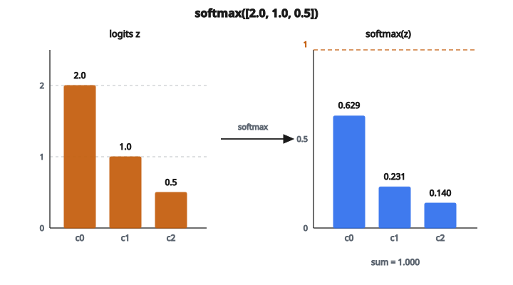

# Softmax

## Từ điểm số tới xác suất

Lớp cuối của mạng phân loại cho ra một vector số thô, một số mỗi lớp. Chúng được gọi là **logits**. Với bài 3 lớp, bạn có thể nhận:

$$
z = \begin{bmatrix} 2.0 & 1.0 & 0.5 \end{bmatrix}
$$

Các logit này nói rằng lớp 0 là dự đoán tự tin nhất và lớp 2 là kém nhất. Nhưng chúng không phải xác suất:

* Chúng không cộng thành 1
* Chúng có thể âm
* Độ lớn khó diễn giải

Softmax biến các điểm số thô thành một **phân phối xác suất** đúng: mọi giá trị nằm trong $(0, 1)$, cộng đúng bằng 1.

## Công thức softmax

Với vector $z = [z_1, z_2, \ldots, z_n]$:

$$
\mathrm{softmax}(z_i) = \frac{e^{z_i}}{\sum_{j=1}^{n} e^{z_j}}
$$

Mỗi phần tử được lũy thừa, rồi chia cho tổng mọi phần tử đã lũy thừa.

**Ví dụ**: $z = [2.0, 1.0, 0.5]$

1. Lũy thừa từng phần tử:

   * $e^{2.0} \approx 7.389$
   * $e^{1.0} \approx 2.718$
   * $e^{0.5} \approx 1.649$
2. Tổng: $7.389 + 2.718 + 1.649 = 11.756$
3. Chia từng số cho tổng:

   * $\frac{7.389}{11.756} \approx 0.629$
   * $\frac{2.718}{11.756} \approx 0.231$
   * $\frac{1.649}{11.756} \approx 0.140$

Kết quả: $[0.629, 0.231, 0.140]$. Chúng cộng thành 1.0 và diễn giải được: “63% khả năng lớp 0, 23% lớp 1, 14% lớp 2.”

::: {#fig-25-softmax fig-cap="softmax([2.0, 1.0, 0.5]) = [0.629, 0.231, 0.140]; các xác suất cộng đúng bằng 1 và bảo toàn thứ tự của logit." fig-alt="Ba logit z = [2.0, 1.0, 0.5] chuyển thành xác suất softmax [0.629, 0.231, 0.140], tổng bằng 1."}
{fig-align="center"}
:::

## Vì sao lũy thừa?

Hàm mũ $e^x$ làm vài việc cùng lúc:

* **Làm mọi thứ dương**: $e^x > 0$ với mọi $x$, kể cả đầu vào âm. Điều này bảo đảm mọi xác suất dương.
* **Giữ thứ tự**: nếu $z_i > z_j$, thì $e^{z_i} > e^{z_j}$. Logit lớn nhất vẫn nhận xác suất lớn nhất.
* **Khuếch đại chênh lệch**: hàm mũ lồi và tăng nhanh. Chênh lệch nhỏ ở logit thành chênh lệch lớn hơn ở xác suất. Nếu một lớp có logit 5 và lớp kia có logit 3, tỉ lệ xác suất là $e^{5}/e^{3} = e^{2} \approx 7.4$, không chỉ $5/3$.

Hiệu ứng khuếch đại này khiến softmax “có ý kiến.” Nó dồn khối xác suất vào các logit lớn nhất. Mạng càng tự tin (khe hở giữa logit đỉnh và phần còn lại càng lớn), đầu ra càng gần vector one-hot.

## Vấn đề tràn số

Có một vấn đề thực tế. Nếu $z_i$ lớn (ví dụ 1000), thì $e^{1000}$ tràn ra vô cực trong số chấm động. Ngay cả giá trị vừa phải như $e^{100} \approx 2.7 \times 10^{43}$ cũng có thể gây rắc rối.

Cách sửa là trừ giá trị lớn nhất trước khi lũy thừa:

$$
\mathrm{softmax}(z_i) = \frac{e^{z_i - \max(z)}}{\sum_{j} e^{z_j - \max(z)}}
$$

Cách này đúng vì:

$$
\begin{aligned}
\frac{e^{z_i - c}}{\sum_j e^{z_j - c}}
&= \frac{e^{z_i} / e^c}{\sum_j e^{z_j} / e^c} \\
&= \frac{e^{z_i}}{\sum_j e^{z_j}}
\end{aligned}
$$

Trừ mọi phần tử một hằng số $c$ không đổi kết quả. Chọn $c = \max(z)$ bảo đảm số mũ lớn nhất là $e^0 = 1$, còn lại là $e^{\text{âm}} < 1$. Không thể tràn.

**Ví dụ**: $z = [1000, 999, 998]$

Không có mẹo: $e^{1000} = \text{Inf}$. Tính toán thất bại.

Có mẹo: trừ 1000 được $[0, -1, -2]$, rồi:

* $e^0 = 1.0$, $e^{-1} \approx 0.368$, $e^{-2} \approx 0.135$
* Tổng $= 1.503$
* Kết quả: $[0.665, 0.245, 0.090]$

## Temperature của softmax

Một biến thể phổ biến là chia logit cho tham số **temperature** $T$ trước khi softmax:

$$
\mathrm{softmax}(z_i; T) = \frac{e^{z_i / T}}{\sum_j e^{z_j / T}}
$$

Temperature điều khiển phân phối “sắc” hay “mềm” tới mức nào:

* $T = 1$: softmax chuẩn
* $T < 1$ (ví dụ 0.1): phân phối sắc hơn. Logit lớn nhất chiếm ưu thế hơn nữa. Khi $T \to 0$, softmax tiến tới argmax (one-hot).
* $T > 1$ (ví dụ 5.0): phân phối mềm hơn. Xác suất đều hơn. Khi $T \to \infty$, mọi lớp nhận xác suất bằng nhau.

Temperature được dùng trong:

* **Sampling mô hình ngôn ngữ**: temperature thấp cho văn bản xác định hơn, temperature cao cho văn bản sáng tạo/ngẫu nhiên hơn
* **Knowledge distillation**: temperature cao làm mềm đầu ra của teacher để lộ “dark knowledge” về độ giống giữa các lớp

## Softmax trên mảng 2D

Khi đầu vào là ma trận (một batch các vector logit), softmax được áp dụng **theo hàng**. Mỗi hàng là một điểm dữ liệu riêng với phân phối xác suất của chính nó:

$$
\text{với mỗi hàng } i:\quad \mathrm{softmax}(z_{i,j}) = \frac{e^{z_{i,j}}}{\sum_k e^{z_{i,k}}}
$$

Phép trừ max và chuẩn hóa xảy ra độc lập trên từng hàng.

## Softmax xuất hiện ở đâu

* **Lớp đầu ra phân loại**: gần như mọi mạng phân loại kết thúc bằng softmax. Mô hình ImageNet 1000 lớp cho ra 1000 logit, softmax biến chúng thành 1000 xác suất.
* **Cross-entropy loss**: loss phân loại chuẩn là $-\sum_i y_i \log(\mathrm{softmax}(z_i))$. Softmax và cross-entropy gắn chặt đến mức các framework cung cấp hàm gộp “softmax + cross-entropy” để ổn định số.
* **Cơ chế attention**: trong Transformers, trọng số attention được tính bằng softmax trên tích vô hướng của query và key. Điều này bảo đảm trọng số attention cộng thành 1 (trung bình có trọng số).
* **Học tăng cường**: softmax dùng để biến ước lượng action-value thành xác suất chọn hành động (Boltzmann exploration).

## Code
```python
import numpy as np

def softmax(x):
    """
    Compute the softmax of input x.
    Works for 1D or 2D NumPy arrays.
    For 2D, compute row-wise softmax.
    """
    x = np.array(x, dtype=float)
    if x.ndim == 1:
        shifted = x - np.max(x)
        exps = np.exp(shifted)
        return np.round(exps / np.sum(exps), 4).tolist()
    elif x.ndim == 2:
        shifted = x - np.max(x, axis=1, keepdims=True)
        exps = np.exp(shifted)
        result = exps / np.sum(exps, axis=1, keepdims=True)
        return np.round(result, 4).tolist()

```
