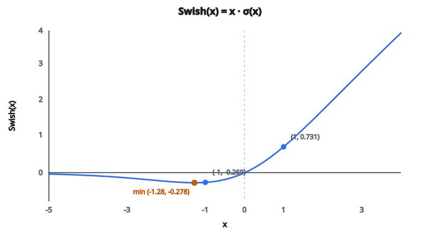

# Swish Activation

## Tìm hàm kích hoạt tốt hơn

ReLU ($\max(0, x)$) là hàm kích hoạt phổ biến nhất trong deep learning, nhưng không tối ưu mọi tình huống. Góc nhọn tại không và vùng âm chết hoàn toàn còn chỗ để cải thiện.

Nghiên cứu đã thử nhiều phương án (Leaky ReLU, ELU, PReLU, v.v.), mỗi cái thiết kế thủ công. Năm 2017, Google Brain đi cách khác: họ dùng **tìm kiếm tự động** để phát hiện hàm kích hoạt mới bằng cách kết hợp các phép toán cơ bản. Hàm tốt nhất họ tìm được là Swish.

## Swish làm gì

Swish được định nghĩa:

$$
\text{Swish}(x) = x \cdot \sigma(x)
$$

với $\sigma(x) = \frac{1}{1 + e^{-x}}$ là hàm sigmoid.

Công thức nhân đầu vào $x$ với sigmoid của chính nó. Vì sigmoid cho ra giá trị trong $(0, 1)$, Swish hoạt động như một **cổng mượt** kiểm soát bao nhiêu phần của $x$ được đi qua:

* Khi $x$ dương lớn: $\sigma(x) \approx 1$, nên $\text{Swish}(x) \approx x$ (đi qua gần như hết)
* Khi $x = 0$: $\sigma(0) = 0.5$, nên $\text{Swish}(0) = 0$
* Khi $x$ âm lớn: $\sigma(x) \approx 0$, nên $\text{Swish}(x) \approx 0$ (bị nén)
* Khi $x$ hơi âm: đầu ra là **một giá trị âm nhỏ** (không phải không)

Một số giá trị cụ thể:

* $\text{Swish}(5.0) = 5.0 \times 0.993 \approx 4.966$
* $\text{Swish}(1.0) = 1.0 \times 0.731 = 0.731$
* $\text{Swish}(0) = 0$
* $\text{Swish}(-1.0) = -1.0 \times 0.269 = -0.269$
* $\text{Swish}(-5.0) = -5.0 \times 0.007 \approx -0.034$

## “Bump” không đơn điệu

Một tính chất thú vị nhất của Swish: nó **không đơn điệu**. Khác ReLU (luôn tăng hoặc phẳng) hay sigmoid (luôn tăng), Swish hơi tụt xuống dưới không rồi mới lên lại.

Cực tiểu khoảng $x \approx -1.28$, nơi $\text{Swish}(x) \approx -0.278$.

Nghĩa là:

* Với $x < -1.28$: đầu ra thực ra đang tăng (ít âm hơn) khi $x$ giảm tiếp
* Đường cong có một “bump” nhỏ ở vùng âm

Tính không đơn điệu này lạ với một hàm kích hoạt, và là một phần lý do Swish hiệu quả. Nó cho phép mạng sinh activation âm nhỏ với đầu vào âm vừa phải, trong khi vẫn nén các giá trị rất âm. Lớp sau nhận được nhiều thông tin hơn so với số không cứng của ReLU.

::: {#fig-51-swish fig-cap="Swish(x) = x·σ(x) không đơn điệu: cực tiểu ≈ (-1.28, -0.278). Hai điểm Swish(1) = 0.731 và Swish(-1) = -0.269 khớp ví dụ trong bài." fig-alt="Đồ thị Swish x·σ(x); cực tiểu ≈ (-1.28, -0.278); Swish(1)=0.731 và Swish(-1)=-0.269."}
{fig-align="center"}
:::

## Swish so với ReLU

Các khác biệt chính:

**Độ mượt**: Swish khả vi vô hạn (mượt mọi nơi). ReLU có góc nhọn tại không, nơi đạo hàm không xác định. Hàm mượt tạo landscape loss mượt hơn, có thể làm tối ưu dễ hơn.

**Giá trị âm**: Swish cho phép đầu ra âm nhỏ. ReLU cho ra đúng không với mọi đầu vào âm. Các giá trị âm nhỏ trong Swish:

* Ngăn neuron chết (gradient không bao giờ đúng bằng không với đầu vào hữu hạn)
* Cho mạng biểu diễn và lan truyền tín hiệu âm
* Đóng vai trò regularization ẩn

**Hành vi tiệm cận**: với $x$ dương lớn, cả hai tiến tới $f(x) \approx x$. Với $x$ âm lớn, cả hai tiến tới 0. Khác biệt nằm ở vùng chuyển quanh không.

**Chi phí tính toán**: Swish cần tính sigmoid ($e^{-x}$, cộng, chia) rồi nhân. ReLU chỉ là so sánh với không. Swish đắt hơn mỗi phép, nhưng tác động tổng thể lên thời gian huấn luyện nhỏ vì phép nhân ma trận chiếm phần lớn.

## Gradient

Đạo hàm của Swish là:

$$
\text{Swish}'(x) = \sigma(x) + x \cdot \sigma(x)(1 - \sigma(x))
$$

Có thể viết gọn:

$$
\text{Swish}'(x) = \sigma(x) + x \cdot \sigma'(x) = \text{Swish}(x) + \sigma(x)(1 - \text{Swish}(x))
$$

Tính chất chính của gradient:

* Tại $x = 0$: gradient $= 0.5 + 0 = 0.5$
* Với $x$ dương lớn: gradient tiến tới 1 (như ReLU)
* Với $x$ âm lớn: gradient tiến tới 0 (như ReLU)
* Gradient **không bao giờ đúng bằng không** với đầu vào hữu hạn, nên không neuron nào chết hẳn

## Swish và SiLU

Swish còn được gọi là **SiLU** (Sigmoid Linear Unit). Hai tên chỉ cùng một hàm:

$$
\text{SiLU}(x) = \text{Swish}(x) = x \cdot \sigma(x)
$$

Trong PyTorch, nó là `torch.nn.SiLU`. Trong một số paper và framework, bạn sẽ gặp một trong hai tên. Chúng thay thế được cho nhau.

## Swish xuất hiện ở đâu

* **EfficientNet**: kiến trúc phân loại ảnh state-of-the-art của Google dùng Swish xuyên suốt thay ReLU. Đây là một trong những mô hình lớn đầu tiên chấp nhận Swish.
* **Vision Transformers**: nhiều biến thể ViT dùng Swish/SiLU trong các lớp MLP
* **Mô hình khuếch tán**: Swish thường dùng trong kiến trúc U-Net của mô hình sinh ảnh (Stable Diffusion, DALL-E)
* **Kiến trúc mobile**: MobileNetV3 và các kiến trúc hiệu quả khác dùng biến thể liên quan hard-swish ($x \cdot \frac{\text{ReLU6}(x+3)}{6}$) xấp xỉ Swish bằng phép rẻ hơn
* **Thay ReLU nói chung**: trên nhiều benchmark, Swish ngang hoặc hơn ReLU, đặc biệt ở mạng sâu hơn. Đó là lựa chọn mặc định an toàn khi muốn hơn ReLU mà không cần tinh chỉnh nhiều.

## Code
```python
import numpy as np

def swish(x):
    """
    Implement Swish activation function.
    """
    x = np.array(x, dtype=float)
    sigmoid = 1.0 / (1.0 + np.exp(-x))
    result = x * sigmoid
    return np.round(result, 4).tolist()

```

<!-- auto-self-check -->

::: {.callout-note}
## Kiểm tra nhanh
<details>
<summary>Ý chính của bài «Swish Activation» là gì?</summary>
ReLU ($\max(0, x)$) là hàm kích hoạt phổ biến nhất trong deep learning, nhưng không tối ưu mọi tình huống.
</details>
<details>
<summary>Công thức / quan hệ cốt lõi trong bài là gì?</summary>
$$\text{Swish}(x) = x \cdot \sigma(x)$$
</details>
:::
