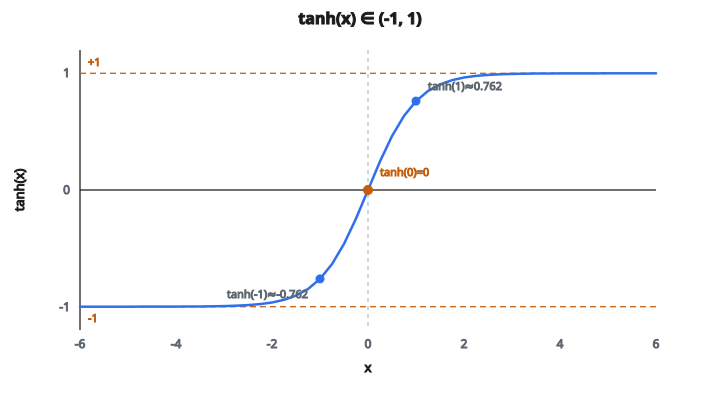

# Tanh Activation

## Cần hàm kích hoạt bị chặn và zero-centered

Trước khi ReLU chiếm ưu thế, mạng neural cần hàm kích hoạt có hai tính chất:

1. **Đầu ra bị chặn**: ngăn activation tăng không giới hạn khi đi qua nhiều lớp
2. **Zero-centered**: cho ra cả giá trị dương và âm, nên trung bình activation gần không

Sigmoid ($\sigma(x) = \frac{1}{1 + e^{-x}}$) cho đầu ra bị chặn trong $(0, 1)$, nhưng **không zero-centered**. Mọi đầu ra đều dương, tạo bias hệ thống có thể làm chậm hạ gradient.

Tanh giải quyết điều này.

## Tanh làm gì

Hàm hyperbolic tangent là:

$$
\tanh(x) = \frac{e^x - e^{-x}}{e^x + e^{-x}}
$$

Nó nén mọi đầu vào vào khoảng $(-1, 1)$:

* $\tanh(-5) \approx -0.9999$ (bão hòa âm)
* $\tanh(-1) \approx -0.762$
* $\tanh(0) = 0$ (đúng bằng không tại gốc)
* $\tanh(1) \approx 0.762$
* $\tanh(5) \approx 0.9999$ (bão hòa dương)

Hàm là đường cong chữ S, đối xứng quanh gốc. Trông giống sigmoid nhưng đã tịnh tiến và co giãn.

::: {#fig-50-tanh fig-cap="tanh(x) ∈ (-1, 1) và tanh(0) = 0. Hai điểm tanh(±1) ≈ ±0.762 khớp bảng giá trị; đường đứt bão hòa tại ±1." fig-alt="Đường cong S của tanh trong (-1, 1); tanh(0)=0 và tanh(±1) ≈ ±0.762."}
{fig-align="center"}
:::

## Quan hệ đúng giữa tanh và sigmoid

Tanh thực ra là phiên bản co giãn của sigmoid:

$$
\tanh(x) = 2\sigma(2x) - 1
$$

Cả hai có cùng dạng chữ S. Khác biệt:

* **Sigmoid**: khoảng đầu ra $(0, 1)$, tâm tại $0.5$
* **Tanh**: khoảng đầu ra $(-1, 1)$, tâm tại $0$

Độ lệch này quan trọng khi huấn luyện. Khi mọi activation đều dương (sigmoid), gradient của trọng số lớp sau đều cùng dấu. Điều đó buộc gradient chỉ đi theo một số hướng, tạo đường zigzag khi tối ưu. Activation zero-centered (tanh) cho phép gradient có dấu lẫn, nên đường tới cực tiểu trực tiếp hơn.

## Gradient

Đạo hàm của tanh có công thức gọn:

$$
\frac{d}{dx} \tanh(x) = 1 - \tanh^2(x)
$$

Nghĩa là một khi đã tính $\tanh(x)$, gradient gần như miễn phí.

Một số giá trị đạo hàm:

* Tại $x = 0$: đạo hàm $= 1 - 0^2 = 1$ (lớn nhất)
* Tại $x = 1$: đạo hàm $= 1 - 0.762^2 \approx 0.42$
* Tại $x = 2$: đạo hàm $= 1 - 0.964^2 \approx 0.07$
* Tại $x = 5$: đạo hàm $\approx 0.00018$ (gần như không)

Gradient lớn nhất tại gốc và giảm nhanh khi đầu vào rời xa không. Với $|x| > 3$, gradient thực tế bằng không.

## Vấn đề vanishing gradient

Đạo hàm suy giảm nhanh là điểm yếu lớn nhất của tanh. Trong mạng sâu hoặc mạng hồi tiếp:

* Gradient ở mỗi lớp bị nhân với đạo hàm tanh (tối đa 1, thường nhỏ hơn nhiều)
* Sau nhiều lớp, tích các số nhỏ này co theo hàm mũ
* Các lớp sớm gần như không nhận tín hiệu gradient và học rất chậm

Ví dụ, nếu đạo hàm khoảng 0.4 ở mỗi lớp trong 10 lớp:

$$
0.4^{10} \approx 0.0001
$$

Gradient tới lớp đầu nhỏ hơn lớp cuối 10.000 lần.

Đó là lý do tanh phần lớn bị ReLU thay thế trong mạng feedforward sâu. Gradient của ReLU bằng 1 với đầu vào dương, nên không bị co nhân tính này.

## Tanh vẫn được dùng ở đâu

Dù có vanishing gradient, tanh vẫn quan trọng ở vài ngữ cảnh:

* **Hidden state của RNN**: ô tanh RNN dùng tanh để giữ hidden state trong $[-1, 1]$. Không chặn, hidden state có thể nổ qua nhiều bước thời gian.
* **Bên trong LSTM và GRU**: cả hai kiến trúc dùng tanh để sinh giá trị ứng viên cho cell/hidden state. Cổng dùng sigmoid (giá trị trong $[0,1]$), còn cập nhật trạng thái dùng tanh (giá trị trong $[-1,1]$).
* **Lớp đầu ra cho target bị chặn**: khi giá trị đích nằm trong $[-1, 1]$, tanh là lựa chọn tự nhiên cho activation đầu ra.
* **Chuẩn hóa biểu diễn**: tanh có thể dùng để chuẩn hóa embedding hoặc vector đặc trưng về khoảng bị chặn.
* **Tầm quan trọng lịch sử**: tanh là activation thống trị từ những năm 1990 đến cuối những năm 2000, dùng gần như mọi mạng neural trước cuộc cách mạng ReLU.

## Ổn định số

Tính tanh từ công thức thô $\frac{e^x - e^{-x}}{e^x + e^{-x}}$ có thể tràn với $|x|$ lớn vì $e^x$ tăng rất nhanh. Trong thực tế:

* Với $x$ dương lớn: $\tanh(x) \approx 1$
* Với $x$ âm lớn: $\tanh(x) \approx -1$
* Hầu hết thư viện số xử lý nội bộ, nên gọi hàm tanh có sẵn mà không lo tràn

## Code
```python
import numpy as np

def tanh(x):
    """
    Implement Tanh activation function.
    """
    x = np.array(x, dtype=float)
    return np.round((np.exp(x) - np.exp(-x)) / (np.exp(x) + np.exp(-x)), 4).tolist()

```

<!-- auto-self-check -->

::: {.callout-note}
## Kiểm tra nhanh
<details>
<summary>Ý chính của bài «Tanh Activation» là gì?</summary>
Trước khi ReLU chiếm ưu thế, mạng neural cần hàm kích hoạt có hai tính chất: 1.
</details>
<details>
<summary>Công thức / quan hệ cốt lõi trong bài là gì?</summary>
$$\tanh(x) = \frac{e^x - e^{-x}}{e^x + e^{-x}}$$
</details>
:::
