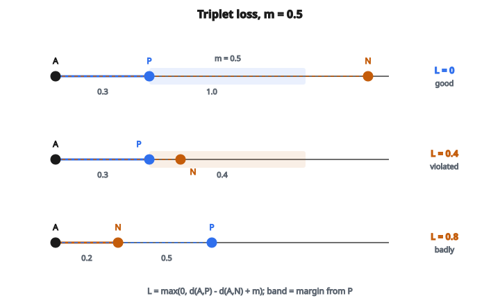

# Triplet Loss

## Ý tưởng của triplet loss

Triplet loss học embedding bằng cách so sánh ba mẫu mỗi lần:

* **Anchor (a)**: mẫu tham chiếu
* **Positive (p)**: mẫu giống anchor (cùng lớp/identity)
* **Negative (n)**: mẫu khác anchor (khác lớp/identity)

Mục tiêu: học embedding sao cho anchor gần positive hơn negative.

$$
d(a, p) < d(a, n)
$$

với $d$ là hàm khoảng cách (thường L2/Euclidean).

## Công thức Triplet Loss

$$
L = \max(0, d(a, p) - d(a, n) + m)
$$

với:

* $d(a, p)$ là khoảng cách giữa embedding anchor và positive
* $d(a, n)$ là khoảng cách giữa embedding anchor và negative
* $m$ là margin (hằng số dương)

Loss bằng không khi $d(a, n) > d(a, p) + m$

Nghĩa là negative phải xa hơn positive ít nhất một khoảng margin $m$.

## Hiểu margin

Margin $m$ ngăn nghiệm tầm thường:

**Không có margin ($m = 0$):**

* Loss bằng $0$ mỗi khi $d(a, n) > d(a, p)$
* Mô hình có thể thỏa với $d(a, p) = 0.99$ và $d(a, n) = 1.0$
* Embedding sẽ không phân biệt tốt

**Có margin (ví dụ $m = 0.2$):**

* Loss bằng $0$ chỉ khi $d(a, n) > d(a, p) + 0.2$
* Ép tách rõ positive và negative
* Giá trị điển hình: $0.2$ đến $1.0$ (tùy cách chuẩn hóa embedding)

## Ví dụ số

::: {#fig-53-triplet fig-cap="Với m = 0.5: triplet tốt (0.3 so với 1.0) cho L = 0; triplet vi phạm (0.3 so với 0.4) cho L = 0.4; triplet vi phạm nặng (0.5 so với 0.2) cho L = 0.8." fig-alt="Ba triplet trên trục khoảng cách từ A, m = 0.5: good d(A,P)=0.3 d(A,N)=1.0 L=0; violated 0.3 vs 0.4 L=0.4; badly 0.5 vs 0.2 L=0.8."}
{fig-align="center"}
:::

Cho margin $m = 0.5$.

**Ví dụ 1: Triplet tốt (thỏa)**

* $d(\text{anchor}, \text{positive}) = 0.3$
* $d(\text{anchor}, \text{negative}) = 1.0$
* Loss: $\max(0, 0.3 - 1.0 + 0.5) = \max(0, -0.2) = 0$

**Ví dụ 2: Triplet vi phạm**

* $d(\text{anchor}, \text{positive}) = 0.3$
* $d(\text{anchor}, \text{negative}) = 0.4$
* Loss: $\max(0, 0.3 - 0.4 + 0.5) = \max(0, 0.4) = 0.4$

**Ví dụ 3: Triplet vi phạm nặng**

* $d(\text{anchor}, \text{positive}) = 0.5$
* $d(\text{anchor}, \text{negative}) = 0.2$ (negative gần hơn!)
* Loss: $\max(0, 0.5 - 0.2 + 0.5) = \max(0, 0.8) = 0.8$

## Các loại triplet

**Easy triplet:** $d(a, n) > d(a, p) + m$

* Loss bằng $0$
* Đã thỏa, không có tín hiệu học

**Semi-hard triplet:** $d(a, p) < d(a, n) < d(a, p) + m$

* Negative xa hơn positive, nhưng chưa đủ
* Cho gradient hữu ích
* Thường tốt nhất để học

**Hard triplet:** $d(a, n) < d(a, p)$

* Negative gần hơn positive
* Loss lớn, gradient mạnh
* Có thể làm huấn luyện không ổn định nếu dùng độc quyền

## Chiến lược triplet mining

Lấy mẫu triplet ngẫu nhiên kém hiệu quả vì hầu hết triplet đều easy:

* Với mô hình đã học tốt, hầu hết negative đều xa anchor
* Easy triplet cho gradient bằng không

**Batch-hard mining:**

* Với mỗi anchor, tìm positive khó nhất (mẫu cùng lớp xa nhất)
* Với mỗi anchor, tìm negative khó nhất (mẫu khác lớp gần nhất)
* Quyết liệt nhưng có thể không ổn định

**Batch-semi-hard mining:**

* Với mỗi anchor, dùng mọi positive
* Chọn negative xa hơn positive nhưng gần hơn positive $+ \text{margin}$
* Ổn định hơn batch-hard

**Offline mining:**

* Tính mọi embedding trước
* Chọn triplet giàu thông tin theo khoảng cách hiện tại
* Đắt nhưng chính xác

## Gradient

Với triplet vi phạm:

$$
\frac{\partial L}{\partial f(a)} = \frac{f(a) - f(p)}{d(a, p)} - \frac{f(a) - f(n)}{d(a, n)}
$$

Điều này đẩy anchor:

* Về phía positive (số hạng thứ nhất)
* Ra xa negative (số hạng thứ hai)

Gradient tương tự áp cho embedding positive và negative:

* Positive bị đẩy về phía anchor
* Negative bị đẩy ra xa anchor

## Triplet loss so với Contrastive loss

**Contrastive loss:**

* Dùng cặp: (anchor, positive) hoặc (anchor, negative)
* Hai số hạng tách cho cặp giống và cặp khác
* Cần ngưỡng khoảng cách tuyệt đối

**Triplet loss:**

* Dùng triplet: (anchor, positive, negative)
* Một số hạng so sánh khoảng cách tương đối
* Chỉ cần positive gần hơn negative

Triplet loss thường được ưa hơn vì:

* Tập trung thứ tự tương đối (tự nhiên hơn cho retrieval)
* Không phải chỉnh ngưỡng khoảng cách tuyệt đối
* Hiệu quả mẫu tốt hơn nếu mining tốt

## Batch All Triplet Loss

Tính loss trên mọi triplet hợp lệ trong một batch:

Với batch có $P$ identity và $K$ mẫu mỗi identity:

* Mỗi mẫu có thể là anchor
* Positive: các mẫu khác cùng identity ($K-1$ mỗi anchor)
* Negative: mẫu khác identity ($(P-1) \times K$ mỗi anchor)

Tổng số triplet mỗi batch: $P \times K \times (K-1) \times (P-1) \times K$

Có thể lên tới hàng nghìn triplet, nhưng hầu hết là easy. Lọc semi-hard hoặc hard là bắt buộc.

## Biến thể khoảng cách bình phương

Một số cài đặt dùng khoảng cách bình phương:

$$
L = \max(0, d(a, p)^2 - d(a, n)^2 + m)
$$

Ưu điểm:

* Tránh tính căn bậc hai
* Rẻ hơn về tính toán

Nhược điểm:

* Thang của margin đổi (cần chỉnh $m$ tương ứng)

## Triplet loss được dùng ở đâu

* **Face recognition**: FaceNet dùng triplet loss để học face embedding
* **Person re-identification**: khớp người qua các góc camera
* **Image retrieval**: tìm ảnh tương tự
* **Xác minh chữ ký**: kiểm tra hai chữ ký có cùng người không
* **Speaker verification**: khớp bản ghi giọng nói
* **One-shot learning**: học so sánh với ít ví dụ

Thực hành tốt:

* Dùng embedding chuẩn hóa L2 (mặt cầu đơn vị)
* Kết hợp mining triplet tốt
* Margin khoảng $0.2$–$0.5$ với embedding đã chuẩn hóa
* Theo dõi tỉ lệ triplet active (loss khác không)

## Code
```python
import numpy as np

def triplet_loss(anchor, positive, negative, margin=1.0):
    """
    Compute Triplet Loss for embedding ranking.
    """
    a = np.asarray(anchor, dtype=float)
    p = np.asarray(positive, dtype=float)
    n = np.asarray(negative, dtype=float)
    if a.ndim == 1: a = a.reshape(1, -1)
    if p.ndim == 1: p = p.reshape(1, -1)
    if n.ndim == 1: n = n.reshape(1, -1)
    dist_ap = np.sum((a - p)**2, axis=1)
    dist_an = np.sum((a - n)**2, axis=1)
    return float(np.mean(np.maximum(0, dist_ap - dist_an + margin)))

```
