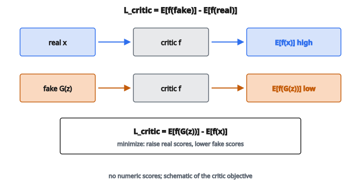

# Wasserstein Critic Loss

## Vấn đề của GAN chuẩn

Trong GAN chuẩn, discriminator xuất ra xác suất đầu vào là thật. Generator cố cực đại hóa xác suất này cho mẫu giả. Thiết lập này có một vấn đề căn bản: **vanishing gradients**.

Khi discriminator quá giỏi phân biệt thật/giả, đầu ra bão hòa về $0$ trên mẫu giả. Gradient của sigmoid bão hòa gần như không, nên generator gần như không nhận tín hiệu học. Huấn luyện đứng.

Vấn đề khác là **mode collapse**: generator học cách sinh chỉ vài kiểu đầu ra đánh lừa được discriminator, bỏ qua toàn bộ đa dạng của phân phối dữ liệu thật.

## Khoảng cách Wasserstein

Wasserstein GAN (WGAN) thay discriminator bằng một **critic** ước lượng khoảng cách Wasserstein (còn gọi là Earth Mover's distance) giữa phân phối thật và phân phối sinh.

Trực giác: khoảng cách Wasserstein đo “chi phí” tối thiểu để biến một phân phối thành phân phối kia, trong đó chi phí là khối lượng xác suất dịch chuyển nhân với quãng đường dịch chuyển.

Ưu điểm then chốt: khoảng cách Wasserstein vẫn cho gradient có nghĩa ngay cả khi hai phân phối không chồng. Khác JS divergence (dùng trong GAN chuẩn), nó không bão hòa.

## Hàm critic

Critic $f$ là một mạng nơ-ron xuất ra số thực không bị chặn (không phải xác suất). Nó cố gán điểm cao cho mẫu thật và điểm thấp cho mẫu giả.

Khoảng cách Wasserstein có thể xấp xỉ:

$$
W(P_r, P_g) \approx \max_f \left( \mathbb{E}_{x \sim P_r}[f(x)] - \mathbb{E}_{z \sim P_z}[f(G(z))] \right)
$$

với

* $P_r$ là phân phối dữ liệu thật
* $P_g$ là phân phối dữ liệu sinh
* $G(z)$ là đầu ra generator với nhiễu $z$
* $f$ là hàm critic

Critic cực đại hóa hiệu điểm trên mẫu thật và mẫu giả.

## Critic loss

Từ phía critic, nó muốn:

* Gán **điểm cao** cho mẫu thật: cực đại hóa $\mathbb{E}[f(x)]$
* Gán **điểm thấp** cho mẫu giả: cực tiểu hóa $\mathbb{E}[f(G(z))]$

Critic loss (để cực tiểu hóa) là:

$$
L_{\mathrm{critic}} = \mathbb{E}[f(G(z))] - \mathbb{E}[f(x)]
$$

Điều này tương đương cực đại hóa $\mathbb{E}[f(x)] - \mathbb{E}[f(G(z))]$.

::: {#fig-58-wgan-critic fig-cap="L_critic = E[f(G(z))] − E[f(x)]: cực tiểu hóa loss này tức là nâng điểm mẫu thật và hạ điểm mẫu giả." fig-alt="Sơ đồ critic: mẫu thật x đi vào f cho E[f(x)] cao; mẫu giả G(z) đi vào f cho E[f(G(z))] thấp; L_critic = E[f(fake)] − E[f(real)]."}
{fig-align="center"}
:::

Theo cách viết trong code:

* Tính đầu ra critic trên batch thật: $\mathrm{real\_scores} = f(x)$
* Tính đầu ra critic trên batch giả: $\mathrm{fake\_scores} = f(G(z))$
* $\mathrm{Loss} = \mathrm{mean}(\mathrm{fake\_scores}) - \mathrm{mean}(\mathrm{real\_scores})$

## Ràng buộc Lipschitz

Có một yêu cầu then chốt: critic phải là **hàm 1-Lipschitz**. Nghĩa là:

$$
|f(x_1) - f(x_2)| \leq \|x_1 - x_2\|
$$

với mọi cặp đầu vào. Hàm không được đổi nhanh hơn độ dốc $1$.

Không có ràng buộc này, critic có thể gán điểm lớn tùy ý cho mẫu thật và điểm âm lớn tùy ý cho mẫu giả, và ước lượng khoảng cách Wasserstein sẽ vô nghĩa.

## Ép Lipschitz: weight clipping (WGAN gốc)

Bài báo WGAN gốc ép ràng buộc Lipschitz bằng cách **clip** trọng số critic vào một khoảng nhỏ như $[-0.01,\ 0.01]$ sau mỗi bước cập nhật.

Cách này chạy được nhưng có vấn đề:

* Nếu khoảng clip quá nhỏ, critic bị hạn chế capacity
* Nếu khoảng clip quá lớn, huấn luyện không ổn định
* Weight clipping thiên critic về các hàm đơn giản

## Ép Lipschitz: gradient penalty (WGAN-GP)

WGAN-GP (Gradient Penalty) dùng cách tinh hơn. Thay vì clip trọng số, nó thêm một **hạng phạt** không khuyến khích chuẩn gradient lệch khỏi $1$.

Critic loss đầy đủ trở thành:

$$
\begin{aligned}
L_{\mathrm{critic}}
&= \mathbb{E}[f(G(z))] - \mathbb{E}[f(x)] \\
&\quad + \lambda \mathbb{E}\left[\bigl(\lVert \nabla_{\hat{x}} f(\hat{x})\rVert_2 - 1\bigr)^2\right]
\end{aligned}
$$

với

* $\hat{x}$ là nội suy ngẫu nhiên giữa mẫu thật và mẫu giả
* $\lambda$ là hệ số phạt (thường là $10$)
* $\lVert \nabla_{\hat{x}} f(\hat{x})\rVert_2$ là chuẩn L2 của gradient critic tại $\hat{x}$

## Nội suy

Các mẫu nội suy $\hat{x}$ được tính:

$$
\hat{x} = \epsilon \cdot x + (1 - \epsilon) \cdot G(z)
$$

trong đó $\epsilon$ lấy mẫu đều trên $[0,\ 1]$ cho từng mẫu trong batch.

Cách này tạo các điểm trên đoạn thẳng giữa mẫu thật và mẫu giả. Gradient penalty được ép tại các điểm nội suy này; thực nghiệm cho thấy tốt hơn là chỉ ép trên mẫu thật hoặc mẫu giả.

## Tính gradient penalty

Với mỗi mẫu nội suy $\hat{x}$:

1. Tính đầu ra critic $f(\hat{x})$
2. Tính gradient $\nabla_{\hat{x}} f(\hat{x})$ bằng automatic differentiation
3. Tính chuẩn L2 của gradient: $\lVert \nabla_{\hat{x}} f(\hat{x})\rVert_2$
4. Phạt độ lệch khỏi $1$: $(\lVert \nabla \rVert_2 - 1)^2$

Trung bình trên batch để được hạng tử gradient penalty.

## Vì sao chuẩn gradient bằng 1?

Một hàm là 1-Lipschitz khi và chỉ khi chuẩn gradient của nó không vượt quá $1$ mọi nơi. Bằng cách khuyến khích chuẩn gradient đúng bằng $1$ (không chỉ nhỏ hơn $1$), ta đẩy critic dùng hết capacity trong khi vẫn nằm trong ràng buộc.

Hạng phạt $(\lVert \nabla \rVert_2 - 1)^2$ bằng không khi chuẩn đúng $1$ và dương trong các trường hợp khác.

## Động lực huấn luyện

Với WGAN-GP:

* Critic loss tương quan với chất lượng ảnh (khác discriminator loss của GAN chuẩn)
* Huấn luyện ổn định hơn trên nhiều kiến trúc
* Mode collapse giảm vì khoảng cách Wasserstein nắm được đa dạng
* Không cần cân chỉnh kỹ số bước cập nhật generator so với discriminator

Critic thường được huấn luyện $5$ vòng cho mỗi vòng generator để ước lượng khoảng cách Wasserstein đủ tốt.

## Code
```python
import numpy as np

def wasserstein_critic_loss(real_scores, fake_scores):
    """
    Compute Wasserstein Critic Loss for WGAN.
    """
    real_scores = np.asarray(real_scores, dtype=float)
    fake_scores = np.asarray(fake_scores, dtype=float)
    return float(np.mean(fake_scores) - np.mean(real_scores))

```

<!-- auto-self-check -->

::: {.callout-note}
## Kiểm tra nhanh
<details>
<summary>Ý chính của bài «Wasserstein Critic Loss» là gì?</summary>
Trong GAN chuẩn, discriminator xuất ra xác suất đầu vào là thật.
</details>
<details>
<summary>Công thức / quan hệ cốt lõi trong bài là gì?</summary>
$$W(P_r, P_g) \approx \max_f \left( \mathbb{E}_{x \sim P_r}[f(x)] - \mathbb{E}_{z \sim P_z}[f(G(z))] \right)$$
</details>
:::
