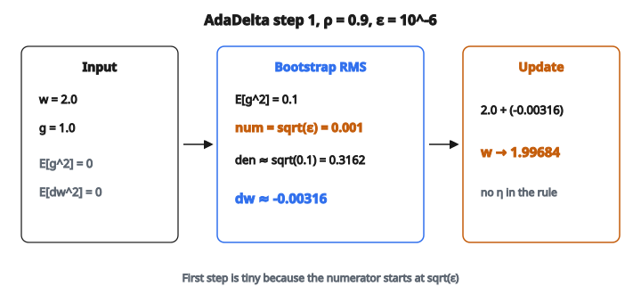

# AdaDelta Update Step

## Vấn đề learning rate

Mọi optimizer ta đã thấy đều đòi hỏi đặt một **learning rate** $\eta$. Đây có lẽ là hyperparameter quan trọng nhất và gây bực nhất trong deep learning:

* **Quá lớn**: huấn luyện phân kỳ, loss nhảy lên vô hạn hoặc NaN
* **Quá nhỏ**: huấn luyện bò chậm, mất rất lâu mới hội tụ
* **Phụ thuộc bài toán**: $\eta$ đúng cho một kiến trúc trên một dataset có thể hoàn toàn sai cho cái khác
* **Đổi trong lúc huấn luyện**: $\eta$ lý tưởng lúc đầu (khi muốn bước lớn) khác $\eta$ lý tưởng lúc cuối (khi muốn tinh chỉnh)

Người thực hành tốn công sức lớn để chỉnh learning rate: grid search, learning rate finder, lịch warmup, lịch decay. Nếu ta có thể loại learning rate hoàn toàn thì sao?

## AdaDelta: không cần learning rate

AdaDelta (Zeiler, 2012) được thiết kế đúng cho việc này. Nó tính cỡ bước tự động bằng cách duy trì hai thống kê chạy, và learning rate $\eta$ không xuất hiện ở bất kỳ chỗ nào trong công thức cập nhật.

Ý tưởng then chốt: **dùng tỉ số giữa root-mean-square của các cập nhật tham số gần đây và root-mean-square của các gradient gần đây làm cỡ bước.**

## Hai trung bình chạy

AdaDelta duy trì hai trung bình mũ có decay:

**1. Trung bình chạy của bình phương gradient** $E[g^2]_t$:

$$
E[g^2]_t = \rho \cdot E[g^2]_{t-1} + (1 - \rho) \cdot g_t^2
$$

* Giống hệt thứ RMSProp dùng
* $\rho$ là hệ số decay (thường $0.9$ hoặc $0.95$)
* Nó theo dõi “gradient gần đây lớn đến mức nào?”
* Root-mean-square là $\mathrm{RMS}[g]_t = \sqrt{E[g^2]_t + \epsilon}$

**2. Trung bình chạy của bình phương cập nhật tham số** $E[\Delta w^2]_t$:

$$
E[\Delta w^2]_t = \rho \cdot E[\Delta w^2]_{t-1} + (1 - \rho) \cdot (\Delta w_t)^2
$$

* Theo dõi “cập nhật tham số gần đây lớn đến mức nào?”
* $\Delta w_t$ là thay đổi thật sự áp lên tham số ở bước $t$
* Root-mean-square là $\mathrm{RMS}[\Delta w]_t = \sqrt{E[\Delta w^2]_t + \epsilon}$
* Accumulator thứ hai này là thứ làm AdaDelta độc đáo

## Quy tắc cập nhật

Thay đổi tham số ở bước $t$ là:

$$
\Delta w_t = -\frac{\mathrm{RMS}[\Delta w]_{t-1}}{\mathrm{RMS}[g]_t} \cdot g_t
$$

Khai triển các hạng RMS:

$$
\Delta w_t = -\frac{\sqrt{E[\Delta w^2]_{t-1} + \epsilon}}{\sqrt{E[g^2]_t + \epsilon}} \cdot g_t
$$

Rồi áp:

$$
w_t = w_{t-1} + \Delta w_t
$$

Và cập nhật accumulator thứ hai:

$$
E[\Delta w^2]_t = \rho \cdot E[\Delta w^2]_{t-1} + (1 - \rho) \cdot (\Delta w_t)^2
$$

Lưu ý: **không có learning rate $\eta$ ở bất kỳ đâu.** Cỡ bước hoàn toàn do tỉ số giữa cỡ cập nhật quá khứ và cỡ gradient hiện tại quyết định.

## Vì sao tỉ số này hợp lý

Tử số $\mathrm{RMS}[\Delta w]_{t-1}$ bắt “ta đã thay đổi tham số này nhiều đến mức nào?”

* Nếu cập nhật gần đây lớn, tử số lớn, cho phép bước lớn hơn
* Nếu cập nhật gần đây nhỏ, tử số nhỏ, cho bước nhỏ hơn
* Điều này tạo vòng phản hồi **tự hiệu chỉnh**

Mẫu số $\mathrm{RMS}[g]_t$ bắt “gradient lớn đến mức nào?” (giống RMSProp)

* Nếu gradient lớn, mẫu số lớn, bước nhỏ hơn
* Nếu gradient nhỏ, mẫu số nhỏ, bước lớn hơn
* Đây là hành vi **adaptive learning rate**

Cùng nhau, tỉ số đóng vai trò learning rate tự chỉnh, thích nghi theo động lực huấn luyện.

## Vấn đề bootstrap

Tại $t = 0$, cả hai accumulator được khởi tạo bằng không:

* $E[g^2]_0 = 0$
* $E[\Delta w^2]_0 = 0$

Với cập nhật đầu tiên:

* Mẫu số cập nhật ngay: $E[g^2]_1 = (1-\rho) g_1^2$ (khác không)
* Nhưng tử số dùng $E[\Delta w^2]_0 = 0$ (vì chưa có cập nhật nào)
* Nên $\mathrm{RMS}[\Delta w]_0 = \sqrt{0 + \epsilon} = \sqrt{\epsilon}$

Cập nhật đầu xấp xỉ:

$$
\Delta w_1 \approx -\frac{\sqrt{\epsilon}}{\sqrt{(1-\rho) g_1^2 + \epsilon}} \cdot g_1
$$

Giá trị này rất nhỏ (do $\epsilon$ kiểm soát, thường $10^{-6}$). AdaDelta bắt đầu với bước cực thận trọng rồi tăng dần cỡ bước khi accumulator cập nhật được lấp đầy. Đây là hành vi **warmup** tự nhiên.

## Ví dụ số

Tham số: $w = [2.0]$, accumulator: $E[g^2] = [0]$, $E[\Delta w^2] = [0]$, $\rho = 0.9$, $\epsilon = 10^{-6}$

**Bước 1** với gradient $g = [1.0]$:

1. Cập nhật accumulator gradient:

   * $E[g^2] = 0.9 \times 0 + 0.1 \times 1.0 = 0.1$
2. Tính cập nhật:

   * Tử số: $\sqrt{E[\Delta w^2] + \epsilon} = \sqrt{0 + 10^{-6}} = 0.001$
   * Mẫu số: $\sqrt{E[g^2] + \epsilon} = \sqrt{0.1 + 10^{-6}} \approx 0.3162$
   * $\Delta w = -\frac{0.001}{0.3162} \times 1.0 \approx -0.00316$
3. Áp cập nhật:

   * $w = 2.0 + (-0.00316) = 1.99684$
4. Cập nhật accumulator thay đổi tham số:

   * $E[\Delta w^2] = 0.9 \times 0 + 0.1 \times (0.00316)^2 \approx 0.000001$

::: {#fig-47-adadelta-step fig-cap="Bootstrap: RMS[Δw] = √ε = 0.001 nên Δw ≈ −0.00316; w: 2.0 → 1.99684." fig-alt="Bước AdaDelta đầu: w=2, g=1, tử số sqrt(eps)=0.001, mẫu số ≈0.3162, Δw≈-0.00316, w→1.99684."}
{fig-align="center"}
:::

Bước đầu rất nhỏ vì tử số bắt đầu từ $\sqrt{\epsilon}$. Qua các bước sau, khi $E[\Delta w^2]$ tích lũy, bước lớn dần.

**Bước 2** với gradient $g = [0.8]$:

1. $E[g^2] = 0.9 \times 0.1 + 0.1 \times 0.64 = 0.154$
2. Tử số: $\sqrt{0.000001 + 10^{-6}} \approx 0.00141$
3. Mẫu số: $\sqrt{0.154 + 10^{-6}} \approx 0.3924$
4. $\Delta w = -\frac{0.00141}{0.3924} \times 0.8 \approx -0.00288$

Các bước đang tăng dần khi accumulator cập nhật được lấp đầy.

## Chọn rho

$\rho$ là hyperparameter duy nhất (ngoài $\epsilon$):

* **$\rho = 0.9$**: cửa sổ hiệu dụng khoảng 10 bước. Mặc định trong hầu hết implementation.
* **$\rho = 0.95$**: cửa sổ khoảng 20 bước. Ước lượng mượt hơn, thích nghi chậm hơn.
* **$\rho = 0.99$**: cửa sổ khoảng 100 bước. Rất mượt, rất chậm thích nghi.
* **$\rho$ cao hơn** nghĩa là warmup chậm hơn (accumulator cập nhật lấp đầy chậm hơn)

## AdaDelta so với RMSProp và Adam

AdaDelta so với các optimizer adaptive khác:

* **RMSProp**: dùng cùng accumulator gradient, nhưng cần learning rate $\eta$. Không momentum. Dễ hiểu và chỉnh hơn.
* **AdaDelta**: thay learning rate bằng tỉ số accumulator cập nhật. Không có $\eta$ để chỉnh. Nhưng khó kiểm soát hơn: không thể chỉ “tăng learning rate” nếu huấn luyện chậm.
* **Adam**: dùng cả momentum và adaptive rate, cần $\eta$, có bias correction. Nhiều tính năng hơn, nhiều hyperparameter hơn, nhìn chung hiệu quả hơn.

Ưu điểm chính của AdaDelta là loại $\eta$. Nhược điểm chính là kiểm soát cỡ bước hạn chế. Trong thực tế, khả năng chỉnh $\eta$ (như trong Adam) thường nặng ký hơn sự tiện khi không có $\eta$.

## AdaDelta xuất hiện ở đâu

* **Nhận dạng tiếng nói**: AdaDelta từng phổ biến trong các mô hình speech sâu sớm, trước khi Adam chiếm ưu thế
* **Xử lý ngôn ngữ tự nhiên**: dùng trong một số công trình NLP deep learning sớm
* **Khi chỉnh hyperparameter đắt**: nếu thực sự không đủ sức chỉnh learning rate (ví dụ vòng huấn luyện rất dài), AdaDelta cho một cách tiếp cận buông tay hợp lý
* **Keras và TensorFlow**: có sẵn dưới `tf.keras.optimizers.Adadelta`
* **Về sư phạm**: AdaDelta quan trọng để hiểu ý tưởng rằng cỡ bước có thể suy ra từ động lực huấn luyện thay vì đặt tay

## Code
```python
import numpy as np

def adadelta_step(w, grad, E_grad_sq, E_update_sq, rho=0.9, eps=1e-6):
    """
    Perform one AdaDelta update step.
    """
    w = np.asarray(w, dtype=float)
    grad = np.asarray(grad, dtype=float)
    E_grad_sq = np.asarray(E_grad_sq, dtype=float)
    E_update_sq = np.asarray(E_update_sq, dtype=float)
    E_grad_sq_new = rho * E_grad_sq + (1.0 - rho) * (grad * grad)
    delta_w = -np.sqrt(E_update_sq + eps) / np.sqrt(E_grad_sq_new + eps) * grad
    E_update_sq_new = rho * E_update_sq + (1.0 - rho) * (delta_w * delta_w)
    w_new = w + delta_w
    return w_new, E_grad_sq_new, E_update_sq_new

```

<!-- auto-self-check -->

::: {.callout-note}
## Kiểm tra nhanh
<details>
<summary>Ý chính của bài «AdaDelta Update Step» là gì?</summary>
Mọi optimizer ta đã thấy đều đòi hỏi đặt một **learning rate** $\eta$.
</details>
<details>
<summary>Công thức / quan hệ cốt lõi trong bài là gì?</summary>
$$E[g^2]_t = \rho \cdot E[g^2]_{t-1} + (1 - \rho) \cdot g_t^2$$
</details>
:::
