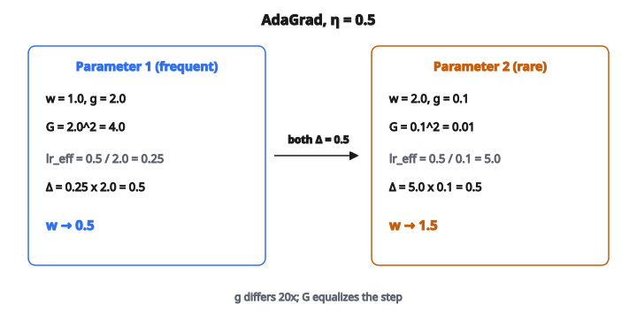

# AdaGrad Optimizer

## Vấn đề: một learning rate cho mọi tham số

Hạ gradient thuần dùng một learning rate cho mọi tham số trong mô hình:

$$
w_t = w_{t-1} - \eta \cdot g_t
$$

Mọi trọng số, mọi bias, mọi phần tử embedding đều nhân với cùng $\eta$. Đây là vấn đề vì các tham số có đặc trưng gradient rất khác nhau:

* **Trọng số gắn với feature thường xuyên** (như từ phổ biến trong NLP, hoặc pixel thường xuyên kích hoạt): chúng nhận gradient lớn trên hầu hết mini-batch. Learning rate tốt cho các tham số này có thể quá lớn, gây dao động.
* **Trọng số gắn với feature hiếm** (như từ ít gặp, hoặc đầu vào ít kích hoạt): chúng chỉ nhận gradient khác không thỉnh thoảng. Chúng gần như không dịch vì phần lớn thời gian gradient bằng không. Learning rate tốt cho các tham số này cần lớn hơn nhiều.

Một $\eta$ duy nhất không thỏa cả hai nhóm. Nếu chỉnh theo feature thường xuyên, feature hiếm học quá chậm. Nếu chỉnh theo feature hiếm, feature thường xuyên dao động.

## Ý tưởng cốt lõi: chia cho độ lớn gradient quá khứ

AdaGrad (Adaptive Gradient Algorithm, Duchi et al., 2011) cho mỗi tham số learning rate hiệu dụng riêng, dựa trên một nguyên tắc đơn giản: **tham số đã nhận gradient lớn trong quá khứ nên nhận learning rate nhỏ hơn bây giờ.**

Nó giữ một **accumulator** chạy $G_t$ cho mỗi tham số:

$$
G_t = G_{t-1} + g_t^2
$$

* $G$ bắt đầu từ 0
* Mỗi bước, bình phương gradient $g_t^2$ được cộng (theo phần tử)
* $G_t$ là **tổng mọi bình phương gradient quá khứ** đến bước $t$
* Với tham số luôn nhận gradient $1.0$: sau 100 bước, $G = 100$
* Với tham số chỉ nhận gradient $1.0$ đúng 5 lần: sau 100 bước, $G = 5$

Rồi quy tắc cập nhật chia cho căn bậc hai của $G_t$:

$$
w_t = w_{t-1} - \frac{\eta}{\sqrt{G_t + \epsilon}} \cdot g_t
$$

* $\epsilon$ (thường $10^{-8}$) tránh chia cho không khi $G_t = 0$
* Mẫu số $\sqrt{G_t}$ lớn với tham số được cập nhật thường xuyên, làm learning rate hiệu dụng nhỏ
* Mẫu số nhỏ với tham số ít được cập nhật, làm learning rate hiệu dụng lớn

## Ví dụ số

Tham số: $w = [1.0, 2.0]$, accumulator: $G = [0.0, 0.0]$, gradient: $g = [2.0, 0.1]$, $\eta = 0.5$

**Cập nhật accumulator** (theo phần tử):

* $G_1 = 0 + (2.0)^2 = 4.0$
* $G_2 = 0 + (0.1)^2 = 0.01$

**Tính learning rate hiệu dụng**:

* Tham số 1: $\frac{\eta}{\sqrt{G_1 + \epsilon}} = \frac{0.5}{\sqrt{4.0}} = \frac{0.5}{2.0} = 0.25$
* Tham số 2: $\frac{\eta}{\sqrt{G_2 + \epsilon}} = \frac{0.5}{\sqrt{0.01}} = \frac{0.5}{0.1} = 5.0$

**Cập nhật tham số**:

* $w_1 = 1.0 - 0.25 \times 2.0 = 1.0 - 0.5 = 0.5$
* $w_2 = 2.0 - 5.0 \times 0.1 = 2.0 - 0.5 = 1.5$

::: {#fig-44-adagrad-adapt fig-cap="G = [4, 0.01] cho lr hiệu dụng 0.25 so với 5.0; cả hai tham số dịch Δ = 0.5 dù g lệch 20 lần." fig-alt="Hai tham số AdaGrad: g=[2, 0.1], G=[4, 0.01], lr hiệu dụng 0.25 so với 5.0; cả hai Δ = 0.5."}
{fig-align="center"}
:::

Cả hai tham số dịch cùng một lượng ($0.5$), dù gradient của tham số 1 lớn gấp 20 lần. AdaGrad tự động san đều cỡ bước.

Giả sử ta làm thêm một bước với gradient $g = [2.0, 0.0]$:

**Cập nhật accumulator**:

* $G_1 = 4.0 + 4.0 = 8.0$
* $G_2 = 0.01 + 0.0 = 0.01$ (không đổi, gradient bằng không)

**Learning rate hiệu dụng**:

* Tham số 1: $\frac{0.5}{\sqrt{8.0}} \approx 0.177$ (giảm từ $0.25$)
* Tham số 2: $\frac{0.5}{\sqrt{0.01}} = 5.0$ (không đổi)

Learning rate của tham số 1 đã co vì nó liên tục nhận gradient lớn. Rate của tham số 2 giữ nguyên vì bước này không nhận gradient. Đây đúng là hành vi thích nghi ta muốn.

## Vấn đề decay đơn điệu

Accumulator $G_t$ là một **tổng**. Nó chỉ tăng. Nó không bao giờ giảm. Nghĩa là learning rate hiệu dụng $\frac{\eta}{\sqrt{G_t}}$ chỉ giảm theo thời gian.

Sau đủ nhiều bước:

* $G_t$ trở nên rất lớn cho mọi tham số (kể cả feature hiếm cuối cùng cũng tích đủ)
* Learning rate hiệu dụng tiến về không
* Mô hình về cơ bản ngừng học

Đây là vấn đề mang tính nguyên lý:

* **Với tối ưu lồi**: learning rate giảm dần thực ra là một tính năng. Lý thuyết nói ta muốn learning rate giảm như $O(1/\sqrt{t})$ để hội tụ tối ưu, và đúng đó là thứ AdaGrad cung cấp. Nó có tốc độ hội tụ tối ưu được chứng minh cho bài toán lồi.
* **Với deep learning (không lồi)**: bề mặt loss phức tạp. Có thể cần cập nhật lớn muộn trong huấn luyện (ví dụ để thoát saddle point hoặc đi vào vùng mới). Rate decay vĩnh viễn của AdaGrad ngăn điều này.

Đó là lý do RMSProp và Adam thay AdaGrad cho hầu hết tác vụ deep learning. Chúng dùng **trung bình có decay** thay vì tổng, nên learning rate hiệu dụng có thể phục hồi.

## AdaGrad vượt trội ở đâu

Dù có vấn đề decay, AdaGrad vẫn là lựa chọn tốt nhất trong một số bối cảnh cụ thể:

* **Feature thưa**: tác vụ NLP với biểu diễn bag-of-words, hầu hết feature bằng không. Từ “the” nhận gradient mọi batch, nhưng từ “serendipity” nhận gradient hiếm. AdaGrad tự động cho “serendipity” learning rate lớn hơn nhiều, nên nó học hiệu quả từ ít tín hiệu gradient.
* **Hệ khuyến nghị**: ma trận tương tác user–item cực thưa. Item phổ biến có nhiều tương tác (nhiều gradient), item niche có ít. AdaGrad cân bằng chúng một cách tự nhiên.
* **Bài toán lồi**: với logistic regression, SVM, và các loss lồi khác, tốc độ hội tụ của AdaGrad tối ưu về mặt lý thuyết.
* **Online learning**: bối cảnh dữ liệu đến từng mẫu một và cần học ngay từ mỗi mẫu.

## Di sản của AdaGrad

Dù AdaGrad ít được dùng trực tiếp trong deep learning hiện đại, mọi optimizer lớn đều xây trên ý tưởng của nó:

* **RMSProp**: thay tổng của AdaGrad bằng trung bình có decay (sửa vấn đề decay)
* **Adam**: thêm momentum lên adaptive rate của RMSProp
* **AdamW**: sửa tương tác weight decay của Adam
* **Nadam**: thêm Nesterov momentum vào Adam

Hiểu AdaGrad là hiểu nền tảng của cả họ optimizer adaptive.

## Code
```python
import numpy as np

def adagrad_step(w, g, G, lr=0.01, eps=1e-8):
    """
    Perform one AdaGrad update step.
    """
    w = np.array(w, dtype=float)
    g = np.array(g, dtype=float)
    G = np.array(G, dtype=float)
    G_new = G + g ** 2
    w_new = w - lr / np.sqrt(G_new + eps) * g
    return np.round(w_new, 6).tolist(), np.round(G_new, 6).tolist()

```
