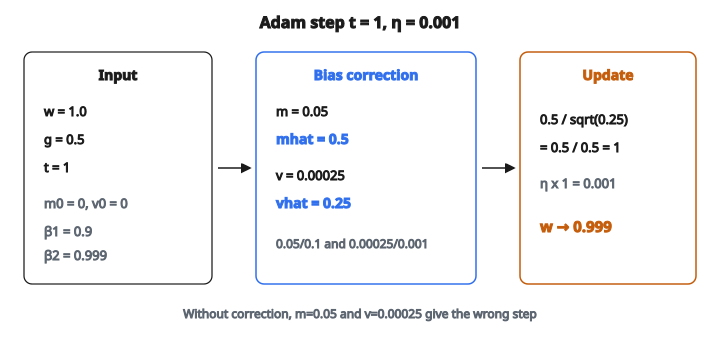

# Adam Optimizer Step

## Hai ý tưởng lớn của optimizer hiện đại

Sự tiến hóa của optimizer cho deep learning được xây trên hai ý tưởng tách biệt, mỗi ý giải một vấn đề khác nhau:

**Ý tưởng 1: Momentum (moment bậc một)**

Thay vì chỉ dùng gradient hiện tại, duy trì một trung bình chạy của các gradient quá khứ. Đây là “first moment” (kỳ vọng / trung bình).

Vì sao momentum giúp:

* **Làm mượt gradient nhiễu**: gradient của mini-batch là ước lượng nhiễu. Trung bình trên nhiều bước cho hướng đáng tin hơn.
* **Tăng tốc theo hướng nhất quán**: nếu gradient liên tục chỉ cùng một hướng, trung bình chạy lớn dần và bước đi lớn hơn.
* **Dập dao động**: trong thung lũng hẹp, gradient đổi dấu luân phiên; các dao động triệt tiêu nhau trong trung bình chạy.

Công thức:

$$
m_t = \beta_1 \cdot m_{t-1} + (1 - \beta_1) \cdot g_t
$$

Với $\beta_1 = 0.9$, gradient hiện tại đóng góp 10% và lịch sử tích lũy đóng góp 90%.

**Ý tưởng 2: Adaptive learning rate (moment bậc hai)**

Theo dõi gradient đã lớn đến mức nào cho từng tham số và co bước cập nhật theo nghịch đảo. Đây là “second moment” (phương sai không tâm).

Vì sao adaptive rate giúp:

* **Tham số có gradient lớn** (feature phổ biến, neuron thường xuyên kích hoạt) tự động nhận bước nhỏ hơn. Chúng không vượt quá.
* **Tham số có gradient nhỏ** (feature hiếm, neuron ít kích hoạt) tự động nhận bước lớn hơn. Chúng không bị bỏ lại.
* **Không cần chỉnh một learning rate riêng cho từng tham số**: sự thích nghi diễn ra tự động.

Công thức:

$$
v_t = \beta_2 \cdot v_{t-1} + (1 - \beta_2) \cdot g_t^2
$$

Với $\beta_2 = 0.999$, đây là trung bình biến đổi chậm của bình phương gradient.

**SGD + momentum** chỉ dùng ý tưởng 1. **RMSProp** chỉ dùng ý tưởng 2. **Adam** kết hợp cả hai.

## Vấn đề bias correction

Cả $m$ và $v$ được khởi tạo bằng vector không. Đầu quá trình huấn luyện, điều này tạo bias:

Với $\beta_1 = 0.9$ và $m_0 = 0$:

* Bước 1: $m_1 = 0.9 \times 0 + 0.1 \times g_1 = 0.1 g_1$

Ước lượng chỉ bằng **10% gradient thật**. Không phải vì gradient nhỏ; mà vì trung bình mũ chưa kịp ấm lên.

Cùng vấn đề với $v$. Với $\beta_2 = 0.999$:

* Bước 1: $v_1 = 0.001 \times g_1^2$. Chỉ **0.1%** bình phương gradient thật.

Không hiệu chỉnh, vài bước đầu sẽ có độ lớn sai lệch mạnh. Cách sửa là **bias correction**:

$$
\hat{m}_t = \frac{m_t}{1 - \beta_1^t}
$$

$$
\hat{v}_t = \frac{v_t}{1 - \beta_2^t}
$$

Cách hiệu chỉnh hoạt động ở bước 1:

* $\hat{m}_1 = \frac{0.1 g_1}{1 - 0.9^1} = \frac{0.1 g_1}{0.1} = g_1$ (đúng)
* $\hat{v}_1 = \frac{0.001 g_1^2}{1 - 0.999^1} = \frac{0.001 g_1^2}{0.001} = g_1^2$ (đúng)

Cách hiệu chỉnh tắt dần theo thời gian:

* Bước 10: $1 - 0.9^{10} = 1 - 0.349 = 0.651$ (hiệu chỉnh vừa)
* Bước 100: $1 - 0.9^{100} \approx 1.0$ (gần như không cần hiệu chỉnh)
* Bước 1000: $1 - \beta_2^{1000} \approx 1.0$ cho cả hai moment

Hiệu chỉnh then chốt ở khoảng 10–20 bước đầu và trở nên không đáng kể về sau.

## Cập nhật Adam đầy đủ

Cho tham số $w$, gradient $g_t$, và số bước $t$:

**Bước 1**: Cập nhật moment bậc một (momentum)

$$
m_t = \beta_1 \cdot m_{t-1} + (1 - \beta_1) \cdot g_t
$$

**Bước 2**: Cập nhật moment bậc hai (adaptive rate)

$$
v_t = \beta_2 \cdot v_{t-1} + (1 - \beta_2) \cdot g_t^2
$$

**Bước 3**: Bias-correct cả hai moment

$$
\hat{m}_t = \frac{m_t}{1 - \beta_1^t} \qquad \hat{v}_t = \frac{v_t}{1 - \beta_2^t}
$$

**Bước 4**: Cập nhật tham số

$$
w_t = w_{t-1} - \eta \cdot \frac{\hat{m}_t}{\sqrt{\hat{v}_t} + \epsilon}
$$

Cập nhật tách thành:

* **Hướng**: do $\hat{m}_t$ quyết định (đi về phía nào)
* **Độ lớn theo từng tham số**: co bởi $\frac{1}{\sqrt{\hat{v}_t} + \epsilon}$ (đi bao xa cho mỗi tham số)
* **Thang toàn cục**: do $\eta$ kiểm soát (learning rate tổng)

## Ví dụ số

Tham số: $w = [1.0]$, moment: $m = [0]$, $v = [0]$, gradient: $g = [0.5]$, bước $t = 1$, $\eta = 0.001$

**Bước 1**: $m_1 = 0.9 \times 0 + 0.1 \times 0.5 = 0.05$

**Bước 2**: $v_1 = 0.999 \times 0 + 0.001 \times 0.25 = 0.00025$

**Bước 3** (bias correction):

* $\hat{m}_1 = \frac{0.05}{1 - 0.9} = \frac{0.05}{0.1} = 0.5$ (hiệu chỉnh từ 0.05 lên 0.5)
* $\hat{v}_1 = \frac{0.00025}{1 - 0.999} = \frac{0.00025}{0.001} = 0.25$ (hiệu chỉnh từ 0.00025 lên 0.25)

**Bước 4**:

$$
\begin{aligned}
w_1
&= 1.0 - 0.001 \times \frac{0.5}{\sqrt{0.25} + 10^{-8}} \\
&= 1.0 - 0.001 \times \frac{0.5}{0.5} \\
&= 1.0 - 0.001 \\
&= 0.999
\end{aligned}
$$

::: {#fig-7-adam-step fig-cap="Tại t = 1, bias correction khôi phục m̂ = 0.5 và v̂ = 0.25; tỉ số đơn vị cho w: 1.0 → 0.999." fig-alt="Ba hộp: đầu vào w=1.0, g=0.5, t=1; bias correction m=0.05 → mhat=0.5 và v=0.00025 → vhat=0.25; cập nhật w → 0.999."}
{fig-align="center"}
:::

Không có bias correction, $\hat{m}_1$ sẽ là 0.05 và $\hat{v}_1$ sẽ là 0.00025, cho một cập nhật rất khác (và sai).

## Hyperparameter mặc định

Bài báo Adam (Kingma và Ba, 2015) đề xuất:

* $\eta = 0.001$: learning rate. Đây là nút chỉnh chính.
* $\beta_1 = 0.9$: decay của moment bậc một. Trung bình khoảng 10 gradient gần nhất.
* $\beta_2 = 0.999$: decay của moment bậc hai. Trung bình khoảng 1000 bình phương gradient gần nhất.
* $\epsilon = 10^{-8}$: hằng số ổn định số. Tránh chia cho không khi $\hat{v}_t$ rất nhỏ.

Vì sao $\beta_2$ lớn hơn $\beta_1$ nhiều:

* **Hướng** gradient có thể đổi nhanh (đang hạ theo một feature, rồi feature khác)
* **Độ lớn** gradient đổi chậm (tham số có gradient lớn thường tiếp tục có gradient lớn)
* Vì vậy moment bậc hai nên có **bộ nhớ dài hơn** moment bậc một

Các mặc định này hoạt động tốt trên nhiều tác vụ. Hầu hết người thực hành chỉ chỉnh $\eta$ và giữ phần còn lại.

## Vì sao Adam trở thành optimizer mặc định

Adam trở thành optimizer phổ biến nhất trong deep learning vì:

* **Chạy được ngay**: hyperparameter mặc định ổn cho hầu hết tác vụ. Ít phải chỉnh hơn SGD.
* **Hội tụ nhanh**: momentum + adaptive rate đi trên bề mặt loss hiệu quả.
* **Xử lý được gradient thưa**: adaptive rate tự động cho feature hiếm bước cập nhật lớn hơn (kế thừa từ AdaGrad/RMSProp).
* **Bền với lựa chọn hyperparameter**: dù $\eta$ chưa chỉnh hoàn hảo, Adam vẫn chạy tương đối tốt.

Hạn chế đã biết:

* **Khe generalization**: trên một số tác vụ (đặc biệt phân loại ảnh với CNN), SGD + momentum chỉnh kỹ có thể cho mô hình generalization tốt hơn trên tập test.
* **Tương tác với weight decay**: khi thêm L2 regularization vào Adam, adaptive rate can thiệp regularization. Đó là lý do **AdamW** (decoupled weight decay) ra đời.
* **Chi phí bộ nhớ**: Adam lưu $m$ và $v$ (cùng kích thước với tham số), gấp ba bộ nhớ so với SGD.
* **Thiên về cực tiểu nhọn**: một số nghiên cứu gợi ý Adam có xu hướng hội tụ tới cực tiểu nhọn hơn SGD, có thể giải thích khe generalization.

## Code
```python
import numpy as np

def adam_step(param, grad, m, v, t, lr=1e-3, beta1=0.9, beta2=0.999, eps=1e-8):
    """
    One Adam optimizer update step.
    Return (param_new, m_new, v_new).
    """
    param = np.asarray(param, dtype=float)
    grad = np.asarray(grad, dtype=float)
    m = np.asarray(m, dtype=float)
    v = np.asarray(v, dtype=float)
    m_t = beta1 * m + (1.0 - beta1) * grad
    v_t = beta2 * v + (1.0 - beta2) * (grad * grad)
    m_hat = m_t / (1.0 - beta1 ** t)
    v_hat = v_t / (1.0 - beta2 ** t)
    param_new = param - lr * (m_hat / (np.sqrt(v_hat) + eps))
    return param_new, m_t, v_t

```
