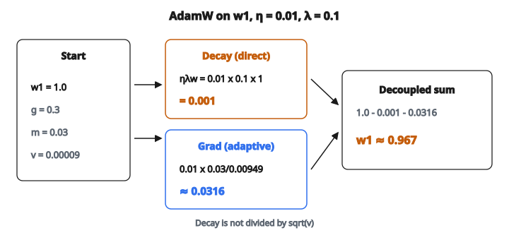

# AdamW (Decoupled Weight Decay)

## Weight decay làm gì

Mạng nơ-ron với hàng triệu tham số có thể ghi nhớ dữ liệu huấn luyện thay vì học mẫu tổng quát. **Weight decay** là kỹ thuật regularization ngăn mô hình phụ thuộc vào bất kỳ tham số đơn lẻ nào quá lớn.

Ý tưởng: mỗi bước huấn luyện, co mọi trọng số nhẹ về phía không. Nếu trọng số lớn, nó bị phạt nhiều hơn. Nếu trọng số gần không, nó gần như không đổi. Điều này giữ độ lớn tổng thể của tham số mạng trong tầm kiểm soát.

Về toán, weight decay thêm một phạt tỉ lệ với chính trọng số:

$$
w_t = w_{t-1} - \eta \cdot \lambda \cdot w_{t-1}
$$

* $\lambda$ là hệ số decay (thường $0.01$ đến $0.1$)
* Mỗi bước, mọi trọng số được nhân với $(1 - \eta \lambda)$, hơi nhỏ hơn $1$
* Qua nhiều bước, điều này ngăn trọng số tăng không giới hạn

## L2 regularization so với weight decay

Hai thuật ngữ này thường bị dùng thay lẫn nhau, nhưng chúng **không cùng một thứ** khi kết hợp với optimizer adaptive như Adam. Phân biệt này chính là lý do AdamW tồn tại.

**L2 regularization** thêm phạt vào **hàm mất mát**:

$$
L_{\text{total}} = L_{\text{original}} + \frac{\lambda}{2} \sum w_i^2
$$

Khi tính gradient của loss đã sửa, gradient trở thành:

$$
g_t^{\text{L2}} = g_t + \lambda \cdot w_{t-1}
$$

Hạng regularization $\lambda \cdot w_{t-1}$ bị trộn vào gradient. Với SGD thuần, điều này tương đương weight decay. Nhưng với Adam thì không.

**Weight decay** co tham số trực tiếp, hoàn toàn tách khỏi gradient:

$$
w_t = w_{t-1} - \eta \cdot \lambda \cdot w_{t-1} - \eta \cdot \text{(cập nhật theo gradient)}
$$

Decay xảy ra độc lập, không đi qua gradient.

## Vì sao L2 + Adam bị hỏng

Với Adam, gradient bị chia cho $\sqrt{v_t}$, trong đó $v_t$ là trung bình chạy của bình phương gradient. Đây là thứ cho Adam adaptive learning rate.

Khi dùng L2 regularization với Adam, hạng regularization $\lambda \cdot w$ bị trộn vào gradient **trước** khi adaptive scaling xảy ra:

1. Gradient đã sửa: $g_t^{\text{L2}} = g_t + \lambda \cdot w_{t-1}$
2. Moment bậc hai: $v_t = \beta_2 v_{t-1} + (1 - \beta_2)(g_t^{\text{L2}})^2$
3. Cập nhật: $w_t = w_{t-1} - \eta \cdot \frac{m_t}{\sqrt{v_t} + \epsilon}$

Vấn đề: tín hiệu weight decay ($\lambda \cdot w$) đang bị **chia cho** $\sqrt{v_t}$. Với tham số có gradient lớn, $v_t$ lớn, nên hiệu ứng decay bị yếu đi. Với tham số có gradient nhỏ, $v_t$ nhỏ, nên hiệu ứng decay bị khuếch đại.

Nghĩa là:

* Tham số đang học tích cực (gradient lớn) gần như không bị regularization
* Tham số gần như không đổi (gradient nhỏ) bị regularization mạnh
* Cường độ regularization hiệu dụng phụ thuộc độ lớn gradient — ngược với điều ta muốn

## AdamW: cách sửa

AdamW (Loshchilov và Hutter, 2019) giải quyết bằng cách **tách** (decouple) weight decay khỏi cập nhật gradient. Weight decay được áp trực tiếp lên tham số, hoàn toàn bỏ qua adaptive scaling.

Ba bước:

**Bước 1**: Cập nhật moment bậc một (giống Adam)

$$
m_t = \beta_1 m_{t-1} + (1 - \beta_1) g_t
$$

**Bước 2**: Cập nhật moment bậc hai (giống Adam)

$$
v_t = \beta_2 v_{t-1} + (1 - \beta_2) g_t^2
$$

**Bước 3**: Cập nhật tham số (khác Adam)

$$
w_t = w_{t-1} - \eta \cdot \lambda \cdot w_{t-1} - \eta \cdot \frac{m_t}{\sqrt{v_t} + \epsilon}
$$

Cập nhật có hai hạng tách biệt:

* $\eta \cdot \lambda \cdot w_{t-1}$: weight decay, áp trực tiếp lên tham số. Không bị $v_t$ ảnh hưởng chút nào.
* $\eta \cdot \frac{m_t}{\sqrt{v_t} + \epsilon}$: cập nhật gradient adaptive, đúng như Adam chuẩn.

Weight decay giờ tác động đều mọi tham số (tỉ lệ với độ lớn của nó), bất kể lịch sử gradient. Đây là phần “decoupled”.

## Ví dụ số

Tham số: $w = [1.0, -2.0]$, moment: $m = [0.0, 0.0]$, $v = [0.0, 0.0]$, gradient: $g = [0.3, -0.7]$, $\eta = 0.01$, $\lambda = 0.1$, $\beta_1 = 0.9$, $\beta_2 = 0.999$

**Bước 1** (moment bậc một):

* $m_1 = 0.9 \times 0 + 0.1 \times 0.3 = 0.03$
* $m_2 = 0.9 \times 0 + 0.1 \times (-0.7) = -0.07$

**Bước 2** (moment bậc hai):

* $v_1 = 0.999 \times 0 + 0.001 \times 0.09 = 0.00009$
* $v_2 = 0.999 \times 0 + 0.001 \times 0.49 = 0.00049$

**Bước 3** (cập nhật tham số cho $w_1$):

* Weight decay: $0.01 \times 0.1 \times 1.0 = 0.001$
* Cập nhật gradient: $0.01 \times \frac{0.03}{\sqrt{0.00009} + 10^{-8}} = 0.01 \times \frac{0.03}{0.00949} \approx 0.0316$

$$
\begin{aligned}
w_1 &= 1.0 - 0.001 - 0.0316 \\
    &\approx 0.967
\end{aligned}
$$

::: {#fig-46-adamw-decouple fig-cap="Hai hạng tách rời trên w₁: decay 0.001 (không qua v) và gradient 0.0316; w: 1.0 → 0.967." fig-alt="AdamW trên w1: decay 0.001 cộng cập nhật gradient 0.0316, tách rời, cho w = 0.967."}
{fig-align="center"}
:::

Weight decay ($0.001$) và cập nhật gradient ($0.0316$) độc lập. Decay không bị co bởi moment bậc hai.

## Vì sao quan trọng trong thực tế

AdamW đã trở thành **optimizer mặc định** để huấn luyện Transformer và mô hình ngôn ngữ lớn:

* **GPT, BERT, T5**: đều huấn luyện với AdamW
* **Vision Transformer (ViT)**: dùng AdamW thay cho SGD+momentum (từng là chuẩn cho CNN)
* **Fine-tune mô hình pretrained**: AdamW với weight decay nhỏ là công thức chuẩn

Lợi ích thực tế:

* Learning rate và weight decay có thể chỉnh **độc lập**. Đổi cái này không làm thay đổi cách cái kia hoạt động.
* Generalization tốt hơn: regularization hoạt động đúng ý, dẫn tới mô hình tốt hơn trên dữ liệu test
* Giá trị weight decay điển hình: $0.01$ đến $0.1$, với $0.01$ là mặc định phổ biến nhất

## Trường hợp đặc biệt: weight decay bằng không

Khi weight decay $= 0$, AdamW trùng với Adam chuẩn. Hạng weight decay biến mất:

$$
w_t = w_{t-1} - 0 - \eta \cdot \frac{m_t}{\sqrt{v_t} + \epsilon}
$$

Nhờ đó AdamW là tổng quát hóa chặt của Adam. Luôn có thể dùng AdamW và đặt $\lambda = 0$ để lấy lại hành vi Adam.

## Code
```python
import numpy as np

def adamw_step(w, m, v, grad, lr=0.001, beta1=0.9, beta2=0.999, weight_decay=0.01, eps=1e-8):
    """
    Perform one AdamW update step.
    """
    w = np.asarray(w, dtype=float)
    m = np.asarray(m, dtype=float)
    v = np.asarray(v, dtype=float)
    grad = np.asarray(grad, dtype=float)
    m_new = beta1 * m + (1.0 - beta1) * grad
    v_new = beta2 * v + (1.0 - beta2) * (grad * grad)
    w_new = w - lr * weight_decay * w - lr * m_new / (np.sqrt(v_new) + eps)
    return w_new, m_new, v_new

```

<!-- auto-self-check -->

::: {.callout-note}
## Kiểm tra nhanh
<details>
<summary>Ý chính của bài «AdamW (Decoupled Weight Decay)» là gì?</summary>
Mạng nơ-ron với hàng triệu tham số có thể ghi nhớ dữ liệu huấn luyện thay vì học mẫu tổng quát.
</details>
<details>
<summary>Công thức / quan hệ cốt lõi trong bài là gì?</summary>
$$w_t = w_{t-1} - \eta \cdot \lambda \cdot w_{t-1}$$
</details>
:::
