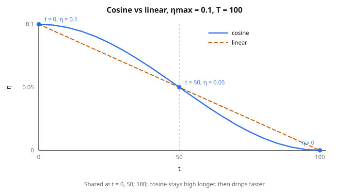

# Cosine Annealing LR Scheduler

## Vì sao cần decay learning rate

Trong huấn luyện, learning rate kiểm soát kích thước bước của mỗi lần cập nhật tham số. Kích thước bước lý tưởng đổi theo giai đoạn huấn luyện:

* **Đầu huấn luyện**: mô hình còn xa mọi cực tiểu. Cần bước lớn để thăm mặt loss và tiến nhanh. Learning rate cao cho phép optimizer phủ quãng đường nhanh.
* **Giữa huấn luyện**: mô hình đang ở vùng hứa hẹn. Bước vừa giúp đi về cực tiểu tốt mà không overshoot.
* **Cuối huấn luyện**: mô hình đã gần cực tiểu. Cần bước nhỏ để ổn định chính xác. Bước lớn sẽ nảy tham số qua lại qua cực tiểu.

Learning rate **cố định** luôn là sự thỏa hiệp. Learning rate scheduler giải quyết bằng cách **giảm tốc độ theo thời gian**, để có phần tốt của mọi pha.

## Vấn đề của linear decay

Lịch đơn giản nhất là linear decay: learning rate giảm với tốc độ không đổi từ đầu tới cuối.

$$
\eta(t) = \eta_{\max} - (\eta_{\max} - \eta_{\min}) \cdot \frac{t}{T}
$$

Cách này chạy được, nhưng hình dạng chưa tối ưu. Linear decay:

* Giảm nhanh lúc đầu, nơi ta thực ra muốn **giữ** tốc độ cao để thăm dò
* Giảm cùng tốc độ ở giữa, nơi phần lớn học hữu ích diễn ra
* Giảm tuyến tính lúc cuối, khi tốc độ đã nhỏ và giảm thêm ít tác động

Lý tưởng, ta muốn một lịch:

* **Giữ cao lâu hơn** lúc đầu (thêm thời gian thăm dò)
* **Giảm nhanh hơn ở giữa** (chuyển từ thăm dò sang khai thác)
* **Làm phẳng lúc cuối** (hội tụ nhẹ, không đổi đột ngột)

Đây đúng là hình của một đường cosine.

## Công thức cosine annealing

$$
\eta_t = \eta_{\min} + \frac{1}{2}(\eta_{\max} - \eta_{\min})\left(1 + \cos\left(\frac{t}{T} \cdot \pi\right)\right)
$$

Tách từng phần:

* Hàm cosine vẽ nửa chu kỳ, từ $\cos(0) = 1$ tới $\cos(\pi) = -1$
* Cộng $1$ dịch khoảng thành $[0, 2]$
* Nhân $\frac{1}{2}$ scale lại thành $[0, 1]$
* Nhân $(\eta_{\max} - \eta_{\min})$ scale vào khoảng learning rate
* Cộng $\eta_{\min}$ dịch thành $[\eta_{\min}, \eta_{\max}]$

Kết quả là đường cong mượt từ $\eta_{\max}$ xuống $\eta_{\min}$.

## Đi theo đường cong từng bước

Với $\eta_{\max} = 0.1$, $\eta_{\min} = 0$, $T = 100$:

**Tại $t = 0$** (bắt đầu):

* $\cos(0) = 1$
* $\eta = 0 + 0.05 \times (1 + 1) = 0.05 \times 2 = 0.1$ (learning rate đầy đủ)

**Tại $t = 10$** (đã đi $10\%$):

* $\cos(0.1\pi) = \cos(18^{\circ}) \approx 0.951$
* $\eta = 0.05 \times (1 + 0.951) = 0.05 \times 1.951 \approx 0.0976$ (gần như chưa giảm)

**Tại $t = 25$** (đã đi $25\%$):

* $\cos(0.25\pi) = \cos(45^{\circ}) \approx 0.707$
* $\eta = 0.05 \times 1.707 \approx 0.0854$ (vẫn cao)

**Tại $t = 50$** (nửa đường):

* $\cos(0.5\pi) = \cos(90^{\circ}) = 0$
* $\eta = 0.05 \times 1 = 0.05$ (đúng trung điểm)

**Tại $t = 75$** (đã đi $75\%$):

* $\cos(0.75\pi) = \cos(135^{\circ}) \approx -0.707$
* $\eta = 0.05 \times 0.293 \approx 0.0146$ (đang giảm nhanh)

**Tại $t = 90$** (đã đi $90\%$):

* $\cos(0.9\pi) \approx -0.951$
* $\eta = 0.05 \times 0.049 \approx 0.0024$ (gần cực tiểu)

**Tại $t = 100$** (kết thúc):

* $\cos(\pi) = -1$
* $\eta = 0.05 \times 0 = 0$ (đúng $\eta_{\min}$)

So với linear decay tại cùng các điểm: $0.1$, $0.09$, $0.075$, $0.05$, $0.025$, $0.01$, $0$. Cosine giữ tốc độ cao lâu hơn trong nửa đầu, rồi giảm dốc hơn.

::: {#fig-126-cosine-anneal fig-cap="Cosine annealing với ηmax = 0.1, T = 100: t = 0 → 0.1, t = 50 → 0.05, t = 100 → 0. Trùng linear tại ba điểm đó; lệch ở giữa mỗi nửa." fig-alt="Hai đường η(t) trên T = 100, ηmax = 0.1: cosine (liền) và linear (nét đứt); đánh dấu t = 0 → 0.1, t = 50 → 0.05, t = 100 → 0."}
{fig-align="center"}
:::

## Cosine vs linear: khác biệt then chốt

Nhìn ngân sách huấn luyện được dùng ở các mức learning rate khác nhau:

**Linear decay**:

* Thời gian bằng nhau ở mọi learning rate
* $25\%$ huấn luyện nằm trên $\eta = 0.075$
* $25\%$ nằm giữa $0.05$ và $0.075$
* $25\%$ nằm giữa $0.025$ và $0.05$
* $25\%$ nằm dưới $0.025$

**Cosine annealing**:

* Nhiều thời gian hơn ở tốc độ cao và thấp, ít hơn ở giữa
* $\sim 35\%$ huấn luyện nằm trên $\eta = 0.075$ (thăm dò nhiều hơn)
* $\sim 15\%$ nằm giữa $0.05$ và $0.075$
* $\sim 15\%$ nằm giữa $0.025$ và $0.05$
* $\sim 35\%$ nằm dưới $0.025$ (tinh chỉnh nhiều hơn)

Cosine dành nhiều thời gian hơn ở các chế độ hữu ích (tốc độ cao để thăm dò, tốc độ thấp để hội tụ) và ít hơn ở vùng trung gian.

## Warm restart (SGDR)

Một mở rộng mạnh là **cosine annealing with warm restarts** (Loshchilov và Hutter, 2017, paper “SGDR”):

Thay vì một đường cosine dài, chạy nhiều chu kỳ ngắn hơn:

1. Bắt đầu tại $\eta_{\max}$, anneal về $\eta_{\min}$ trong $T_0$ bước
2. **Restart**: nhảy learning rate trở lại $\eta_{\max}$
3. Anneal lại, nhưng trong $T_1 = T_0 \times \text{mult}$ bước (chu kỳ dài hơn)
4. Restart nữa, anneal trong $T_2 = T_1 \times \text{mult}$ bước
5. Tiếp tục...

Vì sao restart giúp:

* Mỗi lần restart cho optimizer **learning rate lớn trở lại**, có thể đẩy nó ra khỏi cực tiểu địa phương chưa tốt
* Mô hình có thể thăm một vùng mới của mặt loss
* Các chu kỳ dài dần cho phép hội tụ tinh hơn ở các chu kỳ sau
* Đây là dạng **tradeoff thăm dò–khai thác** gắn vào lịch

Với $\text{mult} = 2$: chu kỳ dài $10$, $20$, $40$, $80$, ... bước.

## Xử lý bước vượt tổng số bước

Khi bước hiện tại $t$ vượt $T$, hầu hết cài đặt kẹp learning rate tại $\eta_{\min}$. Công thức cosine sẽ ngoại suy ra ngoài $\cos(\pi)$, khiến learning rate bắt đầu tăng lại. Kẹp ngăn việc này.

Một số cài đặt cho phép “vượt” này có chủ đích như một dạng warm restart (một chu kỳ cosine đầy đủ thay vì nửa chu kỳ).

## Cosine annealing xuất hiện ở đâu

* **Phân loại ảnh**: cosine annealing là lịch chuẩn khi huấn luyện ResNet, EfficientNet, ConvNeXt và Vision Transformer. Nó đã gần như thay step decay (cách cũ: giảm learning rate $10\times$ tại các epoch cụ thể).
* **Large language model**: nhiều công thức huấn luyện LLM dùng warmup + cosine decay. GPT-3 và các mô hình tương tự dùng cách này.
* **Contrastive learning**: SimCLR, MoCo, CLIP và các phương pháp self-supervised khác dùng lịch cosine.
* **Object detection và segmentation**: DETR, Mask R-CNN và các mô hình detection khác thường dùng cosine annealing.
* **Như mặc định**: khi phân vân lịch nào, cosine annealing là lựa chọn an toàn. Nó chạy ít nhất ngang linear decay trên gần như mọi bài và thường tốt hơn.

## Code
```python
import math

def cosine_annealing_schedule(base_lr, min_lr, total_steps, current_step):
    """
    Compute the learning rate using cosine annealing.
    """
    return min_lr + 0.5 * (base_lr - min_lr) * (1 + math.cos(math.pi * current_step / total_steps))

```

<!-- auto-self-check -->

::: {.callout-note}
## Kiểm tra nhanh
<details>
<summary>Ý chính của bài «Cosine Annealing LR Scheduler» là gì?</summary>
Trong huấn luyện, learning rate kiểm soát kích thước bước của mỗi lần cập nhật tham số.
</details>
<details>
<summary>Công thức / quan hệ cốt lõi trong bài là gì?</summary>
$$\eta(t) = \eta_{\max} - (\eta_{\max} - \eta_{\min}) \cdot \frac{t}{T}$$
</details>
:::
