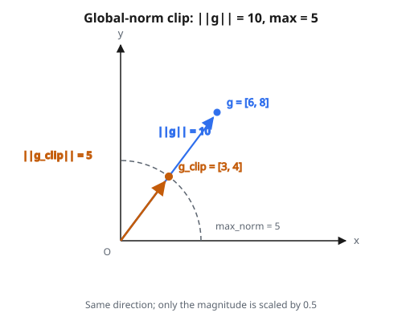

# Gradient Clipping (Global Norm)

## Vì sao gradient nổ

Huấn luyện một mạng nơ-ron nghĩa là tính gradient qua lan truyền ngược. Quy tắc chuỗi bảo ta nhân các đạo hàm địa phương ở mỗi lớp với nhau:

$$
\frac{\partial L}{\partial w_1} = \frac{\partial L}{\partial h_n} \cdot \frac{\partial h_n}{\partial h_{n-1}} \cdot \frac{\partial h_{n-1}}{\partial h_{n-2}} \cdots \frac{\partial h_2}{\partial h_1} \cdot \frac{\partial h_1}{\partial w_1}
$$

Mỗi thừa số trong chuỗi đó là đạo hàm từ một lớp. Khi nhiều thừa số lớn hơn 1, tích tăng theo hàm mũ. Mạng 50 lớp với mỗi đạo hàm khoảng $1.1$ cho $1.1^{50} \approx 117$. Nếu mỗi thừa số khoảng $2$, ta được $2^{50} \approx 10^{15}$.

Đây là **vấn đề exploding gradient**. Nó xuất hiện nhiều nhất ở:

* **Mạng hồi tiếp (RNN)**: bung theo nhiều time step tạo một chuỗi nhân rất sâu qua ma trận trọng số hồi tiếp
* **Mạng rất sâu**: mọi kiến trúc nhiều lớp đều có thể gặp vấn đề này nếu trọng số hoặc activation không được kiểm soát cẩn thận
* **Một số hàm kích hoạt**: hàm không có đạo hàm bị chặn (như ReLU, đạo hàm bằng $1$ với mọi đầu vào dương) không tự giới hạn độ lớn gradient

Khi gradient nổ, bước cập nhật tham số trở nên khổng lồ. Một bước huấn luyện có thể đẩy trọng số đi quá xa, khiến loss nhảy lên giá trị cực lớn hoặc thành NaN. Huấn luyện coi như sập.

## Gradient clipping làm gì

Ý tưởng đơn giản: **nếu gradient quá lớn, thu nhỏ nó trước khi dùng để cập nhật trọng số.**

Ta chọn một ngưỡng (gọi là max norm). Trước mỗi lần cập nhật tham số, kiểm tra độ lớn của gradient. Nếu nằm trong ngưỡng, giữ nguyên. Nếu vượt ngưỡng, scale xuống sao cho độ lớn đúng bằng ngưỡng.

Tính chất then chốt: **clipping chỉ đổi độ lớn, không bao giờ đổi hướng.** Gradient vẫn chỉ cùng hướng (về phía giảm loss), chỉ bước nhỏ hơn. Giống giới hạn tốc độ: vẫn được đi hướng nào cũng được, nhưng tốc độ bị trần.

## Chuẩn L2 (global norm)

Để đo “gradient lớn cỡ nào”, ta dùng **chuẩn L2**. Đây chính là khoảng cách Euclid từ gốc tọa độ.

Với vector gradient 1D $g = [g_1, g_2, \ldots, g_n]$:

$$
\|g\| = \sqrt{g_1^2 + g_2^2 + \cdots + g_n^2}
$$

Vài ví dụ để có cảm giác:

* $g = [3, 4]$: chuẩn $= \sqrt{9 + 16} = \sqrt{25} = 5$
* $g = [1, 1, 1, 1]$: chuẩn $= \sqrt{4} = 2$
* $g = [0, 0, 0]$: chuẩn $= 0$

Với mảng nhiều chiều (ví dụ ma trận trọng số 2D), chuẩn “global” coi toàn bộ mảng như một vector dẹt dài và tính chuẩn trên mọi phần tử. Gradient $2 \times 2$ bằng $\begin{bmatrix} 2 & 2 \\ 2 & 2 \end{bmatrix}$ có chuẩn $= \sqrt{4 + 4 + 4 + 4} = \sqrt{16} = 4$.

Từ “global” nghĩa là ta tính **một** chuẩn trên mọi giá trị gradient, không phải chuẩn riêng theo hàng hay theo lớp. Một số duy nhất nắm độ lớn tổng thể của gradient.

## Quy tắc clipping

Khi đã có chuẩn, quy tắc là:

* Nếu $\|g\| \leq \text{max\_norm}$: gradient ổn, giữ nguyên
* Nếu $\|g\| > \text{max\_norm}$: scale gradient xuống

Hệ số scale:

$$
\text{scale} = \frac{\text{max\_norm}}{\|g\|}
$$

Gradient sau clipping:

$$
g_{\text{clipped}} = g \cdot \text{scale}
$$

**Ví dụ**: gradient $g = [6, 8]$, max norm $= 5$

1. Tính chuẩn: $\|g\| = \sqrt{36 + 64} = \sqrt{100} = 10$
2. Vì $10 > 5$, cần clipping
3. Hệ số scale: $\frac{5}{10} = 0.5$
4. Gradient đã clip: $[6 \cdot 0.5,\; 8 \cdot 0.5] = [3.0, 4.0]$
5. Kiểm tra: $\|g_{\text{clipped}}\| = \sqrt{9 + 16} = 5.0$ (đúng bằng max norm)

::: {#fig-43-grad-clip fig-cap="Clipping chuẩn global giữ hướng: g = [6, 8] với ||g|| = 10 được scale hệ số 0.5 thành [3, 4], đúng max_norm = 5." fig-alt="Hai vector cùng hướng từ gốc: g = [6, 8] có độ dài 10, và g đã clip [3, 4] nằm trên cung tròn max_norm = 5."}
{fig-align="center"}
:::

**Ví dụ**: gradient $g = [0.1, 0.2, 0.2]$, max norm $= 1.0$

1. Tính chuẩn: $\|g\| = \sqrt{0.01 + 0.04 + 0.04} = \sqrt{0.09} = 0.3$
2. Vì $0.3 \leq 1.0$, không cần clipping
3. Trả gradient nguyên: $[0.1, 0.2, 0.2]$

## Vì sao hướng quan trọng

Một lựa chọn thay thế phổ biến là **element-wise clipping**, mỗi phần tử gradient bị trần độc lập (ví dụ kẹp mọi giá trị vào $[-1, 1]$). Vấn đề: cách này **đổi hướng** của vector gradient.

Xét $g = [0.5, 10.0]$ với element-wise clipping tại $1.0$:

* Kết quả element-wise: $[0.5, 1.0]$. Tỉ lệ hai thành phần đổi từ $0.5 : 10 = 1 : 20$ thành $0.5 : 1 = 1 : 2$. Gradient giờ chỉ một hướng rất khác.
* Kết quả chuẩn global: cả vector được scale cùng một hệ số, nên $[0.5, 10.0]$ thành dạng $[0.05, 1.0]$. Tỉ lệ $1 : 20$ được giữ. Hướng khớp hệt.

Giữ hướng quan trọng vì hướng gradient cho biết loss giảm nhanh nhất về phía nào. Đổi hướng nghĩa là không còn đi theo đường hạ nhanh nhất. Clipping chuẩn global tôn trọng hình học của mặt tối ưu.

## Chọn max norm

Max norm là hyperparameter đặt trước khi huấn luyện. Các lựa chọn phổ biến:

* **1.0**: mặc định hay dùng, đặc biệt với RNN và LSTM
* **0.5 đến 5.0**: khoảng điển hình cho hầu hết bài deep learning
* **Giá trị lớn hơn (10+)**: clipping nhẹ, chỉ bắt các spike cực đoan

Cách nghĩ:

* **Quá nhỏ**: gần như mọi bước đều bị clip, học chậm vì learning rate hiệu dụng trở nên rất nhỏ
* **Quá lớn**: clipping hiếm khi kích hoạt, không bảo vệ khỏi spike gradient thỉnh thoảng
* **Vừa**: clipping chỉ kích hoạt ở batch bất thường hoặc đầu huấn luyện khi gradient chưa ổn định, và để các bước gradient bình thường đi qua không đổi

Cách thực tế là theo dõi chuẩn gradient khi huấn luyện rồi đặt ngưỡng ngay trên khoảng điển hình.

## Gradient clipping xuất hiện ở đâu

* **RNN và LSTM**: động cơ ban đầu của gradient clipping. Chuỗi dài tạo computational graph sâu theo thời gian, exploding gradient rất thường gặp
* **Transformer**: mô hình như GPT và BERT dùng gradient clipping khi huấn luyện, thường với max norm khoảng $1.0$
* **Reinforcement learning**: các phương pháp policy gradient có thể sinh spike gradient mạnh khi reward lớn hoặc hiếm
* **Mọi lần huấn luyện bất ổn**: nếu thấy loss đột ngột nhảy lên NaN hoặc vô cực, gradient clipping thường là bước sửa đầu tiên nên thử

## Code
```python
import numpy as np

def clip_gradients(g, max_norm):
    """
    Clip gradients using global norm clipping.
    """
    g = np.asarray(g, dtype=float)
    if max_norm <= 0:
        return g.copy()
    norm = np.linalg.norm(g)
    if norm == 0 or norm <= max_norm:
        return g.copy()
    scale_factor = max_norm / norm
    return g * scale_factor

```
